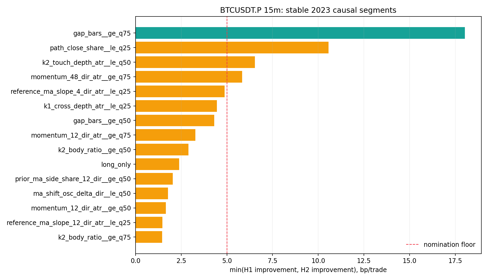
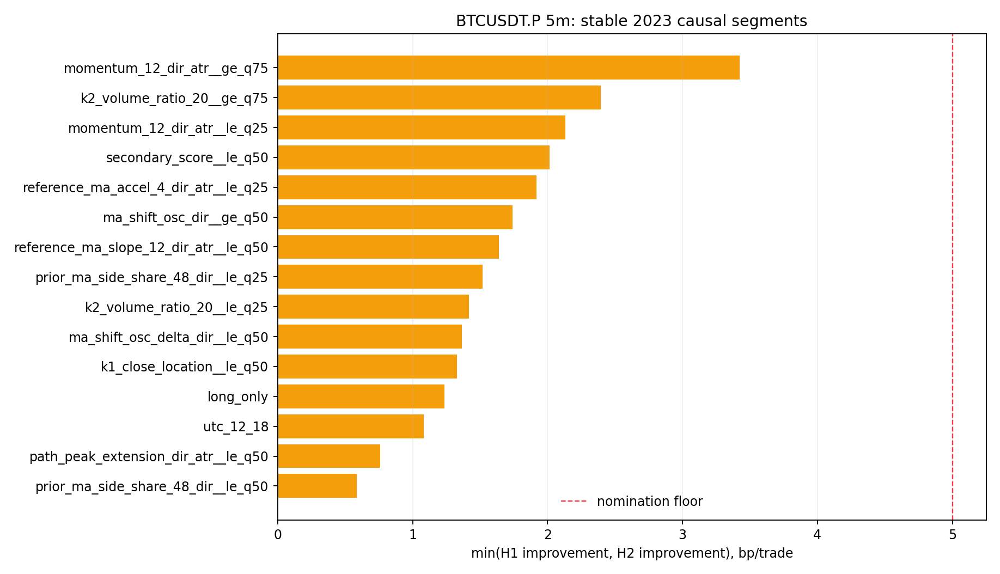

# BTCUSDT.P 15min / 5min K1→K2 因果失败地图（2026-09-04）

性质：P1、pre-holdout、2023 假设生成诊断。

结论：**15min 仅提名 `K1→K2 gap >= 5 bars`；5min 没有任何稳定单变量可提名。此报告不改变交易规则。**

## 先说结论

这轮没有再凭直觉加颜色门或旋参数，而是在冻结交易账本上一次性检查 35 个连续因果特征和 10 个
分类条件。每个连续特征只用 2023H1 的特征分布确定 Q25/Q50/Q75 门槛，再分别看 H1、H2 的
收益改善；总共每周期 150 个分组。为了避免“试得多总会碰巧找到一个”，另外对全部合格分组做
20,000 次半年内收益置换，比较每次搜索到的最大稳定改善。

- **15min：**唯一通过提名门的是 `gap_bars >= 5`，即 K1 与 K2 相隔 5–8 根 15min K 线，实际
  为 75–120 分钟。冻结账本子集 45 笔，H1/H2 分别比基线改善 +19.29/+18.02bp，合并净
  +5.63bp；130 个合格分组的 max-statistic 族级 p=0.0393。它只够提名，不够证明可交易。
- **5min：**最佳是方向调整后的 12-bar 动量位于上四分位，稳定改善仅 +3.42bp，合并净
  -12.73bp；124 个合格分组的族级 p=0.9618。没有任何分组同时达到每半改善 5bp 和合并净
  不低于 -10bp 的预注册门，因此不允许进入 2024 确认。
- **形态美观不等于收益：**二级总分、K1 实体/范围、K2 影线/触线、MA 颜色连续性、均线斜率、
  波动、成交量、结构方向与时段都没有形成跨两个半年的强稳定过滤器。





## 冻结交易规则

本轮没有改规则，只分析以下被冻结系统在入场时可知的差异：

1. K1 的方向实体从 SMA(HL2) 错侧贯穿到方向侧；多头向上，空头镜像。
2. K2 影线真实触线，完整实体与收盘留在方向侧，不允许实体穿越均线。
3. 15min 用 SMA120、gap 2–8；5min 用 SMA40、gap 6–24；12 项形态/颜色/路径等权分最低 0.40。
4. K2 完成后下一根开盘入场；止损为 K2 极值；风险 0.15–2.50 ATR；手续费/价格风险不高于 1.25。
5. 3R 止盈、12 小时时限、同根止损优先；收盘达到 1.5R 后启用覆盖 20bp 成本的保护止损。
6. 两周期都使用六小时冷却：15min 24 根、5min 72 根；固定往返成本 0.20%。

这些规则已经在之前的止损缓冲、扫损收复、突破入场、保护点、固定目标和 runner 实验中逐项失败；
本报告的目的，是判断失败主要集中在哪类入场时可见条件，而不是再次修改退出。

## 数据与样本

| 项目 | 15min | 5min |
|---|---:|---:|
| 2023 因果候选 | 856 | 4,558 |
| 冻结规则实际交易 | 151 | 293 |
| 2023H1 / H2 | 89 / 62 | 180 / 113 |
| 连续特征 | 35 | 35 |
| 总分组数 | 150 | 150 |
| 样本合格分组 | 130 | 124 |
| 后续时期结果读取 | 0 | 0 |
| holdout 行读取 | 0 | 0 |

原生数据为 OKX `BTC-USDT-SWAP` 5min，SHA256
`767f67c2b0ae5a8c83369a7cb950334e61de09edbb82a0158122c41794eed5ac`；15min 由每 3 根连续
5min UTC 对齐聚合。物理源止于 2026-02-28，早于仓库 holdout 2026-05-04。

## 基线失败画像

| 周期 | n | 毛 bp/笔 | 净 bp/笔 | 胜率 | PF | TP / SL / 保护 / 超时 |
|---|---:|---:|---:|---:|---:|---:|
| 15m | 151 | +7.03 | -12.97 | 36.4% | 0.562 | 39 / 94 / 14 / 4 |
| 5m | 293 | +0.87 | -19.13 | 35.2% | 0.312 | 52 / 185 / 54 / 2 |

| 周期 | 半年 | n | 毛 bp/笔 | 净 bp/笔 |
|---|---|---:|---:|---:|
| 15m | 2023H1 | 89 | +12.30 | -7.70 |
| 15m | 2023H2 | 62 | -0.54 | -20.54 |
| 5m | 2023H1 | 180 | -1.07 | -21.07 |
| 5m | 2023H2 | 113 | +3.95 | -16.05 |

5min 的毛收益只有 +0.87bp，几乎没有任何空间支付固定 20bp 成本。15min 毛收益稍高，但 H2
连毛收益都转负。方向拆分也没有救：15min 多/空净值为 -9.65/-17.49bp；5min 为
-17.78/-20.34bp。

## 哪些维度真的稳定，哪些没有

### 15min 前四名

| 分组 | n | H1 净 bp | H2 净 bp | 最小半年改善 bp | 合并净 bp |
|---|---:|---:|---:|---:|---:|
| gap ≥ 5 | 45 | +11.59 | -2.52 | **+18.02** | **+5.63** |
| 中间收盘正确率 ≤ H1 Q25 | 37 | +4.95 | -9.98 | +10.56 | -0.70 |
| K2 触线深度 ≤ H1 中位数 | 79 | +3.62 | -14.01 | +6.53 | -3.96 |
| 48-bar 方向动量 ≥ H1 Q75 | 43 | +12.75 | -14.70 | +5.84 | -0.02 |

只有 gap 分组同时满足预注册的稳定改善和合并净门。按单根 gap 查看也能看出趋势，但样本很小：
gap 2/3/4 的净值为 -23.03/-22.82/-13.79bp，gap 5/6/7/8 为
-6.28/+19.52/+21.52/-7.13bp。不能据此进一步把 6–7 偷选成新范围，因为那会再次利用结果调参。

### 5min 前四名

| 分组 | n | H1 净 bp | H2 净 bp | 最小半年改善 bp | 合并净 bp |
|---|---:|---:|---:|---:|---:|
| 12-bar 方向动量 ≥ H1 Q75 | 75 | -17.65 | -5.37 | **+3.42** | -12.73 |
| K2 成交量比 ≥ H1 Q75 | 72 | -18.67 | -10.39 | +2.40 | -15.57 |
| 12-bar 方向动量 ≤ H1 Q25 | 76 | -6.32 | -13.92 | +2.13 | -9.42 |
| 二级总分 ≤ H1 中位数 | 135 | -19.05 | -11.23 | +2.02 | -16.44 |

同一个 5min 动量特征的高端和低端都进入前列，说明关系不是可稳定外推的单调门槛；更关键的是
所有分组仍净亏。5min 的结构与颜色条件没有被遗漏：结构方向一致组净 -22.20bp，比基线还差；
二级总分较低反而略好，继续提高总分门只会重复旧错误。

### 关键预设逐项裁决

| 预设 | 15min 最佳稳定改善 | 5min 最佳稳定改善 | 裁决 |
|---|---:|---:|---|
| 形态等权总分 | -0.13bp | +2.02bp（低分侧） | 不支持“越漂亮越好” |
| K1 range | -2.30bp | -5.46bp | 不支持加严大实体/大范围 |
| K2 wick | -3.01bp | -0.21bp | 不支持单独提高影线门 |
| 止损距离 | -1.33bp | -1.89bp | 没有稳定单阈值 |
| fee-to-risk | -6.68bp | -1.99bp | 放宽/收紧都不是主解 |
| MA 12-bar 方向斜率 | +1.47bp | +1.64bp | 太弱且都偏向低斜率侧 |
| K2 ATR 扩张 | -4.59bp | -1.22bp | 不支持波动扩张硬门 |
| K2 成交量 | -1.23bp | +2.40bp | 5m 局部、未过门 |
| K1→K2 距离 | **+18.02bp** | -0.81bp | 只在 15m 提名 |

## 排序与零假设

| 周期 | 等权 score AUC | score top10% n | top10% 净 bp | 排序置换 p | 提名特征 AUC | 提名特征 top10% 净 bp |
|---|---:|---:|---:|---:|---:|---:|
| 15m | 0.484 | 16 | -19.28 | 0.689 | gap 0.653 | +11.49 |
| 5m | 0.462 | 30 | -21.27 | 0.619 | momentum 0.468 | -10.13 |

15min gap 的单特征排序有一定信息，而原 12 项等权分仍接近随机；5min 两者都没有排序力。
族级最大统计量置换 p 为 15min 0.0393、5min 0.9618。0.0393 只用于允许一个后续假设，仍未达到
项目正式收益证据要求的 p<0.01。

本报告没有把任何分组当成新策略，因此不使用匹配随机入场来参与选型；其同等严格零假设是保留
全部因果分组身份、在每个半年内部打乱收益，并对“150 个分组里最好的那个”做 max-statistic。
真正改变规则的 15min 单变量确认实验另行从候选池重放，并提供同月×UTC 六小时块×ATR 五分位
匹配随机对照。5min 没有候选，所以没有为一个未成立的策略伪造对照收益。

## 风险与诚实声明

- 分组收益来自旧策略已接受交易；它没有释放 cooldown 后重新选择信号，因此只能生成假设。
- 15min 提名只有 45 笔，H2 自身仍为 -2.52bp/笔；不能因合并为正就改 Pine。
- 2024 聚合基线以前已在其他实验中看过，所以后续确认是时间外推复验，但不是绝对 pristine holdout。
- 资金费率与超过固定 20bp 的额外滑点没有模拟；降低成本不是本轮变量。
- 未读取 2024、audit 或仓库 holdout 结果；未改 Pine、ACTIVE/frozen/forward、部署或真金交易。

## 复现

```bash
cd /Users/zhangzc/fable-trading
python3 -m pytest tests/test_research_btcusdtp_k1k2_causal_failure_map.py -q
PYTHONPATH=. python3 -m scripts.research_btcusdtp_k1k2_causal_failure_map --phase discovery
python3 scripts/md_to_html.py analysis/p1_btcusdtp_k1k2_causal_failure_map_20260904.md --out-dir analysis/html
```

下一步已按预注册规则自动执行：仅把 15min `gap_min_bars: 2→5` 写成独立单变量，在 2024 从过滤点
开始完整重放；5min 因无稳定提名停止继续旋阈值。
