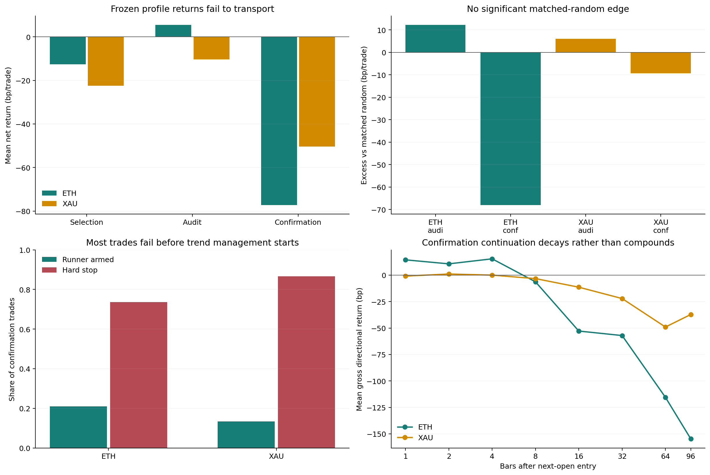

# ETH / XAU 15m：品种专属 K1→K2 趋势策略审计

生成日期：2026-09-05
实验：`ETH V19` / `XAU V1`
状态：**两套品种专属候选均未通过；仅保留研究账本，不写入 TradingView，不改 ACTIVE / forward / 实盘**

## 技术结论：参数已经分品种，但两套都没有可部署优势

本轮没有把 BTC 参数直接复制到 ETH 和黄金，而是分别预注册并按时间顺序选择：触线均线组合、
“压缩→K1 释放→K2 承接”票数、慢线 runner 缓冲和渐进止盈总比例。ETH 的开发选择结果是
`EMA30 + SMA60`、至少 2/3 个状态变化票、runner 缓冲 `1.25 ATR`、总止盈 10%；XAU 是
`EMA20 + SMA50`、不加票数硬门、runner 缓冲 `1.0 ATR`、总止盈 10%。

它们只是各自开发区间里的“最不差组合”，不是最优赚钱参数。冻结后搬到 2026 年 3–4 月确认窗：

- ETH：19 笔，成本后 `-77.26bp/笔`，PF `0.086`，胜率 `5.26%`，0/2 月为正；
- XAU：15 笔，成本后 `-50.41bp/笔`，PF `0.135`，胜率 `6.67%`，0/2 月为正；
- 与同月、同 UTC 时段、同 ATR 桶、同方向的匹配随机相比，ETH 少 `68.04bp/笔`
  (`p=0.9929`)，XAU 少 `9.35bp/笔` (`p=0.7086`)；
- 仓库 holdout 从 2026-05-04 开始，本轮物理读取 **0 行**。

因此本轮交付的是两套完整、可复现、已证伪的品种专属研究策略，而不是把失败参数包装成可实盘版本。
当前没有依据把任一套保存成新的 TradingView 开仓脚本；此前已保存的 ETH V16 研究显示器也不因此
获得生产资格。



图左上是冻结规则在三个时间段的成本后均值，右上是匹配随机超额；左下说明绝大多数确认期交易在
runner 激活前已经触发灾难止损；右下说明确认期的方向收益没有随着持有时间累积。**问题首先在入场
状态没有选中可持续趋势，不是再把止损放宽一点就能解决。**

## 两套候选策略的完整规则

### 共同 K1→K2 形态

| 模块 | 固定规则 |
|---|---|
| 标的与周期 | OKX 永续研究代理；只研究 15m 完成 K 线 |
| ATR | Pine/Wilder RMA ATR14 |
| K1 | 顺方向实体贯穿快线；实体 ≥`0.20 ATR`，整根 ≥`0.65 ATR`，收盘位于顺方向 60% 以上 |
| K1→K2 距离 | 2–8 根；中间完成 K 线收盘不得越过快线错误侧 `0.05 ATR` 以上 |
| K2 | 反向拒绝影线 ≥15%，实体 ≤75%，真实触及快线，触线深度 `0..1.50 ATR`，实体留在趋势侧 |
| 信号时点 | K2 收盘后才确认；下一根连续 K 线开盘入场，禁止用 K2 最优影线价回填成交 |
| 去重 | 每个已确认趋势 regime 最多一单；止损或超时不在同一 regime 重新开仓 |
| 成本 | 固定往返 20bp |
| 初始风险 | 入场价 ±`2×signal ATR` 灾难止损；同根止损与目标冲突时 stop-first |
| 渐进 TP | `+2/+4/+8/+12 signal ATR` 各真实平原仓 2.5%，总计最多 10% |
| runner 激活 | 完成 K 线收盘达到 `+2 signal ATR` 后激活；该收盘计算出的新止损从下一根生效 |
| 最长持有 | 96 根 15m K 线；到期退出剩余仓位 |

这里的“真实 TP”与“抬止损”仍然严格分开：四档成交后，那 10% 已经退出；剩余 90% 才交给慢线
runner。部分止盈不会自动把剩余仓位抬到保本。

### ETHUSDT.P 研究配置 V19

| 项目 | 冻结值 |
|---|---:|
| K1/K2 快线 | EMA30(HL2) |
| regime / runner 慢线 | SMA60(HL2) |
| 强趋势进入 | 快慢价差 ≥`1 ATR` 且 EMA30 四根斜率 ≥`0.05 ATR/bar`，连续 12 根 |
| 中性重置 | 价差 ≤`0.10 ATR` 且斜率 ≤`0.005 ATR/bar`，连续 8 根 |
| 状态变化票 | 至少 2/3 |
| 三票定义 | K1 前 BB20 相对 96 根中位数 ≤1；K1 振幅/前24根中位数 ≥1.25；K2 浅回踩承接 |
| runner | 多头 `SMA60-1.25×当前ATR`，空头镜像，只能单向收紧 |
| 渐进 TP | 四档各 2.5%，总计 10% |

### XAUUSDT.P 研究配置 V1

| 项目 | 冻结值 |
|---|---:|
| K1/K2 快线 | EMA20(HL2) |
| regime / runner 慢线 | SMA50(HL2) |
| 强趋势进入 / 中性重置 | 与 ETH 相同的 ATR 标准化状态机 |
| 状态变化票 | 0；开发期加 1/2 票没有改善，不设装饰性硬门 |
| runner | 多头 `SMA50-1.0×当前ATR`，空头镜像，只能单向收紧 |
| 渐进 TP | 四档各 2.5%，总计 10% |

## 冻结结果：开发期改善没有跨期复现

下表中的 baseline 是同一形态和状态机的 `EMA30/SMA60 + 0票 + 1ATR runner + 10% TP`；
candidate 是各品种完成单变量顺序选择后的冻结结果。

| 品种 / 区间 | Baseline 净 bp/笔 | Candidate 笔数 | Candidate 净 bp/笔 | PF | 胜率 | 正 fold | P95 bp |
|---|---:|---:|---:|---:|---:|---:|---:|
| ETH 2023–2024 selection | -22.32 | 161 | -12.60 | 0.783 | 21.74% | 0/4 | 359.01 |
| ETH 2025–2026-02 audit | +5.19 | 101 | +5.48 | 1.066 | 22.77% | 1/3 | 528.04 |
| ETH 2026-03–04 confirmation | -78.10 | 19 | **-77.26** | **0.086** | **5.26%** | **0/2** | 7.32 |
| XAU 2025-06–10 selection | -27.85 | 34 | -22.52 | 0.199 | 11.76% | 0/5 | 40.81 |
| XAU 2025-11–2026-02 audit | -20.36 | 28 | -10.38 | 0.687 | 25.00% | 1/4 | 117.26 |
| XAU 2026-03–04 confirmation | -37.88 | 15 | **-50.41** | **0.135** | **6.67%** | **0/2** | 19.63 |

ETH 的品种化参数只在开发期减少亏损，audit 与 baseline 几乎相同，确认期同样崩溃。XAU 的参数在
selection/audit 里减少亏损，却在确认期比 baseline 更差。没有一个结果满足“净收益 >0、PF >1、
至少一半时间 fold 为正、匹配随机 `p<0.01`”的注册门。

### 匹配随机与排名诊断

| 品种 / 区间 | 候选净 bp/笔 | 匹配随机 bp/笔 | 超额 bp/笔 | sign-flip p | 3票分数盈利 AUC | 分数前10%净 bp/笔 |
|---|---:|---:|---:|---:|---:|---:|
| ETH audit | +5.48 | -6.73 | +12.20 | 0.3539 | 0.514 | +7.06 |
| ETH confirmation | -77.26 | -9.22 | **-68.04** | 0.9929 | **0.278** | -108.72 |
| XAU audit | -10.38 | -16.38 | +6.00 | 0.3450 | 0.548 | -39.32 |
| XAU confirmation | -50.41 | -41.06 | **-9.35** | 0.7086 | 0.571 | -51.20 |

这里没有 LightGBM 训练或概率模型，所以 `val AUC`、score permutation 和模型单特征基线按字面不适用；
不能编造。表中的 AUC 只诊断三个离散状态变化票能否排序最终正收益。XAU 的 AUC 略高于 0.5，但高分
组仍亏钱，再次说明 AUC 不能替代成本后经济门。严格零假设是匹配随机入场和逐笔 sign-flip。

候选各阶段最强 `ceil(10%×N)` 交易的毛/净均值如下：ETH 为
`384.11/364.11`、`670.35/650.35`、`85.12/65.12bp`；XAU 为
`67.67/47.67`、`180.71/160.71`、`67.64/47.64bp`。右尾仍存在，但出现频率和总亏损无法支付它。

## 失败原因一：趋势状态太晚，不是在抓启动

确认交易发生时，ETH 距当前 regime 起点的中位数是 **98 根**，XAU 是 **46 根**；selection/audit
也分别为 ETH `72/58` 根、XAU `68/69` 根，而 K1→K2 本身中位只隔 3–4 根。也就是说，状态机确实
减少了盘整重复信号，却允许趋势成熟很久以后任意新的快线贯穿再次充当“K1”。它识别的是“强趋势里的一次
局部回踩”，不是 Owner 定义的“密集/中性之后第一段启动”。

把趋势年龄硬切到 24/48/96 根不能修复语义。事后敏感性中，ETH `age≤24` 在 selection 是
`+3.99bp/笔`，audit 变 `-29.68bp/笔`，confirmation 只有 2 笔且 `-120.06bp/笔`；XAU
`age≤48` 为 `-31.10/+9.32/-59.51bp/笔`。阈值只是在不同市场阶段挑了不同噪声。

正确的下一版状态机必须由 **K1 自己启动时钟**：中性/收缩后首次有向贯穿才可 arm，2–8 根内首个
有效 K2 完成后消费该 episode；没有重新回到中性或发生反向启动，就不能再发第二组信号。这是逻辑重构，
不是把 `12` 改成 `8`。

## 失败原因二：大多数交易根本走不到动态退出

| 品种 / 区间 | Runner 激活 | 硬止损 | 中位 MFE 到退出 | 96根中位 MFE | 中位 giveback |
|---|---:|---:|---:|---:|---:|
| ETH selection | 45.34% | 54.66% | 2.42 ATR | 5.35 ATR | 3.50 ATR |
| ETH audit | 39.60% | 61.39% | 1.84 ATR | 3.85 ATR | 3.47 ATR |
| ETH confirmation | **21.05%** | **73.68%** | 2.16 ATR | 2.29 ATR | 4.06 ATR |
| XAU selection | 38.24% | 55.88% | 1.23 ATR | 5.19 ATR | 2.89 ATR |
| XAU audit | 46.43% | 53.57% | 2.37 ATR | 6.42 ATR | 3.20 ATR |
| XAU confirmation | **13.33%** | **86.67%** | 0.21 ATR | 2.61 ATR | 2.21 ATR |

确认期 15/19 笔 ETH、13/15 笔 XAU 没有达到完成收盘 `+2ATR`，SMA runner 根本没有机会接管。
因此“跟均线吃大趋势”的退出思想没有错，错误是把大量不能形成趋势的 K2 送进了它。

确认期无止损固定持有诊断也支持这一点：ETH 下一根开盘后 1/4 根平均毛收益尚有
`+14.47/+15.44bp`，第 8 根变 `-6.27bp`，第 96 根为 `-154.77bp`；XAU 第 2 根仅
`+1.11bp`，第 8/96 根为 `-3.24/-37.16bp`。它们不是“止损刚好把未来大趋势震出去”的稳定群体，
而是短暂承接后整体反转。

## 失败原因三：XAU 15m 的成本/风险结构尤其不合理

XAU selection 的单根 ATR/入场价中位仅 `8.77bp`，2ATR 初始风险为 `17.55bp`，而冻结往返成本是
20bp；中位 `fee/risk=1.14`。换言之，不算方向预测，成本已经大于名义初始风险。audit 与 confirmation
因波动升高改善到 `0.64/0.37`，但仍不低。

事后加 `fee/risk≤0.50` 不能形成稳定策略：XAU selection 仅 2 笔 `-42.72bp`，audit 7 笔
`+4.91bp`，confirmation 8 笔 `-61.39bp`。经济门是必要条件，却不是入场优势。

ETH 的中位 fee/risk 为 `0.31/0.22/0.26`，成本压力较小；但确认期依然大亏，说明 ETH 的主要问题
是状态与方向失效，不是只要降低费率就会转正。

## 失败原因四：常见共振和宽止损都是时期拟合

所有以下结果都是在冻结账本上的事后诊断，明确 **不是新一轮验证**：

- ETH `efficiency24≥0.15` 在 selection/audit 看似达到 `+32.75/+62.28bp/笔`，confirmation
  只剩 3 笔且全部亏损，`-98.14bp/笔`；
- ETH `24根快线侧翻转≤2` 为 `-44.92/+31.50/-70.16bp/笔`；
- XAU `regime age≤48` 为 `-31.10/+9.32/-59.51bp/笔`；
- XAU `fee/risk≤0.50` 为 `-42.72/+4.91/-61.39bp/笔`。

固定 TP/SL 网格同样没有稳定解。ETH 在 selection 最好的是 `SL6/TP6`，仍为 `-2.64bp/笔`；
audit 最好 `SL2/TP12` 仍为 `-8.42bp/笔`；confirmation 最好 `SL2/TP2` 仍为 `-8.79bp/笔`。
XAU 的 `SL4/TP6` 在 audit 可达 `+38.10bp/笔`，但 selection 为 `-24.40bp/笔`，confirmation
为 `-26.81bp/笔`；confirmation 的网格最好值 `SL6/TP8` 也只有 `-4.55bp/笔`。

所以不能把“更宽止损”“更远止盈”“高效率”“少翻色”中的任意一个追加到 Pine，就称为品种专属共振。
它们都缺少时间外一致性。

## 数据、方法和可复现性

| 品种 | 行情范围 | Selection | Audit | Confirmation | 完整前缀行数 | Holdout 行 |
|---|---|---:|---:|---:|---:|---:|
| ETH-USDT-SWAP | 2022-01-03 至 2026-04-30 | 161 笔 | 101 笔 | 19 笔 | 151,522 | **0** |
| XAU-USDT-SWAP | 2025-06-03 至 2026-04-30 | 34 笔 | 28 笔 | 15 笔 | 31,801 | **0** |

ETH selection 是 2023–2024 的 4 个半年 fold；audit 是 2025 至 2026-02 的 3 fold，父 lineage
此前已看过，明确不是 pristine；confirmation 是 2026-03/04 两个月。XAU 因合约历史短，selection
是 2025-06 至 10 的 5 个月，audit 是 2025-11 至 2026-02 的 4 个月，confirmation 同样是
2026-03/04。

参数按 `MA profile → transition vote → runner buffer → bank fraction` 顺序一次只改一个变量；selection
receipt 提交后才能读取 audit，audit receipt 提交后才能读取 confirmation。未来 OHLCV 突变测试中，
ETH 边界前 3,197 个 pair、XAU 364 个 pair 的身份和全部信号字段差异均为 0。结果文件保留逐笔交易、
fold、原始 pair、匹配随机、失败分类和源码/配置哈希。

匹配随机按同月 × UTC 六小时时段 × 月内 ATR14 五分位 × 原方向抽样，每个信号 3 个控制，避开信号
前后 96 根；使用相同退出、成本和仓位规则。它控制常见时间/波动 beta，但不能证明未观测状态的因果性。

## 下一步：不再在已看过的区间追阈值

1. **当前两套 profile 保持 research-only。** 不写 TradingView，不 promote，不接 forward，不改仓位；
   否则就是把确认失败的策略上线。
2. **下一条信号假设只重构 episode 起点。** K1 必须是中性/压缩后的首个贯穿，并由 K1 开始 2–8 根
   倒计时；同一 episode 只接受首个 K2。退出先保持 10% 微止盈 + 90% 慢线 runner，避免同时改入场
   与退出后无法归因。
3. **K2 影线入场需要更细数据。** 15m OHLC 只知道本根触线和收盘承接，不知道触线、灾难止损、收盘
   的内部顺序。若要按 Owner 原语义在影线成交，ETH/XAU 都应取得相同 venue 的 1m 数据，预注册
   “K1 后挂前一根已完成快线限价；小探针成交；K2 收盘有效才加仓”的两阶段协议；所有失败触线也必须
   计费，不能只回放后来收盘有效的 K2。
4. **需要真正新的验证段。** 2023 至 2026-04 已用于本轮选择、审计、确认和事后归因。下一版只能先
   shadow/forward；若要读取 2026-05-04 之后仓库 holdout，应为那一版配置单独记录第 1 次消耗。
5. **XAU 先解决成本门。** 在 20bp 假设下，要求 `2ATR risk > cost` 至少只是经济可交易性底线；若真实
   venue 手续费、maker/taker、滑点与 funding 不同，应另立成本敏感性合同，不能在看到结果后换费率。

进一步问题：K1 启动时钟重构能否在不恢复盘整重复信号的前提下，把确认期的 regime age 从几十根降到
2–8 根？这需要新数据回答；当前结果已经足够否决“只换均线/共振阈值/止损距离”的路线。

## 风险与诚实声明

- XAU 只有约 11 个月 pre-holdout 数据，样本量远小于 ETH；任何月度结论不稳定。
- OKX `ETH-USDT-SWAP` / `XAU-USDT-SWAP` 是本轮明确的研究 venue；不能自动等同于其他交易所同名
  `ETHUSDT.P` / `XAUUSDT.P`。
- confirmation 已经打开，后续在其中挑新门只能叫 postmortem；本报告已把所有这类表标成非验证。
- 固定 20bp 未加入逐笔资金费率、额外冲击和实盘延迟，真实成交可能更差。
- 没有训练或 promote LightGBM/YOLO；没有修改 Pine/TradingView、ACTIVE/frozen、forward、部署、
  新鲜度门、API key 或真实订单。

## 复现命令与证据

```bash
cd /Users/zhangzc/fable-trading

# 配置、prereg 与研究程序必须先提交；selection receipt 提交后才能 audit，
# audit receipt 提交后才能 confirmation。
PYTHONPATH=. .venv/bin/python scripts/research_asset_specific_k1k2_15m.py \
  --config experiments/active/exp-ethusdtp-15m-asset-specific-k1k2-preholdout-20260905-v19/config.json \
  --phase selection
PYTHONPATH=. .venv/bin/python scripts/research_asset_specific_k1k2_15m.py \
  --config experiments/active/exp-ethusdtp-15m-asset-specific-k1k2-preholdout-20260905-v19/config.json \
  --phase audit
PYTHONPATH=. .venv/bin/python scripts/research_asset_specific_k1k2_15m.py \
  --config experiments/active/exp-ethusdtp-15m-asset-specific-k1k2-preholdout-20260905-v19/config.json \
  --phase confirmation

# XAU 使用同一三阶段命令，只替换 --config 为 XAU 实验配置。
PYTHONPATH=. .venv/bin/python scripts/build_asset_specific_k1k2_15m_report.py

/Users/zhangzc/.local/bin/ruff check \
  scripts/research_asset_specific_k1k2_15m.py \
  scripts/build_asset_specific_k1k2_15m_report.py \
  tests/test_research_asset_specific_k1k2_15m.py \
  tests/test_build_asset_specific_k1k2_15m_report.py

PYTHONPATH=. .venv/bin/pytest -q \
  tests/test_research_asset_specific_k1k2_15m.py \
  tests/test_build_asset_specific_k1k2_15m_report.py \
  tests/contracts/test_registries.py

python3 scripts/md_to_html.py \
  analysis/p1_eth_xau_15m_asset_specific_k1k2_20260905.md \
  --out-dir analysis/html
```

- [ETH V19 配置](../experiments/active/exp-ethusdtp-15m-asset-specific-k1k2-preholdout-20260905-v19/config.json)
- [ETH V19 确认 receipt](../experiments/active/exp-ethusdtp-15m-asset-specific-k1k2-preholdout-20260905-v19/results/confirmation_receipt.json)
- [XAU V1 配置](../experiments/active/exp-xauusdtp-15m-asset-specific-k1k2-preholdout-20260905-v1/config.json)
- [XAU V1 确认 receipt](../experiments/active/exp-xauusdtp-15m-asset-specific-k1k2-preholdout-20260905-v1/results/confirmation_receipt.json)
- [注册结果总表](output/asset_specific_k1k2_15m_20260905/phase_summary.csv)
- [方向拆分](output/asset_specific_k1k2_15m_20260905/direction_summary.csv)
- [失败机制](output/asset_specific_k1k2_15m_20260905/failure_mechanics.csv)
- [固定持有路径](output/asset_specific_k1k2_15m_20260905/fixed_horizon_returns.csv)
- [事后单因子压力测试](output/asset_specific_k1k2_15m_20260905/postmortem_gate_stress.csv)
- [事后 TP/SL 网格](output/asset_specific_k1k2_15m_20260905/exit_sensitivity.csv)
