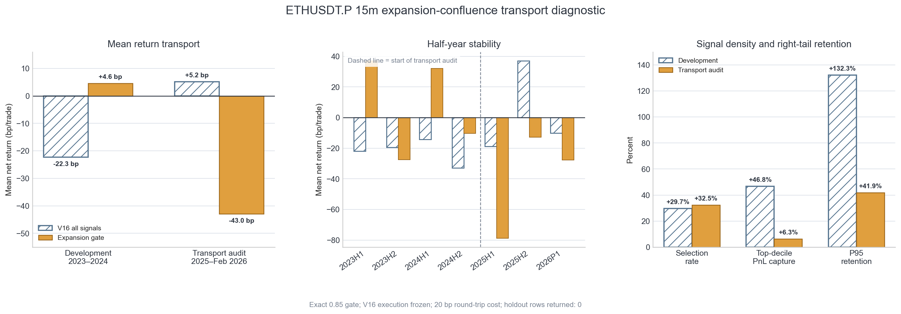

# ETHUSDT.P 15m：因果共振筛选与扩张门外推失败审计（V17/V18）

生成日期：2026-09-05  
实验：`exp-ethusdtp-15m-causal-confluence-preholdout-20260905-v17`、
`exp-ethusdtp-15m-expansion-confluence-preholdout-20260905-v18`  
状态：**全部候选拒绝；未修改 Pine/TradingView、ACTIVE、forward 或实盘；holdout 返回 0 行**

## 技术结论：可以研究共振，但当前这些共振都不应加入开仓

本轮把“加入一些共振”真正做成了两级时间外验证，而不是往脚本里多堆几个勾选项。先在冻结的
ETHUSDT.P 15m V16 信号上预注册 6 个因果维度、12 个固定门；V17 没有任何门通过全部样本量、
跨期、收益、右尾和多重检验条件。唯一值得继续诊断的是“波动扩张”，但严格版只有 28 笔。
随后把它放宽并冻结为一个确定的 V18 门：

`min(ATR14 / 前96根ATR14中位数, BB20宽度 / 前96根BB20宽度中位数) >= 0.85`

这个门在 2023–2024 的 182 笔开发账本中选出 54 笔，成本后从 V16 的 `-22.32bp/笔` 改善到
`+4.59bp/笔`；但阈值是在看过 14 个敏感性组合后选出的，校正家族置换 `p=0.2756`，本来就不是
确认性证据。搬到 2025-01-01 至 2026-03-01 的 114 笔 transport audit 后，它选出 37 笔，
从 V16 的 `+5.19bp/笔、PF 1.065` 恶化到 **`-42.97bp/笔、PF 0.475`**。同月、同 UTC 时段、
同 ATR 桶、同方向的匹配随机入场是 `-11.24bp/笔`；该门比随机还差 `-31.73bp/笔`，单侧
sign-flip `p=0.8929`。

真正致命的不是胜率，而是它删错了趋势右尾：audit 最赚钱的 12 笔中只保留 1 笔，仅保留
**6.34%** 的正收益；P95 只保留 **41.88%**。因此这不是“动态止盈没调好”，而是入场前的
绝对扩张门把大量从低波动/收缩状态起步的大趋势过滤掉，并偏向已在扩张中的冲击 K 线与假启动。



## V17：方向共振大多重复了原策略已有的信息

V16 本身已经要求 EMA30(HL2) 与 SMA60(HL2) 的方向价差至少 `1 ATR`、EMA30 四根斜率至少
`0.05 ATR/bar`，并连续 12 根确认趋势；每个 regime 只允许一组 K1→K2。因此再加 ETH 1h、
ETH 4h、BTC 15m+1h 同向，本质上多数是在重复“趋势方向”而不是增加独立信息。

本轮固定测试的 6 个轴为：ETH 完整 1h 趋势、ETH 完整 4h 趋势、BTC 15m+完整 1h 市场栈、
量能参与、波动扩张、路径结构；同时测试 4 个交集和 3/6、4/6 票数门。1h/4h 只在组成 K 线全部
完成后才可见，所有信号特征都截止 K2；未来数据突变测试的 22 列最大差为 `0`。

| V17 门 | 笔数 | 接受率 | 净 bp/笔 | PF | 胜率 | 最小半年样本 | FWER p | 裁决 |
|---|---:|---:|---:|---:|---:|---:|---:|---|
| V16 全部信号 | 182 | 100.0% | -22.32 | 0.638 | 20.88% | 41 | — | 基线 |
| ETH 完整 1h 同向 | 147 | 80.8% | -31.51 | 0.511 | 19.05% | 31 | 0.9999 | 拒绝 |
| ETH 完整 4h 同向 | 124 | 68.1% | -22.51 | 0.638 | 20.16% | 26 | 0.9776 | 拒绝 |
| BTC 15m+1h 同向 | 121 | 66.5% | -24.04 | 0.596 | 21.49% | 24 | 0.9887 | 拒绝 |
| 量能参与 | 36 | 19.8% | -6.84 | 0.883 | 25.00% | 8 | 0.6644 | 样本不足且不显著 |
| ATR+BB 同时扩张 ≥1.0 | 28 | 15.4% | +56.78 | 1.999 | 46.43% | 4 | 0.1403 | 仅诊断；样本与右尾门失败 |
| 路径结构 | 7 | 3.8% | -46.59 | 0.346 | 28.57% | 1 | 1.0000 | 拒绝 |
| ETH 1h+4h | 96 | 52.7% | -37.42 | 0.433 | 17.71% | 18 | 1.0000 | 拒绝 |
| ETH 1h+BTC 市场栈 | 102 | 56.0% | -36.74 | 0.418 | 19.61% | 20 | 1.0000 | 拒绝 |
| 1h+路径结构 | 7 | 3.8% | -46.59 | 0.346 | 28.57% | 1 | 1.0000 | 拒绝 |
| 确认扩张交集 | 5 | 2.7% | -3.65 | 0.904 | 40.00% | 0 | 0.6040 | 拒绝 |
| 3/6 票 | 91 | 50.0% | -29.61 | 0.545 | 20.88% | 17 | 0.9997 | 拒绝 |
| 4/6 票 | 28 | 15.4% | +33.36 | 1.692 | 39.29% | 6 | 0.2283 | 样本不足且不显著 |

这个结果否定的是“把多个相关布尔门投票就会更稳”，不是否定所有共振。`axis_count` 对盈利分类的
AUC 只有 `0.5323`；按票数最高取前 10% 的 19 笔虽有 `+35.07bp/笔`，但没有形成通过多重检验的
稳定门。单轴对照显示，方向类三轴都没有增加收益；扩张是唯一看起来与原趋势 regime 相对正交的轴，
所以才允许进入 V18 的单变量 transport 诊断。

## V18：开发期改善没有搬到后续市场

V18 没有改 K1、K2、均线、TP、SL、成本或仓位，只改一个入场布尔值。下表的匹配随机对照使用
8 个不复用随机入场，按同月、UTC 六小时时段、月内 ATR14 五分位和候选方向匹配，并复制同一套 V16
执行。开发期的匹配结果也没有达到项目 `p<0.01`；audit 则方向相反。

| 区间 / 方案 | 笔数 | 毛 bp/笔 | 净 bp/笔 | PF | 胜率 | 最大 DD | P95 bp | 最强10%正收益保留 | 匹配随机 bp | 超额 bp | 单侧 p |
|---|---:|---:|---:|---:|---:|---:|---:|---:|---:|---:|---:|
| 2023–2024 V16 | 182 | -2.32 | -22.32 | 0.638 | 20.88% | 46.76% | 273.70 | 100.00% | — | — | — |
| 2023–2024 扩张门 0.85 | 54 | +24.59 | +4.59 | 1.077 | 29.63% | 12.48% | 362.11 | 46.79% | -30.35 | +34.94 | 0.0703 |
| 2025–2026-02 V16 | 114 | +25.19 | +5.19 | 1.065 | 24.56% | 21.03% | 529.71 | 100.00% | — | — | — |
| 2025–2026-02 扩张门 0.85 | 37 | -22.97 | **-42.97** | **0.475** | 21.62% | 16.20% | 221.82 | **6.34%** | -11.24 | **-31.73** | **0.8929** |

连续分数也只能算弱诊断：扩张分数在开发期的盈利 AUC 为 `0.5941`，分数前 10% 净
`+41.86bp/笔`；audit AUC 降到 `0.5407`，分数前 10% 仍有 `+12.07bp/笔`。这说明它可能适合
作为观察字段或未来排序特征，但**不支持现在用固定 0.85 切断交易**。AUC 也不能替代经济验收。

### 半年稳定性已经明确否决固定阈值

| Fold | V16 笔数 | V16 净 bp/笔 | 扩张门笔数 | 扩张门净 bp/笔 |
|---|---:|---:|---:|---:|
| 2023H1 | 46 | -21.86 | 11 | +37.05 |
| 2023H2 | 41 | -19.55 | 13 | -27.50 |
| 2024H1 | 47 | -14.38 | 12 | +32.13 |
| 2024H2 | 48 | -32.92 | 18 | -10.43 |
| 2025H1 | 54 | -18.78 | 16 | **-78.81** |
| 2025H2 | 47 | +36.96 | 17 | -12.80 |
| 2026P1 | 13 | -10.12 | 4 | -27.79 |

开发期只在 2/4 个半年为正；transport audit 是 0/3，且没有一个 audit fold 击败 V16。故失败
不是单个异常月造成，也不能通过“再把 0.85 调成 0.8/0.9”来解释。audit 已经打开后，继续在其中
寻找新阈值会把诊断段变成调参段，本轮没有这样做。

## 失败机制：它把安静启动的大趋势当成“不共振”

audit 的扩张门接受率 `32.46%`，与开发期 `29.67%` 很接近，所以不是简单的数据量漂移；选中的
ATR/BB 比率中位数也相近。真正变化是“当前已经扩张”与“后面能延续成大趋势”的关系失效：

- audit 最赚钱的 12 笔合计 `+7,921bp`，只有 2025-11-03 的一笔通过 0.85，贡献 `+502bp`；其余
  11 笔的 expansion floor 为 `0.419–0.750`。最大一笔 `+1,677bp` 的 floor 只有 `0.750`。
- 未通过扩张门但成功 arm runner 的 31 笔，平均 `+248.07bp`、96 根 horizon MFE 均值
  `12.73 ATR`；通过扩张门且 arm 的 14 笔只剩 `+90.42bp`、MFE `6.69 ATR`。
- 未 arm 的坏交易没有被改善：扩张门内 23 笔平均 `-124.16bp`，门外 46 笔平均 `-119.76bp`。
  它没有有效筛掉假启动，却把 runner 的强右尾削掉了。
- 37 笔门内交易中，13 笔属于“先被止损、后续 horizon 又走出 ≥2 ATR”，平均 `-115.43bp`；
  10 笔是其他假启动/亏损，平均 `-135.51bp`；6 笔 arm 后回吐为负，平均 `-28.75bp`；只有
  8 笔最终为正。
- 开发期收益主要来自多头：门内 LONG 21 笔 `+59.89bp/笔`，SHORT 33 笔 `-30.60bp/笔`；
  audit 中 LONG、SHORT 分别变成 `-41.24`、`-44.15bp/笔`。它从一开始就不是稳定的双向规律。

因此当前失败首先是**入场状态定义错误**，不是 TP/SL 参数错误。V16 的 runner 在 audit 全体仍为正；
扩张门在交易发生前就删掉了 11/12 个最大趋势，后面再优化动态止盈也救不回没有开的仓。更合理的
下一类假设不是“绝对波动已经高”，而是**从收缩到有方向的释放**：用 K1 前的压缩基线、K1 的局部
冲量、K2 回踩的承接质量形成状态变化特征。它必须在新的前向数据上冻结验证，不能用本次 audit 倒推
新阈值。

## 当前冻结交易规则没有被改动

为保证归因，本轮完整复用 V16：ETH-USDT-SWAP 15m；EMA30(HL2) 为 K1/K2 触线均线，SMA60(HL2)
为隐藏 regime/runner 参考；趋势价差 ≥`1 ATR`、EMA30 四根斜率 ≥`0.05 ATR/bar` 连续 12 根；K1
实体贯穿 EMA30，K2 在 2–8 根后用拒绝影线触线且实体留在趋势侧；每个 regime 仅一单；K2 收盘确认，
下一根开盘入场。

初始灾难止损为 `2×signal ATR`。到 `+2/+4/+8/+12 signal ATR` 各真实止盈原仓 `2.5%`，总计最多
10%；剩余 90% 在完成收盘达到 +2 ATR 后，用 SMA60(HL2)±1 个当前 ATR 的单向收紧 runner 管理；
最长 96 根。同根冲突 stop-first，固定往返成本 20bp。本轮没有调整这些障碍参数，也没有将“抬止损”
冒充“真实止盈”。

完整形态与执行定义见
[V16 渐进止盈报告](p1_ethusdtp_15m_gradual_take_profit_20260905.md)。

## 数据、验证设计与指标定义

- 开发账本：2023-01-01 至 2025-01-01（右开），182 笔，4 个半年 fold。
- transport audit：2025-01-01 至 2026-03-01（右开），114 笔，3 个时间 fold；该父谱系此前已看过，
  所以只叫 transport diagnostic，不冒充 pristine OOS。
- ETH/BTC 原始数据按 64 行顺序块读取，到区间边界立即停止；receipt 中开发和 audit 的 repository
  holdout 行均为 0。项目 holdout 从 2026-05-04 开始，本轮未评分、未调参、未验收该区间。
- top-decile 正收益保留：先按 V16 全体净收益选最强 `ceil(10%×N)` 笔，再计算候选保留的正净收益占比；
  它衡量趋势策略最不能丢的右尾，不等于按特征分数取前 10%。
- 所有收益先扣固定 20bp 往返成本；未计 funding 与额外 slippage。
- 因果检查：分别在 2024-07-01、2025-07-01 之后篡改未来 OHLCV，边界前 134/54 个事件的 22 列
  特征最大绝对差都为 0。
- V17 的 FWER p 对 12 个预注册门做 50,000 次家族置换；V18 开发 p 对已看过的 14 个敏感性组合
  做校正，只能描述过拟合风险。匹配随机差异另做 100,000 次单侧 sign-flip。

## 推荐下一步：共振改成“独立状态变化”，先影子记录

1. **不把 V17/V18 任一布尔门写入 TradingView 开仓。** 可以在研究面板影子记录 expansion floor，
   但默认不勾选、不拦截信号、不发警报；当前结果没有资格改变交易。
2. **下一候选只测一个状态变化轴。** 预先冻结“前置压缩 → K1 有向释放 → K2 浅回踩承接”的连续分数，
   特征仍截止 K2；不与 1h/4h/BTC 投票打包，避免再次把相关信息当独立共振。
3. **右尾门优先于平均胜率。** 新候选必须先保留至少 45% 的基线最强 10% 正收益，并在每个时间 fold
   保持足够样本，再比较成本后净收益、PF、匹配随机超额和 `p<0.01`。
4. **需要真正新的数据。** 2023–2026-02 已用于假设生成/transport 诊断，不再适合选阈值。最干净方案是
   前向影子积累；若要动项目 holdout，仍需按项目纪律单独记录该配置的 holdout 消耗次数。
5. **连续分数可优先于硬门。** audit 的分数前 10%仍略正，但证据很弱；以后可比较只排序/只展示与
   hard gate。任何仓位缩放会改变风险规则，必须另立单变量实验，不在本轮暗改。

进一步问题：低波动压缩后的 K1/K2 是否比“已经高波动”的 K1/K2 更容易形成 8–12 ATR runner？这是
本轮证据直接提出、且尚未被当前 audit 调参污染的下一条前向假设。

## 复现命令与证据文件

```bash
cd /Users/zhangzc/fable-trading

PYTHONPATH=. .venv/bin/python \
  scripts/research_ethusdtp_15m_causal_confluence_v17.py --phase selection

PYTHONPATH=. .venv/bin/python \
  scripts/research_ethusdtp_15m_expansion_confluence_v18.py --phase selection

PYTHONPATH=. .venv/bin/python \
  scripts/research_ethusdtp_15m_expansion_confluence_v18.py --phase audit

PYTHONPATH=. .venv/bin/python -m \
  scripts.build_ethusdtp_15m_confluence_report_figures

/Users/zhangzc/.local/bin/ruff check \
  scripts/research_ethusdtp_15m_causal_confluence_v17.py \
  scripts/research_ethusdtp_15m_expansion_confluence_v18.py \
  scripts/build_ethusdtp_15m_confluence_report_figures.py

PYTHONPATH=. .venv/bin/pytest -q \
  tests/test_research_ethusdtp_15m_causal_confluence_v17.py \
  tests/test_research_ethusdtp_15m_micro_profit_ladder_v16.py \
  tests/contracts/test_registries.py

python3 scripts/md_to_html.py \
  analysis/p1_ethusdtp_15m_causal_confluence_20260905.md \
  --out-dir analysis/html
```

- [V17 配置与 12 门定义](../experiments/active/exp-ethusdtp-15m-causal-confluence-preholdout-20260905-v17/config.json)
- [V17 全部开发结果](../experiments/active/exp-ethusdtp-15m-causal-confluence-preholdout-20260905-v17/results/development_variant_summary.csv)
- [V17 选择 receipt](../experiments/active/exp-ethusdtp-15m-causal-confluence-preholdout-20260905-v17/results/selection_receipt.json)
- [V18 单候选配置](../experiments/active/exp-ethusdtp-15m-expansion-confluence-preholdout-20260905-v18/config.json)
- [V18 开发冻结 receipt](../experiments/active/exp-ethusdtp-15m-expansion-confluence-preholdout-20260905-v18/results/selection_receipt.json)
- [V18 transport audit receipt](../experiments/active/exp-ethusdtp-15m-expansion-confluence-preholdout-20260905-v18/results/audit_receipt.json)
- [V18 audit 失败分类](../experiments/active/exp-ethusdtp-15m-expansion-confluence-preholdout-20260905-v18/results/audit_failure_mechanics.csv)
- [匹配随机与方向/runner 诊断](output/ethusdtp_15m_confluence_v17_v18/phase_matched_random_summary.csv)
- [audit 最赚钱 10% 逐笔](output/ethusdtp_15m_confluence_v17_v18/audit_top_decile_trades.csv)

## 风险与诚实声明

- V18 的 0.85 是在看过 V17 的 14 个阈值/分数组合后挑出的，开发期 `+4.59bp/笔` 不能当独立验证；
  校正 p 也没有通过。
- 2025–2026-02 是已知父谱系，只能说明固定规则不能 transport，不能证明所有未来市场都无效。
- 结果由少数右尾主导；这正是报告同时列 P95、top-decile 保留、fold 和匹配随机，而不只报平均值的原因。
- 匹配随机控制了月、日内时段、ATR 桶和方向，但不能控制所有未观测市场状态；它只是一条必要对照，
  不是因果证明。
- 20bp 是冻结研究成本；未模拟 funding、额外滑点、交易所逐 bar 差异与真实延迟。
- 本轮没有训练 LightGBM/YOLO，没有更改 `production_eligible`，没有 promote，没有改 Pine/TradingView，
  没有触碰真金操作。所有测试候选最终状态均为 **REJECT**。
