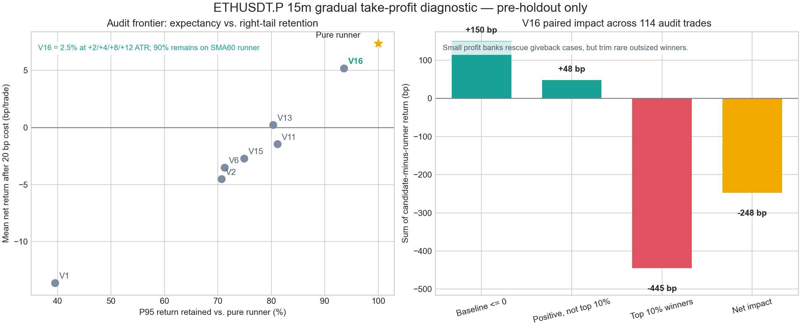

# P1：ETHUSDT.P 15m 趋势单渐进止盈 V16（2026-09-05）

## 结论

**Owner 指出的执行问题成立：真实止盈和抬高止损是两件事，不能互相冒充。** 本轮冻结入场和原
SMA60 runner，只改持仓拆分，连续验证 16 版退出结构。最终保存的 V16 在 `+2/+4/+8/+12`
个 signal ATR 分别平掉原仓位 `2.5%`，四档全到只兑现 `10%`，其余 `90%` 继续由原
SMA60(HL2)±1 个当前 ATR 的单向收紧止损管理。**任何一档部分止盈都不会移动止损、不会改成
保本，也不会提前结束 runner。**

这个版本解决了表达和执行语义，但尚未证明能提高收益。2025-01-01 至 2026-03-01 的非 pristine
审计共 114 笔，纯 runner 成本后单笔 `+7.36bp`，V16 为 `+5.19bp`；配对差
`-2.17bp`，sign-flip `p=0.9141`。V16 仍为正，P95 保留 `93.58%`，明显优于此前所有真正做了
较多止盈的版本，但仍没有击败纯 runner。因此裁决是：**V16 作为符合 Owner 语义的研究/看盘版保存，
不替换生产执行，不 promote。**



图右揭示了最关键的规律：小额止盈给原本非正收益的交易合计补回 `+150bp`，给一般盈利交易再增加
`+48bp`，但从最强 10% 趋势单拿走 `-445bp`，114 笔净影响 `-248bp`。这就是“落袋”和“吃完整
大趋势”的真实冲突；正确方向不是把止损无限上移，而是把止盈份额压得足够小。

## 现在的完整交易规则

### 1. 图表与指标

| 项目 | 固定规则 |
|---|---|
| 标的 / 周期 | OKX `ETH-USDT-SWAP` / 15m；Pine 在其他周期不发信号 |
| 快线 | EMA30(HL2)，图上唯一可见均线，宽度 1 |
| 慢线 | SMA60(HL2)，只参与趋势与 runner 计算，默认不显示 |
| ATR | Pine RMA ATR14 |
| K 线颜色 | EMA30 方向多侧 `#17A297`，空侧 `orange`；实体、边框、影线同色 |
| 信号显示 | K1/K2 高亮，小标签；无 `TP` / `SL` 大字；止盈只显示小百分比 |

### 2. 趋势 regime：先确认趋势，再找 K1→K2

多头要求 `(EMA30-SMA60)/ATR >= 1.0` 且 EMA30 四根斜率 `>= +0.05 ATR/bar`；空头镜像。
该方向连续 12 根完成 K 线后创建一个 regime。每个 regime 最多接受一组 K1→K2；止损或超时不会
让同一段行情再次开仓。只有方向反转，或均线价差 `<=0.10 ATR` 且斜率 `<=0.005 ATR/bar`
连续 8 根，才重置。

历史 regime 记忆不能单独放行。K2 收盘时还必须满足：多头 EMA30 仍高于 SMA60 且四根斜率非负；
空头完全镜像。这样盘整区不会因为旧趋势状态反复出信号。

### 3. K1 形态

K1 是实体顺方向贯穿 EMA30 的完成 K 线：

- 顺方向实体至少 `0.20 ATR`，整根振幅至少 `0.65 ATR`；
- 收盘位于本根顺方向一端至少 60%；
- 开盘在均线错误侧或线上，收盘在正确侧或线上；
- K1 到 K2 相隔 2–8 根；中间每根收盘不得回到错误侧超过 `0.05 ATR`。

若 2–8 根内有多个 K1，按 K1 实体、振幅、收盘位置和 K2 拒绝影线四项等权质量分选最好的一根。

### 4. K2 形态与入场

K2 必须用拒绝影线真实碰到 EMA30，但实体留在趋势侧：

- 趋势反向影线占整根至少 15%；实体占整根最多 75%；
- 触线深度为 `0..1.50 ATR`；负值即没有触线，拒绝；
- 收盘在趋势侧，实体不能穿到均线另一侧；
- K2 完成收盘确认，下一根开盘入场；多空同根冲突时取形态质量更高者。

### 5. 初始风险、渐进 TP 与 runner

| 顺序 | 规则 |
|---:|---|
| 1 | 入场即放初始灾难止损：多头 `entry-2×signal ATR`，空头镜像 |
| 2 | 价格触及 `+2 ATR`：按目标价真实平原仓 2.5% |
| 3 | 触及 `+4 ATR`：再平原仓 2.5% |
| 4 | 触及 `+8 ATR`：再平原仓 2.5% |
| 5 | 触及 `+12 ATR`：再平原仓 2.5%；仍保留 90% |
| 6 | 完成 K 线收盘达到 `+2 ATR` 后 arm runner |
| 7 | runner 多头止损为 `SMA60(HL2)-1×当前 ATR`，空头为加号，只能朝盈利方向收紧 |
| 8 | 最长 96 根；到期才退出剩余仓位 |

同一根同时碰到有效止损和新止盈档位时，回测按 **stop first**，避免用未知的 15m 内部路径挑最乐观
顺序。跳空越过止损按该根开盘成交。SMA60 runner 在完成 K 线收盘计算，从下一根才生效。

这正对应 Owner 截图中的处理：上涨途中逐档把很小一部分利润变成已实现收益；其余 90% 让均线拖着走，
等趋势真正破坏再退出。已经平掉的 2.5% 永远不会“变成止损”；但剩余大仓若反转，整笔组合仍可能为负，
不能把部分落袋伪装成整笔保本。

## 为什么最后只有 10%，不是继续加大 TP

### 开发选择（2023–2024，182 笔）

只选择总止盈比例，候选为 10% / 15% / 20%，四档等分；入场、档位、stop、runner、96 bars 和 20bp
成本全部冻结。

| 方案 | 单笔净收益 | PF | P95 | P95 相对纯 runner | 最大单笔 |
|---|---:|---:|---:|---:|---:|
| 纯 runner | -22.431bp | 0.6427 | 285.37bp | 100.00% | 882.39bp |
| V16：总止盈 10% | -22.324bp | 0.6376 | 273.70bp | **95.91%** | 811.35bp |
| 总止盈 15% | -22.270bp | 0.6349 | 268.52bp | 94.10% | 775.83bp |
| 总止盈 20% | -22.216bp | 0.6323 | 263.34bp | 92.28% | 740.32bp |

比例越大，平均值在开发期看起来越好一点，但 PF 反而下降，右尾持续变薄。预注册门要求 P95 至少保留
95%，因此只有 10% 通过。这里不是“10% 收益最漂亮”，而是它是**仍符合趋势策略右尾约束的最大保守
候选**。

### 非 pristine 审计（2025-01 至 2026-02，114 笔）

| 指标 | 纯 SMA60 runner | V16 渐进 TP | V16 - runner |
|---|---:|---:|---:|
| 单笔毛收益 | +27.363bp | +25.190bp | -2.172bp |
| 单笔净收益（20bp 成本） | **+7.363bp** | **+5.190bp** | -2.172bp |
| PF | 1.0906 | 1.0649 | -0.0257 |
| 胜率 | 24.56% | 24.56% | 0.00pp |
| 最大回撤（1% 等风险） | -21.48% | -21.03% | +0.45pp |
| P95 单笔 | 566.02bp | 529.71bp | 保留 93.58% |
| 最大单笔 | 1824.84bp | 1677.30bp | -147.54bp |
| 中位 giveback | 4.40 ATR | 3.45 ATR | -0.95 ATR |
| 配对差 sign-flip p | — | — | `0.9141` |

V16 有 56/114 笔至少触发一档：0/1/2/3/4 档分别为 58/21/16/7/12 笔；40 笔收益提高、16 笔
降低、58 笔不变。它减少视觉上最讨厌的 giveback，却没有改变胜率，因为小额落袋通常不足以抵消剩余
97.5% 或 95% 仓位的最终亏损。

### 右尾为什么这么敏感

按纯 runner 最终收益事后分组，仅用于诊断：

| 组别 | 笔数 | V16 相对 runner 合计变化 |
|---|---:|---:|
| runner 非正收益 | 86 | +149.98bp |
| 正收益但非前 10% | 16 | +47.73bp |
| 前 10% 大赢家 | 12 | **-445.36bp** |
| 全部 | 114 | **-247.66bp** |

前 10% 的纯 runner 毛/净均值为 `+717.23/+697.23bp`，V16 为 `+680.11/+660.11bp`。这组是按
未来结果定义，绝不能当入场过滤器；它只说明趋势策略的数学结构：大量小幅改良抵不过少数超级趋势被
削掉一点仓位。V16 已把这个损失压到此前版本中最小，但没有消失。

## V1–V16 失败规律

| 版本族 | 做法 | 结果与失败原因 |
|---|---|---|
| V1 | `+2ATR` 起累计平 75% | 审计 -13.61bp，P95 只剩 39.49%；过早把趋势仓切碎 |
| V2 | 间距放到 3ATR，仍平 60% | 审计 -4.51bp，P95 70.68%；方向正确但仓位仍太重 |
| V3–V6 | 固定 2/4/8/12 ATR 银行梯子 | 开发期均值略改善会诱导选大比例；V6 平 50% 后审计 -3.50bp、P95 71.24% |
| V7–V10 | 等弱势、K 线变色或衰减后再平 | 太晚时救不回失败单；太早/太多仍砍右尾。没有一个通过开发期全部门 |
| V11 | 连续两根反向颜色后按 20/10/5/5% 平 | 开发期单笔反而 -0.11bp；审计 -1.46bp，仍损失 18.84% P95 |
| V12 | 达 +8ATR 后禁止再减仓 | 开发 P95 保留 99.42%，但最优参数是强趋势释放倍数 0；等于大趋势不做 Owner 要求的渐进 TP |
| V13 | 强趋势也至少释放 5/2.5/1.25/1.25% | 开发很好，审计却从 +7.36 降到 +0.23bp；强势身份知道得太晚，前两档已经切掉尾部 |
| V14 | 若“最终会到 +8ATR”就把总释放封顶 10% | 违反因果：交易当时不知道未来会不会到 +8ATR；10 次 strong-cap 穿透，审计前拒绝 |
| V15 | 用“先到 +8ATR 还是先深回撤”决定 strong/ordinary | 因果修复成功，但审计 -2.71bp、P95 74.90%；分类时点仍晚，普通路径放量过多 |
| **V16** | 不分类，固定四档各 2.5%，90% 永久留 runner | 审计仍正 +5.19bp、P95 93.58%；最符合语义、损伤最小，但未击败纯 runner |

共同规律有三条：

1. **提高止损不是止盈。** 它只是改变未实现利润的退出条件；跳空、bar 内路径和后续反转都可能把它
   打回去。真实部分成交才能把利润从市场风险中拿走。
2. **越早知道“大趋势”，越容易泄漏未来。** 用最终 MFE 给当前仓位分类会得到漂亮结果，但不能交易；
   改成因果路径后，确认通常已晚。
3. **ETH 15m 这套入口靠极少数大赢家付账。** 分批比例是对右尾的直接税。要慢慢 TP 可以，但总预算必须
   小；本轮数据支持 10% 研究版，不支持 40%–75%。

## 匹配随机对照与统计口径

审计对照按同月 × UTC 六小时段 × 月内 ATR14 五分位匹配，每个事件 3 个控制，避开信号前后 96 根，
用同方向、同执行和同 20bp 成本重放。

| 项目 | 结果 |
|---|---:|
| V16 候选净均值 | +5.190bp |
| 匹配随机净均值 | -22.808bp |
| 匹配超额 | +27.999bp |
| 配对 sign-flip p | 0.1650 |

超额为正但 `p` 远高于项目的 0.01 门，所以不能声称已经证明 entry edge。V16 与纯 runner 的配对检验
同样不显著，而且方向为负。

本实验是**冻结同一批入口后的确定性退出管理对照**，没有训练模型、没有概率分数、没有做候选排序，
所以 val AUC、score permutation、模型 top-decile 和单特征基线在字面上不适用；不能编造。等价的严格
零假设证据是：逐笔同 setup 的 runner 配对、sign-flip 检验，以及上述匹配随机入场。事后按 runner
收益切的 top 10% 只用于解释损伤来源，不是模型 top-decile 成绩。

## 数据统计与无前视合同

| 项目 | 开发选择 | 非 pristine 审计 |
|---|---:|---:|
| 行情范围 | 2022-01-03 至 2024-12-31 | 2022-01-03 至 2026-02-28 |
| 文件前缀读取行 | 104,962 | 145,666 |
| 冻结交易 | 182（LONG 90 / SHORT 92） | 114（LONG 57 / SHORT 57） |
| 净正交易 | 38 | 28 |
| 原始 K1/K2 pair（开发） | 3,815 | — |
| 仓库 holdout 行读取 | **0** | **0** |

仓库 holdout 起点是 `2026-05-04T00:00:00Z`。读取器先按 chunksize=1000 截止到
`2026-03-01T00:00:00Z`，没有把后面的行载入再过滤。所有信号特征只用 K2 及以前的完成 K 线；
未来 OHLC 仅用于成交标签和退出重放。TradingView 编译时图表锚定在 2024-12-15，只验证语法、挂载和
样式，没有用截图后的行情调参数，也没有给仓库 holdout 评分。

## TradingView 交付

- 私有脚本名：`Fable ETH 15m Trend · Gradual TP V16`；未发布到社区。
- TradingView 官方 Pine v6 编译 0 错误，已挂到 15m 图表并保存。
- 源码 SHA256：`e780c26989530ec6be8ccb4c6c2ba3d8f6611b9cd04bb6a94feb5b12809ab5a2`。
- 代码保留原 V5 稀疏信号、K1/K2 高亮、单条细 EMA、同色 K 线实体/边框/影线和简洁风险框。
- 官方编译只能证明 Pine 语法和当前图表渲染，不证明 Python 与 Pine 的逐笔成交完全一致。

## 风险与诚实声明

- 114 笔审计期在父 lineage 已被查看，本轮明确标为 `audit_is_not_pristine=true`，不是全新终审。
- V16 通过的是开发期预注册尾部门，不是收益显著性门；审计相对 runner 为负，不能说“最优赚钱参数”。
- 部分 TP 降低未实现利润回吐，但 2.5% 的已实现利润不保证整笔为正；保证保本必须另改 stop 合同，而
  Owner 本轮明确要求不要拿抬 stop 冒充 TP。
- OHLC 不知道同根 15m 内先后路径，统一用 stop-first 是保守约定；实盘成交、滑点和资金费率可能更差。
- 成本为固定往返 20bp，没有逐笔资金费率、冲击和额外滑点。
- V16 Pine 是研究显示器，不是自动下单策略；没有修改 ACTIVE、frozen、forward、新鲜度门、仓位、
  API key、部署或真实订单。
- 没有自动 promote；`training_eligible=false`、`production_eligible=false`。

## 产物

- V16 实验、逐笔账本与审计：
  `experiments/active/exp-ethusdtp-15m-micro-profit-ladder-preholdout-20260905-v16/`
- Pine：
  `experiments/active/exp-ethusdtp-15m-micro-profit-ladder-preholdout-20260905-v16/pine/fable_eth_15m_trend_gradual_tp_v16.pine`
- 研究程序：`scripts/research_ethusdtp_15m_micro_profit_ladder_v16.py`
- 图表程序：`scripts/build_ethusdtp_15m_gradual_tp_report_figures.py`
- 测试：`tests/test_research_ethusdtp_15m_micro_profit_ladder_v16.py`
- 编译保存凭据：
  `experiments/active/exp-ethusdtp-15m-micro-profit-ladder-preholdout-20260905-v16/results/tradingview_compile_receipt.json`

## 复现命令

```bash
cd /Users/zhangzc/fable-trading

PYTHONPATH=. python3 -m scripts.research_ethusdtp_15m_micro_profit_ladder_v16 \
  --phase selection

# selection_receipt.json 已提交后才允许运行 audit；只读取 2026-03-01 以前。
PYTHONPATH=. python3 -m scripts.research_ethusdtp_15m_micro_profit_ladder_v16 \
  --phase audit

python3 scripts/build_ethusdtp_15m_gradual_tp_report_figures.py

python3 -m pytest -q \
  tests/test_research_ethusdtp_15m_micro_profit_ladder_v16.py

/Users/zhangzc/.local/bin/ruff check \
  scripts/research_ethusdtp_15m_micro_profit_ladder_v16.py \
  scripts/build_ethusdtp_15m_gradual_tp_report_figures.py \
  tests/test_research_ethusdtp_15m_micro_profit_ladder_v16.py

python3 scripts/md_to_html.py \
  analysis/p1_ethusdtp_15m_gradual_take_profit_20260905.md \
  --out-dir analysis/html
```
