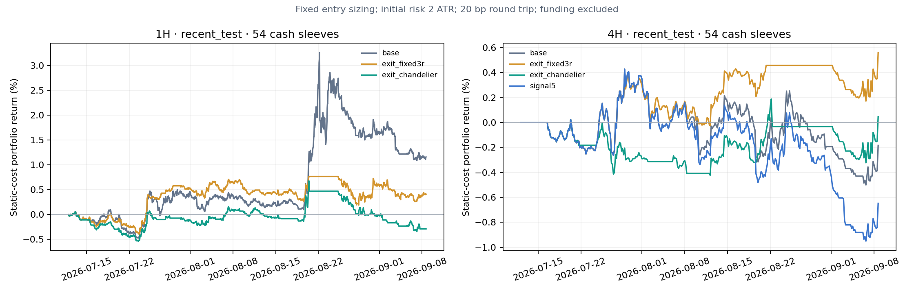
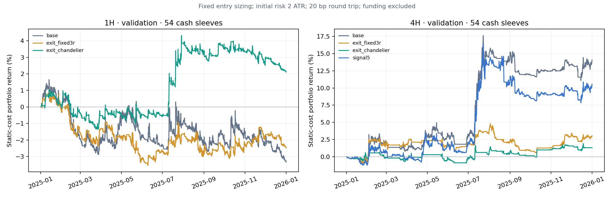

# Spike｜高波动山寨启动与趋势持有研究

2026-09-09 · 原54币研究池＋SOPH/USELESS展示组 · 1H/4H主检验、15m迁移/成本诊断。

**当前表格的“净”只扣统一20bp交易成本，未计完整资金费、盘口冲击和清算。以下是历史研究，不是已验证的实盘收益。**

## 这轮找到的重点

**有能跑出大趋势的启动案例，但本轮没有找到跨时间、跨山寨池稳定胜出的“最优参数”。最值得继续研究的是从安静到活跃的变化，以及启动后如何保留长尾利润。单纯挑过去已经最波动的币、把蓄势根数调大，或硬加OI上升条件，都没有得到稳定支持。**

本轮覆盖原54币研究池、额外215个加密合约、SOPH/USELESS两个展示币，共271个不同品种。原池测试15m、1H、4H；外部池测试1H、4H。比较11组一因素参数、5项独立启动背景、4种共同初始风险下的退出路径，并另检验OI/主动成交和费用。原池与外部池截止时间不同，不能把它们当成同一时段的全市场收益。

### 参数来源，以及能否直接用于山寨

34/9继承自原始LazyBear代码；12根、0.10ATR是后来突出近零蓄势的显示默认；六条20/60/120均线来自你已有的方法。**它们从来不是ETH、BTC或者山寨历史收益优化出来的参数。**ATR归一化使价格尺度更容易迁移，但不会自动解决不同周期、流动性和行情阶段的差异。12根在15m、1H、4H分别代表3、12、48小时。

用2023–2024开发、2025选择后，1H的综合排名主提名是3ATR移动保护，4H是Signal5；两周期各有5项达到入围条件，另分别保留箱体突破、固定3R等家族提名。15m没有候选达到原定入围条件。将这些固定到2026再检验，表现不稳定，不能把旧年冠军直接部署：

| 固定候选 | 原池近期组合净收益 | 收盘最大回撤 | 外部215币近期组合净收益 | 收盘最大回撤 |
|---|---:|---:|---:|---:|
| 1H · 3ATR移动保护 | −0.29% | −1.01% | −0.40% | −0.69% |
| 4H · Signal5 | −0.65% | −1.37% | −0.70% | −0.81% |

以上为统一20bp静态交易成本、等资本袖套、空闲资金留现金的结果；主池近期为7月12日至9月9日北京时间零点，外部池只到8月14日04:00 UTC。它们不是同一段对比，也不含完整资金费、滑点与清算。BTC与ETH的单币结果在正文单列，没有把两者和山寨混成一个平均值。15m近期353个高波动基准候选，四种固定退出组合净收益为−0.87%至−1.40%，相应收盘最大回撤约−1.10%至−1.63%；没有按近期结果再选出一个“赢家”。

### 你说的“3R太小”，在部分行情里确实成立

USELESS 1H的同一根启动、同一入场0.068和同一2ATR初始风险：固定3R约留下2.97R，3ATR移动保护约8.85R，主线失向退出约35.33R，SMA60退出约38.56R。这里是按规则模拟自然退出后的静态成本净R，MFE约57R只代表途中有利幅度，不能当作赚到了57R。

但SOPH 4H展示了另一面：同一启动下，SMA60路径接近保本后退出，移动保护不到1R，3R正常退出；主线路径到研究截止约13.21R，**仍是边界盯市，尚未自然退出**。因此不能把某一张图的最佳退出推广到所有币。保留大趋势要接受回吐；放宽保护也会扩大失败与持仓成本。

### “已经很波动”和“正在从安静变得剧烈”需要分开

我们在信号发生前按上周ATR/价格选高波动前四分之一，这比用今天涨幅榜倒选过去更严格，却也暴露了遗漏：原池近期1H基准的18个事后≥5R事件只保留6个，遗漏的最大自然退出案例是XRP约48.05R。4H四个≥5R事件全部遗漏，其中三个是边界盯市，不能全部称已兑现赢家；ZEC约37.14R就是其中一个尚未自然退出的例子。

这些对照没有证明“不要筛波动”就能赚钱，但表明**上周已很活跃不能作为新启动的唯一入场资格**。你的目标更接近：先识别压缩/均线汇拢，再观察价格离开整理区时量能与振幅相对自身历史是否发生变化。全景图库同时收录这类遗漏、正常赢家和失败，避免只看成功截图。

### OI、成交量、动能要怎样加入

- **相对成交量、真实振幅扩张、收盘位置、箱体突破、BB宽度**都已经独立测试；这轮没有证据支持把所有条件直接叠成一个更严格信号。越严格可能越少噪音，也可能把真正的大赢家一起删掉。
- **OI币本位变化与价格方向分开读。**USD持仓估值会被涨价推高；OI增加不等于净做多。USELESS那次1H启动的可用4H OI变化略负，OI24H略正，因此“4H OI必须增加”会删除该启动时点，不代表它一定漏掉之后全部机会。
- **主动买卖量只能作额外证据。**本轮方向占比阈值在近期1H仅留下13个事件，4H仅5个；周期之间结果不一致，样本不足以确立统一硬条件。
- **资金费率先用于成本与拥挤诊断。**真实已结算历史不完整，不能把今天的费率回填过去；本轮给出共同覆盖子集的区间，不冒称完整资金费后组合收益。

你记得的热门币监控思路，在[CoinAnk工具说明](https://www.coinank.com/zh/tool)和[Coinalyze提醒](https://coinalyze.net/alerts/)能找到对应的持仓、成交、波动与资金费指标。公开资料可以帮助定义观察项，不能替代收益验证；本轮未核实某个推特博主的交易战绩。

### 已经做成了什么，下一步依据什么推进

Python中已加入因果特征、同风险逐根回放、匹配随机对照、时间切分锁参、成本敏感性、全景图和原生OKX衍生品采集。使用现有NumPy/pandas明确实现执行时钟，没有为了换框架而改变数据或模型依赖。另保留了原生1H OI/taker历史入口，采集质量单独报告；**它尚未经过增量收益验证，也没有替换当前4H背景结果。**

下一步优先保留“结构候选＋当下扩张程度”的独立观察记录，分别标注OI上升/下降、主动成交与费率，等累积真实收到时间后再做前向比较。退出继续用共同初始风险比较长尾捕获和回吐，不预设3R就是全部止盈。上述方向是这轮证据支持继续研究的问题，不是已证实可赚钱的新信号。

线上Pine、IMACD→YOLO二次确认、通知规则和实盘配置未切换。没有把历史提名冠军自动升为线上参数。低胜率可以接受，但需要整个分布在费用后成立，而不只是能找到几笔几十R的漂亮行情。


## 样本与覆盖

| 时期 | 周期 | 有效基准事件 | 有事件币数 | 已匹配事件 | 单仓选中 | 边界盯市 | 正净收益占比% |
| --- | --- | --- | --- | --- | --- | --- | --- |
| 2023–24开发 | 1H | 796.00 | 39.00 | 795.00 | 796.00 | 3.00 | 25.75 |
| 2023–24开发 | 4H | 166.00 | 33.00 | 165.00 | 166.00 | 4.00 | 31.93 |
| 2025选择 | 1H | 490.00 | 42.00 | 489.00 | 490.00 | 2.00 | 24.69 |
| 2025选择 | 4H | 103.00 | 33.00 | 102.00 | 103.00 | 2.00 | 32.04 |
| 2023–24开发 | 15m | 3411.00 | 42.00 | 3411.00 | 3411.00 | 2.00 | 21.58 |
| 2025选择 | 15m | 1976.00 | 43.00 | 1976.00 | 1976.00 | 6.00 | 21.91 |
| 2026年初–5/4 | 1H | 176.00 | 36.00 | 174.00 | 176.00 | 4.00 | 25.57 |
| 2026年初–5/4 | 4H | 36.00 | 21.00 | 35.00 | 36.00 | 3.00 | 22.22 |
| 5/4–7/12已观察 | 1H | 99.00 | 26.00 | 98.00 | 99.00 | 3.00 | 28.28 |
| 5/4–7/12已观察 | 4H | 28.00 | 14.00 | 28.00 | 28.00 | 3.00 | 25.00 |
| 7/12–9/9近期时间测试 | 1H | 82.00 | 25.00 | 82.00 | 82.00 | 1.00 | 34.15 |
| 7/12–9/9近期时间测试 | 4H | 24.00 | 15.00 | 24.00 | 24.00 | 5.00 | 37.50 |
| 2026年初–5/4 | 15m | 725.00 | 37.00 | 725.00 | 725.00 | 3.00 | 24.69 |
| 5/4–7/12已观察 | 15m | 414.00 | 31.00 | 414.00 | 414.00 | 1.00 | 25.85 |
| 7/12–9/9近期时间测试 | 15m | 353.00 | 31.00 | 353.00 | 353.00 | 4.00 | 23.23 |

开发2023–2024，选择2025，2026年初–5/4、5/4–7/12、7/12–9/9分段回放；每段结束处强制盯市并显式标记。K线周期来自完整15m聚合，事件与对照共同550根预热。

## 先看锁定候选在近期的结果

候选仅用2023–2024开发和2025选择期提名，然后固定后检查2026。1H提名3ATR移动保护，4H提名信号线5；其他固定退出作为预先约定基准。提名不等于统计验收。2026日期在此前研究中已被观察，因此称时间测试，不能冒称全新盲测。

| 时期 | 周期 | 方案 | 事件 | 匹配事件 | 全事件均净bp | 随机对照bp | 匹配超额bp | 组合净% | 收盘回撤% | 胜率% |
| --- | --- | --- | --- | --- | --- | --- | --- | --- | --- | --- |
| 7/12–9/9近期时间测试 | 1H | 3ATR移动保护 | 82.00 | 82.00 | -19.130 | -87.981 | 68.852 | -0.29 | -1.01 | 40.24 |
| 7/12–9/9近期时间测试 | 4H | 信号线5 | 27.00 | 27.00 | -134.234 | -90.419 | -43.815 | -0.65 | -1.37 | 33.33 |

同一币只有一仓，54个等资本袖套，不活跃资金留现金；高波动名单每周固定。各臂使用相同资本分配规则，实际持仓利用率随退出路径不同；不能把该收益乘54冒充高集中仓位实绩。组合净收益与“每笔平均收益”不是同一个量。

表中“全事件均净”包括重叠候选；组合只使用单仓选中事件。随机对照和超额只使用匹配子集，所以全事件均净减对照不一定等于超额。匹配案例均净可以由对照+超额还原。



## 参数到底从哪里来

| 参数 | 来源/含义 | 当前证据边界 |
|---|---|---|
| MA34 / Signal9 | 用户原始LazyBear代码 | 继承值，不是针对ETH/BTC/山寨选出的最优值 |
| 蓄势12根 / 近零0.10ATR | 后续显示默认，资格成立后冻结近零带 | 不是历史收益优化结果；本轮首次按预定候选比较 |
| SMA/EMA20、60、120六线 | 用户已有均线密集方法 | 可表达结构，不能据线密集直接推断胜率 |
| SMA20回踩/保护 | 对应用户原先关注的深色线 | 是结构参考，没有证明对所有币最优 |
| 高周期许可、密集阈值 | 旧系统背景/普通启动逻辑 | 当前重点focus释放标签并非都由这些输入过滤 |
| 3R、颜色、延伸长度、保留框数 | 风险展示与样式 | 不等于回测实际止盈，也不影响全部信号 |

0.10ATR是相对本币波动的尺度，已经比固定ETH/BTC点数更容易迁移；但相同12根在15m=3小时、1H=12小时、4H=48小时，含义差别很大。需要检验跨年、跨币和邻近参数，而不是每币挑一个历史冠军。Mac监控参数不会自动跟随TradingView设置同步。

本轮复现的是Pine可见focus释放候选，未把YOLO二次确认加进每个离线事件。当前前端/TG仍用既有IMACD→YOLO协议；这些表格不能直接冒充当前通知组合的绩效。

## 旧年一因素参数比较

基准34/9/12/0.10，每次仅改一项：MA21/55，signal5/13，蓄势6/24/36，近零带0.05/0.20/0.30。共同禁止550根前入场，但不重写指标自己的状态。表中2025参与选择，属于样本内选择证据。

| 时期 | 周期 | 方案 | 事件 | 匹配事件 | 全事件均净bp | 随机对照bp | 匹配超额bp | 组合净% | 收盘回撤% | 胜率% |
| --- | --- | --- | --- | --- | --- | --- | --- | --- | --- | --- |
| 2025选择 | 1H | 近零带0.05ATR | 401.00 | 399.00 | -44.639 | -134.251 | 90.000 | -3.91 | -5.34 | 24.94 |
| 2025选择 | 1H | 近零带0.20ATR | 642.00 | 642.00 | -54.539 | -103.228 | 48.689 | -7.98 | -9.62 | 24.92 |
| 2025选择 | 1H | 近零带0.30ATR | 757.00 | 757.00 | -54.733 | -118.553 | 63.820 | -8.57 | -10.57 | 24.83 |
| 2025选择 | 1H | 34/9基准 · 主线失向退出 | 490.00 | 489.00 | -18.054 | -100.170 | 82.220 | -3.32 | -4.91 | 24.69 |
| 2025选择 | 1H | 蓄势24根 | 169.00 | 168.00 | -36.336 | -150.866 | 114.721 | -1.29 | -3.15 | 27.22 |
| 2025选择 | 1H | 蓄势36根 | 54.00 | 54.00 | 49.866 | -203.764 | 253.630 | 0.45 | -0.95 | 37.04 |
| 2025选择 | 1H | 蓄势6根 | 836.00 | 835.00 | -42.858 | -104.625 | 61.798 | -7.34 | -9.42 | 24.04 |
| 2025选择 | 1H | MA21 | 584.00 | 584.00 | -24.395 | -74.620 | 50.225 | -3.04 | -4.85 | 28.94 |
| 2025选择 | 1H | MA55 | 392.00 | 391.00 | -85.766 | -130.460 | 42.296 | -5.67 | -6.54 | 19.90 |
| 2025选择 | 1H | 信号线13 | 378.00 | 377.00 | -14.083 | -103.018 | 89.079 | -1.54 | -4.18 | 26.98 |
| 2025选择 | 1H | 信号线5 | 606.00 | 605.00 | -28.899 | -113.059 | 84.226 | -5.12 | -6.68 | 24.42 |
| 2025选择 | 4H | 近零带0.05ATR | 79.00 | 79.00 | 157.223 | 46.508 | 110.715 | 2.03 | -3.60 | 30.38 |
| 2025选择 | 4H | 近零带0.20ATR | 150.00 | 149.00 | 331.692 | 214.767 | 122.671 | 12.97 | -7.73 | 30.67 |
| 2025选择 | 4H | 近零带0.30ATR | 177.00 | 176.00 | 241.955 | 135.087 | 112.101 | 9.59 | -8.01 | 29.38 |
| 2025选择 | 4H | 34/9基准 · 主线失向退出 | 103.00 | 102.00 | 433.231 | 307.533 | 135.202 | 14.02 | -5.57 | 32.04 |
| 2025选择 | 4H | 蓄势24根 | 40.00 | 40.00 | 445.967 | 219.499 | 226.468 | 2.96 | -2.18 | 35.00 |
| 2025选择 | 4H | 蓄势36根 | 9.00 | 9.00 | -65.026 | -166.559 | 101.532 | -0.11 | -0.72 | 33.33 |
| 2025选择 | 4H | 蓄势6根 | 199.00 | 197.00 | 242.157 | 110.899 | 140.905 | 10.04 | -9.15 | 28.64 |
| 2025选择 | 4H | MA21 | 134.00 | 134.00 | -3.161 | -85.611 | 82.451 | -0.79 | -3.32 | 31.34 |
| 2025选择 | 4H | MA55 | 99.00 | 98.00 | 375.688 | 221.880 | 167.500 | 6.27 | -4.61 | 30.30 |
| 2025选择 | 4H | 信号线13 | 77.00 | 77.00 | 234.924 | 166.481 | 68.443 | 2.95 | -2.94 | 33.77 |
| 2025选择 | 4H | 信号线5 | 139.00 | 138.00 | 235.132 | 229.973 | 10.748 | 10.50 | -7.28 | 30.22 |
| 2025选择 | 15m | 近零带0.05ATR | 1607.00 | 1607.00 | -16.007 | -33.231 | 17.224 | -3.78 | -6.62 | 21.90 |
| 2025选择 | 15m | 近零带0.20ATR | 2574.00 | 2574.00 | -21.567 | -36.813 | 15.246 | -9.36 | -10.36 | 22.69 |
| 2025选择 | 15m | 近零带0.30ATR | 3067.00 | 3067.00 | -20.700 | -33.532 | 12.832 | -11.23 | -12.14 | 23.12 |
| 2025选择 | 15m | 34/9基准 · 主线失向退出 | 1976.00 | 1976.00 | -16.300 | -40.197 | 23.897 | -4.72 | -6.44 | 21.91 |
| 2025选择 | 15m | 蓄势24根 | 713.00 | 713.00 | -25.601 | -44.001 | 18.401 | -3.46 | -5.51 | 20.48 |
| 2025选择 | 15m | 蓄势36根 | 270.00 | 270.00 | -68.641 | -27.239 | -41.402 | -3.31 | -3.88 | 16.67 |
| 2025选择 | 15m | 蓄势6根 | 3385.00 | 3385.00 | -11.449 | -40.002 | 28.553 | -7.55 | -8.48 | 23.22 |
| 2025选择 | 15m | MA21 | 2363.00 | 2363.00 | -26.821 | -28.704 | 1.883 | -9.91 | -10.20 | 24.80 |
| 2025选择 | 15m | MA55 | 1593.00 | 1593.00 | -26.062 | -37.210 | 11.148 | -6.94 | -8.72 | 20.03 |
| 2025选择 | 15m | 信号线13 | 1592.00 | 1592.00 | -21.533 | -37.009 | 15.476 | -4.98 | -6.62 | 22.24 |
| 2025选择 | 15m | 信号线5 | 2444.00 | 2444.00 | -10.061 | -35.427 | 25.366 | -3.68 | -5.84 | 22.67 |

## 是否真的需要把3R放开

所有退出使用同一下一根开盘入场、2×信号ATR初始风险。对比3R、中性md退出、3ATR移动保护、SMA60退出。移动保护只在下一根生效；先执行已有止损，再依据已收盘K线更新。不能先拿当根最高价抬保护线、再利用同根最低价假设成交。

| 时期 | 周期 | 方案 | 事件 | 匹配事件 | 全事件均净bp | 随机对照bp | 匹配超额bp | 组合净% | 收盘回撤% | 胜率% |
| --- | --- | --- | --- | --- | --- | --- | --- | --- | --- | --- |
| 2023–24开发 | 1H | 34/9基准 · 主线失向退出 | 796.00 | 795.00 | 41.638 | 34.763 | 7.338 | 2.71 | -6.79 | 25.75 |
| 2023–24开发 | 1H | 3ATR移动保护 | 796.00 | 795.00 | 13.229 | -30.864 | 44.466 | 2.14 | -2.76 | 36.31 |
| 2023–24开发 | 1H | 固定3R | 796.00 | 795.00 | 13.213 | -55.884 | 69.524 | 0.51 | -3.06 | 28.14 |
| 2023–24开发 | 1H | SMA60退出 | 796.00 | 795.00 | 34.736 | 34.755 | 0.436 | 2.27 | -4.60 | 28.14 |
| 2023–24开发 | 4H | 34/9基准 · 主线失向退出 | 166.00 | 165.00 | -24.019 | -233.489 | 211.546 | 0.18 | -3.56 | 31.93 |
| 2023–24开发 | 4H | 3ATR移动保护 | 166.00 | 165.00 | 18.779 | -154.989 | 177.423 | 0.77 | -2.74 | 36.75 |
| 2023–24开发 | 4H | 固定3R | 166.00 | 165.00 | 90.240 | -87.782 | 183.719 | 3.36 | -2.99 | 30.12 |
| 2023–24开发 | 4H | SMA60退出 | 166.00 | 165.00 | -41.812 | -184.797 | 145.350 | -1.03 | -4.16 | 28.92 |
| 2025选择 | 1H | 34/9基准 · 主线失向退出 | 490.00 | 489.00 | -18.054 | -100.170 | 82.220 | -3.32 | -4.91 | 24.69 |
| 2025选择 | 1H | 3ATR移动保护 | 490.00 | 489.00 | 23.395 | -16.982 | 40.565 | 2.12 | -2.36 | 33.88 |
| 2025选择 | 1H | 固定3R | 490.00 | 489.00 | -15.954 | -52.553 | 36.706 | -2.46 | -4.51 | 26.12 |
| 2025选择 | 1H | SMA60退出 | 490.00 | 489.00 | -12.980 | -64.414 | 51.547 | -1.70 | -3.49 | 28.16 |
| 2025选择 | 4H | 34/9基准 · 主线失向退出 | 103.00 | 102.00 | 433.231 | 307.533 | 135.202 | 14.02 | -5.57 | 32.04 |
| 2025选择 | 4H | 3ATR移动保护 | 103.00 | 102.00 | 74.048 | -30.399 | 109.426 | 1.32 | -2.03 | 35.92 |
| 2025选择 | 4H | 固定3R | 103.00 | 102.00 | 158.655 | 57.863 | 107.605 | 3.05 | -4.04 | 31.07 |
| 2025选择 | 4H | SMA60退出 | 103.00 | 102.00 | 156.949 | 73.673 | 90.072 | 3.50 | -2.73 | 37.86 |
| 2023–24开发 | 15m | 34/9基准 · 主线失向退出 | 3411.00 | 3411.00 | -15.663 | -34.627 | 18.964 | -11.19 | -18.57 | 21.58 |
| 2023–24开发 | 15m | 3ATR移动保护 | 3411.00 | 3411.00 | -22.896 | -28.652 | 5.756 | -13.22 | -13.73 | 30.23 |
| 2023–24开发 | 15m | 固定3R | 3411.00 | 3411.00 | -25.275 | -31.671 | 6.396 | -15.00 | -15.43 | 25.56 |
| 2023–24开发 | 15m | SMA60退出 | 3411.00 | 3411.00 | -21.675 | -33.550 | 11.875 | -12.58 | -17.27 | 22.90 |
| 2025选择 | 15m | 34/9基准 · 主线失向退出 | 1976.00 | 1976.00 | -16.300 | -40.197 | 23.897 | -4.72 | -6.44 | 21.91 |
| 2025选择 | 15m | 3ATR移动保护 | 1976.00 | 1976.00 | -16.861 | -23.331 | 6.470 | -4.93 | -6.09 | 30.72 |
| 2025选择 | 15m | 固定3R | 1976.00 | 1976.00 | -21.417 | -35.126 | 13.709 | -6.89 | -7.86 | 24.85 |
| 2025选择 | 15m | SMA60退出 | 1976.00 | 1976.00 | -20.410 | -29.123 | 8.713 | -5.83 | -8.09 | 24.60 |
| 2026年初–5/4 | 1H | 34/9基准 · 主线失向退出 | 176.00 | 174.00 | 10.607 | -39.328 | 52.025 | 0.20 | -3.60 | 25.57 |
| 2026年初–5/4 | 1H | 3ATR移动保护 | 176.00 | 174.00 | 38.062 | -21.018 | 58.317 | 1.16 | -1.00 | 38.64 |
| 2026年初–5/4 | 1H | 固定3R | 176.00 | 174.00 | 12.843 | -18.484 | 35.056 | 0.31 | -2.01 | 26.14 |
| 2026年初–5/4 | 1H | SMA60退出 | 176.00 | 174.00 | -5.159 | -36.831 | 32.361 | -0.26 | -2.40 | 26.70 |
| 2026年初–5/4 | 4H | 34/9基准 · 主线失向退出 | 36.00 | 35.00 | -171.181 | -147.891 | -9.794 | -1.15 | -2.43 | 22.22 |
| 2026年初–5/4 | 4H | 3ATR移动保护 | 36.00 | 35.00 | -136.450 | -104.098 | -27.915 | -0.92 | -1.32 | 33.33 |
| 2026年初–5/4 | 4H | 固定3R | 36.00 | 35.00 | -55.564 | -115.317 | 76.553 | -0.41 | -1.82 | 30.56 |
| 2026年初–5/4 | 4H | SMA60退出 | 36.00 | 35.00 | -161.113 | -91.345 | -55.984 | -1.03 | -1.95 | 25.00 |
| 5/4–7/12已观察 | 1H | 34/9基准 · 主线失向退出 | 99.00 | 98.00 | -25.602 | -63.398 | 40.532 | -0.49 | -2.20 | 28.28 |
| 5/4–7/12已观察 | 1H | 3ATR移动保护 | 99.00 | 98.00 | -10.547 | -57.504 | 49.749 | -0.29 | -0.93 | 36.36 |
| 5/4–7/12已观察 | 1H | 固定3R | 99.00 | 98.00 | 7.509 | -59.441 | 70.024 | 0.21 | -1.39 | 28.28 |
| 5/4–7/12已观察 | 1H | SMA60退出 | 99.00 | 98.00 | 22.784 | -53.877 | 79.890 | 0.33 | -1.40 | 30.30 |
| 5/4–7/12已观察 | 4H | 34/9基准 · 主线失向退出 | 28.00 | 28.00 | -327.716 | -389.358 | 61.641 | -1.67 | -2.42 | 25.00 |
| 5/4–7/12已观察 | 4H | 3ATR移动保护 | 28.00 | 28.00 | -2.320 | -221.519 | 219.199 | -0.06 | -1.10 | 42.86 |
| 5/4–7/12已观察 | 4H | 固定3R | 28.00 | 28.00 | -275.546 | -423.831 | 148.284 | -1.39 | -2.41 | 32.14 |
| 5/4–7/12已观察 | 4H | SMA60退出 | 28.00 | 28.00 | -156.172 | -285.508 | 129.337 | -0.84 | -1.64 | 39.29 |
| 7/12–9/9近期时间测试 | 1H | 34/9基准 · 主线失向退出 | 82.00 | 82.00 | 81.151 | 38.563 | 42.589 | 1.16 | -2.10 | 34.15 |
| 7/12–9/9近期时间测试 | 1H | 3ATR移动保护 | 82.00 | 82.00 | -19.130 | -87.981 | 68.852 | -0.29 | -1.01 | 40.24 |
| 7/12–9/9近期时间测试 | 1H | 固定3R | 82.00 | 82.00 | 17.633 | -79.254 | 96.887 | 0.41 | -0.57 | 32.93 |
| 7/12–9/9近期时间测试 | 1H | SMA60退出 | 82.00 | 82.00 | 39.539 | -19.951 | 59.490 | 0.60 | -2.69 | 34.15 |
| 7/12–9/9近期时间测试 | 4H | 34/9基准 · 主线失向退出 | 24.00 | 24.00 | -48.276 | -77.556 | 29.280 | -0.18 | -0.92 | 37.50 |
| 7/12–9/9近期时间测试 | 4H | 3ATR移动保护 | 24.00 | 24.00 | 16.445 | -11.046 | 27.491 | 0.05 | -0.51 | 41.67 |
| 7/12–9/9近期时间测试 | 4H | 固定3R | 24.00 | 24.00 | 122.840 | 19.520 | 103.320 | 0.56 | -0.42 | 45.83 |
| 7/12–9/9近期时间测试 | 4H | SMA60退出 | 24.00 | 24.00 | -38.359 | -44.216 | 5.857 | -0.14 | -0.72 | 37.50 |
| 2026年初–5/4 | 15m | 34/9基准 · 主线失向退出 | 725.00 | 725.00 | 8.713 | -13.676 | 22.390 | 1.38 | -2.99 | 24.69 |
| 2026年初–5/4 | 15m | 3ATR移动保护 | 725.00 | 725.00 | -4.845 | -25.980 | 21.135 | -0.68 | -1.33 | 30.34 |
| 2026年初–5/4 | 15m | 固定3R | 725.00 | 725.00 | -4.223 | -13.774 | 9.551 | -0.63 | -2.13 | 26.90 |
| 2026年初–5/4 | 15m | SMA60退出 | 725.00 | 725.00 | -0.939 | -13.929 | 12.990 | -0.13 | -2.48 | 25.52 |
| 5/4–7/12已观察 | 15m | 34/9基准 · 主线失向退出 | 414.00 | 414.00 | -3.962 | -42.135 | 38.173 | 0.14 | -2.24 | 25.85 |
| 5/4–7/12已观察 | 15m | 3ATR移动保护 | 414.00 | 414.00 | -16.533 | -36.816 | 20.283 | -1.27 | -1.95 | 30.19 |
| 5/4–7/12已观察 | 15m | 固定3R | 414.00 | 414.00 | -11.399 | -45.897 | 34.499 | -1.09 | -2.05 | 27.54 |
| 5/4–7/12已观察 | 15m | SMA60退出 | 414.00 | 414.00 | 6.645 | -32.318 | 38.963 | 0.77 | -1.54 | 28.50 |
| 7/12–9/9近期时间测试 | 15m | 34/9基准 · 主线失向退出 | 353.00 | 353.00 | -21.672 | -49.016 | 27.344 | -1.40 | -1.63 | 23.23 |
| 7/12–9/9近期时间测试 | 15m | 3ATR移动保护 | 353.00 | 353.00 | -22.150 | -36.378 | 14.228 | -1.37 | -1.62 | 28.61 |
| 7/12–9/9近期时间测试 | 15m | 固定3R | 353.00 | 353.00 | -10.816 | -44.544 | 33.728 | -0.87 | -1.10 | 26.91 |
| 7/12–9/9近期时间测试 | 15m | SMA60退出 | 353.00 | 353.00 | -18.227 | -37.892 | 19.666 | -1.14 | -1.41 | 24.93 |



低胜率并不自动否定趋势策略，但需同时看损益均值、对照和最大回撤。MFE只是持有路径中的有利运动，不等于可以兑现的收益；盘中退出K线未知先后的极值没有被加入已证实MFE。

## 启动质量与真正的增量信息

| 时期 | 周期 | 方案 | 事件 | 匹配事件 | 全事件均净bp | 随机对照bp | 匹配超额bp | 组合净% | 收盘回撤% | 胜率% |
| --- | --- | --- | --- | --- | --- | --- | --- | --- | --- | --- |
| 2023–24开发 | 1H | 34/9基准 · 主线失向退出 | 796.00 | 795.00 | 41.638 | 34.763 | 7.338 | 2.71 | -6.79 | 25.75 |
| 2023–24开发 | 1H | BB压缩前20% | 188.00 | 188.00 | 208.162 | 78.040 | 130.122 | 6.62 | -2.47 | 26.60 |
| 2023–24开发 | 1H | 收盘突破原箱体 | 162.00 | 161.00 | 139.320 | -17.104 | 159.319 | 3.37 | -3.08 | 28.40 |
| 2023–24开发 | 1H | 方向收盘位置≥70% | 261.00 | 261.00 | 92.654 | -26.739 | 119.392 | 3.08 | -6.11 | 24.52 |
| 2023–24开发 | 1H | 相对量能≥2 | 233.00 | 233.00 | 217.405 | 24.837 | 192.568 | 8.02 | -2.76 | 29.61 |
| 2023–24开发 | 1H | 振幅扩张≥1.5 | 167.00 | 166.00 | 254.611 | 42.872 | 215.241 | 6.59 | -2.39 | 28.14 |
| 2023–24开发 | 4H | 34/9基准 · 主线失向退出 | 166.00 | 165.00 | -24.019 | -233.489 | 211.546 | 0.18 | -3.56 | 31.93 |
| 2023–24开发 | 4H | BB压缩前20% | 43.00 | 43.00 | 240.825 | -32.850 | 273.675 | 1.90 | -1.48 | 48.84 |
| 2023–24开发 | 4H | 收盘突破原箱体 | 40.00 | 39.00 | -200.187 | -185.227 | -10.696 | -1.60 | -3.03 | 27.50 |
| 2023–24开发 | 4H | 方向收盘位置≥70% | 62.00 | 61.00 | 178.881 | -120.779 | 308.600 | 2.27 | -1.53 | 37.10 |
| 2023–24开发 | 4H | 相对量能≥2 | 34.00 | 34.00 | -196.252 | -187.541 | -8.711 | -1.44 | -2.05 | 29.41 |
| 2023–24开发 | 4H | 振幅扩张≥1.5 | 28.00 | 28.00 | 77.363 | -141.551 | 218.913 | 0.31 | -1.08 | 39.29 |
| 2025选择 | 1H | 34/9基准 · 主线失向退出 | 490.00 | 489.00 | -18.054 | -100.170 | 82.220 | -3.32 | -4.91 | 24.69 |
| 2025选择 | 1H | BB压缩前20% | 121.00 | 121.00 | -9.102 | -105.384 | 96.281 | -0.17 | -2.34 | 22.31 |
| 2025选择 | 1H | 收盘突破原箱体 | 134.00 | 134.00 | 120.646 | -78.955 | 199.601 | 1.68 | -2.08 | 26.87 |
| 2025选择 | 1H | 方向收盘位置≥70% | 188.00 | 188.00 | 50.429 | -103.293 | 153.722 | 0.59 | -2.90 | 24.47 |
| 2025选择 | 1H | 相对量能≥2 | 129.00 | 129.00 | 59.400 | -105.005 | 164.405 | 0.54 | -2.69 | 24.81 |
| 2025选择 | 1H | 振幅扩张≥1.5 | 83.00 | 83.00 | 92.054 | -100.509 | 192.563 | 0.74 | -2.74 | 22.89 |
| 2025选择 | 4H | 34/9基准 · 主线失向退出 | 103.00 | 102.00 | 433.231 | 307.533 | 135.202 | 14.02 | -5.57 | 32.04 |
| 2025选择 | 4H | BB压缩前20% | 19.00 | 19.00 | 1108.810 | 1003.647 | 105.162 | 4.29 | -1.85 | 47.37 |
| 2025选择 | 4H | 收盘突破原箱体 | 23.00 | 23.00 | -113.340 | -377.244 | 263.904 | -0.55 | -1.56 | 34.78 |
| 2025选择 | 4H | 方向收盘位置≥70% | 39.00 | 39.00 | 851.986 | 688.606 | 163.380 | 5.52 | -2.11 | 35.90 |
| 2025选择 | 4H | 相对量能≥2 | 21.00 | 21.00 | 1071.792 | 805.855 | 265.937 | 4.14 | -1.90 | 28.57 |
| 2025选择 | 4H | 振幅扩张≥1.5 | 15.00 | 15.00 | 1754.603 | 1165.024 | 589.580 | 4.87 | -1.65 | 40.00 |
| 2023–24开发 | 15m | 34/9基准 · 主线失向退出 | 3411.00 | 3411.00 | -15.663 | -34.627 | 18.964 | -11.19 | -18.57 | 21.58 |
| 2023–24开发 | 15m | BB压缩前20% | 678.00 | 678.00 | -18.423 | -19.039 | 0.616 | -2.16 | -6.18 | 20.94 |
| 2023–24开发 | 15m | 收盘突破原箱体 | 845.00 | 845.00 | -6.716 | -18.991 | 12.275 | -0.95 | -7.00 | 23.08 |
| 2023–24开发 | 15m | 方向收盘位置≥70% | 1241.00 | 1241.00 | -6.117 | -38.021 | 31.903 | -1.69 | -7.26 | 22.00 |
| 2023–24开发 | 15m | 相对量能≥2 | 1152.00 | 1152.00 | -20.553 | -26.722 | 6.169 | -3.19 | -8.01 | 22.66 |
| 2023–24开发 | 15m | 振幅扩张≥1.5 | 750.00 | 750.00 | -11.375 | -18.471 | 7.097 | -1.17 | -5.27 | 23.47 |
| 2025选择 | 15m | 34/9基准 · 主线失向退出 | 1976.00 | 1976.00 | -16.300 | -40.197 | 23.897 | -4.72 | -6.44 | 21.91 |
| 2025选择 | 15m | BB压缩前20% | 461.00 | 461.00 | -33.230 | -30.177 | -3.053 | -2.70 | -3.35 | 19.96 |
| 2025选择 | 15m | 收盘突破原箱体 | 557.00 | 557.00 | -19.920 | -49.753 | 29.832 | -2.04 | -3.60 | 22.80 |
| 2025选择 | 15m | 方向收盘位置≥70% | 833.00 | 833.00 | -23.829 | -43.959 | 20.130 | -3.70 | -4.61 | 21.85 |
| 2025选择 | 15m | 相对量能≥2 | 602.00 | 602.00 | -33.175 | -42.889 | 9.714 | -3.56 | -4.18 | 20.10 |
| 2025选择 | 15m | 振幅扩张≥1.5 | 368.00 | 368.00 | -43.038 | -53.673 | 10.635 | -2.93 | -2.98 | 18.75 |
| 2026年初–5/4 | 1H | 34/9基准 · 主线失向退出 | 176.00 | 174.00 | 10.607 | -39.328 | 52.025 | 0.20 | -3.60 | 25.57 |
| 2026年初–5/4 | 1H | 收盘突破原箱体 | 40.00 | 39.00 | -28.511 | 13.715 | -36.738 | -0.23 | -0.82 | 25.00 |
| 2026年初–5/4 | 4H | 34/9基准 · 主线失向退出 | 36.00 | 35.00 | -171.181 | -147.891 | -9.794 | -1.15 | -2.43 | 22.22 |
| 5/4–7/12已观察 | 1H | 34/9基准 · 主线失向退出 | 99.00 | 98.00 | -25.602 | -63.398 | 40.532 | -0.49 | -2.20 | 28.28 |
| 5/4–7/12已观察 | 1H | 收盘突破原箱体 | 29.00 | 29.00 | -16.032 | -100.876 | 84.844 | -0.09 | -0.78 | 34.48 |
| 5/4–7/12已观察 | 4H | 34/9基准 · 主线失向退出 | 28.00 | 28.00 | -327.716 | -389.358 | 61.641 | -1.67 | -2.42 | 25.00 |
| 7/12–9/9近期时间测试 | 1H | 34/9基准 · 主线失向退出 | 82.00 | 82.00 | 81.151 | 38.563 | 42.589 | 1.16 | -2.10 | 34.15 |
| 7/12–9/9近期时间测试 | 1H | 收盘突破原箱体 | 10.00 | 10.00 | 122.178 | 178.936 | -56.759 | 0.22 | -0.24 | 30.00 |
| 7/12–9/9近期时间测试 | 4H | 34/9基准 · 主线失向退出 | 24.00 | 24.00 | -48.276 | -77.556 | 29.280 | -0.18 | -0.92 | 37.50 |
| 2026年初–5/4 | 15m | 34/9基准 · 主线失向退出 | 725.00 | 725.00 | 8.713 | -13.676 | 22.390 | 1.38 | -2.99 | 24.69 |
| 5/4–7/12已观察 | 15m | 34/9基准 · 主线失向退出 | 414.00 | 414.00 | -3.962 | -42.135 | 38.173 | 0.14 | -2.24 | 25.85 |
| 7/12–9/9近期时间测试 | 15m | 34/9基准 · 主线失向退出 | 353.00 | 353.00 | -21.672 | -49.016 | 27.344 | -1.40 | -1.63 | 23.23 |

每一项单独与默认信号比较，未把获胜的条件临时叠起来。尤其需要区分“删掉噪音”与“删掉未来的大赢家”。均线/箱体是定义形态的工具，只有同币同时段随机对照才能判断是否超出市场本身的上涨/下跌。

## 持仓量和主动成交量

使用OKX逐合约4H历史，BTC/ETH与SOPH/USELESS均为各自合约。OI以币本位变化为主，USD OI另列；涨价本身就能推高USD值。OI增加不是净做多，OI下降也不能直接叫做空头回补。

历史bucket没有confirm和可证明的首次可见时钟：本轮按桶开始+8小时才可用，超过8小时陈旧则缺失。1H/4H共用该保守4H背景；并未拿今天的快照补过去。每个门与该特征同覆盖的base对比，controls也必须在其当时可用。

| 时期 | 周期 | 方案 | 事件 | 匹配事件 | 全事件均净bp | 随机对照bp | 匹配超额bp | 组合净% | 收盘回撤% | 胜率% |
| --- | --- | --- | --- | --- | --- | --- | --- | --- | --- | --- |
| 7/12–9/9近期时间测试 | 1H | OI24H同覆盖基准 | 82.00 | 82.00 | 81.151 | 4.606 | 76.545 | 1.16 | -2.10 | 34.15 |
| 7/12–9/9近期时间测试 | 1H | OI24H下降诊断 | 44.00 | 44.00 | 172.881 | -7.062 | 179.943 | 1.39 | -1.07 | 38.64 |
| 7/12–9/9近期时间测试 | 1H | OI24H增加 | 38.00 | 38.00 | -25.062 | 18.116 | -43.178 | -0.16 | -1.47 | 28.95 |
| 7/12–9/9近期时间测试 | 1H | OI4H同覆盖基准 | 82.00 | 82.00 | 81.151 | 73.161 | 7.990 | 1.16 | -2.10 | 34.15 |
| 7/12–9/9近期时间测试 | 1H | OI4H增加 | 38.00 | 38.00 | 198.038 | 225.264 | -27.227 | 1.33 | -1.65 | 36.84 |
| 7/12–9/9近期时间测试 | 1H | 主动方向占比≥55% | 13.00 | 13.00 | 147.710 | -190.367 | 338.077 | 0.34 | -0.35 | 46.15 |
| 7/12–9/9近期时间测试 | 1H | 主动量同覆盖基准 | 82.00 | 82.00 | 81.151 | 8.807 | 72.344 | 1.16 | -2.10 | 34.15 |
| 7/12–9/9近期时间测试 | 4H | OI24H同覆盖基准 | 24.00 | 24.00 | -48.276 | -93.337 | 45.061 | -0.18 | -0.92 | 37.50 |
| 7/12–9/9近期时间测试 | 4H | OI24H下降诊断 | 6.00 | 6.00 | -272.267 | -393.288 | 121.021 | -0.30 | -0.67 | 16.67 |
| 7/12–9/9近期时间测试 | 4H | OI24H增加 | 18.00 | 18.00 | 26.388 | 6.646 | 19.741 | 0.10 | -0.68 | 44.44 |
| 7/12–9/9近期时间测试 | 4H | OI4H同覆盖基准 | 24.00 | 24.00 | -48.276 | -74.659 | 26.383 | -0.18 | -0.92 | 37.50 |
| 7/12–9/9近期时间测试 | 4H | OI4H增加 | 8.00 | 8.00 | 152.772 | -23.453 | 176.225 | 0.23 | -0.53 | 37.50 |
| 7/12–9/9近期时间测试 | 4H | 主动方向占比≥55% | 5.00 | 5.00 | -378.105 | -323.177 | -54.928 | -0.35 | -0.43 | 20.00 |
| 7/12–9/9近期时间测试 | 4H | 主动量同覆盖基准 | 24.00 | 24.00 | -48.276 | -76.221 | 27.945 | -0.18 | -0.92 | 37.50 |

以上为短历史增量诊断。OI24H下降行包含双方向，只能称下降组；是否空头回补需要同时看价格/成交方向。未验证清算热图、盘口深度或社交热度的历史因果优势。

**对照口径：**各可用域有独立固定随机种子，所以同样候选也可能得到不同对照均值。不能把available相对全域base的超额变化叫做信息增益；过滤臂应对应同域available。p检验相对随机入场的超额，不是加过滤相对不加过滤的增量显著性。

## 多头与空头分别看

下表仅为原组合实际选中事件的描述均值，未重新生成多空资金曲线。高波动不代表只能做多；价格上涨且OI下降也不等于已确认空头回补。

| 时期 | 周期 | 方向 | 选中事件 | 每笔净bp | 胜率% | 边界盯市数 |
| --- | --- | --- | --- | --- | --- | --- |
| 2026年初–5/4 | 1H | 空头 | 102.00 | 51.899 | 28.43 | 3.00 |
| 2026年初–5/4 | 1H | 多头 | 74.00 | -46.308 | 21.62 | 1.00 |
| 2026年初–5/4 | 4H | 空头 | 23.00 | -32.580 | 26.09 | 3.00 |
| 2026年初–5/4 | 4H | 多头 | 13.00 | -416.399 | 15.38 | 0.00 |
| 5/4–7/12已观察 | 1H | 空头 | 60.00 | -71.180 | 28.33 | 0.00 |
| 5/4–7/12已观察 | 1H | 多头 | 39.00 | 44.519 | 28.21 | 3.00 |
| 5/4–7/12已观察 | 4H | 空头 | 13.00 | -39.135 | 46.15 | 2.00 |
| 5/4–7/12已观察 | 4H | 多头 | 15.00 | -577.820 | 6.67 | 1.00 |
| 7/12–9/9近期时间测试 | 1H | 空头 | 45.00 | 46.554 | 42.22 | 0.00 |
| 7/12–9/9近期时间测试 | 1H | 多头 | 37.00 | 123.229 | 24.32 | 1.00 |
| 7/12–9/9近期时间测试 | 4H | 空头 | 13.00 | -121.532 | 23.08 | 0.00 |
| 7/12–9/9近期时间测试 | 4H | 多头 | 11.00 | 38.299 | 54.55 | 5.00 |

## BTC / ETH 与山寨不能混成一个结论

逐币列出默认值与山寨旧年提名候选，未在BTC/ETH上重新选参。此处净收益、回撤是该币单独一个资本袖套，不是54币组合；不能与主高波动组合绝对收益直接比较。

| 币种 | 时期 | 周期 | 方案 | 事件 | 单仓选中 | 事件均净bp | 单币净% | 收盘回撤% |
| --- | --- | --- | --- | --- | --- | --- | --- | --- |
| BTC | 2025选择 | 1H | 34/9基准 · 主线失向退出 | 41.00 | 41.00 | -44.782 | -17.39 | -23.25 |
| BTC | 2025选择 | 1H | 3ATR移动保护 | 41.00 | 40.00 | -13.525 | -5.48 | -14.78 |
| ETH | 2025选择 | 1H | 34/9基准 · 主线失向退出 | 41.00 | 41.00 | -123.096 | -40.21 | -42.40 |
| ETH | 2025选择 | 1H | 3ATR移动保护 | 41.00 | 41.00 | -50.797 | -19.71 | -25.23 |
| BTC | 2025选择 | 4H | 34/9基准 · 主线失向退出 | 10.00 | 10.00 | -153.470 | -14.47 | -24.33 |
| BTC | 2025选择 | 4H | 信号线5 | 13.00 | 13.00 | -136.088 | -16.48 | -25.76 |
| ETH | 2025选择 | 4H | 34/9基准 · 主线失向退出 | 9.00 | 9.00 | -338.696 | -26.88 | -28.12 |
| ETH | 2025选择 | 4H | 信号线5 | 8.00 | 8.00 | -427.012 | -29.48 | -30.68 |
| BTC | 2025选择 | 15m | 34/9基准 · 主线失向退出 | 158.00 | 158.00 | -13.242 | -20.01 | -25.69 |
| ETH | 2025选择 | 15m | 34/9基准 · 主线失向退出 | 166.00 | 166.00 | -5.815 | -13.11 | -43.60 |
| BTC | 7/12–9/9近期时间测试 | 1H | 34/9基准 · 主线失向退出 | 3.00 | 3.00 | -142.207 | -4.21 | -4.31 |
| BTC | 7/12–9/9近期时间测试 | 1H | 3ATR移动保护 | 3.00 | 3.00 | -94.830 | -2.82 | -3.02 |
| ETH | 7/12–9/9近期时间测试 | 1H | 34/9基准 · 主线失向退出 | 7.00 | 7.00 | -125.922 | -8.50 | -9.89 |
| ETH | 7/12–9/9近期时间测试 | 1H | 3ATR移动保护 | 7.00 | 7.00 | -49.400 | -3.41 | -3.93 |
| BTC | 7/12–9/9近期时间测试 | 4H | 34/9基准 · 主线失向退出 | 1.00 | 1.00 | -212.984 | -2.13 | -2.29 |
| BTC | 7/12–9/9近期时间测试 | 4H | 信号线5 | 2.00 | 2.00 | -202.005 | -4.00 | -4.42 |
| ETH | 7/12–9/9近期时间测试 | 4H | 34/9基准 · 主线失向退出 | 1.00 | 1.00 | 2972.373 | 29.72 | -5.54 |
| ETH | 7/12–9/9近期时间测试 | 4H | 信号线5 | 3.00 | 3.00 | 814.618 | 22.96 | -5.54 |
| BTC | 7/12–9/9近期时间测试 | 15m | 34/9基准 · 主线失向退出 | 17.00 | 17.00 | -35.878 | -5.96 | -7.21 |
| ETH | 7/12–9/9近期时间测试 | 15m | 34/9基准 · 主线失向退出 | 31.00 | 31.00 | -52.318 | -15.04 | -16.24 |

主高波动组每周一按此前完整7日ATR/close均值选出可用山寨前25%，BTC/ETH单列，SOPH/USELESS不参与排名或选参。全部名单依然来自便利/近期存续池，不能宣称历史全市场无偏。

### 过去已经很波动，是否反而漏掉刚启动的币

这里只比较原研究池中52个山寨的同一基准事件，BTC/ETH与用户展示币剔除。每周前25%名单在交易前已固定；事后净R≥5只用于描述大赢家保留率，不用于选参。它与“这根K线波动正在放大”是两个不同问题。≥5R统计包含边界盯市，不能全部当作自然退出已兑现利润；近期4H四笔中有三笔属于这一情况。

| 时期 | 周期 | 全池事件 | 高波动保留 | 事后≥5R事件 | 其中边界盯市 | 其中保留 | 全池事件均净bp | 保留均净bp | 遗漏最大净R |
| --- | --- | --- | --- | --- | --- | --- | --- | --- | --- |
| 2026年初–5/4 | 1H | 713.00 | 176.00 | 21.00 | 1.00 | 6.00 | -31.750 | 10.607 | 13.65 |
| 2026年初–5/4 | 4H | 179.00 | 36.00 | 8.00 | 1.00 | 2.00 | -61.903 | -171.181 | 18.25 |
| 5/4–7/12已观察 | 1H | 413.00 | 99.00 | 22.00 | 1.00 | 3.00 | 17.562 | -25.602 | 21.77 |
| 5/4–7/12已观察 | 4H | 88.00 | 28.00 | 2.00 | 0.00 | 1.00 | -62.397 | -327.716 | 24.08 |
| 7/12–9/9近期时间测试 | 1H | 338.00 | 82.00 | 18.00 | 1.00 | 6.00 | 70.196 | 81.151 | 48.05 |
| 7/12–9/9近期时间测试 | 4H | 104.00 | 24.00 | 4.00 | 3.00 | 0.00 | 94.519 | -48.276 | 37.14 |

## SOPH / USELESS：成功、失败都看

| 时期 | 周期 | 方案 | 事件 | 匹配事件 | 全事件均净bp | 随机对照bp | 匹配超额bp | 组合净% | 收盘回撤% | 胜率% |
| --- | --- | --- | --- | --- | --- | --- | --- | --- | --- | --- |
| 7/12–9/9近期时间测试 | 1H | 34/9基准 · 主线失向退出 | 11.00 | 11.00 | 2455.962 | 1311.290 | 1144.672 | 194.49 | -24.23 | 54.55 |
| 7/12–9/9近期时间测试 | 1H | 3ATR移动保护 | 11.00 | 11.00 | 899.541 | 373.689 | 525.852 | 63.49 | -6.68 | 72.73 |
| 7/12–9/9近期时间测试 | 1H | 固定3R | 11.00 | 11.00 | 374.393 | 106.721 | 267.673 | 23.30 | -9.84 | 45.45 |
| 7/12–9/9近期时间测试 | 1H | SMA60退出 | 11.00 | 11.00 | 2639.866 | 1426.120 | 1213.746 | 212.27 | -18.46 | 54.55 |
| 7/12–9/9近期时间测试 | 1H | 收盘突破原箱体 | 0.00 | 0.00 | — | — | — | 0.00 | 0.00 | — |
| 7/12–9/9近期时间测试 | 4H | 34/9基准 · 主线失向退出 | 2.00 | 2.00 | 6207.163 | 2957.801 | 3249.362 | 62.07 | -21.08 | 100.00 |
| 7/12–9/9近期时间测试 | 4H | 3ATR移动保护 | 2.00 | 2.00 | 701.442 | 165.034 | 536.408 | 7.01 | -5.34 | 100.00 |
| 7/12–9/9近期时间测试 | 4H | 固定3R | 2.00 | 2.00 | 2729.616 | 1888.982 | 840.634 | 27.30 | -6.97 | 100.00 |
| 7/12–9/9近期时间测试 | 4H | SMA60退出 | 2.00 | 2.00 | 667.281 | 161.286 | 505.996 | 6.67 | -6.73 | 50.00 |
| 7/12–9/9近期时间测试 | 4H | 信号线5 | 2.00 | 2.00 | 6207.163 | 131.817 | 6075.347 | 62.07 | -21.08 | 100.00 |
| 7/12–9/9近期时间测试 | 15m | 34/9基准 · 主线失向退出 | 40.00 | 40.00 | 115.168 | 69.087 | 46.081 | 21.46 | -28.19 | 32.50 |
| 7/12–9/9近期时间测试 | 15m | 3ATR移动保护 | 40.00 | 40.00 | 37.609 | -16.620 | 54.229 | 7.57 | -9.14 | 40.00 |
| 7/12–9/9近期时间测试 | 15m | 固定3R | 40.00 | 40.00 | 39.478 | -23.138 | 62.616 | 6.75 | -11.24 | 37.50 |
| 7/12–9/9近期时间测试 | 15m | SMA60退出 | 40.00 | 40.00 | -8.489 | 65.982 | -74.470 | -0.69 | -12.28 | 32.50 |

这两币是用户事后提供的案例组，不能用它们反推参数再称样本外。全景图按事后收益确定性选择最好、最差和中位案例，供解释形态；不是成功率抽样。前文100根，之后至少目标72根并尽量延伸到实际退出；遇500根上限会显式标记退出是否在图外。

[打开全景案例图库](/Users/zhangzc/fable-trading/experiments/active/exp-imacd-altcoin-trends-20260909-v1/results_clock_v2/gallery_final/index.html)

### 同一启动、不同退出的对照

只选上面事后案例，同一入场与同一2ATR初始风险。逐事件反事实未必被每种退出组合实际选中；边界盯市收益必须和规则实际退出分开看。

| 币种 | 周期 | 启动UTC | 退出 | 净R | MFE R | 状态 |
| --- | --- | --- | --- | --- | --- | --- |
| SOPH | 1H | 2026-07-17 03:00:00+00:00 | 34/9基准 · 主线失向退出 | 1.29 | 3.86 | 规则已退出 |
| SOPH | 1H | 2026-07-17 03:00:00+00:00 | 固定3R | 2.85 | 3.00 | 规则已退出 |
| SOPH | 1H | 2026-07-17 03:00:00+00:00 | 3ATR移动保护 | 1.37 | 2.60 | 规则已退出 |
| SOPH | 1H | 2026-07-17 03:00:00+00:00 | SMA60退出 | 0.52 | 2.60 | 规则已退出 |
| SOPH | 4H | 2026-08-29 04:00:00+00:00 | 34/9基准 · 主线失向退出 | 13.21 | 36.83 | 边界盯市 · 尚非自然退出 |
| SOPH | 4H | 2026-08-29 04:00:00+00:00 | 固定3R | 2.97 | 3.00 | 规则已退出 |
| SOPH | 4H | 2026-08-29 04:00:00+00:00 | 3ATR移动保护 | 0.95 | 3.27 | 规则已退出 |
| SOPH | 4H | 2026-08-29 04:00:00+00:00 | SMA60退出 | -0.02 | 3.27 | 规则已退出 |
| USELESS | 1H | 2026-08-31 00:00:00+00:00 | 34/9基准 · 主线失向退出 | 35.33 | 57.09 | 规则已退出 |
| USELESS | 1H | 2026-08-31 00:00:00+00:00 | 固定3R | 2.97 | 3.00 | 规则已退出 |
| USELESS | 1H | 2026-08-31 00:00:00+00:00 | 3ATR移动保护 | 8.85 | 13.19 | 规则已退出 |
| USELESS | 1H | 2026-08-31 00:00:00+00:00 | SMA60退出 | 38.56 | 57.09 | 规则已退出 |
| USELESS | 4H | 2026-07-16 08:00:00+00:00 | 34/9基准 · 主线失向退出 | 3.56 | 4.31 | 规则已退出 |
| USELESS | 4H | 2026-07-16 08:00:00+00:00 | 固定3R | 2.98 | 3.00 | 规则已退出 |
| USELESS | 4H | 2026-07-16 08:00:00+00:00 | 3ATR移动保护 | 0.67 | 1.79 | 规则已退出 |
| USELESS | 4H | 2026-07-16 08:00:00+00:00 | SMA60退出 | 1.10 | 2.42 | 规则已退出 |


## 大赢家依赖与统计强度

| 时期 | 周期 | 方案 | 事件 | 去掉前三赢家净bp | 前三占正利润% | 中位净R | 中位MFE R | 主家族p |
| --- | --- | --- | --- | --- | --- | --- | --- | --- |
| 2025选择 | 1H | 34/9基准 · 主线失向退出 | 490.00 | -68.650 | 21.19 | -1.04 | 1.08 | — |
| 2025选择 | 1H | 3ATR移动保护 | 490.00 | -7.572 | 15.12 | -0.45 | 0.96 | 1.000 |
| 2025选择 | 1H | 固定3R | 490.00 | -29.187 | 4.87 | -1.05 | 1.14 | 1.000 |
| 2025选择 | 1H | SMA60退出 | 490.00 | -37.103 | 11.38 | -0.74 | 0.97 | 1.000 |
| 2025选择 | 1H | 收盘突破原箱体 | 134.00 | -64.273 | 46.01 | -1.04 | 1.41 | 1.000 |
| 2025选择 | 4H | 34/9基准 · 主线失向退出 | 103.00 | -18.809 | 50.75 | -1.02 | 1.07 | — |
| 2025选择 | 4H | 3ATR移动保护 | 103.00 | -25.150 | 23.68 | -0.48 | 0.92 | 1.000 |
| 2025选择 | 4H | 固定3R | 103.00 | 53.858 | 15.84 | -1.02 | 1.07 | 1.000 |
| 2025选择 | 4H | SMA60退出 | 103.00 | 0.127 | 28.72 | -0.70 | 1.01 | 1.000 |
| 2025选择 | 4H | 信号线5 | 139.00 | -100.427 | 46.07 | -1.02 | 1.02 | 1.000 |
| 2025选择 | 15m | 34/9基准 · 主线失向退出 | 1976.00 | -23.898 | 6.39 | -1.09 | 0.98 | — |
| 2025选择 | 15m | 3ATR移动保护 | 1976.00 | -23.009 | 7.69 | -0.61 | 0.90 | — |
| 2025选择 | 15m | 固定3R | 1976.00 | -23.737 | 1.80 | -1.11 | 1.06 | — |
| 2025选择 | 15m | SMA60退出 | 1976.00 | -25.813 | 5.58 | -0.85 | 0.91 | — |
| 7/12–9/9近期时间测试 | 1H | 34/9基准 · 主线失向退出 | 82.00 | -39.446 | 45.60 | -1.03 | 0.90 | — |
| 7/12–9/9近期时间测试 | 1H | 3ATR移动保护 | 82.00 | -63.956 | 31.12 | -0.59 | 0.86 | 1.000 |
| 7/12–9/9近期时间测试 | 1H | 固定3R | 82.00 | -17.721 | 15.51 | -1.06 | 0.99 | 1.000 |
| 7/12–9/9近期时间测试 | 1H | SMA60退出 | 82.00 | -45.564 | 40.61 | -0.61 | 0.90 | 1.000 |
| 7/12–9/9近期时间测试 | 1H | 收盘突破原箱体 | 10.00 | -270.444 | 100.00 | -1.08 | 0.44 | 1.000 |
| 7/12–9/9近期时间测试 | 4H | 34/9基准 · 主线失向退出 | 24.00 | -232.335 | 71.69 | -0.55 | 0.71 | — |
| 7/12–9/9近期时间测试 | 4H | 3ATR移动保护 | 24.00 | -135.423 | 61.33 | -0.13 | 0.78 | 1.000 |
| 7/12–9/9近期时间测试 | 4H | 固定3R | 24.00 | -106.119 | 53.69 | -1.03 | 0.78 | 1.000 |
| 7/12–9/9近期时间测试 | 4H | SMA60退出 | 24.00 | -207.747 | 66.94 | -0.40 | 0.71 | 1.000 |
| 7/12–9/9近期时间测试 | 4H | 信号线5 | 27.00 | -298.693 | 70.70 | -1.03 | 0.51 | 1.000 |
| 7/12–9/9近期时间测试 | 15m | 34/9基准 · 主线失向退出 | 353.00 | -38.091 | 19.98 | -1.12 | 0.98 | — |
| 7/12–9/9近期时间测试 | 15m | 3ATR移动保护 | 353.00 | -31.376 | 16.52 | -0.67 | 0.88 | — |
| 7/12–9/9近期时间测试 | 15m | 固定3R | 353.00 | -18.615 | 7.62 | -1.14 | 1.03 | — |
| 7/12–9/9近期时间测试 | 15m | SMA60退出 | 353.00 | -34.057 | 21.46 | -0.88 | 0.90 | — |

置换与bootstrap以日历月份为块；同月币种和重叠事件不是独立样本。主1H/4H家族固定36个比较，缺数据不缩小分母；近期只有少量月份，p的分辨率有限。较高收益或漂亮曲线不能替代对照和独立前向验证。

### 预定单特征的排序诊断

基准高波动组，以单特征从高到低排序，标签为统一20bp后收益大于零。Top10%在各表内事后描述，不是可直接实时应用的阈值；AUC并非生产验收标准。

| 时期 | 周期 | 指标 | 有效事件 | AUC | Top10%事件 | 毛bp | 净bp | 胜率% | 匹配超额bp |
| --- | --- | --- | --- | --- | --- | --- | --- | --- | --- |
| 2025选择 | 1H | 相对成交量 | 490.00 | 0.50 | 49.000 | 37.328 | 17.328 | 28.57 | 189.457 |
| 2025选择 | 1H | 振幅扩张 | 490.00 | 0.48 | 49.000 | -38.241 | -58.241 | 24.49 | 103.198 |
| 2025选择 | 1H | 蓄势根数 | 490.00 | 0.56 | 49.000 | 36.511 | 16.511 | 34.69 | 163.112 |
| 2025选择 | 4H | 相对成交量 | 103.00 | 0.50 | 11.000 | 2731.804 | 2711.804 | 54.55 | 681.862 |
| 2025选择 | 4H | 振幅扩张 | 103.00 | 0.52 | 11.000 | -148.853 | -168.853 | 36.36 | 345.839 |
| 2025选择 | 4H | 蓄势根数 | 103.00 | 0.52 | 11.000 | -12.305 | -32.305 | 36.36 | 19.652 |
| 7/12–9/9近期时间测试 | 1H | 相对成交量 | 82.00 | 0.57 | 9.000 | 133.463 | 113.463 | 44.44 | -292.377 |
| 7/12–9/9近期时间测试 | 1H | 振幅扩张 | 82.00 | 0.54 | 9.000 | 147.396 | 127.396 | 44.44 | -354.870 |
| 7/12–9/9近期时间测试 | 1H | 蓄势根数 | 82.00 | 0.44 | 9.000 | 91.930 | 71.930 | 33.33 | 258.538 |
| 7/12–9/9近期时间测试 | 4H | 相对成交量 | 24.00 | 0.68 | 3.000 | 158.461 | 138.461 | 33.33 | -155.372 |
| 7/12–9/9近期时间测试 | 4H | 振幅扩张 | 24.00 | 0.70 | 3.000 | 158.461 | 138.461 | 33.33 | -155.372 |
| 7/12–9/9近期时间测试 | 4H | 蓄势根数 | 24.00 | 0.64 | 3.000 | 325.412 | 305.412 | 33.33 | 468.903 |

## 原54币之外的跨币迁移诊断

使用此前冻结的加密品种身份清单与已有本地文件交集，剔除原54及SOPH/USELESS；参数直接继承旧年锁定结果，没有在外部池重新挑选。仍有近期存续与数据覆盖偏差，近期右端早于主研究，不混称同一段测试。

| 时期 | 周期 | 方案 | 事件 | 匹配事件 | 全事件均净bp | 随机对照bp | 匹配超额bp | 组合净% | 收盘回撤% | 胜率% |
| --- | --- | --- | --- | --- | --- | --- | --- | --- | --- | --- |
| 2026年初–5/4 | 1H | 34/9基准 · 主线失向退出 | 660.00 | 656.00 | 452.773 | 208.710 | 245.336 | 13.32 | -21.23 | 25.30 |
| 2026年初–5/4 | 1H | 3ATR移动保护 | 660.00 | 656.00 | 29.695 | -27.273 | 57.331 | 1.27 | -0.66 | 37.73 |
| 2026年初–5/4 | 1H | 固定3R | 660.00 | 656.00 | 54.792 | -30.718 | 82.283 | 1.86 | -0.58 | 29.85 |
| 2026年初–5/4 | 1H | SMA60退出 | 660.00 | 656.00 | 692.880 | 377.954 | 319.544 | 20.31 | -8.78 | 28.03 |
| 2026年初–5/4 | 1H | 收盘突破原箱体 | 156.00 | 154.00 | 61.937 | -21.122 | 87.457 | 0.50 | -1.66 | 26.92 |
| 2026年初–5/4 | 4H | 34/9基准 · 主线失向退出 | 136.00 | 135.00 | 55.569 | -86.938 | 148.841 | 0.31 | -1.72 | 29.41 |
| 2026年初–5/4 | 4H | 3ATR移动保护 | 136.00 | 135.00 | 72.331 | -33.556 | 112.345 | 0.47 | -0.55 | 38.97 |
| 2026年初–5/4 | 4H | 固定3R | 136.00 | 135.00 | 166.542 | 117.359 | 56.339 | 1.20 | -0.81 | 33.09 |
| 2026年初–5/4 | 4H | SMA60退出 | 136.00 | 135.00 | -27.417 | -99.808 | 78.110 | -0.17 | -1.04 | 31.62 |
| 2026年初–5/4 | 4H | 信号线5 | 175.00 | 174.00 | 8.389 | -78.425 | 91.457 | -0.03 | -2.37 | 26.86 |
| 5/4–7/12已观察 | 1H | 34/9基准 · 主线失向退出 | 424.00 | 423.00 | -49.313 | -125.860 | 75.187 | -1.41 | -2.30 | 24.53 |
| 5/4–7/12已观察 | 1H | 3ATR移动保护 | 424.00 | 423.00 | -31.641 | -83.921 | 51.543 | -0.73 | -1.18 | 32.31 |
| 5/4–7/12已观察 | 1H | 固定3R | 424.00 | 423.00 | -24.127 | -92.626 | 66.228 | -0.95 | -1.38 | 27.36 |
| 5/4–7/12已观察 | 1H | SMA60退出 | 424.00 | 423.00 | -38.975 | -97.598 | 56.661 | -0.98 | -1.52 | 26.18 |
| 5/4–7/12已观察 | 1H | 收盘突破原箱体 | 96.00 | 95.00 | -7.810 | -123.437 | 110.009 | -0.05 | -0.74 | 20.83 |
| 5/4–7/12已观察 | 4H | 34/9基准 · 主线失向退出 | 95.00 | 95.00 | -228.826 | -314.027 | 85.201 | -0.97 | -2.00 | 21.05 |
| 5/4–7/12已观察 | 4H | 3ATR移动保护 | 95.00 | 95.00 | -264.807 | -303.457 | 38.650 | -1.13 | -1.26 | 27.37 |
| 5/4–7/12已观察 | 4H | 固定3R | 95.00 | 95.00 | -174.039 | -221.227 | 47.188 | -0.86 | -1.24 | 26.32 |
| 5/4–7/12已观察 | 4H | SMA60退出 | 95.00 | 95.00 | -239.808 | -257.236 | 17.428 | -1.01 | -1.89 | 21.05 |
| 5/4–7/12已观察 | 4H | 信号线5 | 109.00 | 109.00 | 899.841 | 78.810 | 821.031 | 2.77 | -4.47 | 21.10 |
| 7/12–8/14外部迁移 | 1H | 34/9基准 · 主线失向退出 | 232.00 | 230.00 | -54.140 | -133.568 | 71.553 | -0.51 | -1.11 | 24.14 |
| 7/12–8/14外部迁移 | 1H | 3ATR移动保护 | 232.00 | 230.00 | -40.409 | -64.737 | 22.814 | -0.40 | -0.69 | 31.03 |
| 7/12–8/14外部迁移 | 1H | 固定3R | 232.00 | 230.00 | -77.428 | -98.328 | 12.480 | -0.69 | -1.00 | 23.28 |
| 7/12–8/14外部迁移 | 1H | SMA60退出 | 232.00 | 230.00 | -47.517 | -96.812 | 40.279 | -0.44 | -1.08 | 25.86 |
| 7/12–8/14外部迁移 | 1H | 收盘突破原箱体 | 43.00 | 42.00 | -201.389 | -120.976 | -97.263 | -0.40 | -0.47 | 18.60 |
| 7/12–8/14外部迁移 | 4H | 34/9基准 · 主线失向退出 | 51.00 | 50.00 | -255.852 | -110.450 | -263.360 | -0.63 | -0.76 | 25.49 |
| 7/12–8/14外部迁移 | 4H | 3ATR移动保护 | 51.00 | 50.00 | -94.796 | -96.902 | -114.627 | -0.26 | -0.55 | 27.45 |
| 7/12–8/14外部迁移 | 4H | 固定3R | 51.00 | 50.00 | -83.732 | 59.999 | -200.065 | -0.21 | -0.72 | 33.33 |
| 7/12–8/14外部迁移 | 4H | SMA60退出 | 51.00 | 50.00 | -184.148 | -166.917 | -133.755 | -0.47 | -0.65 | 23.53 |
| 7/12–8/14外部迁移 | 4H | 信号线5 | 60.00 | 59.00 | -241.488 | -135.766 | -205.443 | -0.70 | -0.81 | 25.00 |

### 外部池极端收益逐笔核验

年初外部池的漂亮结果主要依赖极少数行情。RAVE单个资本袖套对1H基准与SMA60组合分别贡献约10.786和18.238个百分点；其价格锚点得到OKX独立公共请求复核，但这不证明费用、资金费和容量可实现。去掉前三后每笔均值变负，不等于已经重新计算了删除前三后的组合净收益。

[九行事件账本、信号前缀与五个公开价格锚点审计](/Users/zhangzc/fable-trading/experiments/active/exp-imacd-altcoin-transfer-20260909-v1/EXTREME_CASE_AUDIT.md)

## 费用、资金费与可执行性

40/60bp与按成交名义计费是锁定事件路径的额外敏感性诊断，不是重新选参。资金费区间仅依据观察到的实际结算表、用成交开盘代理mark，并显式处理一分钟评估窗口与盘中退出；不表示完整资金费后复利回放。

[完整成本敏感性表](/Users/zhangzc/fable-trading/experiments/active/exp-imacd-altcoin-trends-20260909-v1/results_clock_v2/cost_diagnostics/summary.csv)

| 周期 | 方案 | 事件 | 20bp后均净bp | 40bp后均净bp | 60bp后均净bp | 按成交名义均净bp |
| --- | --- | --- | --- | --- | --- | --- |
| 1H | 34/9基准 · 主线失向退出 | 82.00 | 81.151 | 61.151 | 41.151 | 81.123 |
| 1H | 3ATR移动保护 | 81.00 | -16.496 | -36.496 | -56.496 | -16.458 |
| 1H | 固定3R | 78.00 | 32.650 | 12.650 | -7.350 | 32.785 |
| 1H | SMA60退出 | 82.00 | 39.539 | 19.539 | -0.461 | 39.543 |
| 1H | 收盘突破原箱体 | 10.00 | 122.178 | 102.178 | 82.178 | 122.001 |
| 4H | 34/9基准 · 主线失向退出 | 24.00 | -48.276 | -68.276 | -88.276 | -48.358 |
| 4H | 3ATR移动保护 | 23.00 | 8.022 | -11.978 | -31.978 | 7.920 |
| 4H | 固定3R | 23.00 | 119.044 | 99.044 | 79.044 | 119.088 |
| 4H | SMA60退出 | 24.00 | -38.359 | -58.359 | -78.359 | -38.457 |
| 4H | 信号线5 | 27.00 | -134.234 | -154.234 | -174.234 | -134.357 |

| 周期 | 方案 | 资金费共同覆盖事件 | 含观测资金费下界bp | 上界bp | 对照下界bp | 对照上界bp |
| --- | --- | --- | --- | --- | --- | --- |
| 1H | 34/9基准 · 主线失向退出 | 78.00 | 60.223 | 60.443 | -3.809 | -3.508 |
| 1H | 3ATR移动保护 | 80.00 | -13.082 | -12.774 | -89.003 | -88.649 |
| 1H | 固定3R | 73.00 | 36.421 | 36.709 | -94.675 | -94.323 |
| 1H | SMA60退出 | 80.00 | 43.968 | 44.194 | -22.605 | -22.340 |
| 1H | 收盘突破原箱体 | 9.00 | -129.064 | -128.878 | -136.235 | -135.946 |
| 4H | 34/9基准 · 主线失向退出 | 18.00 | -117.916 | -116.719 | -203.498 | -202.270 |
| 4H | 3ATR移动保护 | 18.00 | -78.767 | -77.361 | -145.577 | -144.217 |
| 4H | 固定3R | 18.00 | 64.956 | 66.312 | -101.852 | -100.502 |
| 4H | SMA60退出 | 18.00 | -107.287 | -106.109 | -160.193 | -159.138 |
| 4H | 信号线5 | 21.00 | -218.611 | -217.352 | -203.975 | -202.669 |

资金费表仅用案例与其全部原有效对照共同有资料的子集；不能与上一表全部事件均值直接相减作为资金费影响。首尾覆盖不保证结算表无遗漏，因此区间只针对已观察结算，不是总费用的完整界。

## 回撤口径：收盘与极值压力

| 时期 | 周期 | 方案 | 收盘回撤% | 极值压力% |
| --- | --- | --- | --- | --- |
| 2025选择 | 4H | 34/9基准 · 主线失向退出 | -5.57 | -5.86 |
| 2025选择 | 4H | 固定3R | -4.04 | -4.05 |
| 2025选择 | 4H | 3ATR移动保护 | -2.03 | -2.16 |
| 2025选择 | 4H | SMA60退出 | -2.73 | -2.74 |
| 2025选择 | 1H | 34/9基准 · 主线失向退出 | -4.91 | -4.92 |
| 2025选择 | 1H | 固定3R | -4.51 | -4.52 |
| 2025选择 | 1H | 3ATR移动保护 | -2.36 | -2.36 |
| 2025选择 | 1H | SMA60退出 | -3.49 | -3.49 |
| 7/12–9/9近期时间测试 | 4H | 34/9基准 · 主线失向退出 | -0.92 | -1.00 |
| 7/12–9/9近期时间测试 | 4H | 固定3R | -0.42 | -0.54 |
| 7/12–9/9近期时间测试 | 4H | 3ATR移动保护 | -0.51 | -0.61 |
| 7/12–9/9近期时间测试 | 4H | SMA60退出 | -0.72 | -0.80 |
| 7/12–9/9近期时间测试 | 1H | 34/9基准 · 主线失向退出 | -2.10 | -2.44 |
| 7/12–9/9近期时间测试 | 1H | 固定3R | -0.57 | -0.61 |
| 7/12–9/9近期时间测试 | 1H | 3ATR移动保护 | -1.01 | -1.02 |
| 7/12–9/9近期时间测试 | 1H | SMA60退出 | -2.69 | -2.72 |

主表回撤来自收盘盯市。压力列为相对收盘历史峰值的不利极值跌幅：把同根各币不利极值同时施加，通常不会真实同步；未计盘中更高峰值，因此不代表真实路径，也不保证覆盖盘中峰到谷最大回撤。

## 风险与诚实声明

- **预注册偏差：实时1倍上限未实现。**实际为入场前权益100%名义、持有固定数量、不再平衡；实时名义/权益会变化，亏损空头会超1倍。本文只对应此模型。

- 收益为统一20bp静态成本后；没有完整资金费、普通滑点、价差、市场冲击或清算模拟。小币种更不能直接按图中点位假设可成交。

- 同根止损/止盈先后不明时取止损；止损跳空按更差open。盘中退出的时间是所在K线收盘上界，并已标intrabar_unknown。

- 旧CSV没有保留confirm字段。近期确认来自fetcher行为及收盘截断，并非完整逐请求确认档案。BTC/FIL两处volume冲突以独立重取核验，原值与裁决均保留；没有改canonical文件。

- 2025是参数选择期；2026日期在此前研究中已经见过。SOPH/USELESS是事后展示币，案例图含未来，禁止作为训练输入。

- 本报告使用周度名单按确认收盘切换的修正版。旧实现周日末根晚切一根，原结果保留但不作主结论；1H/4H正式holdout为本配置第二次收益访问，15m单列首次。参数、阈值、费用与退出没有依据旧审计结果改动。

- AUC只用于预定连续分数的正净收益排序诊断，不是交易成功标准。其top-decile毛/净收益与匹配超额另附完整表；未进行YOLO或LGB新训练。

- 没有修改Pine、Mac当前信号通知、ACTIVE、实盘执行或凭据。本轮结论需要按证据判断能否进入独立观察；不以美观图片或低胜率/高R叙事代替验证。

## 下一步如何使用

先依据锁定候选的2026表现、跨币迁移和成本压力决定是否进入独立前向观察；未通过的项留作否定证据。若改实时仓位上限、用更细执行数据、接入实盘或调整当前通知协议，需要单独明确合同。没有自动把研究冠军切到线上。

## 复现与原始证据

[预注册计划](/Users/zhangzc/fable-trading/experiments/active/exp-imacd-altcoin-trends-20260909-v1/PROJECT_PLAN.md) · [合同偏差说明](/Users/zhangzc/fable-trading/experiments/active/exp-imacd-altcoin-trends-20260909-v1/CONTRACT_CLARIFICATIONS.md) · [外部资料](/Users/zhangzc/fable-trading/experiments/active/exp-imacd-altcoin-trends-20260909-v1/EXTERNAL_RESEARCH.md) · [holdout访问记录](/Users/zhangzc/fable-trading/experiments/active/exp-imacd-altcoin-trends-20260909-v1/exposure_ledger.json)

[开发/选择完整表](/Users/zhangzc/fable-trading/experiments/active/exp-imacd-altcoin-trends-20260909-v1/results_clock_v2/development/summary.csv) · [2026完整表](/Users/zhangzc/fable-trading/experiments/active/exp-imacd-altcoin-trends-20260909-v1/results_clock_v2/audit/summary.csv) · [排序/AUC/top-decile诊断](/Users/zhangzc/fable-trading/experiments/active/exp-imacd-altcoin-trends-20260909-v1/results_clock_v2/audit/rank_diagnostics.csv)

```bash
#!/bin/bash
# Recompute from the frozen local snapshots. Do not overwrite the delivered study.
# Public API retention/revisions mean fetching today cannot promise original bytes.
# Original acquisition calls, dates and hashes are in collection_receipt.json,
# history manifests and derivatives4h/{manifest,coverage}.json.
set -euo pipefail
cd /Users/zhangzc/fable-trading
SPIKE_OUTPUT_ROOT="${SPIKE_OUTPUT_ROOT:?Set a new output directory outside the delivered results}"
SPIKE_EXPOSURE_ROUND="${SPIKE_EXPOSURE_ROUND:?Record this additional audit exposure in the ledger first}"
test ! -e "$SPIKE_OUTPUT_ROOT"
mkdir -p "$SPIKE_OUTPUT_ROOT"

.venv/bin/python -m pytest -q \
  tests/test_altcoin_features.py tests/test_altcoin_history.py \
  tests/test_altcoin_derivatives.py tests/test_altcoin_accounting.py \
  tests/test_altcoin_trend_research.py tests/test_altcoin_trend_figures.py \
  tests/test_altcoin_cost_diagnostics.py tests/test_altcoin_trend_report.py

.venv/bin/python -m yoyo.evaluation.altcoin_trend_research \
  --history data/altcoin_trends_20260909_v1/history_development/manifest.json \
  --phase development --periods 60,240 --out-dir "$SPIKE_OUTPUT_ROOT/development"
.venv/bin/python -m yoyo.evaluation.altcoin_trend_research \
  --history data/altcoin_trends_20260909_v1/history_full_verified/manifest.json \
  --phase audit --periods 60,240 --selection "$SPIKE_OUTPUT_ROOT/development" \
  --derivatives data/altcoin_trends_20260909_v1/derivatives4h \
  --exposure-round "$SPIKE_EXPOSURE_ROUND" --out-dir "$SPIKE_OUTPUT_ROOT/audit"
.venv/bin/python -m yoyo.evaluation.altcoin_trend_research \
  --history data/altcoin_trends_20260909_v1/history_development/manifest.json \
  --phase development --periods 15 --out-dir "$SPIKE_OUTPUT_ROOT/development15"
.venv/bin/python -m yoyo.evaluation.altcoin_trend_research \
  --history data/altcoin_trends_20260909_v1/history_full_verified/manifest.json \
  --phase audit --periods 15 --selection "$SPIKE_OUTPUT_ROOT/development15" \
  --exposure-round "$SPIKE_EXPOSURE_ROUND" --out-dir "$SPIKE_OUTPUT_ROOT/audit15"
.venv/bin/python -m yoyo.evaluation.altcoin_trend_figures \
  --events "$SPIKE_OUTPUT_ROOT/audit/events_all.csv.gz" \
  --history data/altcoin_trends_20260909_v1/history_full_verified/manifest.json \
  --out-dir "$SPIKE_OUTPUT_ROOT/gallery" --phase recent_test \
  --selection "$SPIKE_OUTPUT_ROOT/development/selection_lock.json"
.venv/bin/python -m yoyo.evaluation.altcoin_cost_diagnostics \
  --results "$SPIKE_OUTPUT_ROOT/audit" \
  --history data/altcoin_trends_20260909_v1/history_full_verified/manifest.json \
  --derivatives data/altcoin_trends_20260909_v1/derivatives4h \
  --out-dir "$SPIKE_OUTPUT_ROOT/cost_diagnostics"
# The source report generator deliberately targets this experiment's artifact
# paths; call it for the official completed run, not to overwrite an older report.

```

公开指标监控思路参照[CoinAnk官方工具说明](https://www.coinank.com/zh/tool)、[Coinalyze提醒](https://coinalyze.net/alerts/)；数据语义来自[OKX官方API](https://www.okx.com/docs-v5/en/)。这些来源提供定义，不构成收益证据。

## 已保留的更及时数据入口

除本轮4H背景外，已检查原生1H OI/taker接口，并另行冻结滚动保留的近期历史。它与4H聚合不保证逐字节等价，历史首次发布时间仍未知；1H数据采集不是收益验收，也没有被悄悄替换进上述4H背景结果。

[原生1H接口、首尾探针和聚合差异记录](/Users/zhangzc/fable-trading/experiments/active/exp-imacd-altcoin-trends-20260909-v1/NATIVE_1H_FEASIBILITY.md)

[112条OI/taker数据流的覆盖与原始错误验收](/Users/zhangzc/fable-trading/experiments/active/exp-imacd-altcoin-trends-20260909-v1/NATIVE_1H_COLLECTION.md)

原始采集回执保留2条终端分页错误；其CSV含所需近期数据，经逐页重放与覆盖验收后单列记录。没有把错误数改成零，也没有用这批1H历史重算上述收益。
