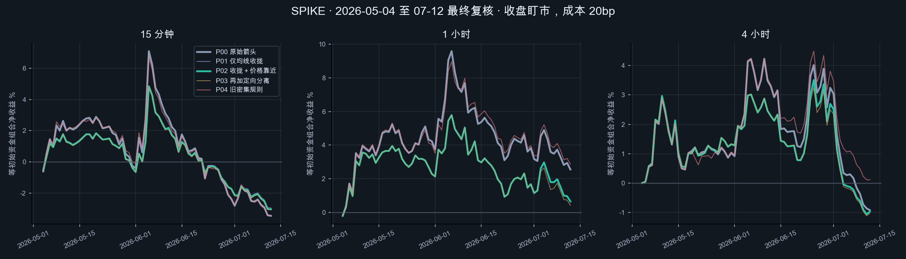
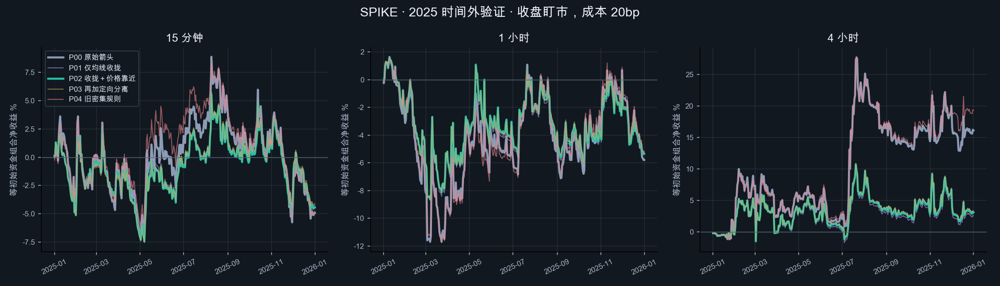
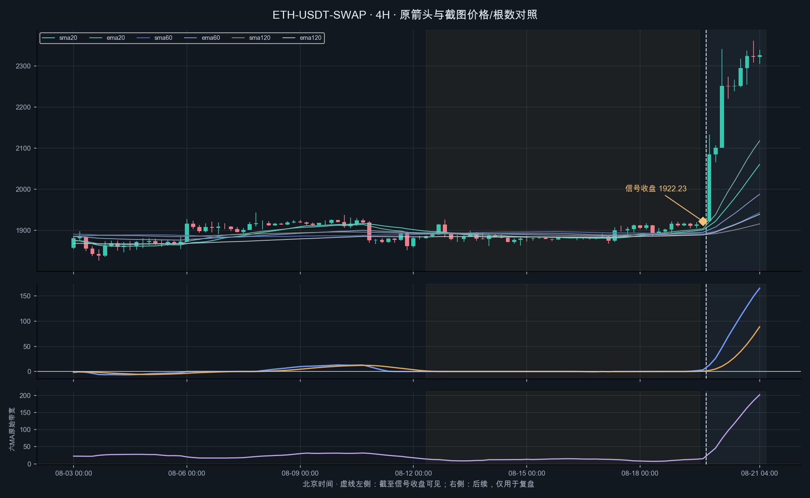
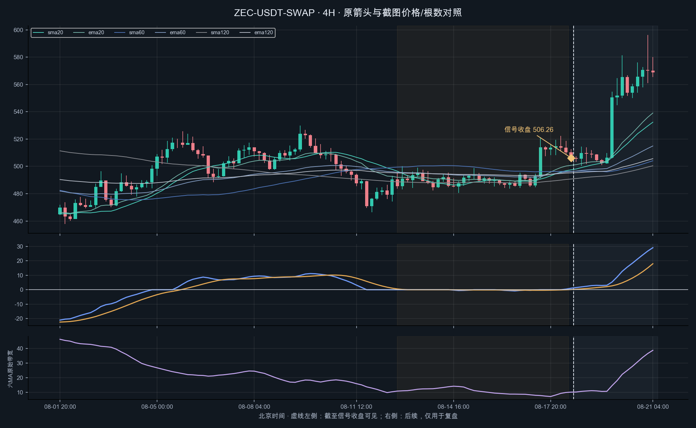
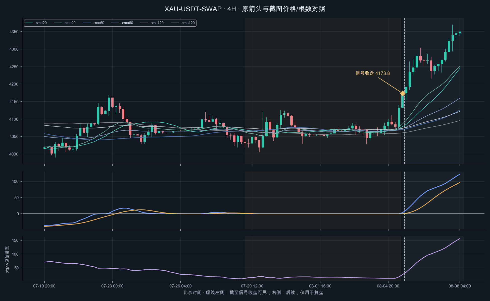
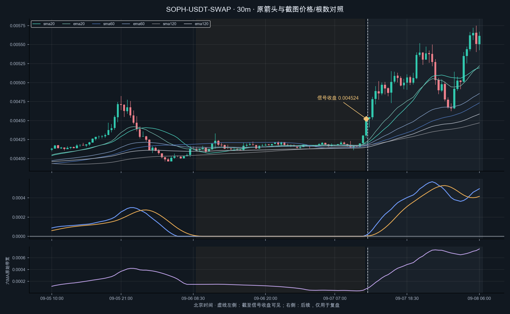
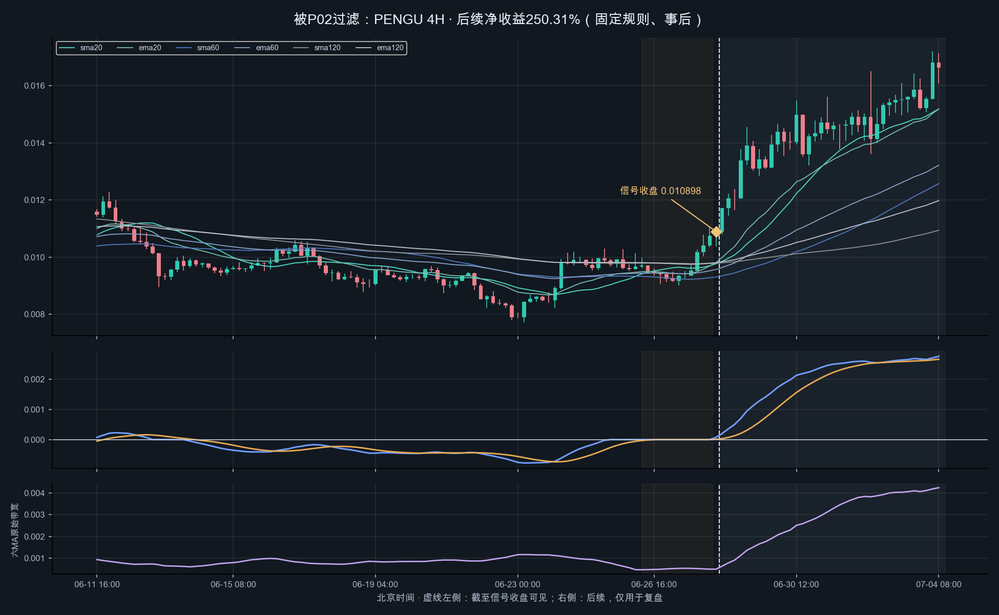
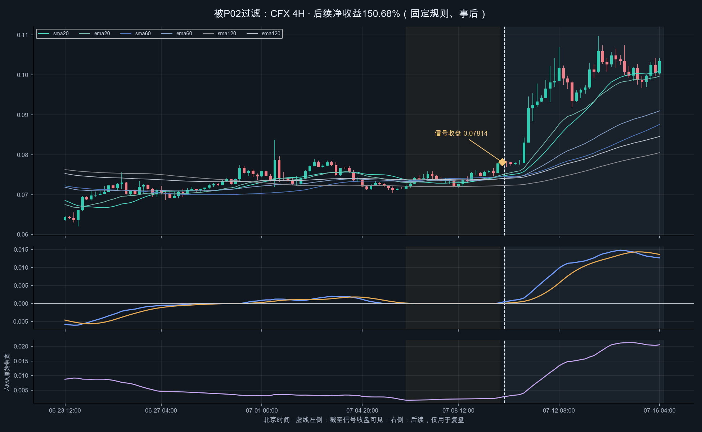

# SPIKE · IMACD 启动质量实证

**预先指定的P02没有周期通过全部上线条件。当前Pine、spike监控和通知条件保持原样。**

本轮检验“同一蓄势段的均线收拢＋价格围绕均线整理”能否改进当前可见箭头。信号变少不等于过滤有效；同时检查亏损减少、大赢家保留、等资金净收益和最大回撤。

54个既有OKX USDT永续数据集；32,779个可评估原始箭头；15m／1H／4H。时间范围2023-01-01至2026-07-12，分4段独立记账。所有参数在源码提交 `2471ff3e80d770093a54a592441f80c127e8479a` 后一次运行。

## 先看最终复核

下表为2026-05-04至2026-07-12，期末不跨段持仓。净收益和回撤来自同一个54袖套组合；其余指标来自原始事件账本，不把重叠箭头的收益相加当成组合收益。

| 周期 | 规则 | 箭头数 | 每笔净bp | 组合净收益 | 收盘最大回撤 | 大赢家正收益保留 |
| --- | --- | --- | --- | --- | --- | --- |
| 15m | 原始箭头 | 1636 | -13.24 | -3.46% | 11.29% | 100.00% |
| 15m | 收拢＋价格靠近 | 1215 | -13.11 | -3.04% | 8.87% | 72.06% |
| 60m | 原始箭头 | 426 | 40.12 | 2.54% | 7.39% | 100.00% |
| 60m | 收拢＋价格靠近 | 337 | 17.64 | 0.65% | 5.57% | 73.92% |
| 240m | 原始箭头 | 90 | -54.62 | -0.92% | 5.06% | 100.00% |
| 240m | 收拢＋价格靠近 | 75 | -69.35 | -0.97% | 4.44% | 69.03% |



“大赢家”是同周期同时间段基线真实净收益最高10%，数量取ceil、并列按event_id；保留率是其中原有正收益的保留份额，是事后诊断，不是选股规则。

## 为什么不把通知数量下降直接当成成功

| 周期 | 全部信号减少 | 亏损箭头减少 | 盈利箭头保留 | 大赢家正收益保留 |
| --- | --- | --- | --- | --- |
| 15m | 25.73% | 26.92% | 77.52% | 72.06% |
| 60m | 20.89% | 18.21% | 72.58% | 73.92% |
| 240m | 16.67% | 17.86% | 85.29% | 69.03% |

亏损箭头指在本轮固定入退规则与20bp成本下净收益≤0，并非Owner逐图确认的“形态噪音”。过滤收益变化还受单仓阻挡、资金复利与机会缺失影响。

## 固定政策与判定结果

| 政策 | 唯一变化 |
| --- | --- |
| P00 原始箭头 | 当前可见focusRelease，34/9、连续近零至少12根、冻结0.10×ATR[1]容差 |
| P01 仅收拢 | 本近零段末6根六MA带宽中位数≤首6根中位数 |
| P02 主候选 | P01＋前12根价格到六MA带的外侧距离中位数≤释放前ATR |
| P03 分离诊断 | P02＋20组相对60/120组在最近3根向信号方向分离 |
| P04 旧密集对照 | 基线＋前12根带宽/ATR均值≤3且均线交织≥2次 |

P02在开跑前已指定为唯一候选。P01/P03/P04即使某一段更好，也不从最终复核中改选成上线方案。


- **15m**：2025 时间外验证：匹配超额未提升；2025 时间外验证：大赢家保留不足80%；2025 时间外验证：相对基线增益未通过校正显著性；2026-05-04 至 07-12 最终复核：匹配超额未提升；2026-05-04 至 07-12 最终复核：大赢家保留不足80%。

- **60m**：2025 时间外验证：大赢家保留不足80%；2025 时间外验证：相对基线增益未通过校正显著性；2026-05-04 至 07-12 最终复核：组合净收益未提升；2026-05-04 至 07-12 最终复核：匹配超额未提升；2026-05-04 至 07-12 最终复核：大赢家保留不足80%。

- **240m**：2025 时间外验证：组合净收益未提升；2025 时间外验证：匹配超额未提升；2025 时间外验证：大赢家保留不足80%；2025 时间外验证：相对基线增益未通过校正显著性；2026-05-04 至 07-12 最终复核：组合净收益未提升；2026-05-04 至 07-12 最终复核：匹配超额未提升；2026-05-04 至 07-12 最终复核：大赢家保留不足80%。

## 所有时间段和对照，包含负面结果


### 2023–2024 开发

| 周期 | 政策 | n | 净bp/笔 | 随机净bp | 匹配超额bp | alpha p | 增益p校正 | 组合净% | 回撤% | 右尾保留% |
| --- | --- | --- | --- | --- | --- | --- | --- | --- | --- | --- |
| 15 | P00 | 13062 | -11.83 | -29.52 | 17.69 | 0.0095 | — | -28.54 | 39.43 | 100.00 |
| 15 | P01 | 10363 | -12.66 | -30.26 | 17.60 | 0.0154 | — | -21.94 | 32.32 | 78.50 |
| 15 | P02 | 10276 | -13.42 | -30.50 | 17.08 | 0.0160 | — | -22.52 | 31.89 | 77.17 |
| 15 | P03 | 10220 | -13.36 | -30.44 | 17.07 | 0.0177 | — | -22.61 | 31.99 | 76.82 |
| 15 | P04 | 12287 | -14.70 | -29.96 | 15.26 | 0.0202 | — | -30.39 | 40.75 | 91.22 |
| 60 | P00 | 3090 | 39.22 | -17.46 | 56.72 | 0.0031 | — | 16.00 | 10.37 | 100.00 |
| 60 | P01 | 2445 | 35.90 | -18.12 | 54.06 | 0.0151 | — | 11.12 | 10.43 | 79.80 |
| 60 | P02 | 2424 | 34.66 | -17.80 | 52.51 | 0.0179 | — | 9.94 | 11.10 | 79.16 |
| 60 | P03 | 2420 | 34.46 | -17.44 | 51.94 | 0.0192 | — | 9.72 | 11.22 | 78.96 |
| 60 | P04 | 2884 | 51.19 | -19.18 | 70.41 | 0.0007 | — | 22.25 | 9.66 | 96.56 |
| 240 | P00 | 736 | 145.08 | -71.26 | 229.30 | 0.0001 | — | 16.90 | 11.46 | 100.00 |
| 240 | P01 | 586 | 147.74 | -60.45 | 219.67 | 0.0002 | — | 16.36 | 10.06 | 85.40 |
| 240 | P02 | 581 | 153.36 | -59.94 | 225.11 | 0.0001 | — | 17.06 | 10.07 | 85.40 |
| 240 | P03 | 579 | 154.91 | -62.26 | 229.09 | 0.0001 | — | 17.22 | 10.07 | 85.40 |
| 240 | P04 | 689 | 173.76 | -69.86 | 257.33 | 0.0001 | — | 20.04 | 10.38 | 94.97 |

### 2025 时间外验证

| 周期 | 政策 | n | 净bp/笔 | 随机净bp | 匹配超额bp | alpha p | 增益p校正 | 组合净% | 回撤% | 右尾保留% |
| --- | --- | --- | --- | --- | --- | --- | --- | --- | --- | --- |
| 15 | P00 | 7529 | -10.01 | -24.33 | 14.38 | 0.0559 | — | -4.93 | 14.11 | 100.00 |
| 15 | P01 | 6037 | -14.06 | -25.78 | 11.72 | 0.1130 | 1.0000 | -4.26 | 11.85 | 78.29 |
| 15 | P02 | 5980 | -14.33 | -25.48 | 11.15 | 0.1245 | 1.0000 | -4.43 | 12.19 | 77.70 |
| 15 | P03 | 5944 | -14.44 | -25.64 | 11.20 | 0.1213 | 1.0000 | -4.12 | 11.90 | 77.19 |
| 15 | P04 | 6982 | -9.28 | -25.28 | 16.06 | 0.0398 | 1.0000 | -4.79 | 12.96 | 92.99 |
| 60 | P00 | 1884 | -3.60 | -89.24 | 85.86 | 0.0032 | — | -5.79 | 14.80 | 100.00 |
| 60 | P01 | 1488 | -6.94 | -94.32 | 87.65 | 0.0037 | 1.0000 | -5.17 | 11.93 | 80.07 |
| 60 | P02 | 1470 | -8.81 | -95.19 | 86.65 | 0.0037 | 1.0000 | -5.35 | 11.89 | 79.21 |
| 60 | P03 | 1464 | -8.84 | -95.41 | 86.84 | 0.0039 | 1.0000 | -5.23 | 11.89 | 79.21 |
| 60 | P04 | 1766 | -3.18 | -93.79 | 90.84 | 0.0029 | 1.0000 | -5.29 | 14.78 | 94.92 |
| 240 | P00 | 472 | 175.91 | -19.39 | 184.98 | 0.0015 | — | 16.11 | 13.82 | 100.00 |
| 240 | P01 | 367 | 55.02 | -75.77 | 112.24 | 0.0613 | 1.0000 | 2.58 | 8.77 | 58.11 |
| 240 | P02 | 364 | 60.95 | -74.45 | 116.94 | 0.0518 | 1.0000 | 3.12 | 8.70 | 58.11 |
| 240 | P03 | 362 | 63.57 | -74.44 | 119.56 | 0.0476 | 1.0000 | 3.33 | 8.68 | 58.11 |
| 240 | P04 | 439 | 214.48 | -13.70 | 215.99 | 0.0005 | 1.0000 | 19.28 | 13.08 | 96.26 |

### 2026-01-01 至 05-04 复核

| 周期 | 政策 | n | 净bp/笔 | 随机净bp | 匹配超额bp | alpha p | 增益p校正 | 组合净% | 回撤% | 右尾保留% |
| --- | --- | --- | --- | --- | --- | --- | --- | --- | --- | --- |
| 15 | P00 | 2928 | 5.92 | -17.28 | 23.28 | 0.0312 | — | 2.49 | 7.65 | 100.00 |
| 15 | P01 | 2301 | 13.63 | -17.67 | 31.42 | 0.0312 | — | 5.73 | 6.20 | 82.93 |
| 15 | P02 | 2276 | 13.70 | -17.84 | 31.65 | 0.0312 | — | 5.67 | 6.18 | 82.50 |
| 15 | P03 | 2254 | 13.06 | -18.11 | 31.29 | 0.0312 | — | 5.37 | 5.98 | 81.41 |
| 15 | P04 | 2738 | 6.32 | -15.12 | 21.44 | 0.0312 | — | 2.73 | 7.50 | 94.43 |
| 60 | P00 | 737 | -60.31 | -72.57 | 11.34 | 0.3438 | — | -7.94 | 16.92 | 100.00 |
| 60 | P01 | 562 | -47.92 | -87.32 | 38.25 | 0.1250 | — | -5.14 | 12.66 | 84.28 |
| 60 | P02 | 554 | -50.38 | -86.98 | 35.42 | 0.1250 | — | -5.27 | 12.57 | 82.48 |
| 60 | P03 | 548 | -48.14 | -87.26 | 37.94 | 0.1250 | — | -5.01 | 12.30 | 82.48 |
| 60 | P04 | 688 | -66.18 | -76.62 | 9.43 | 0.3438 | — | -8.14 | 16.54 | 91.71 |
| 240 | P00 | 189 | -116.79 | -192.62 | 64.69 | 0.2500 | — | -4.14 | 11.31 | 100.00 |
| 240 | P01 | 162 | -101.82 | -172.87 | 57.73 | 0.3125 | — | -3.15 | 10.65 | 97.26 |
| 240 | P02 | 151 | -78.97 | -163.65 | 72.10 | 0.2500 | — | -2.22 | 9.78 | 97.26 |
| 240 | P03 | 151 | -78.97 | -163.65 | 72.10 | 0.2500 | — | -2.22 | 9.78 | 97.26 |
| 240 | P04 | 179 | -90.06 | -179.91 | 79.96 | 0.2500 | — | -3.19 | 10.72 | 100.00 |

### 2026-05-04 至 07-12 最终复核

| 周期 | 政策 | n | 净bp/笔 | 随机净bp | 匹配超额bp | alpha p | 增益p校正 | 组合净% | 回撤% | 右尾保留% |
| --- | --- | --- | --- | --- | --- | --- | --- | --- | --- | --- |
| 15 | P00 | 1636 | -13.24 | -36.63 | 23.38 | 0.2500 | — | -3.46 | 11.29 | 100.00 |
| 15 | P01 | 1228 | -12.65 | -32.05 | 19.39 | 0.2500 | — | -2.95 | 8.78 | 72.70 |
| 15 | P02 | 1215 | -13.11 | -31.17 | 18.06 | 0.2500 | — | -3.04 | 8.87 | 72.06 |
| 15 | P03 | 1211 | -13.39 | -31.33 | 17.94 | 0.2500 | — | -3.07 | 8.89 | 72.06 |
| 15 | P04 | 1534 | -13.64 | -36.06 | 22.42 | 0.2500 | — | -3.46 | 10.77 | 93.44 |
| 60 | P00 | 426 | 40.12 | -28.04 | 69.06 | 0.2500 | — | 2.54 | 7.39 | 100.00 |
| 60 | P01 | 338 | 16.97 | -13.31 | 31.34 | 0.3750 | — | 0.61 | 5.60 | 73.92 |
| 60 | P02 | 337 | 17.64 | -13.00 | 31.71 | 0.3750 | — | 0.65 | 5.57 | 73.92 |
| 60 | P03 | 336 | 12.77 | -17.82 | 31.64 | 0.3750 | — | 0.42 | 5.79 | 71.80 |
| 60 | P04 | 400 | 44.43 | -31.19 | 76.58 | 0.1250 | — | 2.86 | 6.52 | 93.70 |
| 240 | P00 | 90 | -54.62 | -362.07 | 343.30 | 0.1250 | — | -0.92 | 5.06 | 100.00 |
| 240 | P01 | 75 | -69.35 | -366.95 | 335.49 | 0.1250 | — | -0.97 | 4.44 | 69.03 |
| 240 | P02 | 75 | -69.35 | -366.95 | 335.49 | 0.1250 | — | -0.97 | 4.44 | 69.03 |
| 240 | P03 | 73 | -76.71 | -374.53 | 335.96 | 0.1250 | — | -1.03 | 4.27 | 69.03 |
| 240 | P04 | 81 | 10.51 | -317.66 | 376.65 | 0.1250 | — | 0.11 | 4.24 | 100.00 |



## 独立信息与统计边界

匹配随机入场固定同品种×周期×月份×因果波动五分位×md方向，排除原始箭头且不复用对照时点。三名对照不足时不强配，计算匹配超额时只用完整配对。各政策复用同一映射，因此随机alpha与过滤本身的增益是两回事。

增益检验对统一初始资金组合的月净值变化做候选−P00，再进行月块符号置换，2025验证的4候选×3周期共12项做Holm校正。币种同月共用市场块；这依赖月份符号可交换假设，不是随机干预实验。收盘为月初00:00的最后一根归入之前的月份，避免凭空增加统计块。

最终复核只有约3个月块；即使每月差额同向，精确符号置换p最小也只有1/8=0.125。大量币种不能把3个月变成大量独立市场状态。历史也已用于其他研究，时间外复核不等于从未被看过的盲测。

| 周期 | 政策 | 验证匹配覆盖 | 复核匹配覆盖 | 验证增益p | 验证增益p校正 |
| --- | --- | --- | --- | --- | --- |
| 15 | P00 | 99.99% | 100.00% | — | — |
| 15 | P01 | 100.00% | 100.00% | 0.4487 | 1.0000 |
| 15 | P02 | 100.00% | 100.00% | 0.4614 | 1.0000 |
| 15 | P03 | 100.00% | 100.00% | 0.4348 | 1.0000 |
| 15 | P04 | 99.99% | 100.00% | 0.4773 | 1.0000 |
| 60 | P00 | 99.95% | 99.77% | — | — |
| 60 | P01 | 99.93% | 99.70% | 0.4429 | 1.0000 |
| 60 | P02 | 99.93% | 99.70% | 0.4595 | 1.0000 |
| 60 | P03 | 99.93% | 99.70% | 0.4492 | 1.0000 |
| 60 | P04 | 99.94% | 99.75% | 0.3347 | 1.0000 |
| 240 | P00 | 96.82% | 90.00% | — | — |
| 240 | P01 | 95.91% | 89.33% | 0.7400 | 1.0000 |
| 240 | P02 | 95.88% | 89.33% | 0.7207 | 1.0000 |
| 240 | P03 | 95.86% | 89.04% | 0.7139 | 1.0000 |
| 240 | P04 | 96.81% | 88.89% | 0.2046 | 1.0000 |

## 单特征基线：事前特征的事后排序诊断

下表只使用原始箭头，展示2025验证段。AUC标签是该笔扣成本后是否盈利；分数在信号收盘可知，但最高10%的数量和分位是在整段事件收齐后确定。这是离线诊断，不是可在线直接执行的top10%门槛。没有训练模型，没有因为AUC高就宣告成功。

| 周期 | 事前分数 | AUC | 最高10%毛bp | 最高10%净bp | 胜率% | 匹配超额bp |
| --- | --- | --- | --- | --- | --- | --- |
| 15 | strength_score | 0.525 | 36.14 | 16.14 | 33.47 | 13.76 |
| 15 | contraction_score | 0.489 | 12.36 | -7.64 | 25.63 | 17.08 |
| 15 | proximity_score | 0.482 | -10.85 | -30.85 | 27.36 | 9.24 |
| 15 | separation_score | 0.547 | 9.74 | -10.26 | 35.19 | -1.73 |
| 60 | strength_score | 0.557 | 99.75 | 79.75 | 41.80 | 202.22 |
| 60 | contraction_score | 0.511 | 111.49 | 91.49 | 39.15 | 178.18 |
| 60 | proximity_score | 0.462 | -36.63 | -56.63 | 29.63 | 61.47 |
| 60 | separation_score | 0.552 | -72.70 | -92.70 | 38.10 | 37.89 |
| 240 | strength_score | 0.521 | 67.61 | 47.61 | 37.50 | 134.13 |
| 240 | contraction_score | 0.486 | 58.20 | 38.20 | 41.67 | 7.13 |
| 240 | proximity_score | 0.393 | -15.75 | -35.75 | 29.17 | 63.79 |
| 240 | separation_score | 0.477 | -175.99 | -195.99 | 31.25 | -66.51 |

### 多空分别看（补充描述，不作新选优）

| 周期 | 方向 | 原箭头数 | 保留数 | 原净bp/笔 | P02净bp/笔 |
| --- | --- | --- | --- | --- | --- |
| 15 | 空 | 853 | 651 | -19.16 | -18.05 |
| 15 | 多 | 783 | 564 | -6.80 | -7.40 |
| 60 | 空 | 247 | 195 | 24.82 | -15.18 |
| 60 | 多 | 179 | 142 | 61.23 | 62.71 |
| 240 | 空 | 49 | 41 | 200.17 | 112.01 |
| 240 | 多 | 41 | 34 | -359.12 | -288.04 |

四张参考图都是上涨案例；多空结果不得用一个合并均值互相代替，也不根据这个补充分组改成只做某方向。


## 被删掉的大赢家

以下按最终复核原有净收益排序，仅作失败解释。不能把它们的后续结果再用于本轮调阈值。

| 品种 | 周期 | 原净收益bp | 近零根数 | 末/首宽度 | 距带/ATR | 定向分离 |
| --- | --- | --- | --- | --- | --- | --- |
| XLM | 60 | 4,556.38 | 16 | 1.127 | 0.178 | 0.744 |
| ZEC | 15 | 3,537.37 | 18 | 1.693 | 0.003 | 0.131 |
| ZEC | 15 | 2,860.95 | 13 | 1.017 | 0.000 | 0.445 |
| GRT | 240 | 2,206.25 | 16 | 1.861 | 0.264 | 0.193 |
| INJ | 15 | 2,189.03 | 12 | 1.050 | 0.229 | 0.218 |
| GALA | 60 | 2,172.20 | 12 | 1.054 | 0.435 | 0.405 |
| VIRTUAL | 15 | 2,144.40 | 29 | 1.149 | 0.316 | 0.319 |
| ETH | 15 | 2,067.40 | 22 | 1.009 | 0.804 | 0.199 |
| ETH | 240 | 1,908.05 | 30 | 1.336 | 0.489 | 0.248 |
| CHZ | 60 | 1,863.62 | 15 | 1.432 | 0.067 | 0.127 |
| SOL | 60 | 1,715.47 | 16 | 1.091 | 0.203 | 0.272 |
| ICP | 15 | 1,696.05 | 12 | 1.080 | 0.000 | 0.353 |

## 被保留的亏损箭头

| 品种 | 周期 | 信号确认UTC | 净收益bp | 近零根数 | 末/首宽度 | 距带/ATR |
| --- | --- | --- | --- | --- | --- | --- |
| WLD | 15 | 2026-06-04T11:45:00+00:00 | -1,993.52 | 18 | 0.763 | 0.182 |
| XLM | 240 | 2026-06-10T04:00:00+00:00 | -1,768.58 | 21 | 0.694 | 0.000 |
| VIRTUAL | 240 | 2026-07-08T12:00:00+00:00 | -1,762.80 | 26 | 0.562 | 0.568 |
| JTO | 240 | 2026-06-15T20:00:00+00:00 | -1,631.42 | 19 | 0.830 | 0.183 |
| ICP | 240 | 2026-06-02T00:00:00+00:00 | -1,557.94 | 19 | 0.317 | 0.122 |
| UNI | 240 | 2026-07-01T08:00:00+00:00 | -1,408.49 | 36 | 0.218 | 0.245 |
| OP | 240 | 2026-06-30T16:00:00+00:00 | -1,356.71 | 28 | 0.709 | 0.498 |
| ORDI | 60 | 2026-06-17T21:00:00+00:00 | -1,129.74 | 23 | 0.837 | 0.092 |
| CHZ | 240 | 2026-05-17T00:00:00+00:00 | -1,103.86 | 22 | 0.483 | 0.533 |
| JTO | 240 | 2026-06-26T16:00:00+00:00 | -1,050.84 | 17 | 0.938 | 0.000 |
| EIGEN | 60 | 2026-06-02T23:00:00+00:00 | -951.05 | 15 | 0.774 | 0.352 |
| ETHFI | 60 | 2026-06-23T09:00:00+00:00 | -916.40 | 30 | 0.379 | 0.295 |

## 四张截图案例

案例使用独立的OKX原生周期行情复核，全部结果保存于cases/manifest.json。截图已暴露，不混入上面的统计样本，也不按截图价格筛掉不一致事件。













| 品种 | 周期 | 原生数据确认UTC | 收盘价 | 近零根数 | 与截图价格差 | P02 |
| --- | --- | --- | --- | --- | --- | --- |
| ETH-USDT-SWAP | 4H | 2026-08-19T12:00:00+00:00 | 1922.23 | 44 | 0.00000000 | 保留 |
| ZEC-USDT-SWAP | 4H | 2026-08-18T08:00:00+00:00 | 506.26 | 34 | 0.00000000 | 保留 |
| XAU-USDT-SWAP | 4H | 2026-08-05T08:00:00+00:00 | 4173.8 | 44 | 0.00000000 | 保留 |
| SOPH-USDT-SWAP | 30m | 2026-09-07T04:30:00+00:00 | 0.004524 | 54 | 0.00000000 | 保留 |

价格与根数一致是案例匹配证据；截图没有逐根导出的确切时间，本记录仍不冒称完成TradingView数据窗口逐字段验收。有限1200根递推种子也可能影响临界信号。

完整逐案例记录：[案例JSON](../experiments/active/exp-imacd-startup-quality-20260908-v1/results/cases/manifest.json)。


## 首尾收拢条件误删的实际结构


**PENGU 4H**：末/首均线宽度比1.082，近零12根，因此首尾收拢门拒绝。近零段开始前12根带宽中位数0.00086884071，段首6根0.00049480373，释放前6根0.00053521667。这是已保存失败案例的解释量，不是本轮新增筛选条件。大收益已从原始价格与首次neutral退出时钟复算核对；图片只展示启动初段，标题收益来自完整持仓账本（200根），不是图内这36根的收益。




**CFX 4H**：末/首均线宽度比1.295，近零22根，因此首尾收拢门拒绝。近零段开始前12根带宽中位数0.0027235833，段首6根0.0016675182，释放前6根0.0021600417。这是已保存失败案例的解释量，不是本轮新增筛选条件。大收益已从原始价格与首次neutral退出时钟复算核对；图片只展示启动初段，标题收益来自完整持仓账本（195根），不是图内这36根的收益。




这里需要区分“均线此前已经收拢”和“在IMACD近零段内还必须继续收拢”。首尾比较只检验后者。PENGU图显示进入近零段前带宽已下降，随后维持较窄却略有波动，机械首尾门仍会拒绝它。本轮结果否定的是该机械定义足以改进通知，不是否定Owner的视觉形态。


## 数据统计与风险、诚实声明

- 54个固定历史品种，32,779个原始箭头，9,885个2025验证箭头；净正类率28.27%。各币上市/数据起点不同，覆盖表完整记录。
- 可评估范围缺失或预热不足的品种×周期×时间段：21。缺数据时对应初始资本留在现金，不用后来的行情回填。
- 出现开盘/收盘/费用后权益非正的单币政策袖套：0。一旦出现即锁存并拒绝续开仓；未捏造爆仓成交。
- 当前规则下的盈利不等于实盘可实现收益：20bp是固定成本代理，未读取资金费、盘口、滑点、真实成交、保证金或盘中爆仓。
- 组合MDD为逐K收盘盯市；单币明细包含开盘与费用跳点。图仅显示每日最后净值，不能从图形反推完整回撤。
- 每个时间段独立从相同资金开始，边界持仓按末根收盘计价；报告包含强制记账笔数。没有止损保护，3R绘图未参与交易规则。
- 大赢家保留是事件级诊断，已过滤后的真实单仓可用资金与可成交事件可能变化；不把两类指标混为收益贡献归因。
- 既有54品种可能包含数据可得性/幸存者偏差，不能外推为OKX全部473个合约的结果。多空同时评估，四张截图仅确认了多头视觉例子。
- 这是本配置P00/P01/P02/P03/P04各第1次消耗holdout。依据Owner“任何时间段数据都可以使用不要有任何限制”和本轮“你去做吧”；没有使用holdout调参或换候选。

## 复现与下一步

先核对manifest内源文件SHA与冻结源码。以下构建命令在没有既有输出的工作目录执行；程序拒绝覆盖本轮结果。报告重渲染只读取保存账本，不重新评估行情。

```bash
.venv/bin/python -m pytest -q tests/test_imacd_startup_quality.py tests/test_imacd_startup_accounting.py tests/test_imacd_startup_research.py
.venv/bin/python -m yoyo.evaluation.imacd_startup_research
.venv/bin/python -m yoyo.evaluation.imacd_startup_cases
.venv/bin/python -m yoyo.evaluation.imacd_startup_report
```

下一步只在新的研究版本中提出更接近Owner视觉过程的定义，并先用开发段或新的前向样本验证。未经新证据，不把本轮某个好看的子结果接入通知。Pine外观、当前箭头、spike通知及TG/Bark均未更改。

[实验计划](../experiments/active/exp-imacd-startup-quality-20260908-v1/PROJECT_PLAN.md) · [完整对照CSV](../experiments/active/exp-imacd-startup-quality-20260908-v1/results/summary.csv) · [单特征CSV](../experiments/active/exp-imacd-startup-quality-20260908-v1/results/rankings.csv) · [数据与源码清单](../experiments/active/exp-imacd-startup-quality-20260908-v1/results/manifest.json)
