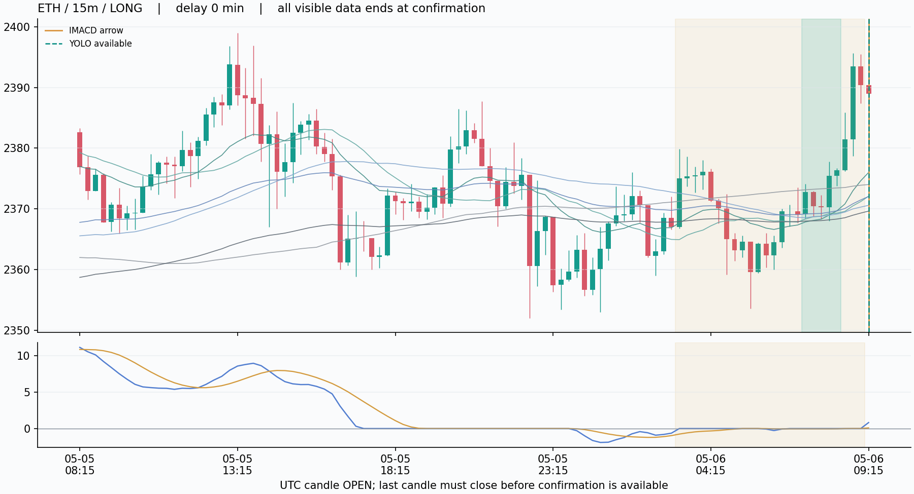
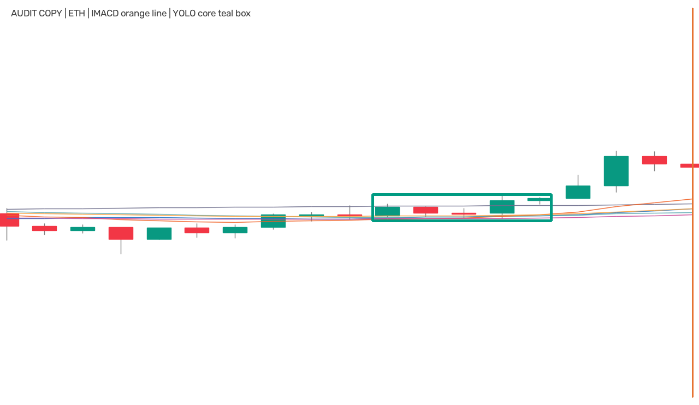
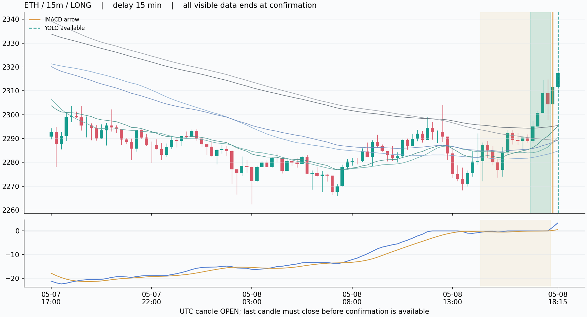
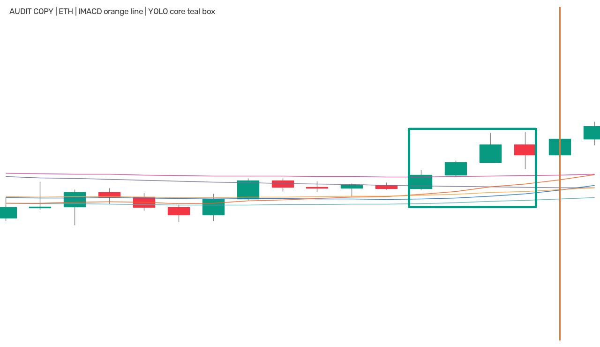
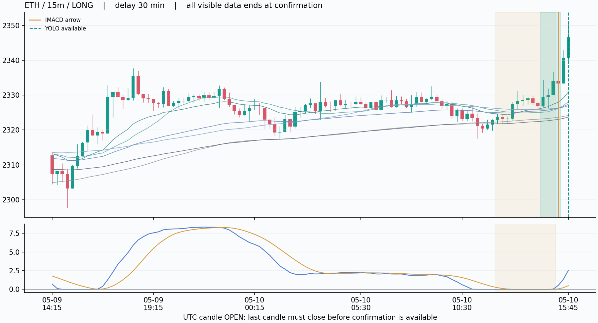
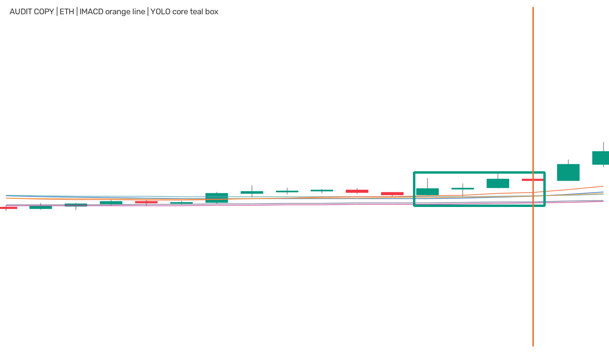
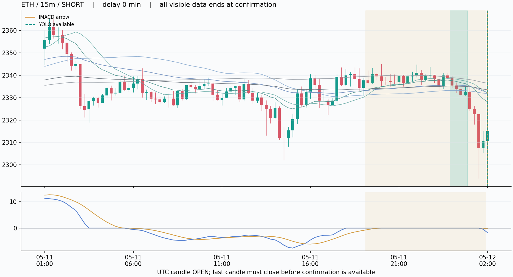
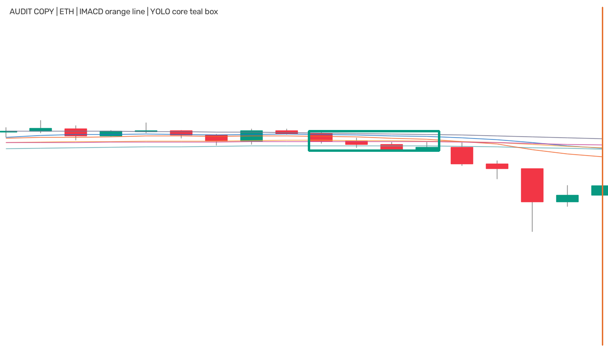

# IMACD → YOLO 延迟确认试验：接线可行，盈利与去噪仍待验证

本轮已实际加载固定 Grade-A 1280 模型，在 BTC、ETH 的 OKX 15m 上完成推理。2026-05-04 至 2026-07-01 UTC（右开）共 49 个可见 IMACD 启动箭头，其中 12 个得到模型确认，保留 24.49%。**这表示减少了通知候选数，不能等同于减少了错误信号。**

7 个在原箭头收盘就能确认；其余 5 个实际等待15、30或60分钟。模型不必永远晚于箭头：它识别的核心常在蓄势区内更早形成。最大沿方向追价为 0.5734%，有一个空头等待后获得更高的开盘价。模型置信度不是行情成功概率。

## 方案与模型身份

流程为“IMACD候选 → 等待模型同向确认 → 确认/失效/过期”。最多等9根15m（135分钟），包含原箭头当根；期间md回零、反向或未知即作废。取第一次确认，价格使用那次确认后的下一根开盘。核心必须为4/5根、核心之后2–9根，同原蓄势区+箭头有真实K线交集；不要求精确框住箭头。这个9根预算是固定试验选择，未被证明最优。

使用当前研究基线 Grade-A close源 full40 native1280 YOLO11s，权重SHA `862705b999594355c1133640acc540f4de19b561889e89d9e050ddad5c6db838`。原生15m、W18/W19、conf0.25、NMS0.70、imgsz1280、MPS float32，未训练、未叠旧语义门。旧`owner_best`别名仍指向更早模型；HL2更新版没有通过其配对联合门。因此这里的“最好”只能落实为当前有明确血缘、参数与早期命中证据的研究基线，不能宣称全版本经济最优。

输入由训练同源渲染器生成白底K线和六根close均线，未把TV界面截图输入模型。NumPy图像使用BGR，预测参数含conf/iou/imgsz，遵循[Ultralytics官方推理接口](https://docs.ultralytics.com/modes/predict/)。现装8.4.89对`half=False`打印弃用提醒；调用成功，无静默设备回退。实际包版本在JSON收据中。

## 主表：同一批箭头前后对照

| 品种 / 15m | 原箭头 | YOLO确认 | 等待中失效 | 到期无确认 | 数据截断 | 保留率 |
|---|---:|---:|---:|---:|---:|---:|
| BTC | 23 | 3 | 5 | 15 | 0 | 13.04% |
| ETH | 26 | 9 | 4 | 13 | 0 | 34.62% |

原始基线放行全部箭头；确认组只放行表中YOLO确认数。失效和过期是状态机终态，不是人工判断的错误行情。数据末端完整随访要求属于离线研究队列规则；在线实现应保留已知即时确认，不能照搬“缺未来9根就整体截断”的队列筛选。本次截断为0，对本次结果没有影响。

## 全部确认明细

| 品种/方向 | 原箭头确认（北京时间） | 模型确认 | 等待 | 原次开盘 | 确认次开盘 | 沿方向追价 | conf |
|---|---|---|---:|---:|---:|---:|---:|
| ETH / 多 | 05-06 17:30 | 05-06 17:30 | 0分 | 2389 | 2389 | +0.0000% | 0.679 |
| ETH / 多 | 05-09 02:15 | 05-09 02:30 | 15分 | 2311.56 | 2317.42 | +0.2535% | 0.841 |
| ETH / 多 | 05-10 23:30 | 05-11 00:00 | 30分 | 2333.36 | 2346.74 | +0.5734% | 0.547 |
| ETH / 空 | 05-12 10:15 | 05-12 10:15 | 0分 | 2314.99 | 2314.99 | -0.0000% | 0.373 |
| ETH / 空 | 05-18 07:45 | 05-18 08:00 | 15分 | 2120 | 2129.6 | -0.4528% | 0.679 |
| BTC / 多 | 05-22 12:15 | 05-22 12:15 | 0分 | 77839.9 | 77839.9 | +0.0000% | 0.620 |
| ETH / 多 | 05-25 16:15 | 05-25 17:15 | 60分 | 2111.19 | 2117.61 | +0.3041% | 0.320 |
| ETH / 多 | 05-30 22:30 | 05-30 22:30 | 0分 | 2026.61 | 2026.61 | +0.0000% | 0.407 |
| BTC / 多 | 06-13 16:45 | 06-13 16:45 | 0分 | 63839 | 63839 | +0.0000% | 0.523 |
| ETH / 空 | 06-17 16:45 | 06-17 16:45 | 0分 | 1762.43 | 1762.43 | -0.0000% | 0.867 |
| BTC / 多 | 06-22 19:45 | 06-22 20:00 | 15分 | 64589.5 | 64625 | +0.0550% | 0.711 |
| ETH / 多 | 06-30 01:30 | 06-30 01:30 | 0分 | 1625.89 | 1625.89 | +0.0000% | 0.811 |

追价定义 `side × (确认后次开盘 / 原箭头后次开盘 - 1)`，正值表示沿信号方向更贵。两个价格均来自可执行的下一开盘时钟；不把它称真实成交滑点，也没有按原价格回填新信号。这里没有固定3R退出或任何新止损合同。

## 数据与统计口径

候选数49，模型确认率24.49%，不是有标签正类率；没有新金标或监督训练，val样本数不适用。两个源文件共解析314759根15m，最早2022-01-03，用于复现递归指标播种；评分候选仅在上述固定时段。完整检测窗口980张，原始框128个，结构合格框121个。滑窗框不是独立事件。

原始模型训练可见窗最晚2025-11-29，验证最晚2026-05-03。本轮继承Owner“任何时间段数据都可以使用不要有任何限制”的明确授权，**这是本融合配置第1次消耗holdout**。其他模型/研究已有历史接触，不能称全新盲验；本轮之后未搜索权重、等待上限、阈值或品种。

本轮是工程可行性评价，不是收益回测。未设置退出/仓位合同，因此AUC、胜率、净收益、最大回撤、top-decile毛净收益以及经济匹配随机入场均不适用，不能编造。没有人工真假金标，也不能报形态precision/recall。独立指标基线为全部IMACD箭头，实验只追加一个冻结的模型确认规则。

对应工程零假设：固定候选的原始有效窗口与模型几何池，在同币同月内打乱方向10000次。真实同向确认12，随机均值6.1271，单侧p=0.000400。这只支持两个条件化信号的方向关联，**不是盈利检验，也不是去噪成功检验**。两种方法本就使用相同价格和均线，有机械相关的可能；没有用翻转后立刻被md取消的伪对照。

## 逐图查看：按时间选最早四个确认，不按涨跌挑例子

图中只显示截至模型实际检测端点的数据。橙色线为原箭头、青色虚线为模型确认，浅橙底为已冻结蓄势区。第二张是独立审核副本，矩形为原始YOLO框；真正模型输入另存无注释PNG，其像素SHA逐张核对一致。

### ETH_15_1778058900





### ETH_15_1778263200





### ETH_15_1778426100





### ETH_15_1778551200





## 验证与复现

源冻结commit `d0f4c65afddb38915f9da35db6cc50a124fc9b7d`；台账验证全部12个确认的身份、方向、core/post、真实交集、等待、时钟与价格位移。20个合成测试（含未来扰动后像素一致和模拟批量模型接口）及68个层间守门测试通过。独立复核结果见实验目录results/independent_review.json。台账未保存逐根md或首个失效位置，因此9条失效时钟不能只凭台账完整独立重放；这部分由冻结代码与合成测试支持，没有冒充独立复证。

从源码与相同本地权重、缓存复现首次运行：

```bash
cd /Users/zhangzc/fable-trading
.venv/bin/python -m pytest -q tests/test_imacd_yolo_confirmation.py tests/boundaries/test_layer_imports.py
.venv/bin/python -m yoyo.evaluation.imacd_yolo_confirmation
.venv/bin/python -m yoyo.evaluation.imacd_yolo_verify
.venv/bin/python -m yoyo.evaluation.imacd_yolo_report
```

推理命令只供没有run_started收据的首次环境；当前工作区会拒绝覆盖该次评价。复核现有结果只运行报告命令，它校验已保存SHA并复现渲染，不再次调用模型。无需安装依赖；权重、原始缓存不入git，路径与摘要记录在source_manifest/summary。渲染报告源码先提交再生成图片。

## 风险与诚实声明

- 这次只检验BTC、ETH原生15m，共12个确认；不代表OKX全币种或1H/4H效果，更不能据此宣布能赚大钱。
- 确认框和蓄势区存在时间交集，不代表已经人工确认同一个形态；已保存交集比例、核心相对箭头位置。重复使用同一精确核心的确认数为0，邻近但不完全相同的框仍可能相关。
- 没有评估被删掉的37个箭头中有多少大趋势；保留率低可以是强筛选，也可以是漏报。
- 无经济退出合同，未测资金费、真实滑点、止损存活或趋势利润留存；本轮无法回答收益与最大回撤。
- 离线计算理论可用时间，不包含Mac扫描、推理、网络和通知的实际延迟。实际推理总耗时约65.0秒（980张条件化输入），不能线性冒充全市场服务容量测试。
- 没有更改现有TradingView、spike、Mac监控、TG/Bark信号口径、ACTIVE或执行配置。training_eligible=false，production_eligible=false。

## 下一步

技术上已经可以实现候选与双确认两种状态；真实通知应发在双确认的当前时间，并同时保留原箭头时间和确认价格。接入前应按真实在线输入长度/递归播种与延迟预算做影子验证，尤其不要把离线完整随访筛选直接塞进实时循环。

经济上需要对同一批已保存候选预先固定入场、退出和成本口径，比较确认组与原指标，检查删掉的赢家和尾部趋势收益。当前不根据这12个确认调参数；需要新评价合同才能回答是否更赚钱。1H/4H跨周期使用也要单独注册检验，不能自动推广。
