# IMACD → YOLO 扩大检查：筛选生效，等待与形态身份仍需检验

**1H确认335/1076个完整随访候选，4H确认90/249个。** 扩展到54币半年后，程序确实筛掉了多数候选；是否筛掉了假启动、是否保留真正大行情，仍没有真假标签或收益评价支持。

| 周期 | 全部箭头 | 完整随访 | 确认 | 确认/完整 | 仅延迟确认数 | 仅延迟等待中位h | 仅延迟方向位移中位 |
|---|---|---|---|---|---|---|---|
| 1H | 1084 | 1076 | 335 | 31.13% | 139 | 2.00 | 1.00897% |
| 4H | 257 | 249 | 90 | 36.14% | 45 | 8.00 | 2.31849% |

对实际需要等待的组，1H中位等2小时，4H中位等8小时；沿方向下一开盘位移中位分别为1.00897%和2.31849%。这反映等待后的报价位置，**不是收益、实际滑点或真实成交成本**。还发现仅1根交集也能放行的4条案例，以及4H后段方向置换只有很少可变组；后文分别核对这两项限制。

这轮按1H/4H和两段日期完成216个分组，实际推理26,500张条件化窗口。共1,341个原箭头，其中1,325个有完整随访、16个被分段边界截断；模型确认425个，分布于54个品种。合并确认/完整随访为32.08%，是候选保留率，不是真实去噪率或成功概率。

本轮只扩大数据覆盖；模型、图像、阈值和9根等待预算没有按新结果调整。前段2026-01-01至05-04属于模型验证已暴露时段，后段05-04至07-01属于既有holdout再次复核。同一配置的holdout评估次数：1H第2次，4H第2次；不能因另起实验名重新记作首次，更不能称新盲测。

## 先看周期与时段

| 原箭头时段UTC | 周期 | 全部箭头 | 完整随访 | 确认 | 失效 | 到期 | 截断 | 确认/完整 | 即时确认 | 等待中位h |
|---|---|---|---|---|---|---|---|---|---|---|
| 1/1–5/4 · 模型验证已暴露 | 1H | 737 | 736 | 235 | 90 | 411 | 1 | 31.93% | 138 | 0.00 |
| 1/1–5/4 · 模型验证已暴露 | 4H | 189 | 185 | 63 | 19 | 103 | 4 | 34.05% | 32 | 0.00 |
| 5/4–7/1 · 第2次复核 | 1H | 347 | 340 | 100 | 47 | 193 | 7 | 29.41% | 58 | 0.00 |
| 5/4–7/1 · 第2次复核 | 4H | 68 | 64 | 27 | 4 | 33 | 4 | 42.19% | 13 | 4.00 |

分组依据原箭头收盘时间，所有日期右开。5月4日和7月1日分别硬截断随访；候选需要完整覆盖p至p+9的确认端点以及p+10的下一开盘，否则记censored。保留率统一以完整随访候选为分母，截断仍列在全部箭头中，不把缺观察当作未确认。

1H最多等9小时，4H最多等36小时，均检查p至p+9共10个收盘端点。取第一次合法确认；md回零、反向或未知后永久失效。这里的失效、到期、确认都是程序状态，没有新增人工真假标签。

## 全54币分布：不只列出有确认的币

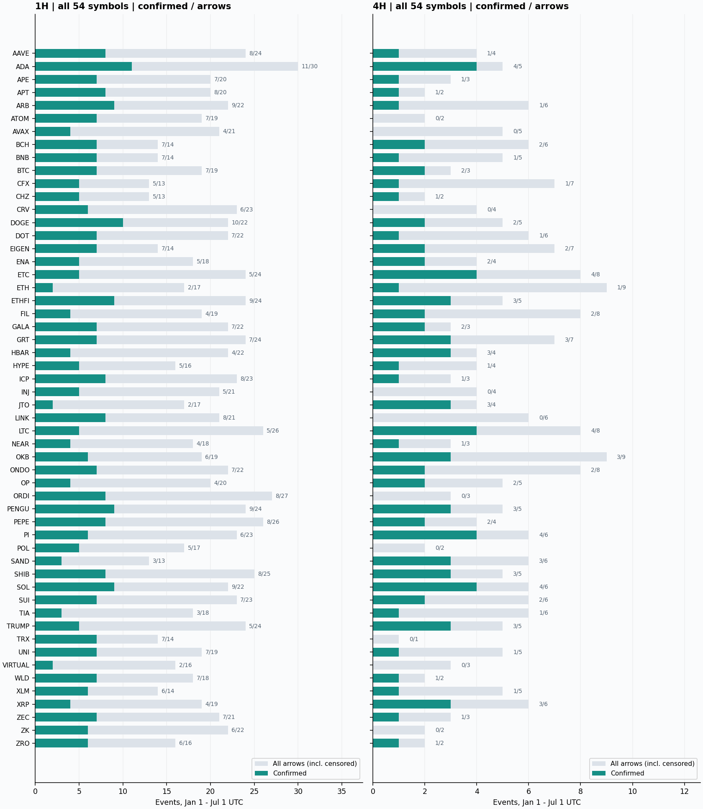

灰条为全部箭头（含截断），绿色为确认；右侧数字为确认/全部，按币名字母顺序排列，保留零事件品种。图上比例与主表“确认/完整随访”分母不同，避免把截断藏起来。长条只表示候选更多，不代表该币更适合交易。

| 币种 | 1H 确认/完整/全部 | 1H确认率 | 4H 确认/完整/全部 | 4H确认率 |
|---|---|---|---|---|
| AAVE | 8/24/24 | 33.33% | 1/4/4 | 25.00% |
| ADA | 11/30/30 | 36.67% | 4/5/5 | 80.00% |
| APE | 7/20/20 | 35.00% | 1/3/3 | 33.33% |
| APT | 8/20/20 | 40.00% | 1/2/2 | 50.00% |
| ARB | 9/22/22 | 40.91% | 1/5/6 | 20.00% |
| ATOM | 7/19/19 | 36.84% | 0/2/2 | 0.00% |
| AVAX | 4/21/21 | 19.05% | 0/5/5 | 0.00% |
| BCH | 7/14/14 | 50.00% | 2/5/6 | 40.00% |
| BNB | 7/14/14 | 50.00% | 1/5/5 | 20.00% |
| BTC | 7/19/19 | 36.84% | 2/3/3 | 66.67% |
| CFX | 5/13/13 | 38.46% | 1/7/7 | 14.29% |
| CHZ | 5/13/13 | 38.46% | 1/2/2 | 50.00% |
| CRV | 6/23/23 | 26.09% | 0/4/4 | 0.00% |
| DOGE | 10/22/22 | 45.45% | 2/5/5 | 40.00% |
| DOT | 7/22/22 | 31.82% | 1/6/6 | 16.67% |
| EIGEN | 7/14/14 | 50.00% | 2/6/7 | 33.33% |
| ENA | 5/18/18 | 27.78% | 2/4/4 | 50.00% |
| ETC | 5/24/24 | 20.83% | 4/8/8 | 50.00% |
| ETH | 2/17/17 | 11.76% | 1/9/9 | 11.11% |
| ETHFI | 9/24/24 | 37.50% | 3/5/5 | 60.00% |
| FIL | 4/18/19 | 22.22% | 2/8/8 | 25.00% |
| GALA | 7/21/22 | 33.33% | 2/3/3 | 66.67% |
| GRT | 7/23/24 | 30.43% | 3/7/7 | 42.86% |
| HBAR | 4/22/22 | 18.18% | 3/4/4 | 75.00% |
| HYPE | 5/16/16 | 31.25% | 1/4/4 | 25.00% |
| ICP | 8/23/23 | 34.78% | 1/3/3 | 33.33% |
| INJ | 5/21/21 | 23.81% | 0/4/4 | 0.00% |
| JTO | 2/17/17 | 11.76% | 3/4/4 | 75.00% |
| LINK | 8/20/21 | 40.00% | 0/6/6 | 0.00% |
| LTC | 5/26/26 | 19.23% | 4/8/8 | 50.00% |
| NEAR | 4/17/18 | 23.53% | 1/3/3 | 33.33% |
| OKB | 6/19/19 | 31.58% | 3/9/9 | 33.33% |
| ONDO | 7/22/22 | 31.82% | 2/8/8 | 25.00% |
| OP | 4/20/20 | 20.00% | 2/4/5 | 50.00% |
| ORDI | 8/27/27 | 29.63% | 0/2/3 | 0.00% |
| PENGU | 9/23/24 | 39.13% | 3/5/5 | 60.00% |
| PEPE | 8/26/26 | 30.77% | 2/4/4 | 50.00% |
| PI | 6/23/23 | 26.09% | 4/6/6 | 66.67% |
| POL | 5/17/17 | 29.41% | 0/2/2 | 0.00% |
| SAND | 3/13/13 | 23.08% | 3/6/6 | 50.00% |
| SHIB | 8/25/25 | 32.00% | 3/5/5 | 60.00% |
| SOL | 9/21/22 | 42.86% | 4/5/6 | 80.00% |
| SUI | 7/23/23 | 30.43% | 2/6/6 | 33.33% |
| TIA | 3/18/18 | 16.67% | 1/5/6 | 20.00% |
| TRUMP | 5/24/24 | 20.83% | 3/5/5 | 60.00% |
| TRX | 7/14/14 | 50.00% | 0/1/1 | 0.00% |
| UNI | 7/19/19 | 36.84% | 1/5/5 | 20.00% |
| VIRTUAL | 2/16/16 | 12.50% | 0/2/3 | 0.00% |
| WLD | 7/18/18 | 38.89% | 1/2/2 | 50.00% |
| XLM | 6/14/14 | 42.86% | 1/5/5 | 20.00% |
| XRP | 4/18/19 | 22.22% | 3/6/6 | 50.00% |
| ZEC | 7/21/21 | 33.33% | 1/3/3 | 33.33% |
| ZK | 6/22/22 | 27.27% | 0/2/2 | 0.00% |
| ZRO | 6/16/16 | 37.50% | 1/2/2 | 50.00% |

## 月份和多空是否集中

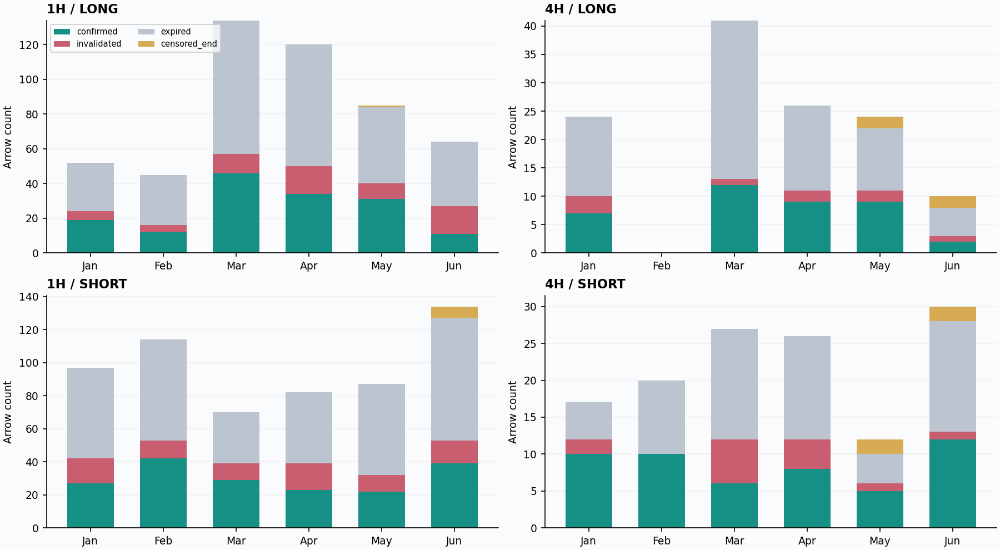

月份按原箭头收盘UTC归属，五月包含硬分界两侧，推断时仍使用主表两段拆分。零柱表示无该方向候选，不能单凭它证明当月完整市场覆盖。多币同一行情不等于彼此独立的证据。

| 月份UTC | 周期 | 全部 | 完整 | 确认 | 截断 | 确认/完整 |
|---|---|---|---|---|---|---|
| 2026-01 | 1H | 149 | 149 | 46 | 0 | 30.87% |
| 2026-02 | 1H | 159 | 159 | 54 | 0 | 33.96% |
| 2026-03 | 1H | 204 | 204 | 75 | 0 | 36.76% |
| 2026-04 | 1H | 202 | 202 | 57 | 0 | 28.22% |
| 2026-05 | 1H | 172 | 171 | 53 | 1 | 30.99% |
| 2026-06 | 1H | 198 | 191 | 50 | 7 | 26.18% |
| 2026-01 | 4H | 41 | 41 | 17 | 0 | 41.46% |
| 2026-02 | 4H | 20 | 20 | 10 | 0 | 50.00% |
| 2026-03 | 4H | 68 | 68 | 18 | 0 | 26.47% |
| 2026-04 | 4H | 52 | 52 | 17 | 0 | 32.69% |
| 2026-05 | 4H | 36 | 32 | 14 | 4 | 43.75% |
| 2026-06 | 4H | 40 | 36 | 14 | 4 | 38.89% |

| 周期 | 方向 | 全部 | 完整 | 确认 | 确认/完整 |
|---|---|---|---|---|---|
| 1H | 多 | 500 | 499 | 153 | 30.66% |
| 1H | 空 | 584 | 577 | 182 | 31.54% |
| 4H | 多 | 125 | 121 | 39 | 32.23% |
| 4H | 空 | 132 | 128 | 51 | 39.84% |

## 等多久、等完价格变了多少

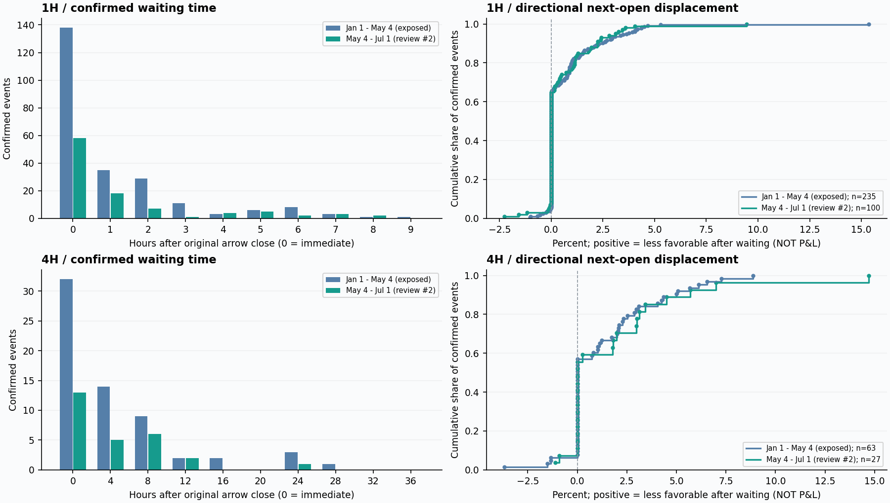

左侧0小时单列即时确认；右侧为全部确认的经验累计分布，包括即时确认的零位移。沿方向位移定义为 `side × (确认后次开盘 / 原箭头后次开盘 − 1)`，正数表示等待后沿信号方向更贵，负数表示更便宜。它不是收益、实际滑点或成交保证。为免大量即时确认掩盖等待代价，另列仅延迟确认的中位数。

| 时段 | 周期 | 确认 | 即时 | 延迟 | 仅延迟等待中位h | 全部位移中位bp | 仅延迟位移中位bp | 延迟更贵 | 延迟更便宜 |
|---|---|---|---|---|---|---|---|---|---|
| 1/1–5/4 · 模型验证已暴露 | 1H | 235 | 138 | 97 | 2.00 | 0.00 | 97.10 | 83 | 12 |
| 5/4–7/1 · 第2次复核 | 1H | 100 | 58 | 42 | 2.00 | 0.00 | 112.13 | 35 | 7 |
| 1/1–5/4 · 模型验证已暴露 | 4H | 63 | 32 | 31 | 8.00 | 0.00 | 227.89 | 27 | 4 |
| 5/4–7/1 · 第2次复核 | 4H | 27 | 13 | 14 | 8.00 | 0.00 | 300.26 | 12 | 2 |

## 模型确认的还是原蓄势结构吗

这里仅读保存几何台账：重合根数是模型核心与原蓄势段加箭头根p的真实交集；重合率的分母是模型核心自身4/5根，不是整个蓄势段。当前冻结规则只要求至少1根交集，所以下表必须和保留率一起看，不能沿用BTC/ETH小样本的重合程度作为全币结论。

| 时段 | 周期 | 确认数 | 最小核心重合率 | 中位核心重合率 | 仅重合1根 | 核心末端晚于箭头p |
|---|---|---|---|---|---|---|
| 1/1–5/4 · 模型验证已暴露 | 1H | 235 | 20.00% | 100.00% | 3/235 (1.28%) | 15/235 (6.38%) |
| 5/4–7/1 · 第2次复核 | 1H | 100 | 25.00% | 100.00% | 1/100 (1.00%) | 4/100 (4.00%) |
| 1/1–5/4 · 模型验证已暴露 | 4H | 63 | 80.00% | 100.00% | 0/63 (0.00%) | 1/63 (1.59%) |
| 5/4–7/1 · 第2次复核 | 4H | 27 | 100.00% | 100.00% | 0/27 (0.00%) | 0/27 (0.00%) |

| 周期 | 确认数 | 重合1根 | 2根 | 3根 | 4根 | 5根 | 核心末端早于p | 等于p | 晚于p |
|---|---|---|---|---|---|---|---|---|---|
| 1H | 335 | 4 | 7 | 5 | 139 | 180 | 298 | 18 | 19 |
| 4H | 90 | 0 | 0 | 0 | 52 | 38 | 81 | 8 | 1 |

仅重合1根时，几何条件通过对原蓄势身份的支持很弱；核心末端晚于p表示核心延伸到了原箭头之后，可能包含启动后的新结构。这些是审核优先级描述，并未新增过滤门，也不能单凭表格判定形态正确或错误。需要逐图人工审核才能确认是否仍是用户要求的“原蓄势释放”。

全部4条仅重合1根案例列在下面；其中4条核心从原箭头p开始，4条核心延伸到p之后。这揭示了当前宽松交集门的具体问题：即使核心主体出现在启动以后，只要碰到箭头这一根，也能获得确认。不能把这种确认直接当成模型认可了此前整段均线密集。

| 币种 | 周期 | 方向 | 原箭头收盘UTC | 等待h | 核心相对箭头区间 | 核心重合率 |
|---|---|---|---|---|---|---|
| ETHFI | 1H | 空 | 2026-02-05 13:00:00+00:00 | 7 | p+0 至 p+4 | 20% |
| ARB | 1H | 多 | 2026-03-15 23:00:00+00:00 | 7 | p+0 至 p+4 | 20% |
| FIL | 1H | 多 | 2026-03-15 23:00:00+00:00 | 6 | p+0 至 p+4 | 20% |
| TRX | 1H | 多 | 2026-05-24 08:00:00+00:00 | 5 | p+0 至 p+3 | 25% |

## 看实际模型识别的形态

固定选例规则是1H/4H×多/空各取按原箭头时间最早的确认，另加最早一条仅重合1根的确认，去重后最多5例。不是按未来涨跌或收益挑赢家；缺少某组确认时不补选。

上下文保留原参数六均线、IMACD双线和零轴；浅橙底为冻结蓄势段，橙线为原箭头，青色虚线为模型确认端点，青色区域为模型核心。每幅图只显示截至模型实际确认端点的K线，没有确认之后的走势。模型输入原图不加注释，框和箭头只画在独立audit副本。案例生成器复现原输入像素SHA，不重跑YOLO；本报告核对summary SHA、案例身份/时钟和三张PNG的文件SHA后展示。

### ORDI · 1H · 多 · 核心重合5根

原箭头收盘UTC：2026-01-01 10:00:00+00:00；模型确认UTC：2026-01-01 12:00:00+00:00。此图最后一根开盘UTC：2026-01-01 11:00:00+00:00。

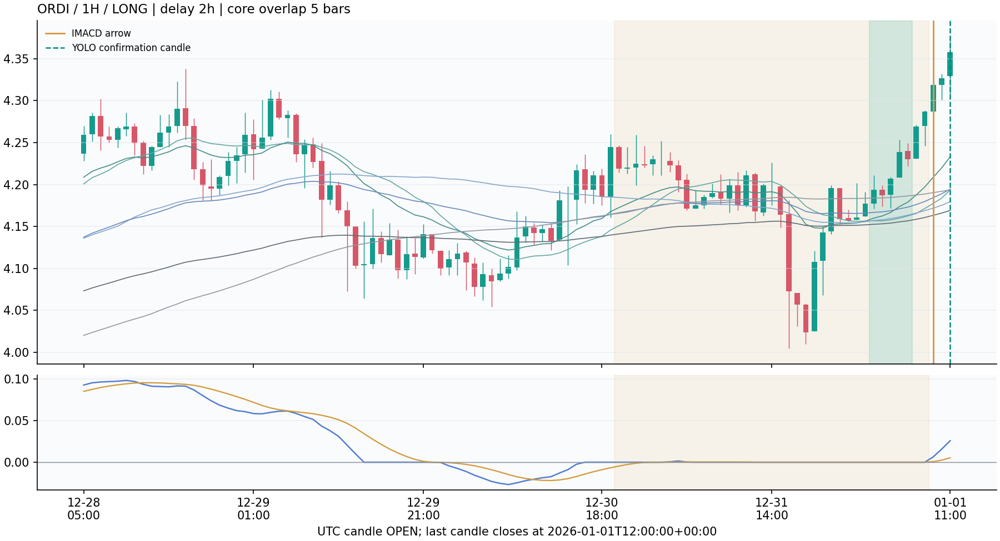

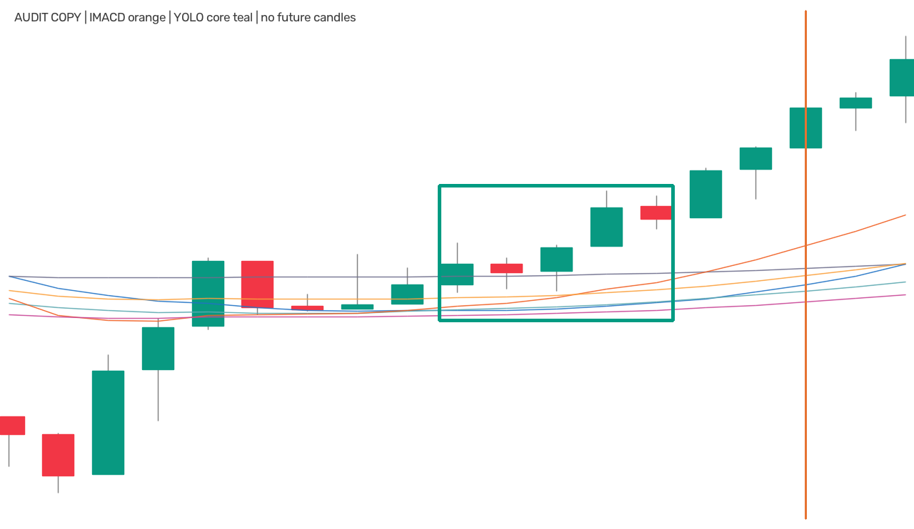

[查看无注释模型原始输入](/Users/zhangzc/fable-trading/experiments/active/exp-imacd-yolo-expanded-20260908-v1/results/examples/ORDI_60_1767258000_input.png)；生成器核对的输入像素SHA：`9994fbbfa1774f6b2074406de719c712a461f7def5cf7ed29cff3ce6e04aae3d`。

### HYPE · 1H · 空 · 核心重合4根

原箭头收盘UTC：2026-01-01 16:00:00+00:00；模型确认UTC：2026-01-01 16:00:00+00:00。此图最后一根开盘UTC：2026-01-01 15:00:00+00:00。

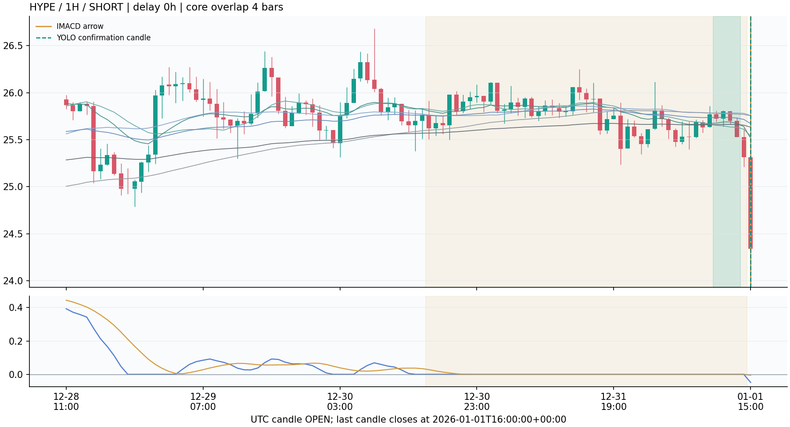

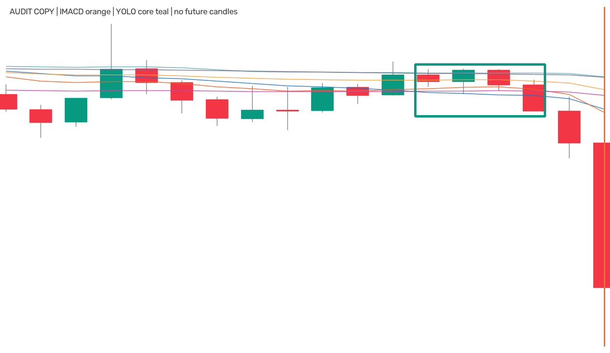

[查看无注释模型原始输入](/Users/zhangzc/fable-trading/experiments/active/exp-imacd-yolo-expanded-20260908-v1/results/examples/HYPE_60_1767279600_input.png)；生成器核对的输入像素SHA：`d8562b2347735edd93e1eff59619bdd44196febb2fe46e961b0c07b4221d73d3`。

### PEPE · 4H · 多 · 核心重合4根

原箭头收盘UTC：2026-01-01 20:00:00+00:00；模型确认UTC：2026-01-02 00:00:00+00:00。此图最后一根开盘UTC：2026-01-01 20:00:00+00:00。

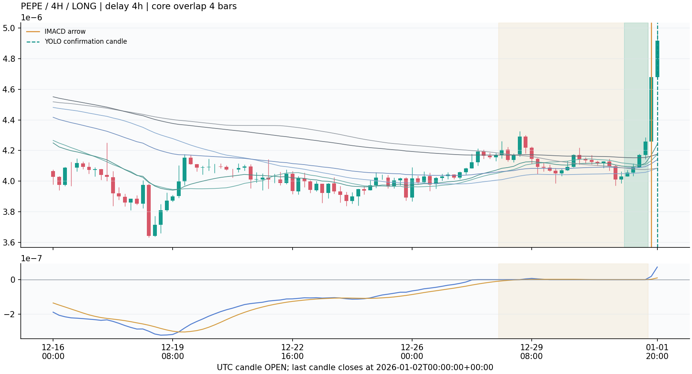

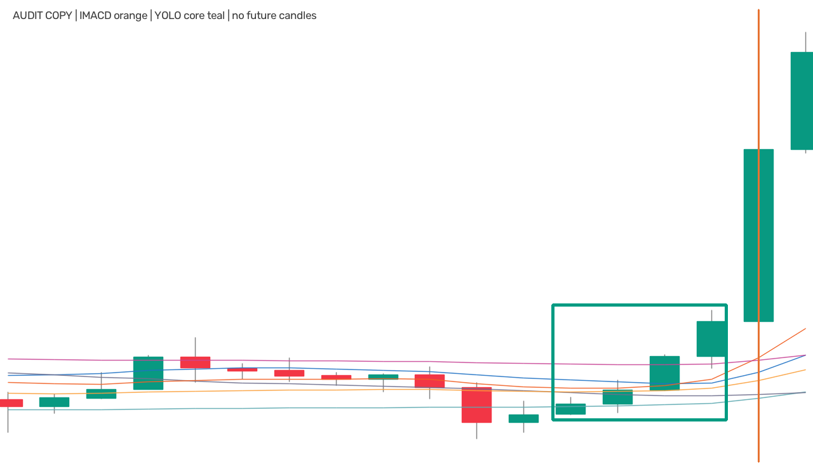

[查看无注释模型原始输入](/Users/zhangzc/fable-trading/experiments/active/exp-imacd-yolo-expanded-20260908-v1/results/examples/PEPE_240_1767283200_input.png)；生成器核对的输入像素SHA：`02fbfd05eaca4ac242de926a041b75e14b48d10fd36e0563e801522c1d26edc3`。

### UNI · 4H · 空 · 核心重合4根

原箭头收盘UTC：2026-01-08 20:00:00+00:00；模型确认UTC：2026-01-08 20:00:00+00:00。此图最后一根开盘UTC：2026-01-08 16:00:00+00:00。

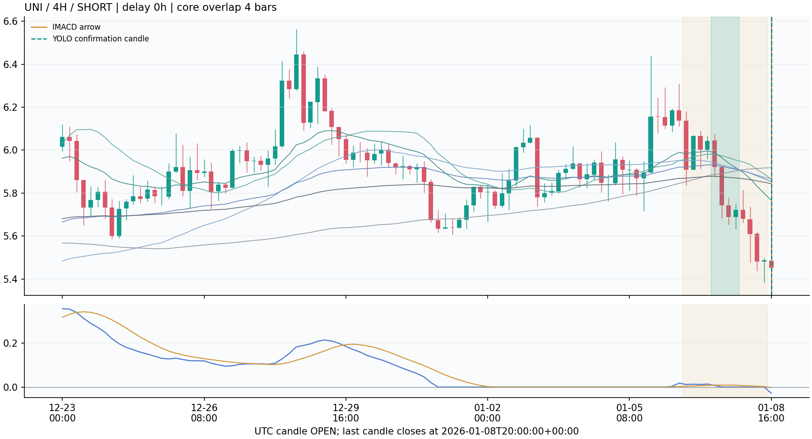

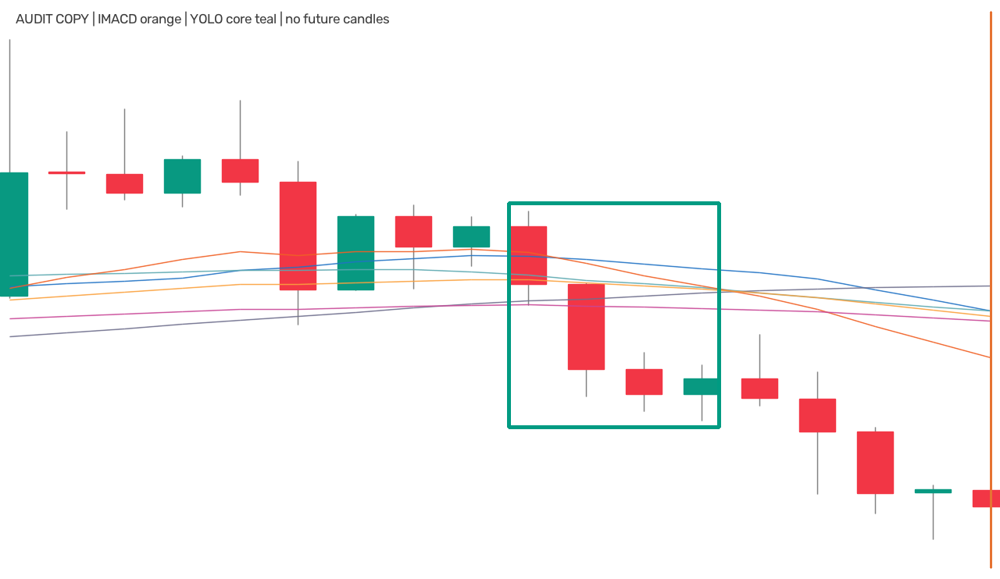

[查看无注释模型原始输入](/Users/zhangzc/fable-trading/experiments/active/exp-imacd-yolo-expanded-20260908-v1/results/examples/UNI_240_1767888000_input.png)；生成器核对的输入像素SHA：`e7da41f0a88aa80ee6544dbcc07ea5f421910c8cf3a763410ec042d9d223a47d`。

### ETHFI · 1H · 空 · 核心重合1根

原箭头收盘UTC：2026-02-05 13:00:00+00:00；模型确认UTC：2026-02-05 20:00:00+00:00。此图最后一根开盘UTC：2026-02-05 19:00:00+00:00。

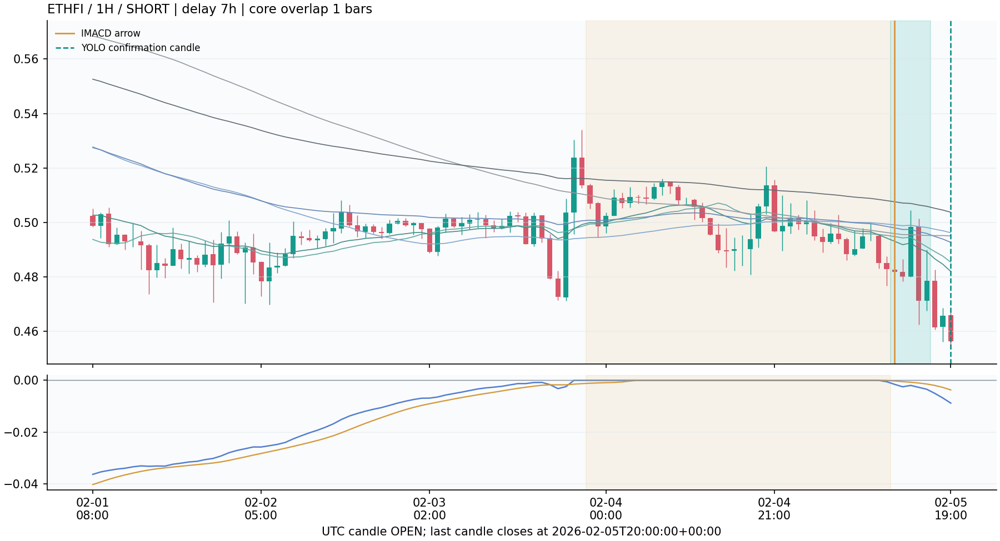

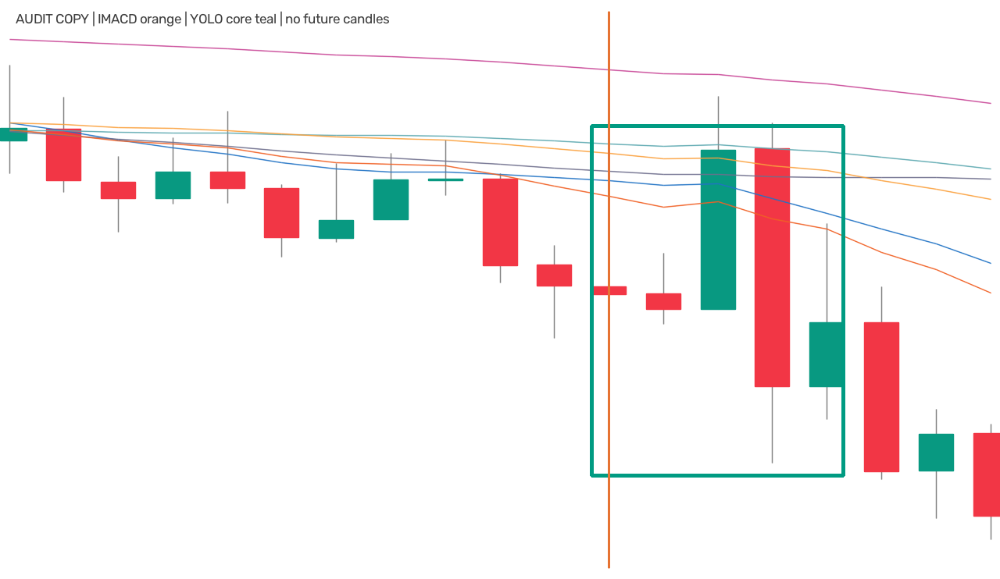

[查看无注释模型原始输入](/Users/zhangzc/fable-trading/experiments/active/exp-imacd-yolo-expanded-20260908-v1/results/examples/ETHFI_60_1770292800_input.png)；生成器核对的输入像素SHA：`3f2ec083792027cea72f2f6e456d180f765ca76f2877c299886e9e650913356e`。


## 与之前BTC/ETH小样本核对

旧台账14条，扩大评估中BTC/ETH同日期14条；按event_id对齐14条，其中14条指定字段一致。核对方向、原箭头与确认时钟、等待、模型框身份及两次开盘价格位移；差异与缺失清单见下方回执。

| 范围 | 周期 | 全部 | 完整 | 确认 | 截断 | 确认/完整 |
|---|---|---|---|---|---|---|
| 旧BTC/ETH | 1H | 12 | 12 | 5 | 0 | 41.67% |
| 扩展后BTC/ETH同日期 | 1H | 12 | 12 | 5 | 0 | 41.67% |
| 旧BTC/ETH | 4H | 2 | 2 | 0 | 0 | 0.00% |
| 扩展后BTC/ETH同日期 | 4H | 2 | 2 | 0 | 0 | 0.00% |

旧报告见[BTC/ETH的1H/4H试验](/Users/zhangzc/fable-trading/analysis/html/p1_imacd_yolo_timeframes_20260908.html)。这里不重跑旧推理，也不改写历史报告；共同事件对齐只能验证扩大任务没有悄悄改变旧事件结果，不能验证新增事件真假。

## 覆盖与零信号的区别

| 时段 | 周期 | 输入币数 | 零箭头币数 | 覆盖不足币数 | 有未ready行情币数 | 评价K线 | ready K线 |
|---|---|---|---|---|---|---|---|
| 1/1–5/4 · 模型验证已暴露 | 1H | 54 | 0 | 0 | 0 | 159408 | 159408 |
| 1/1–5/4 · 模型验证已暴露 | 4H | 54 | 0 | 0 | 1 | 39852 | 39846 |
| 5/4–7/1 · 第2次复核 | 1H | 54 | 0 | 0 | 0 | 75168 | 75168 |
| 5/4–7/1 · 第2次复核 | 4H | 54 | 9 | 0 | 0 | 18792 | 18792 |

每段每周期计划54个输入，共216个。覆盖不足表示evaluation_bars小于该完整时段理论K线数；“有未ready行情”表示已有K线中存在未满足固定指标就绪条件的部分。两者都不能记成有充分观察的无信号。既有缓存池不是历史上全部OKX在交易币种，可能存在选择、上市时间及幸存者偏差；没有按本轮收益或确认率选择这54币。

## 工程零假设与证据边界

| 时段 | 周期 | 真实同向确认 | 置换次数 | 打乱均值 | 单侧p | 四项Holm p |
|---|---|---|---|---|---|---|
| 1/1–5/4 · 模型验证已暴露 | 1H | 235 | 10000 | 158.682 | 0.000100 | 0.000400 |
| 1/1–5/4 · 模型验证已暴露 | 4H | 63 | 10000 | 53.313 | 0.000100 | 0.000400 |
| 5/4–7/1 · 第2次复核 | 1H | 100 | 10000 | 66.760 | 0.000100 | 0.000400 |
| 5/4–7/1 · 第2次复核 | 4H | 27 | 10000 | 26.002 | 0.256374 | 0.256374 |

固定原箭头方向下的md有效窗口与模型几何候选，在同币同月内打乱箭头方向；两段×两周期共四项检验使用同一家族Holm校正。这只检验条件化方向关联，不检验未来趋势、真假噪音、盈利或新增过滤器的独立价值。模型与IMACD共享价格和均线，存在机械相关；同月同币缺少方向变化时，置换本身也可能退化。

| 时段 | 周期 | 币×月组数 | 完整事件 | 混合方向组 | 组内事件 | 确认总数可变组 | 组内事件 |
|---|---|---|---|---|---|---|---|
| 1/1–5/4 · 模型验证已暴露 | 1H | 229 | 736 | 135 | 536 | 101 | 415 |
| 1/1–5/4 · 模型验证已暴露 | 4H | 133 | 185 | 27 | 62 | 15 | 35 |
| 5/4–7/1 · 第2次复核 | 1H | 103 | 340 | 67 | 268 | 50 | 209 |
| 5/4–7/1 · 第2次复核 | 4H | 56 | 64 | 4 | 8 | 2 | 4 |

上表从保存decisions独立重算，没有重跑模型或改变原p值。只有同时出现多、空的组才可能交换方向；进一步要求组内`can_long−can_short`不恒定，置换才可能改变确认总数。所列事件数表示这些组包含多少事件，不能当作独立样本数。

**4H后段p=0.256不能直接判模型无效。** 该段56个币×月组、64个完整事件中，混合方向仅4组/8个事件；真正能改变确认总数的只有2组/4个事件，其余对照贡献不变。这使当前检验的辨别能力很有限；结论应是这项条件化方向检验证据不足，既不能凭此确认有效，也不能凭不显著否定模型。相对地，1H的小p支持的是本定义下方向关联，并没有越过真假信号与盈利验证的缺口。

本轮没有新增金标或监督训练，正类率和val样本数不适用；确认率不是正类率。AUC、accuracy、precision/recall均为N/A。未规定经济退出和仓位合同，因此成本、TP/SL、胜率、净收益、最大回撤、top-decile毛净收益和经济匹配随机入场均为N/A，不以确认数减少代替这些指标。工程对照是全IMACD箭头及上述条件化方向打乱。

## 验证、来源和复现

### 输出层JSON格式修复

原冻结runner的多列grouped_stats分组键包含NumPy int64标量，Python JSON在最后写summary时拒绝该类型。这个错误发生在汇总输出层，216个模型分片及候选、框、决策、轨迹已经保存；没有改动其冻结源码、来源manifest、模型输入或决策规则。

单独提交的finalizer先验证216份完整分片收据、文件SHA和四份combined台账与分片一致，再从保存决策重算同规则描述与四项固定方向置换，只用`np.generic.item()`将NumPy标量显式转换为Python标量后写JSON。不静默字符串化未知对象，不允许非有限指标。这个过程没有读取原始行情、加载模型或重跑推理；重新生成同一套统计不是新的模型/市场评价。

| 输出修复来源 | 保存值 |
|---|---|
| 源码 | [yoyo/evaluation/imacd_yolo_expanded_finalize.py](/Users/zhangzc/fable-trading/yoyo/evaluation/imacd_yolo_expanded_finalize.py) |
| 源码SHA | `13d80ea1d73ac08f0beba7126aae7434e84d662c5eebd98b2a305a0d95e8ef27` |
| 生成commit | `ef12262a0d694a14b1a380f37ccafeb1cfb00195` |
| 修复范围原文 | Explicit NumPy scalar conversion only; all market inference and saved shards unchanged. |

修复有两条独立回归覆盖：复现多列分组的int64写出错误并核对转换后数字保持一致；拒绝未知对象与NaN，防止“能写JSON”掩盖坏数据。测试源码见[输出修复回归测试](/Users/zhangzc/fable-trading/tests/test_imacd_yolo_expanded_finalize.py)。本报告不因测试文件存在而自行填报整套测试通过数量。

### 保存台账的复核

报告逐一核对1084份保存产物的SHA，并将216组计数与combined decisions重新对账。冻结程序保存216组内置验证收据，其中216组passed=true，共记录425次确认事件检查；未通过或缺少passed的分组：`[]`。这是内置回执，不冒充外部审核通过数量。以下仅列独立审核的检查总数、结果、失效覆盖与旧样本对齐摘要，窗口数明确取自运行summary。失败列表最多展示20项，完整逐项检查见[独立审核JSON](/Users/zhangzc/fable-trading/experiments/active/exp-imacd-yolo-expanded-20260908-v1/results/independent_review.json)。

```json
{
  "n_checks": 3750,
  "all_passed": true,
  "n_shards": 216,
  "n_events": 1341,
  "n_proposals": 3819,
  "n_trace_rows": 14680,
  "n_confirmed": 425,
  "statuses": {
    "expired": 740,
    "confirmed": 425,
    "invalidated": 160,
    "censored_end": 16
  },
  "events_outside_prior_btc_eth_cohort": 1327,
  "reused_core_confirmations": 0,
  "trace_replay_coverage": {
    "complete_events": 1325,
    "censored_events": 16,
    "events_with_observed_invalidation": 174,
    "invalidated_events": 160,
    "confirmed_before_later_invalidation": 13
  },
  "failed_check_count": 0,
  "failed_checks": [],
  "omitted_failed_checks": 0,
  "windows_scored_from_summary": 26500,
  "prior_btc_eth_comparison": {
    "previous_events": 14,
    "repeated_event_ids": 14,
    "frozen_candidates_equal": true,
    "traces_equal": true,
    "all_decision_fields_equal": true,
    "previous_boxes": 29,
    "repeated_cohort_boxes": 29,
    "shared_detection_ids": 29,
    "old_only_detection_ids": 0,
    "new_only_detection_ids": 0,
    "shared_detection_confidence_changes": 0,
    "common_windows_with_saved_pixel_hashes": 29,
    "differing_common_pixel_hashes": 0
  }
}
```

共同小样本对齐回执：

```json
{
  "available": true,
  "prior_events": 14,
  "current_events": 14,
  "common_events": 14,
  "unchanged_events": 14,
  "mismatches": [],
  "missing_prior_ids": [],
  "extra_current_ids": [],
  "prior_decisions_sha256": "ca23bd9f86dde7b347061e7a6bb0ad097b912619c283e4cb44134c58a4005df8",
  "prior_summary_sha256": "5f8892b6d663faae16cede37675efc4fb4c58b98e745fa11b437674f7f65fb48"
}
```

推理源冻结commit：`b3640dbec4001d7f755453a1217a8cb5a98bf401`；模型权重SHA：`862705b999594355c1133640acc540f4de19b561889e89d9e050ddad5c6db838`。模型保持原生15m研究权重的W18/W19、conf0.25、NMS0.70、imgsz1280配置，无训练或参数搜索。相同根数在1H/4H覆盖更长自然时间，不能当作模型已经适配新周期的证明。运行版本：`{"torch": "2.8.0", "ultralytics": "8.4.89", "numpy": "2.0.2", "pandas": "2.3.3"}`。预测API背景见[Ultralytics官方文档](https://docs.ultralytics.com/modes/predict/)。本报告生成器不加载模型、不读取原始行情，只读取保存台账。

```bash
cd /Users/zhangzc/fable-trading
# 首次/中断续跑：仅接受来源与SHA一致的已完成分片
.venv/bin/python -m yoyo.evaluation.imacd_yolo_expanded
# 当前冻结版本在最后summary JSON写出报int64 TypeError；不因此重跑模型
# 确认completed_groups=total_groups=216，且四份combined台账已经存在
cat experiments/active/exp-imacd-yolo-expanded-20260908-v1/results/progress.json
# 只校验216分片/combined并修复输出格式；不足216或summary已存在均拒绝执行
.venv/bin/python -m yoyo.evaluation.imacd_yolo_expanded_finalize
# 独立核对保存台账，不重复推理
.venv/bin/python -m yoyo.evaluation.imacd_yolo_expanded_verify
# 可选：复现按时间选定的历史模型输入/审核图，不重跑YOLO
.venv/bin/python -m yoyo.evaluation.imacd_yolo_expanded_examples
# 重新生成展示，不再推理
.venv/bin/python -m yoyo.evaluation.imacd_yolo_expanded_report
# HTML也可从保存MD独立转换（report命令已自动执行此步）
.venv/bin/python scripts/md_to_html.py analysis/p1_imacd_yolo_expanded_20260908.md --out-dir analysis/html
```

原runner的最后序列化错误不是缺失分片的豁免：必须先核对216组完成与四份combined台账存在，finalizer会再次严格校验，不能对部分结果生成完整总结。已有summary时只执行verify、可选examples和report；不重复run或finalize。报告源码提交后生成MD，随后立即用scripts/md_to_html.py转换HTML。模型、原始缓存、大型台账不入git，完整路径、来源与摘要保存在实验source_manifest、universe及summary中。

## 风险与诚实声明

- 更多币和更长区间提高覆盖，但共享行情、训练/验证暴露和历史池选择仍限制外推；没有新增真正独立盲样本。
- 模型确认少不等于噪音少：尚未人工审查被删除的赢家、保留的假启动或图形语义一致性。
- 4H允许等待36小时。离线可用时钟不包含Mac扫描、推理和网络通知延迟，未完成全市场在线容量或交易验收。
- 截断候选不能用于评价完整确认过程；在线系统应按当前已知数据逐步决定，不能等待未来完整随访后再回填信号。
- 没有经济退出合同，不宣称更赚钱。TradingView、spike、Mac监控、TG/Bark、ACTIVE和实盘配置保持本任务只读，training_eligible=false、production_eligible=false。

## 下一步

依据全币、月份、方向分布选择人工审核队列，按事前规则同时审核确认与未确认候选；用逐端点轨迹核对首次合法确认和首次失效。经济增益需要另行固定入场、退出、成本与评价合同，不能直接把本轮保留率作为上线门。
