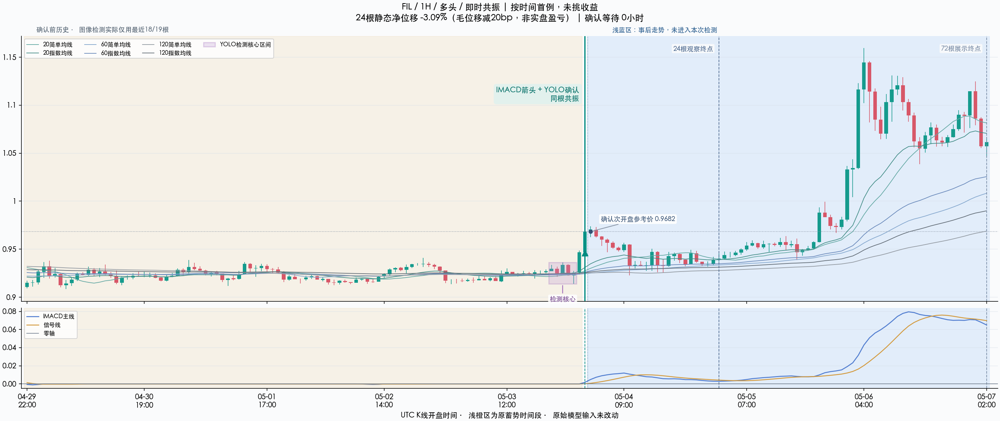
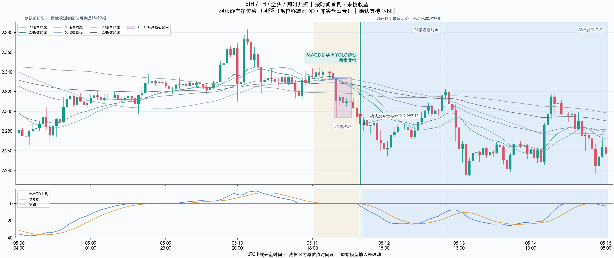
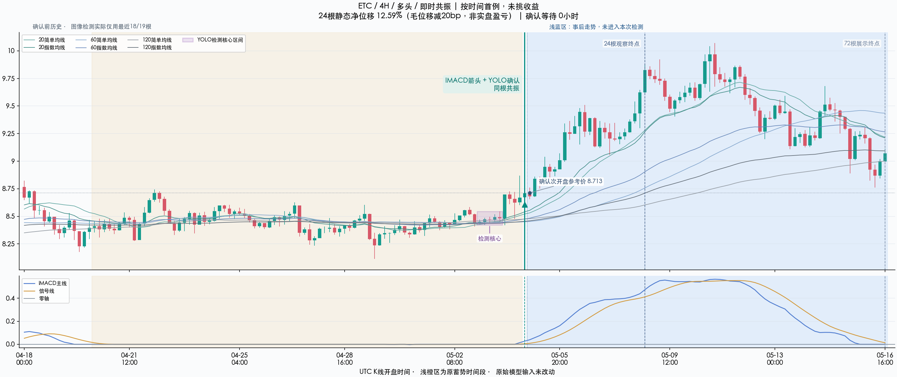
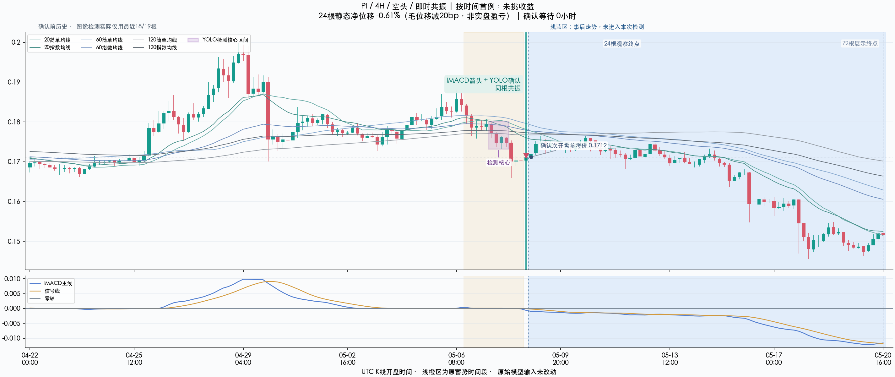
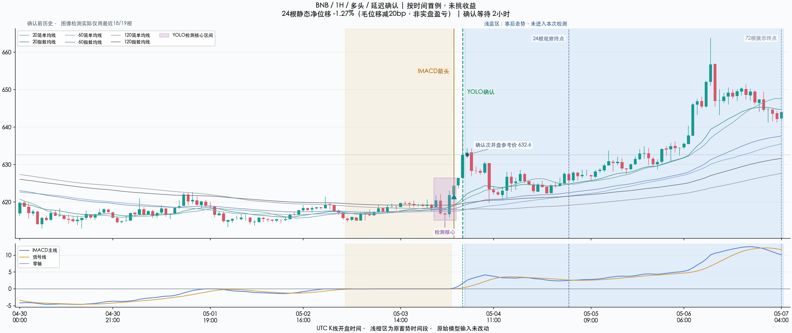
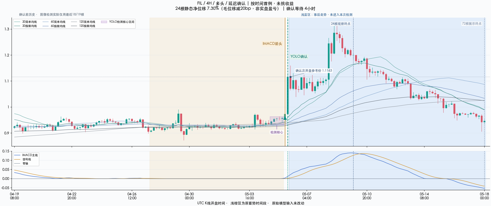
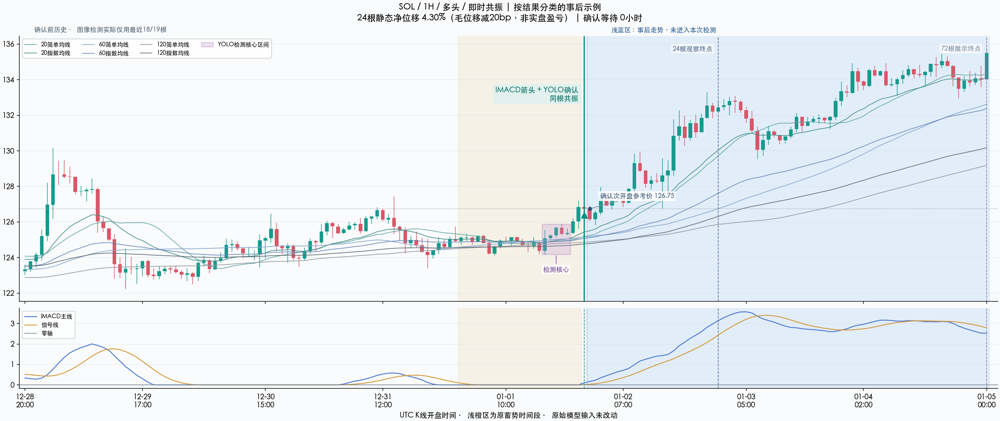
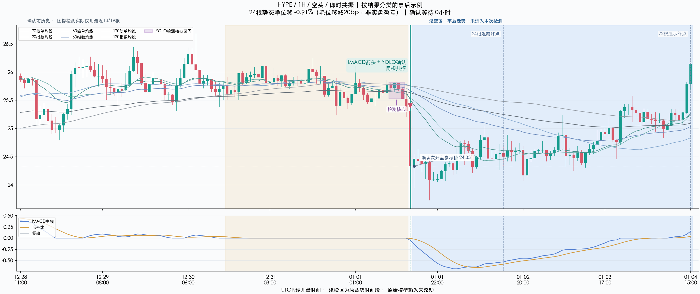
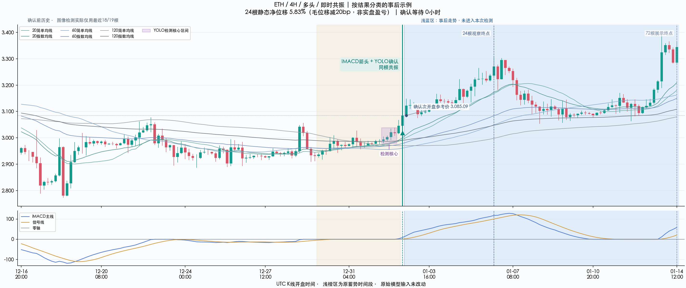
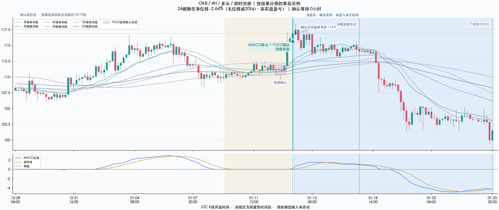

# IMACD + YOLO 后续走势：24根统计与完整事后图

这次把模型确认之后的走势展开，而不是把历史输入截在确认点。主比较固定24根：1H是24小时，4H是96小时；另列6根与72根敏感度。全部统计来自冻结事件全集，不根据展示图挑样本。

**先看后段（5/4–7/1）的全样本：** 净位移只是方向性持有位移减去固定20bp的静态成本敏感度，不是含资金费、滑点、保证金和重叠仓位的完整实盘PnL。

| 周期 | 持有时长 | 分组 | 实际计时起点 | 完整/全部 | 平均静态净位移 | 同向收盘比例 | 匹配事件 | 随机净位移 | 匹配超额 |
|---|---|---|---|---|---|---|---|---|---|
| 1H | 24h | 原箭头全体 | p+1 | 332/347 | -0.05% | 45.18% | 315 | 0.21% | -0.33% |
| 1H | 24h | 即时共振 | e+1 | 56/58 | 0.20% | 42.86% | 53 | 0.52% | -0.40% |
| 1H | 24h | 延迟确认 | e+1 | 40/42 | -0.42% | 47.50% | 36 | -0.08% | -0.55% |
| 4H | 96h | 原箭头全体 | p+1 | 64/68 | 2.74% | 67.19% | 48 | 2.42% | 0.97% |
| 4H | 96h | 即时共振 | e+1 | 13/13 | 2.24% | 61.54% | 11 | 3.78% | -1.30% |
| 4H | 96h | 延迟确认 | e+1 | 14/14 | -0.19% | 57.14% | 8 | 1.21% | -1.17% |

原箭头全体从p+1开盘计；即时共振p=e，确认组同样从真实e+1开盘计。延迟确认只能从真正e+1开始，不能把原p+1价冒充模型确认后的入场价。随机与匹配超额只在有匹配的同一事件子集上平均，不能把全样本净均值直接减去不同分母的随机均值。这里必须有3条完整随机对照才记匹配；不足3条不补抽、不填超额。

**四组预注册confirmation主比较的匹配超额均为负，当前结果没有支持追加YOLO改善这个固定持有期的表现。即使某组原始平均净位移为正，也不能据此称成功；必须连同相同匹配条件下的随机对照、正向比例和样本数解释。** 同向收盘比例指固定时长结束时方向性毛位移为正，不是人工启动准确率。

主统计检验只有后段24根、confirmation锚点的1H/4H×即时/延迟四组。以下是主程序保存的ISO周整块符号检验与Holm4校正，报告不重跑或挑选p值；相邻周的持有窗口仍可能重叠，因此是探索性证据，不是随机试验或实盘获利认证。

| 周期 | 确认组 | 匹配事件 | 匹配超额 | ISO周块数 | 单侧p | Holm4 p |
|---|---|---|---|---|---|---|
| 1H | immediate | 53 | -0.40% | 8 | 0.632812 | 1.000000 |
| 1H | delayed | 36 | -0.55% | 9 | 0.773438 | 1.000000 |
| 4H | immediate | 11 | -1.30% | 5 | 0.687500 | 1.000000 |
| 4H | delayed | 8 | -1.17% | 6 | 0.687500 | 1.000000 |

## 同钟即时事件：随机控制抽样的敏感性

即时共振p=e，两种锚点的实际行情时钟相同，但冻结随机种子包含anchor_kind，imacd与confirmation各自独立抽3条控制。因此相同事件的对照均值与匹配覆盖可能不同，小池可以出现超额符号翻转。预注册主表是confirmation，不能挑imacd副表的有利数字，也不能把相同时间下的差异解释成等待效应。

| 周期 | 锚点标签 | 完整事件 | 匹配事件 | 匹配事件净位移 | 随机净位移 | 匹配超额 |
|---|---|---|---|---|---|---|
| 1H | imacd | 56 | 54 | 0.15% | 0.22% | -0.08% |
| 1H | confirmation | 56 | 53 | 0.12% | 0.52% | -0.40% |
| 4H | imacd | 13 | 11 | 2.48% | 1.48% | 1.00% |
| 4H | confirmation | 13 | 11 | 2.48% | 3.78% | -1.30% |

## 持有途中曾经走多远

MFE/MAE均为完整24根窗口的事后价格路径标签；MAE为非负不利幅度，不是组合最大回撤，不能推断止损触发先后或实际可获得利润。

| 周期 | 确认组 | 完整事件 | 有利偏移中位 | 不利偏移中位 | 有利偏移中位ATR | 不利偏移中位ATR |
|---|---|---|---|---|---|---|
| 1H | immediate | 56 | 2.32% | 2.30% | 2.44 | 2.13 |
| 1H | delayed | 40 | 1.96% | 3.41% | 2.19 | 2.59 |
| 4H | immediate | 13 | 6.56% | 3.62% | 2.43 | 1.37 |
| 4H | delayed | 14 | 7.10% | 3.52% | 2.71 | 1.57 |

## 如何看下面的宽图

每图显示确认前100根历史、确认根，以及确认后的72根。浅蓝区全部是事后观察，模型当时看不到；左侧100根是已发生的历史上下文，也不声称全部曾送入YOLO。历史与未来区使用同一真实价格坐标、六根close均线和IMACD双线/零轴。所有新图只写入future_only目录，原始模型输入保持不变，禁止作训练输入。

紫色框只标保存的YOLO检测核心K线区间，不扩大成整段蓄势；框的上下界取这几根K线的高低，不是重新绘制原像素检测框。图内中文标出IMACD箭头、YOLO确认或同根共振、确认次开盘参考价，以及确认后24根观察终点与72根展示终点。这些是展示说明，没有改变指标、检测核心或确认规则。

前四个选例角色是1H/4H×多/空的最早即时共振，优先后段且要求72根完整；其次每周期最早后段延迟确认。最后四个角色按24根静态净位移正/非正取最早即时例，属于明确的事后结果选图。相同事件去重，不会为凑图或让结果漂亮而换成后面的赢家。

### 1. FIL · 1H · 多 · 即时

**仅按时间选例，未按收益挑选。** 选例角色：`first_immediate_60_long`。24根静态净位移-3.09%，该数字是事后结果。



[打开原尺寸宽图](/Users/zhangzc/fable-trading/experiments/active/exp-imacd-yolo-followthrough-20260908-v1/results/future_only/FIL_60_1777860000_hindsight_72.png)。模型确认UTC：2026-05-04 03:00:00+00:00；未来区开始UTC：2026-05-04 03:00:00+00:00；最后未来K线收盘UTC：2026-05-07 03:00:00+00:00。实际前文100根，未来72根；未来区不曾进入原模型识别。

### 2. ETH · 1H · 空 · 即时

**仅按时间选例，未按收益挑选。** 选例角色：`first_immediate_60_short`。24根静态净位移-1.46%，该数字是事后结果。



[打开原尺寸宽图](/Users/zhangzc/fable-trading/experiments/active/exp-imacd-yolo-followthrough-20260908-v1/results/future_only/ETH_60_1778572800_hindsight_72.png)。模型确认UTC：2026-05-12 09:00:00+00:00；未来区开始UTC：2026-05-12 09:00:00+00:00；最后未来K线收盘UTC：2026-05-15 09:00:00+00:00。实际前文100根，未来72根；未来区不曾进入原模型识别。

### 3. ETC · 4H · 多 · 即时

**仅按时间选例，未按收益挑选。** 选例角色：`first_immediate_240_long`。24根静态净位移12.59%，该数字是事后结果。



[打开原尺寸宽图](/Users/zhangzc/fable-trading/experiments/active/exp-imacd-yolo-followthrough-20260908-v1/results/future_only/ETC_240_1777910400_hindsight_72.png)。模型确认UTC：2026-05-04 20:00:00+00:00；未来区开始UTC：2026-05-04 20:00:00+00:00；最后未来K线收盘UTC：2026-05-16 20:00:00+00:00。实际前文100根，未来72根；未来区不曾进入原模型识别。

### 4. PI · 4H · 空 · 即时

**仅按时间选例，未按收益挑选。** 选例角色：`first_immediate_240_short`。24根静态净位移-0.61%，该数字是事后结果。



[打开原尺寸宽图](/Users/zhangzc/fable-trading/experiments/active/exp-imacd-yolo-followthrough-20260908-v1/results/future_only/PI_240_1778256000_hindsight_72.png)。模型确认UTC：2026-05-08 20:00:00+00:00；未来区开始UTC：2026-05-08 20:00:00+00:00；最后未来K线收盘UTC：2026-05-20 20:00:00+00:00。实际前文100根，未来72根；未来区不曾进入原模型识别。

### 5. BNB · 1H · 多 · 延迟

**仅按时间选例，未按收益挑选。** 选例角色：`first_later_delayed_60`。24根静态净位移-1.27%，该数字是事后结果。



[打开原尺寸宽图](/Users/zhangzc/fable-trading/experiments/active/exp-imacd-yolo-followthrough-20260908-v1/results/future_only/BNB_60_1777860000_hindsight_72.png)。模型确认UTC：2026-05-04 05:00:00+00:00；未来区开始UTC：2026-05-04 05:00:00+00:00；最后未来K线收盘UTC：2026-05-07 05:00:00+00:00。实际前文100根，未来72根；未来区不曾进入原模型识别。

### 6. FIL · 4H · 多 · 延迟

**仅按时间选例，未按收益挑选。** 选例角色：`first_later_delayed_240`。24根静态净位移7.30%，该数字是事后结果。



[打开原尺寸宽图](/Users/zhangzc/fable-trading/experiments/active/exp-imacd-yolo-followthrough-20260908-v1/results/future_only/FIL_240_1778011200_hindsight_72.png)。模型确认UTC：2026-05-06 04:00:00+00:00；未来区开始UTC：2026-05-06 04:00:00+00:00；最后未来K线收盘UTC：2026-05-18 04:00:00+00:00。实际前文100根，未来72根；未来区不曾进入原模型识别。

### 7. SOL · 1H · 多 · 即时

**含按24根结果挑选的事后示例。** 选例角色：`posthoc_24bar_positive_60`。24根静态净位移4.30%，该数字是事后结果。



[打开原尺寸宽图](/Users/zhangzc/fable-trading/experiments/active/exp-imacd-yolo-followthrough-20260908-v1/results/future_only/SOL_60_1767312000_hindsight_72.png)。模型确认UTC：2026-01-02 01:00:00+00:00；未来区开始UTC：2026-01-02 01:00:00+00:00；最后未来K线收盘UTC：2026-01-05 01:00:00+00:00。实际前文100根，未来72根；未来区不曾进入原模型识别。

### 8. HYPE · 1H · 空 · 即时

**含按24根结果挑选的事后示例。** 选例角色：`posthoc_24bar_nonpositive_60`。24根静态净位移-0.91%，该数字是事后结果。



[打开原尺寸宽图](/Users/zhangzc/fable-trading/experiments/active/exp-imacd-yolo-followthrough-20260908-v1/results/future_only/HYPE_60_1767279600_hindsight_72.png)。模型确认UTC：2026-01-01 16:00:00+00:00；未来区开始UTC：2026-01-01 16:00:00+00:00；最后未来K线收盘UTC：2026-01-04 16:00:00+00:00。实际前文100根，未来72根；未来区不曾进入原模型识别。

### 9. ETH · 4H · 多 · 即时

**含按24根结果挑选的事后示例。** 选例角色：`posthoc_24bar_positive_240`。24根静态净位移5.83%，该数字是事后结果。



[打开原尺寸宽图](/Users/zhangzc/fable-trading/experiments/active/exp-imacd-yolo-followthrough-20260908-v1/results/future_only/ETH_240_1767355200_hindsight_72.png)。模型确认UTC：2026-01-02 16:00:00+00:00；未来区开始UTC：2026-01-02 16:00:00+00:00；最后未来K线收盘UTC：2026-01-14 16:00:00+00:00。实际前文100根，未来72根；未来区不曾进入原模型识别。

### 10. OKB · 4H · 多 · 即时

**含按24根结果挑选的事后示例。** 选例角色：`posthoc_24bar_nonpositive_240`。24根静态净位移-2.64%，该数字是事后结果。



[打开原尺寸宽图](/Users/zhangzc/fable-trading/experiments/active/exp-imacd-yolo-followthrough-20260908-v1/results/future_only/OKB_240_1768334400_hindsight_72.png)。模型确认UTC：2026-01-14 00:00:00+00:00；未来区开始UTC：2026-01-14 00:00:00+00:00；最后未来K线收盘UTC：2026-01-26 00:00:00+00:00。实际前文100根，未来72根；未来区不曾进入原模型识别。

缺少的固定选例角色：`[]`。去重后实际10幅图；缺组不以其他类别替代。

## 24根：原箭头全体及最终状态分层

下表p+1的“最终延迟确认/最终未确认”分层在p时不可知，是事后解释用途，不能当成可执行策略；真正可用的确认结果仍看e+1锚点。即时组在p收盘已知，因为p=e。完整/全部明确保留各时长的截断分母；未满完整持有期不填收益数字。

| 时段 | 周期 | 分组 | 起点 | 完整/全部 | 平均毛位移 | 平均静态净位移 | 中位静态净位移 | 净正比例 | 匹配事件 | 随机净位移 | 匹配超额 |
|---|---|---|---|---|---|---|---|---|---|---|---|
| 1/1–5/4 · 已暴露 | 1H | 原箭头全体 | p+1 | 733/737 | 0.36% | 0.16% | -0.22% | 47.75% | 725 | -0.03% | 0.20% |
| 1/1–5/4 · 已暴露 | 1H | 即时共振 | p+1 | 138/138 | 0.38% | 0.18% | -0.49% | 47.10% | 137 | -0.40% | 0.61% |
| 1/1–5/4 · 已暴露 | 1H | 最终延迟确认（事后分类） | p+1 | 97/97 | 1.93% | 1.73% | 1.99% | 64.95% | 97 | -0.64% | 2.37% |
| 1/1–5/4 · 已暴露 | 1H | 最终未确认（事后分类） | p+1 | 498/501 | 0.04% | -0.16% | -0.37% | 44.58% | 491 | 0.20% | -0.35% |
| 1/1–5/4 · 已暴露 | 1H | 确认随访截断 | p+1 | 0/1 | N/A% | N/A% | N/A% | N/A% | 0 | N/A% | N/A% |
| 1/1–5/4 · 已暴露 | 1H | 即时共振实际锚点 | e+1 | 138/138 | 0.38% | 0.18% | -0.49% | 47.10% | 138 | -0.32% | 0.50% |
| 1/1–5/4 · 已暴露 | 1H | 延迟确认实际锚点 | e+1 | 97/97 | 0.28% | 0.08% | 0.20% | 53.61% | 97 | -0.13% | 0.21% |
| 1/1–5/4 · 已暴露 | 4H | 原箭头全体 | p+1 | 176/189 | -0.92% | -1.12% | -1.25% | 39.20% | 175 | 0.15% | -1.30% |
| 1/1–5/4 · 已暴露 | 4H | 即时共振 | p+1 | 32/32 | 0.49% | 0.29% | -0.38% | 46.88% | 32 | 1.07% | -0.78% |
| 1/1–5/4 · 已暴露 | 4H | 最终延迟确认（事后分类） | p+1 | 30/31 | 1.39% | 1.19% | -0.50% | 43.33% | 29 | 1.81% | -0.75% |
| 1/1–5/4 · 已暴露 | 4H | 最终未确认（事后分类） | p+1 | 114/122 | -1.92% | -2.12% | -1.83% | 35.96% | 114 | -0.53% | -1.59% |
| 1/1–5/4 · 已暴露 | 4H | 确认随访截断 | p+1 | 0/4 | N/A% | N/A% | N/A% | N/A% | 0 | N/A% | N/A% |
| 1/1–5/4 · 已暴露 | 4H | 即时共振实际锚点 | e+1 | 32/32 | 0.49% | 0.29% | -0.38% | 46.88% | 32 | 1.95% | -1.66% |
| 1/1–5/4 · 已暴露 | 4H | 延迟确认实际锚点 | e+1 | 30/31 | -0.79% | -0.99% | -2.71% | 43.33% | 29 | 0.01% | -0.90% |
| 5/4–7/1 · 再次事后评估 | 1H | 原箭头全体 | p+1 | 332/347 | 0.15% | -0.05% | -0.55% | 43.67% | 315 | 0.21% | -0.33% |
| 5/4–7/1 · 再次事后评估 | 1H | 即时共振 | p+1 | 56/58 | 0.40% | 0.20% | -0.52% | 42.86% | 54 | 0.22% | -0.08% |
| 5/4–7/1 · 再次事后评估 | 1H | 最终延迟确认（事后分类） | p+1 | 40/42 | 1.31% | 1.11% | 0.96% | 62.50% | 37 | 0.83% | 0.28% |
| 5/4–7/1 · 再次事后评估 | 1H | 最终未确认（事后分类） | p+1 | 236/240 | -0.11% | -0.31% | -0.86% | 40.68% | 224 | 0.11% | -0.49% |
| 5/4–7/1 · 再次事后评估 | 1H | 确认随访截断 | p+1 | 0/7 | N/A% | N/A% | N/A% | N/A% | 0 | N/A% | N/A% |
| 5/4–7/1 · 再次事后评估 | 1H | 即时共振实际锚点 | e+1 | 56/58 | 0.40% | 0.20% | -0.52% | 42.86% | 53 | 0.52% | -0.40% |
| 5/4–7/1 · 再次事后评估 | 1H | 延迟确认实际锚点 | e+1 | 40/42 | -0.22% | -0.42% | -0.39% | 45.00% | 36 | -0.08% | -0.55% |
| 5/4–7/1 · 再次事后评估 | 4H | 原箭头全体 | p+1 | 64/68 | 2.94% | 2.74% | 3.22% | 62.50% | 48 | 2.42% | 0.97% |
| 5/4–7/1 · 再次事后评估 | 4H | 即时共振 | p+1 | 13/13 | 2.44% | 2.24% | 2.75% | 61.54% | 11 | 1.48% | 1.00% |
| 5/4–7/1 · 再次事后评估 | 4H | 最终延迟确认（事后分类） | p+1 | 14/14 | 3.65% | 3.45% | 2.08% | 57.14% | 10 | 5.94% | -0.85% |
| 5/4–7/1 · 再次事后评估 | 4H | 最终未确认（事后分类） | p+1 | 37/37 | 2.84% | 2.64% | 3.27% | 64.86% | 27 | 1.50% | 1.64% |
| 5/4–7/1 · 再次事后评估 | 4H | 确认随访截断 | p+1 | 0/4 | N/A% | N/A% | N/A% | N/A% | 0 | N/A% | N/A% |
| 5/4–7/1 · 再次事后评估 | 4H | 即时共振实际锚点 | e+1 | 13/13 | 2.44% | 2.24% | 2.75% | 61.54% | 11 | 3.78% | -1.30% |
| 5/4–7/1 · 再次事后评估 | 4H | 延迟确认实际锚点 | e+1 | 14/14 | 0.01% | -0.19% | 0.89% | 50.00% | 8 | 1.21% | -1.17% |

## 延迟确认：同事件、同退出时点的事后对照

以下并列真实e+1开盘锚点与同事件原p+1开盘至同一退出点的毛位移。原p+1对照在当时不知道以后会确认，只能用于解释等待期间已经发生的价格变化，不能称提前识别策略。

| 时段 | 周期 | 完整延迟事件 | 原p+1至同退出点毛位移 | 真实e+1至退出点毛位移 |
|---|---|---|---|---|
| 1/1–5/4 · 已暴露 | 1H | 97 | 1.80% | 0.28% |
| 5/4–7/1 · 再次事后评估 | 1H | 40 | 1.12% | -0.22% |
| 1/1–5/4 · 已暴露 | 4H | 30 | 1.74% | -0.79% |
| 5/4–7/1 · 再次事后评估 | 4H | 14 | 3.40% | 0.01% |

## 6根敏感度

| 时段 | 周期 | 分组 | 起点 | 完整/全部 | 平均毛位移 | 平均静态净位移 | 中位静态净位移 | 净正比例 | 匹配事件 | 随机净位移 | 匹配超额 |
|---|---|---|---|---|---|---|---|---|---|---|---|
| 1/1–5/4 · 已暴露 | 1H | 原箭头全体 | p+1 | 736/737 | 0.02% | -0.18% | -0.29% | 39.40% | 734 | -0.07% | -0.10% |
| 1/1–5/4 · 已暴露 | 1H | 即时共振 | p+1 | 138/138 | -0.07% | -0.27% | -0.37% | 33.33% | 138 | -0.04% | -0.22% |
| 1/1–5/4 · 已暴露 | 1H | 最终延迟确认（事后分类） | p+1 | 97/97 | 1.46% | 1.26% | 1.26% | 74.23% | 97 | -0.16% | 1.41% |
| 1/1–5/4 · 已暴露 | 1H | 最终未确认（事后分类） | p+1 | 501/501 | -0.23% | -0.43% | -0.41% | 34.33% | 499 | -0.06% | -0.36% |
| 1/1–5/4 · 已暴露 | 1H | 确认随访截断 | p+1 | 0/1 | N/A% | N/A% | N/A% | N/A% | 0 | N/A% | N/A% |
| 1/1–5/4 · 已暴露 | 1H | 即时共振实际锚点 | e+1 | 138/138 | -0.07% | -0.27% | -0.37% | 33.33% | 138 | -0.29% | 0.03% |
| 1/1–5/4 · 已暴露 | 1H | 延迟确认实际锚点 | e+1 | 97/97 | -0.18% | -0.38% | -0.32% | 42.27% | 97 | -0.21% | -0.17% |
| 1/1–5/4 · 已暴露 | 4H | 原箭头全体 | p+1 | 186/189 | 0.09% | -0.11% | -0.32% | 44.09% | 183 | 0.36% | -0.45% |
| 1/1–5/4 · 已暴露 | 4H | 即时共振 | p+1 | 32/32 | 0.55% | 0.35% | -0.00% | 50.00% | 32 | 0.18% | 0.16% |
| 1/1–5/4 · 已暴露 | 4H | 最终延迟确认（事后分类） | p+1 | 31/31 | 3.04% | 2.84% | 1.90% | 74.19% | 31 | 0.93% | 1.91% |
| 1/1–5/4 · 已暴露 | 4H | 最终未确认（事后分类） | p+1 | 122/122 | -0.74% | -0.94% | -0.85% | 35.25% | 119 | 0.23% | -1.16% |
| 1/1–5/4 · 已暴露 | 4H | 确认随访截断 | p+1 | 1/4 | -5.35% | -5.55% | -5.55% | 0.00% | 1 | 3.56% | -9.11% |
| 1/1–5/4 · 已暴露 | 4H | 即时共振实际锚点 | e+1 | 32/32 | 0.55% | 0.35% | -0.00% | 50.00% | 32 | 0.78% | -0.43% |
| 1/1–5/4 · 已暴露 | 4H | 延迟确认实际锚点 | e+1 | 31/31 | 1.04% | 0.84% | -0.03% | 48.39% | 30 | -0.25% | 1.06% |
| 5/4–7/1 · 再次事后评估 | 1H | 原箭头全体 | p+1 | 347/347 | -0.04% | -0.24% | -0.26% | 44.96% | 340 | -0.05% | -0.19% |
| 5/4–7/1 · 再次事后评估 | 1H | 即时共振 | p+1 | 58/58 | -0.49% | -0.69% | -0.45% | 39.66% | 58 | -0.01% | -0.68% |
| 5/4–7/1 · 再次事后评估 | 1H | 最终延迟确认（事后分类） | p+1 | 42/42 | 1.19% | 0.99% | 0.93% | 76.19% | 41 | 0.09% | 0.96% |
| 5/4–7/1 · 再次事后评估 | 1H | 最终未确认（事后分类） | p+1 | 240/240 | -0.16% | -0.36% | -0.35% | 40.42% | 234 | -0.09% | -0.27% |
| 5/4–7/1 · 再次事后评估 | 1H | 确认随访截断 | p+1 | 7/7 | 0.07% | -0.13% | 0.03% | 57.14% | 7 | 0.08% | -0.21% |
| 5/4–7/1 · 再次事后评估 | 1H | 即时共振实际锚点 | e+1 | 58/58 | -0.49% | -0.69% | -0.45% | 39.66% | 57 | -0.01% | -0.72% |
| 5/4–7/1 · 再次事后评估 | 1H | 延迟确认实际锚点 | e+1 | 42/42 | -0.14% | -0.34% | -0.90% | 35.71% | 41 | -0.09% | -0.20% |
| 5/4–7/1 · 再次事后评估 | 4H | 原箭头全体 | p+1 | 65/68 | 0.87% | 0.67% | 0.54% | 53.85% | 62 | 0.23% | 0.48% |
| 5/4–7/1 · 再次事后评估 | 4H | 即时共振 | p+1 | 13/13 | -0.44% | -0.64% | -1.46% | 38.46% | 12 | 0.84% | -1.38% |
| 5/4–7/1 · 再次事后评估 | 4H | 最终延迟确认（事后分类） | p+1 | 14/14 | 2.97% | 2.77% | 2.07% | 85.71% | 12 | 0.47% | 2.58% |
| 5/4–7/1 · 再次事后评估 | 4H | 最终未确认（事后分类） | p+1 | 37/37 | 0.65% | 0.45% | -0.76% | 48.65% | 37 | -0.08% | 0.53% |
| 5/4–7/1 · 再次事后评估 | 4H | 确认随访截断 | p+1 | 1/4 | -2.94% | -3.14% | -3.14% | 0.00% | 1 | 1.44% | -4.58% |
| 5/4–7/1 · 再次事后评估 | 4H | 即时共振实际锚点 | e+1 | 13/13 | -0.44% | -0.64% | -1.46% | 38.46% | 12 | 0.80% | -1.34% |
| 5/4–7/1 · 再次事后评估 | 4H | 延迟确认实际锚点 | e+1 | 14/14 | -0.09% | -0.29% | -0.30% | 42.86% | 12 | -0.72% | 0.23% |

## 72根敏感度

| 时段 | 周期 | 分组 | 起点 | 完整/全部 | 平均毛位移 | 平均静态净位移 | 中位静态净位移 | 净正比例 | 匹配事件 | 随机净位移 | 匹配超额 |
|---|---|---|---|---|---|---|---|---|---|---|---|
| 1/1–5/4 · 已暴露 | 1H | 原箭头全体 | p+1 | 714/737 | -0.53% | -0.73% | -0.60% | 44.12% | 714 | 0.08% | -0.81% |
| 1/1–5/4 · 已暴露 | 1H | 即时共振 | p+1 | 137/138 | -1.01% | -1.21% | -0.59% | 40.15% | 137 | 0.17% | -1.37% |
| 1/1–5/4 · 已暴露 | 1H | 最终延迟确认（事后分类） | p+1 | 95/97 | 1.14% | 0.94% | 0.62% | 54.74% | 95 | -1.36% | 2.30% |
| 1/1–5/4 · 已暴露 | 1H | 最终未确认（事后分类） | p+1 | 482/501 | -0.73% | -0.93% | -0.90% | 43.15% | 482 | 0.34% | -1.26% |
| 1/1–5/4 · 已暴露 | 1H | 确认随访截断 | p+1 | 0/1 | N/A% | N/A% | N/A% | N/A% | 0 | N/A% | N/A% |
| 1/1–5/4 · 已暴露 | 1H | 即时共振实际锚点 | e+1 | 137/138 | -1.01% | -1.21% | -0.59% | 40.15% | 137 | 0.31% | -1.52% |
| 1/1–5/4 · 已暴露 | 1H | 延迟确认实际锚点 | e+1 | 95/97 | -0.39% | -0.59% | -0.29% | 48.42% | 95 | 1.25% | -1.84% |
| 1/1–5/4 · 已暴露 | 4H | 原箭头全体 | p+1 | 161/189 | -1.97% | -2.17% | -1.58% | 44.10% | 146 | -0.42% | -2.09% |
| 1/1–5/4 · 已暴露 | 4H | 即时共振 | p+1 | 29/32 | 2.43% | 2.23% | 0.23% | 51.72% | 28 | 3.54% | -1.59% |
| 1/1–5/4 · 已暴露 | 4H | 最终延迟确认（事后分类） | p+1 | 29/31 | 0.02% | -0.18% | -1.18% | 48.28% | 25 | 1.13% | -1.48% |
| 1/1–5/4 · 已暴露 | 4H | 最终未确认（事后分类） | p+1 | 103/122 | -3.77% | -3.97% | -2.44% | 40.78% | 93 | -2.03% | -2.40% |
| 1/1–5/4 · 已暴露 | 4H | 确认随访截断 | p+1 | 0/4 | N/A% | N/A% | N/A% | N/A% | 0 | N/A% | N/A% |
| 1/1–5/4 · 已暴露 | 4H | 即时共振实际锚点 | e+1 | 29/32 | 2.43% | 2.23% | 0.23% | 51.72% | 27 | 4.85% | -2.74% |
| 1/1–5/4 · 已暴露 | 4H | 延迟确认实际锚点 | e+1 | 29/31 | -1.62% | -1.82% | -5.25% | 37.93% | 24 | -0.69% | -1.09% |
| 5/4–7/1 · 再次事后评估 | 1H | 原箭头全体 | p+1 | 320/347 | 1.16% | 0.96% | 1.10% | 56.88% | 279 | 0.73% | 0.15% |
| 5/4–7/1 · 再次事后评估 | 1H | 即时共振 | p+1 | 53/58 | 1.72% | 1.52% | 1.49% | 60.38% | 46 | 1.07% | 1.20% |
| 5/4–7/1 · 再次事后评估 | 1H | 最终延迟确认（事后分类） | p+1 | 39/42 | 2.37% | 2.17% | 2.07% | 69.23% | 35 | 0.52% | 1.11% |
| 5/4–7/1 · 再次事后评估 | 1H | 最终未确认（事后分类） | p+1 | 228/240 | 0.82% | 0.62% | 0.53% | 53.95% | 198 | 0.69% | -0.26% |
| 5/4–7/1 · 再次事后评估 | 1H | 确认随访截断 | p+1 | 0/7 | N/A% | N/A% | N/A% | N/A% | 0 | N/A% | N/A% |
| 5/4–7/1 · 再次事后评估 | 1H | 即时共振实际锚点 | e+1 | 53/58 | 1.72% | 1.52% | 1.49% | 60.38% | 48 | 2.03% | 0.33% |
| 5/4–7/1 · 再次事后评估 | 1H | 延迟确认实际锚点 | e+1 | 39/42 | 1.05% | 0.85% | 0.19% | 53.85% | 32 | 0.55% | 0.62% |
| 5/4–7/1 · 再次事后评估 | 4H | 原箭头全体 | p+1 | 41/68 | -1.43% | -1.63% | -0.82% | 48.78% | 34 | -0.66% | -2.03% |
| 5/4–7/1 · 再次事后评估 | 4H | 即时共振 | p+1 | 11/13 | 0.94% | 0.74% | 2.81% | 63.64% | 9 | 2.95% | -2.81% |
| 5/4–7/1 · 再次事后评估 | 4H | 最终延迟确认（事后分类） | p+1 | 8/14 | 1.83% | 1.63% | 0.68% | 50.00% | 6 | 0.76% | -1.63% |
| 5/4–7/1 · 再次事后评估 | 4H | 最终未确认（事后分类） | p+1 | 22/37 | -3.81% | -4.01% | -3.08% | 40.91% | 19 | -2.82% | -1.78% |
| 5/4–7/1 · 再次事后评估 | 4H | 确认随访截断 | p+1 | 0/4 | N/A% | N/A% | N/A% | N/A% | 0 | N/A% | N/A% |
| 5/4–7/1 · 再次事后评估 | 4H | 即时共振实际锚点 | e+1 | 11/13 | 0.94% | 0.74% | 2.81% | 63.64% | 10 | 3.82% | -3.29% |
| 5/4–7/1 · 再次事后评估 | 4H | 延迟确认实际锚点 | e+1 | 8/14 | -2.38% | -2.58% | -2.51% | 50.00% | 6 | -3.37% | -3.04% |

## 规则、覆盖与验证

本报告重新核对保存产物SHA、事件/锚点/时长唯一性、下一开盘和退出时钟、截断不填收益、20bp静态差值与匹配超额。完整匹配规则与覆盖沿用冻结主程序，以下原样引用，不由报告按结果改变。

```json
{
  "rules": {
    "horizons": [
      6,
      24,
      72
    ],
    "primary_horizon": 24,
    "cost_bp": 20.0,
    "features": "Through anchor only; rolling240 ATR/close quintiles",
    "controls": "Same symbol/timeframe/anchor-close UTC month/volatility quintile; same side,H,cost; no release in prior10 inclusive. 3 unique per event/anchor, frozen across horizons; incomplete controls not replaced; reuse across cases allowed.",
    "interpretation": "Fixed-horizon paths and static cost sensitivity, not portfolio PnL; post-hoc unconfirmed grouping is not a tradable policy.",
    "inference": "4 holdout24 confirmation TF/mode tests; ISO-week exploratory sign test, Holm4. Adjacent-week label dependence remains.",
    "future": "Human-review outputs only; no original model inputs or predictions modified."
  },
  "coverage": {
    "groups": 216,
    "symbols": 54,
    "events_by_period": [
      {
        "fold": "holdout_review",
        "timeframe_min": 60,
        "events": 347
      },
      {
        "fold": "holdout_review",
        "timeframe_min": 240,
        "events": 68
      },
      {
        "fold": "pre_holdout",
        "timeframe_min": 60,
        "events": 737
      },
      {
        "fold": "pre_holdout",
        "timeframe_min": 240,
        "events": 189
      }
    ]
  },
  "report_checks": {
    "outcome_rows": 5298,
    "complete_rows": 5121,
    "unique_event_anchor_horizon": true,
    "incomplete_returns_absent": true,
    "next_open_horizon_verified": true,
    "static_20bp_verified": true,
    "matched_excess_reconciled": true
  },
  "independent_review": {
    "n_checks": 279,
    "all_passed": true,
    "failed_checks": []
  }
}
```

[完整独立复核](/Users/zhangzc/fable-trading/experiments/active/exp-imacd-yolo-followthrough-20260908-v1/results/independent_review.json)；来源commit `8a9f93895c1d669db5b1733bb36d8a5de5ff085a`。来源输入SHA由summary.source_inputs和files保留。原计算出现NumPy matmul运行警告，保存数值有限本身不能证明计算正确；周符号检验的独立标量复算结果以审核回执为准，没有通过审核前不把p值当已核准证据。报告不重复YOLO，也不修改原输入图或标签。

## 风险与诚实声明

- 这批历史此前已暴露，前段与模型验证时段重合，不能称全新盲测；当前Owner明确授权后续走势核对。本次1H第3次、4H第3次holdout消耗。
- 事件均值、净正比例与匹配超额不等于组合复利收益；持有窗口重叠，不建立真实仓位或资金曲线。
- 20bp是固定往返扣除的敏感度，不包含真实资金费、成交滑点、交易所保证金与订单执行。没有新TP/SL。
- 净正只是该固定时长的事后方向位移标签，不等于人工认定的真正启动；模型conf不是收益概率。
- val AUC：N/A，本轮没有人工真假启动金标或新增分类评估；模型得分top-decile毛/净收益：N/A，本轮未冻结得分排序分组，不能事后另选高分池。单一基线为原IMACD箭头全体，已与确认组同表列出。
- 延迟和最终未确认分层有事后信息，不能在原箭头时回填状态；统计与图中都明确保留真实确认时钟。
- future_only中的所有图片含模型当时不可见的未来，只能用于审核/解释，training_eligible=false、production_eligible=false。
- TradingView、spike、TG/Bark与实盘配置保持原口径；本报告不改变通知门或执行配置。

## 下一步选项

本轮核对的是确认后的真实价格路径，人工定义的真假启动仍没有金标。Owner可以先看完整宽图，给出符合与不符合目标形态的反馈；若进一步比较YOLO这道门的价值，应先冻结共享或更稳定的随机控制、真实退出规则，再独立评估。本报告不直接改阈值、TP/SL、成本或上线。

## 复现

以下是从零生成的顺序。主程序拒绝覆盖已存在产物；如果已有outcomes/contexts与summary，从独立verify那一行开始，不重复运行主程序。报告读取保存产物，写完Markdown即转换HTML；最后一行是可独立重做的HTML转换命令。

```bash
cd /Users/zhangzc/fable-trading
.venv/bin/python -m yoyo.evaluation.imacd_yolo_followthrough
.venv/bin/python -m yoyo.evaluation.imacd_yolo_followthrough_verify
.venv/bin/python -m yoyo.evaluation.imacd_yolo_followthrough_report
.venv/bin/python scripts/md_to_html.py analysis/p1_imacd_yolo_followthrough_20260908.md --out-dir analysis/html
```
