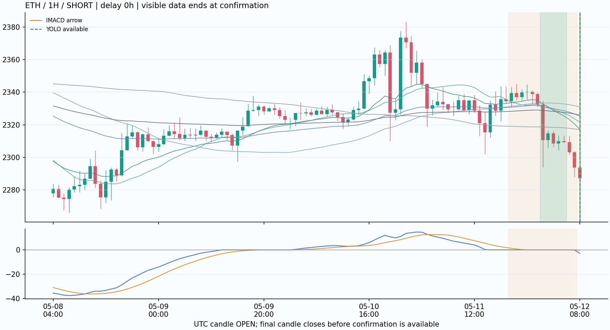
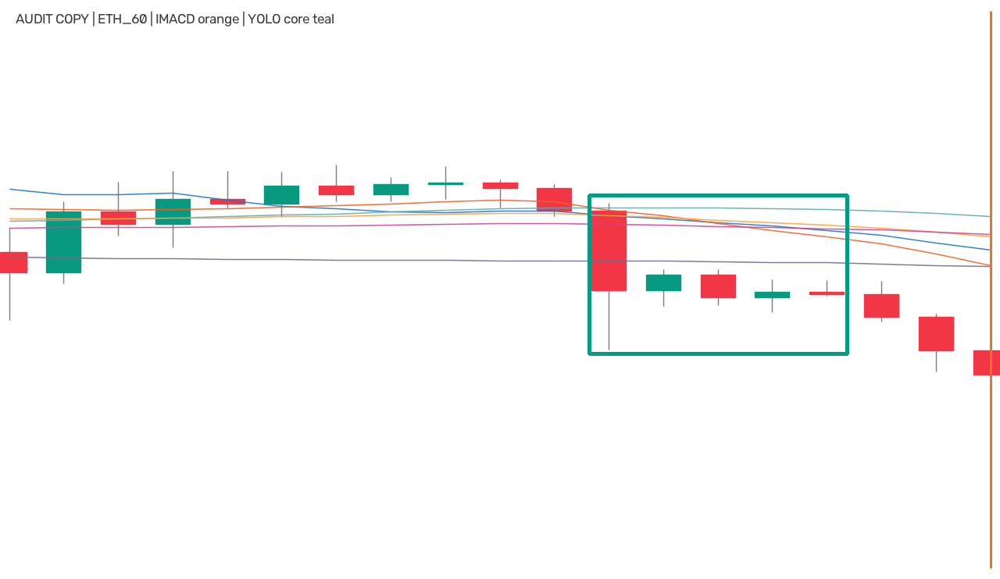
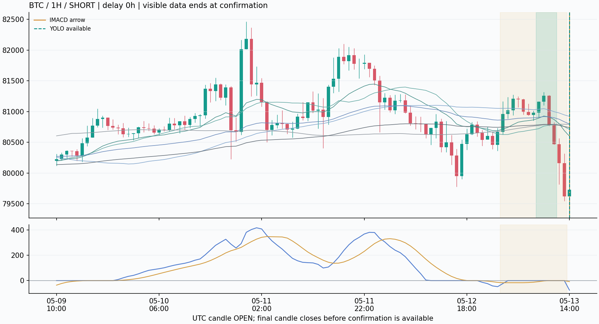
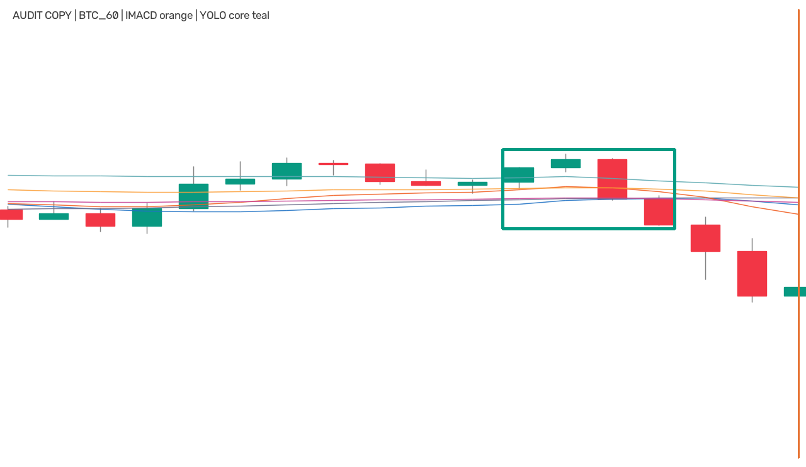

# IMACD → YOLO 的1H/4H迁移：先核对确认与等待时钟

本轮读取冻结1H/4H推理台账，BTC、ETH合计14个原始箭头，模型确认5个，保留率35.71%。其中4个在原箭头收盘即可确认，1个需要等待，0个因数据末端缺少完整随访而截断。**这些数字描述候选筛选与确认延迟，不能称为真正噪音减少、预测准确率或盈利改善。**

确认方向为多头0、空头5；实际非零等待为5小时，最不利的沿方向追价为0.8961%。本次确认集中在空头时，不能据此声称能抓住Owner截图中的多头大启动。4H没有足够候选时，应将“没有原箭头”与“有箭头但模型没有确认”分开解释。

这次把原生15m研究模型直接用于完整聚合的1H/4H图像，没有重新训练。评价区间固定为2026-05-04至2026-07-01 UTC（右开），只用BTC和ETH；三个周期的箭头集合不同，15m旧表仅作工程参照，不能把保留率差异归因为哪个周期更赚钱。

## 新周期逐项结果

| 品种 | 周期 | 原箭头 | 模型确认 | 等待失效 | 到期 | 数据截断 | 保留率 | 最长等待预算 |
|---|---|---:|---:|---:|---:|---:|---:|---:|
| BTC | 1H | 6 | 3 | 0 | 3 | 0 | 50.00% | 9h |
| BTC | 4H | 0 | 0 | 0 | 0 | 0 | N/A | 36h |
| ETH | 1H | 6 | 2 | 0 | 4 | 0 | 33.33% | 9h |
| ETH | 4H | 2 | 0 | 0 | 2 | 0 | 0.00% | 36h |

基线放行所有原始IMACD可见focusRelease；试验追加同一个冻结YOLO确认规则。失效、到期和截断是程序状态，均不是人工标注的错误行情。存在截断时，完整随访子集的结果不能冒充所有实时可用候选的结论。

## 与已保存15m试验并列

| 品种 | 周期 | 原箭头 | 模型确认 | 等待失效 | 到期 | 数据截断 | 保留率 | 最长等待预算 |
|---|---|---:|---:|---:|---:|---:|---:|---:|
| BTC | 15m | 23 | 3 | 5 | 15 | 0 | 13.04% | 2.25h |
| ETH | 15m | 26 | 9 | 4 | 13 | 0 | 34.62% | 2.25h |

已保存15m summary SHA：`1e93a4b8cb4d667806dd694ce0f3067169b79f13fa8b3e619948947ae885c521`。这里只读取旧汇总，未重跑15m推理。 旧说明见[15m工程报告](/Users/zhangzc/fable-trading/analysis/html/p1_imacd_yolo_confirmation_20260908.html)。本报告不改写其历史数字或结论。

## 时间预算与跨周期含义

箭头p收盘后，可检查p至p+9共10个收盘端点，最多实际等待9根本周期K线：1H为9小时，4H为36小时。按第一次满足条件的确认端点记录，不能挑后面更好看的框或价格。等待中md回零、反向或未知就永久作废；对应核心必须为4/5根，核心后2–9根，与原冻结蓄势区加箭头存在真实K线交集。这种交集不等于人工确认了同一形态。

| 时间结构 | 15m旧试验 | 1H迁移 | 4H迁移 |
|---|---:|---:|---:|
| W18/W19覆盖时长 | 4.5/4.75小时 | 18/19小时 | 72/76小时 |
| 核心4/5根 | 1/1.25小时 | 4/5小时 | 16/20小时 |
| 核心后2–9根 | 0.5–2.25小时 | 2–9小时 | 8–36小时 |
| 箭头后最多等待 | 2.25小时 | 9小时 | 36小时 |

相同根数不代表相同市场时间尺度。模型原生训练域为15m，跨周期可能有形态、波动和事件频率分布变化；本次只评价直接迁移的工程行为，没有证明该权重已经适配1H/4H。9根等待预算事前固定，未搜索最优值。

模型权重SHA：`862705b999594355c1133640acc540f4de19b561889e89d9e050ddad5c6db838`；推理源码冻结commit：`53a6d7c611a53b0619c0f0875279b36c43eb02a2`。图像由训练同源白底K线与close源六均线渲染，不是TradingView界面截图。沿用W18/W19、conf0.25、NMS0.70、imgsz1280及冻结推理配置；conf不是行情成功概率。接口背景见[Ultralytics官方predict文档](https://docs.ultralytics.com/modes/predict/)。本报告没有加载模型或调用predict。

## 确认明细：价格位移不是盈亏

| 品种/周期/方向 | 原箭头收盘（北京） | 模型确认（北京） | 等待 | 原次开盘 | 确认次开盘 | 沿方向位移 | conf |
|---|---|---|---:|---:|---:|---:|---:|
| ETH/1H/空 | 05-12 17:00 | 05-12 17:00 | 0h | 2287.11 | 2287.11 | -0.0000% | 0.445 |
| BTC/1H/空 | 05-13 23:00 | 05-13 23:00 | 0h | 79727.4 | 79727.4 | -0.0000% | 0.464 |
| BTC/1H/空 | 05-23 04:00 | 05-23 04:00 | 0h | 75830.4 | 75830.4 | -0.0000% | 0.826 |
| ETH/1H/空 | 05-23 04:00 | 05-23 04:00 | 0h | 2064.72 | 2064.72 | -0.0000% | 0.297 |
| BTC/1H/空 | 06-01 15:00 | 06-01 20:00 | 5h | 73109 | 72453.9 | +0.8961% | 0.336 |

沿方向位移为 `side × (确认后下一开盘 / 原箭头后下一开盘 − 1)`。正值表示等待后沿信号方向更贵，负值表示更便宜；不是已实现利润或盘口滑点。新确认的可用时间是实际检测窗右端K线的收盘，不回填到原箭头，也不沿用原箭头价格。离线完整随访筛选不能直接复制到实时循环：在线应在当时已知数据上确认或继续等待。

## 条件化方向零假设

| 周期 | 有效候选的真实同向确认 | 方向打乱次数 | 随机均值 | 单侧p | Holm p |
|---|---:|---:|---:|---:|---:|
| 1H | 5 | 10000 | 3.598 | 0.100090 | 0.200180 |
| 4H | 0 | 10000 | 0.000 | 1.000000 | 1.000000 |

对每个周期，固定原箭头方向下的md有效时间池与模型几何池，在同币同月内打乱箭头方向；两个周期的p由冻结程序进行Holm校正。这检验的是条件化方向关联，**不检验真假形态、未来趋势、盈利或去噪成功**。两套信号都由价格与均线生成，存在机械相关的可能。空候选、空确认或缺少方向可交换性时，应按台账记录解释；不能用小p替代独立人工金标。

## 数据、授权与指标适用范围

| 输入 | 聚合周期 | 已解析完整K线 | 首根UTC | 末根UTC | 推理窗口 | 源15m缓存 |
|---|---|---:|---|---|---:|---|
| BTC_60 | 1H | 39345 | 2022-01-03T15:00:00+00:00 | 2026-06-30T23:00:00+00:00 | 120 | `data/kline_deep/okx_BTC_USDT_SWAP_15m_158499.csv` |
| BTC_240 | 4H | 9836 | 2022-01-03T16:00:00+00:00 | 2026-06-30T20:00:00+00:00 | 0 | `data/kline_deep/okx_BTC_USDT_SWAP_15m_158499.csv` |
| ETH_60 | 1H | 39344 | 2022-01-03T16:00:00+00:00 | 2026-06-30T23:00:00+00:00 | 120 | `data/kline_deep/okx_ETH_USDT_SWAP_15m_158499.csv` |
| ETH_240 | 4H | 9836 | 2022-01-03T16:00:00+00:00 | 2026-06-30T20:00:00+00:00 | 40 | `data/kline_deep/okx_ETH_USDT_SWAP_15m_158499.csv` |

源15m缓存按时间戳读取到固定结束点，UTC仅聚合完整1H/4H组；较早历史用于递归指标播种，候选评价仅在固定区间内。模型训练血缘、聚合摘要、模型输入像素SHA及逐端点轨迹保留在实验台账，供后续独立审核。各周期是独立配置；依据Owner既有“任何时间段数据都可以使用不要有任何限制”的明确授权，**这是1H迁移配置第1次消耗holdout，也是4H迁移配置第1次消耗holdout**。这些市场时间此前已被研究接触，不能称全新盲测；本轮没有依据结果换权重、阈值、等待预算或品种。

BTC4H本轮无原始箭头，因此按条件化流程未触发模型；ETH4H两条候选共检查40张W18/W19输入，阈值0.25以上的原始模型框为0，未确认不是被后续方向或失效门删掉。推理期间现装Ultralytics对half参数、pandas对空组拼接给出弃用提示，均正常完成，未更换版本、设备或数据源。

确认率不是有标签正类率；没有新增监督训练，val样本数不适用。没有真假金标，AUC、accuracy、precision、recall均不适用。没有预注册经济退出/仓位合同，因此成本、TP/SL、胜率、净收益、最大回撤、top-decile毛净收益、经济匹配随机入场均为N/A。上述方向打乱是本工程任务的零假设对照，不代替经济对照。单规则基线为原始IMACD全部箭头。

## 可复现案例：每周期按时间取前两条确认

只显示截至模型实际消耗端点的K线；浅橙区是冻结蓄势段，橙线为原箭头、青色虚线为模型确认，青色区域为检测核心。模型原始输入与审核注释副本分开保存，前者逐张验证像素SHA。没有确认的周期不挑选替代成功案例。

### 1H


**ETH_60_1778572800**





[无注释模型原始输入](/Users/zhangzc/fable-trading/experiments/active/exp-imacd-yolo-timeframes-20260908-v1/results/examples/ETH_60_1778572800_input.png)；像素SHA `f1309fd6590a1016eb2dce58a7a927096ad8481f4e2214993e06e866781ff032`。

**BTC_60_1778680800**





[无注释模型原始输入](/Users/zhangzc/fable-trading/experiments/active/exp-imacd-yolo-timeframes-20260908-v1/results/examples/BTC_60_1778680800_input.png)；像素SHA `fb23909172852fd8ac09a7ac968523aa1c8b48d9e9e4f6236b211d281646bd29`。

### 4H

本周期没有确认事件，不生成示例图。

## 验证回执与复现

冻结运行的内置验证回执原文如下；没有将其冒称独立审核，也不从代码存在推断测试通过数量。

```json
{
  "BTC_60": {
    "passed": true,
    "confirmed_events_checked": 3,
    "identities_unique": true,
    "clock_geometry_price_invariants": true
  },
  "BTC_240": {
    "passed": true,
    "confirmed_events_checked": 0,
    "identities_unique": true,
    "clock_geometry_price_invariants": true
  },
  "ETH_60": {
    "passed": true,
    "confirmed_events_checked": 2,
    "identities_unique": true,
    "clock_geometry_price_invariants": true
  },
  "ETH_240": {
    "passed": true,
    "confirmed_events_checked": 0,
    "identities_unique": true,
    "clock_geometry_price_invariants": true
  }
}
```

已保存独立复核收据（以下为文件原文，不新增通过数量）：

```json
{
  "source_commit": "53a6d7c611a53b0619c0f0875279b36c43eb02a2",
  "checks": {
    "frozen_configuration": true,
    "hash_manifest_covers_saved_ledgers": true,
    "saved_ledger_hashes": true,
    "combined_candidates_matches_parts": true,
    "combined_decisions_matches_parts": true,
    "combined_trace_matches_parts": true,
    "candidate_decision_frozen_fields": true,
    "unique_event_detection_trace_identities": true,
    "trace_event_set": true,
    "decision_boolean_fields": true,
    "candidate_integer_fields": true,
    "proposal_integer_fields": true,
    "proposal_structure_and_model_values": true,
    "trace_integer_fields": true,
    "trace_prices_finite_positive": true,
    "summary_group_coverage": true,
    "BTC_60/group_identity": true,
    "BTC_60/metadata_clock_and_partial_groups": true,
    "BTC_60/candidate_clock_identity_setup": true,
    "BTC_60/complete_followup_boundary": true,
    "BTC_60/proposal_endpoint_clock_and_counts": true,
    "BTC_60/trace_clock_bounds": true,
    "BTC_60/trace_coverage_and_signal_price": true,
    "BTC_60/first_invalid_from_trace": true,
    "BTC_60/censoring": true,
    "BTC_60/direction_pools": true,
    "BTC_60/status_and_first_match": true,
    "BTC_60/confirmation_clock_geometry": true,
    "BTC_60/next_open_trace_prices": true,
    "BTC_60/summary_table": true,
    "BTC_60/reported_validation_count": true,
    "BTC_240/group_identity": true,
    "BTC_240/metadata_clock_and_partial_groups": true,
    "BTC_240/candidate_clock_identity_setup": true,
    "BTC_240/complete_followup_boundary": true,
    "BTC_240/proposal_endpoint_clock_and_counts": true,
    "BTC_240/trace_clock_bounds": true,
    "BTC_240/trace_coverage_and_signal_price": true,
    "BTC_240/first_invalid_from_trace": true,
    "BTC_240/censoring": true,
    "BTC_240/direction_pools": true,
    "BTC_240/status_and_first_match": true,
    "BTC_240/confirmation_clock_geometry": true,
    "BTC_240/next_open_trace_prices": true,
    "BTC_240/summary_table": true,
    "BTC_240/reported_validation_count": true,
    "ETH_60/group_identity": true,
    "ETH_60/metadata_clock_and_partial_groups": true,
    "ETH_60/candidate_clock_identity_setup": true,
    "ETH_60/complete_followup_boundary": true,
    "ETH_60/proposal_endpoint_clock_and_counts": true,
    "ETH_60/trace_clock_bounds": true,
    "ETH_60/trace_coverage_and_signal_price": true,
    "ETH_60/first_invalid_from_trace": true,
    "ETH_60/censoring": true,
    "ETH_60/direction_pools": true,
    "ETH_60/status_and_first_match": true,
    "ETH_60/confirmation_clock_geometry": true,
    "ETH_60/next_open_trace_prices": true,
    "ETH_60/summary_table": true,
    "ETH_60/reported_validation_count": true,
    "ETH_240/group_identity": true,
    "ETH_240/metadata_clock_and_partial_groups": true,
    "ETH_240/candidate_clock_identity_setup": true,
    "ETH_240/complete_followup_boundary": true,
    "ETH_240/proposal_endpoint_clock_and_counts": true,
    "ETH_240/trace_clock_bounds": true,
    "ETH_240/trace_coverage_and_signal_price": true,
    "ETH_240/first_invalid_from_trace": true,
    "ETH_240/censoring": true,
    "ETH_240/direction_pools": true,
    "ETH_240/status_and_first_match": true,
    "ETH_240/confirmation_clock_geometry": true,
    "ETH_240/next_open_trace_prices": true,
    "ETH_240/summary_table": true,
    "ETH_240/reported_validation_count": true,
    "60/conditional_direction_null": true,
    "240/conditional_direction_null": true,
    "holm_two_timeframes": true
  },
  "n_checks": 79,
  "all_passed": true,
  "failed_checks": [],
  "n_events": 14,
  "n_proposals": 29,
  "n_trace_rows": 154,
  "n_confirmed": 5,
  "statuses": {
    "expired": 9,
    "confirmed": 5
  },
  "replay_failures": {
    "BTC_60": {},
    "BTC_240": {},
    "ETH_60": {},
    "ETH_240": {}
  },
  "direction_null_recomputed": {
    "60": {
      "observed": 5,
      "permutations": 10000,
      "seed": 20260908,
      "null_mean": 3.5981,
      "null_sd": 0.7587993081177657,
      "p_one_sided": 0.10008999100089991,
      "p_holm": 0.20017998200179982
    },
    "240": {
      "observed": 0,
      "permutations": 10000,
      "seed": 20260908,
      "null_mean": 0.0,
      "null_sd": 0.0,
      "p_one_sided": 1.0,
      "p_holm": 1.0
    }
  },
  "reused_core_confirmations": 0,
  "trace_replay_coverage": {
    "complete_events": 14,
    "censored_events": 0,
    "events_with_observed_invalidation": 0,
    "invalidated_events": 0,
    "confirmed_before_later_invalidation": 0
  },
  "limitations": [
    "Saved traces independently support md invalidation, direction pools, earliest confirmation and next-open price joins; the raw source is not re-read.",
    "Frozen setup boundaries are checked across ledgers and by index arithmetic. Pre-signal md/sb/ATR/focus history is absent, so original focusRelease is not independently recomputed.",
    "Aggregation metadata and trace clocks are checked, but raw OHLCV aggregation, MA history, input pixels and YOLO predictions are not independently reproduced.",
    "Direction permutation and Holm adjustment quantify conditional label association. They do not establish profitability, launch accuracy or fewer false alerts.",
    "Incomplete-follow-up candidates follow the frozen whole-event censoring policy, including when an early confirmation might already have been observable.",
    "No saved candidate has an observed md invalidation in this run; permanent-invalidation branches remain supported by code and synthetic tests only."
  ]
}
```

首次推理仅供尚无运行收据的相同环境：

```bash
cd /Users/zhangzc/fable-trading
.venv/bin/python -m yoyo.evaluation.imacd_yolo_timeframes
.venv/bin/python -m yoyo.evaluation.imacd_yolo_timeframes_verify
.venv/bin/python -m yoyo.evaluation.imacd_yolo_timeframes_report
```

当前结果复核与重新生成报告只运行后两条Python命令。校验器读取保存轨迹，报告先校验台账SHA，案例再校验聚合OHLCV摘要和输入像素SHA，不再次推理。报告源码必须先提交；生成MD后立即用仓库scripts/md_to_html.py转换HTML。原始缓存、权重和大型轨迹数据不入git，由来源路径与摘要定位。

## 风险与诚实声明

- 只覆盖两个品种和已暴露历史中的固定区间，不代表全OKX或未来分布；1H/4H确认数少时尤其不能推广。
- 未评估删掉的箭头是否包含大行情，保留率更低既可能过滤无用候选，也可能漏掉机会。
- 更长周期把同样9根等待放大为9或36小时；理论可用时钟不含Mac扫描、推理、网络与通知延迟，尚未做全市场容量或影子在线验收。
- 模型与IMACD共有价格/均线输入；条件化方向关联不足以证明独立增益，框交集不足以证明语义同一。
- 后续如评估经济价值，需要先固定独立入场、退出、成本与样本规则。本轮不设新TP/SL，也不宣称优于原系统。
- TradingView、spike、Mac监控、TG/Bark、ACTIVE和执行配置均不在本报告写入范围；training_eligible=false，production_eligible=false。

## 下一步

工程轨迹复核见上方实际收据；后续应人工审核保留与删除的候选，区分语义一致性与仅有几何交集。4H样本覆盖不足需要独立冻结的新样本才能扩展结论；不能在本次固定试验里临时改阈值追求出框。上线或经济验证需要先明确合同，不能因为确认数下降就改通知门。
