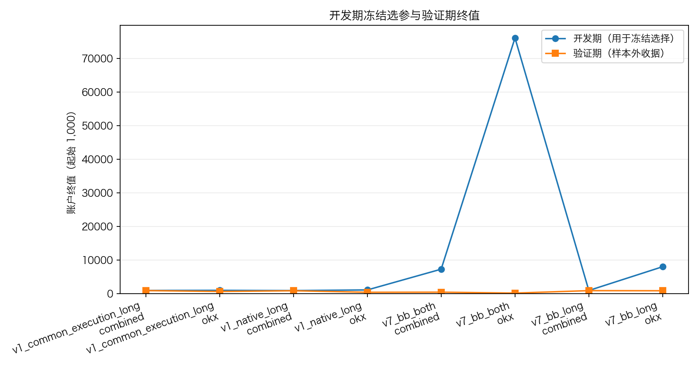
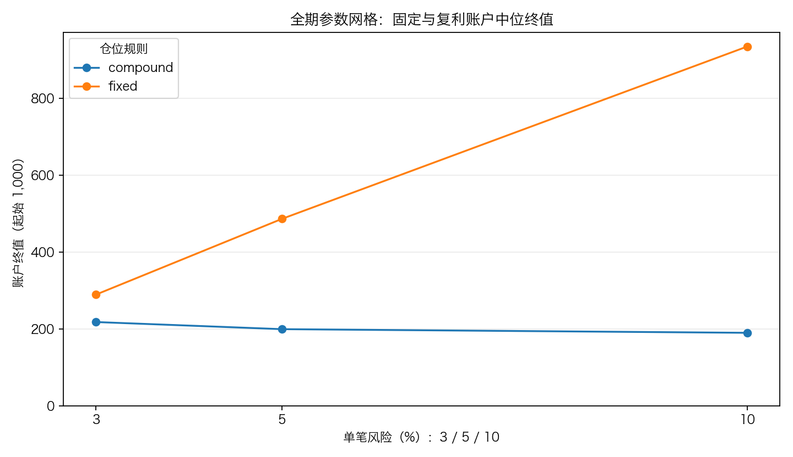
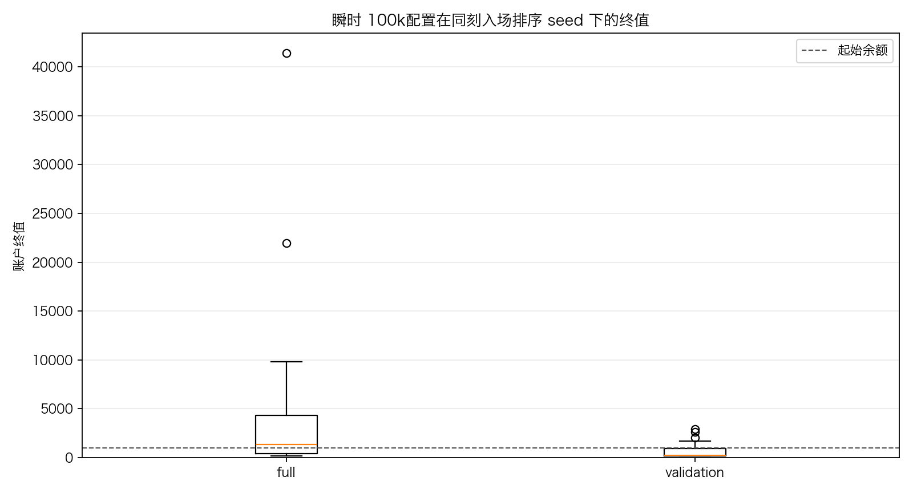
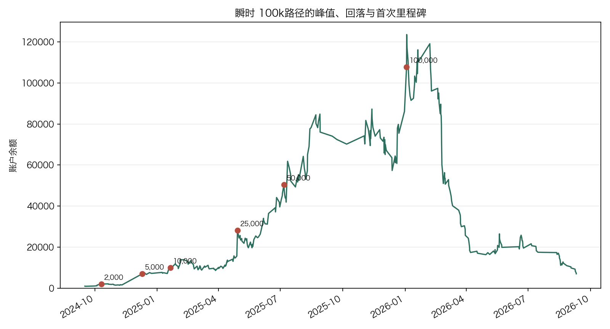
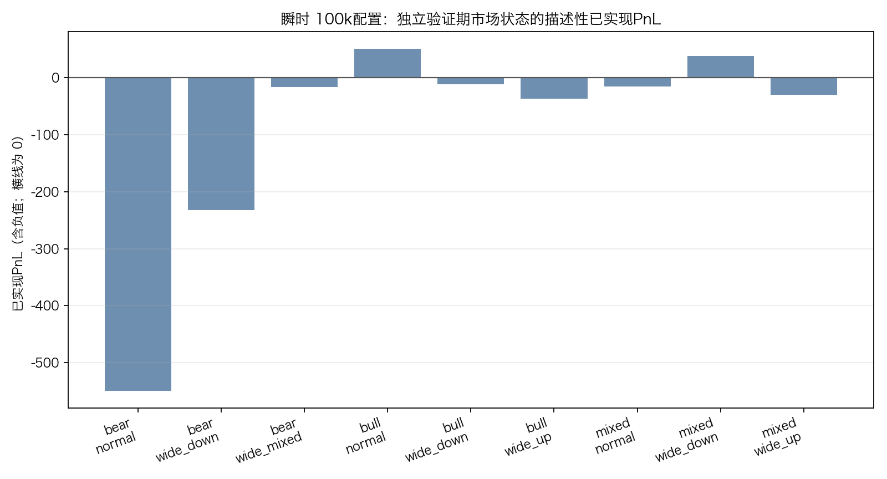

# SPIKE 账户冻结回放技术报告

## 数据质量、范围与完整重现

本报告只读取 `--result` 与 `--post` 中 manifest 固定的 CSV。生成前已校验 replay 的 5 个输出、post 的 14 个输出的 SHA-256，并校验二者关联。两个源文件共有 1,155,780 行，载入相关交易 174,281 行；账户网格 576 条，保留 accepted 95,360 行。源 entry 时间范围为 2024-09-10T00:00:00+00:00 至 2026-09-09T23:30:00+00:00；起始余额 1,000.00。holdout 授权记录：本配置 **第 1 次** 消耗 holdout，报告只描述冻结结果。

```bash
python3 -m yoyo.evaluation.spike_account_growth_study --output experiments/active/exp-spike-account-growth-20260913-v1/results/reproduce_full_v1 --seed 0
python3 -m yoyo.evaluation.spike_account_growth_post --result experiments/active/exp-spike-account-growth-20260913-v1/results/reproduce_full_v1 --output experiments/active/exp-spike-account-growth-20260913-v1/results/reproduce_post_v2
python3 -m yoyo.evaluation.spike_account_growth_report --result experiments/active/exp-spike-account-growth-20260913-v1/results/reproduce_full_v1 --post experiments/active/exp-spike-account-growth-20260913-v1/results/reproduce_post_v2 --report analysis/p1_spike_account_growth_20260913.md --figures analysis/figures/p1_spike_account_growth_20260913
python3 scripts/md_to_html.py analysis/p1_spike_account_growth_20260913.md --out-dir analysis/html
```

上面的 `reproduce_*` 必须是新的空目录；冻结输入目录只读，禁止把重现输出写回 `experiments/active/exp-spike-account-growth-20260913-v1/results/full_v1` 或 `experiments/active/exp-spike-account-growth-20260913-v1/results/post_v2`。

## 方法与独立 validation 结果

开发期只冻结每个 source-arm × venue 的一个参数；validation 是独立余额、独立准入路径的收据。8/8 development-selected 配置的 validation 终值低于 1,000.00，0/8 持平，0/8 高于起始余额，0/8 达到 100,000。full 不能拼接 development+validation：余额会改变仓位、风险上限和候选准入。

| 策略臂 | 场所 | 周期 | 仓位 | 风险 | 开发终值 | 验证终值 | 全期终值 |
| --- | --- | --- | --- | --- | --- | --- | --- |
| v1_common_execution_long | combined | 30m | fixed | 10.00% | 988.62 | 947.21 | 988.62 |
| v1_common_execution_long | okx | 240m | fixed | 5.00% | 1,019.14 | 676.03 | 760.92 |
| v1_native_long | combined | 60m | fixed | 10.00% | 953.86 | 896.65 | 953.86 |
| v1_native_long | okx | 240m | compound | 5.00% | 1,135.34 | 440.21 | 585.45 |
| v7_bb_both | combined | allm | fixed | 5.00% | 7,307.56 | 472.73 | 4,019.55 |
| v7_bb_both | okx | allm | compound | 5.00% | 76,049.27 | 199.41 | 7,083.56 |
| v7_bb_long | combined | 30m | fixed | 10.00% | 973.33 | 932.30 | 973.33 |
| v7_bb_long | okx | 240m | fixed | 10.00% | 8,044.32 | 895.91 | 10,510.49 |



本报告不训练分类器，也不产生排序分数，因此 val AUC、top-decile 毛/净收益和单特征基线不适用，不能编造。对应的零假设证据使用上游同币、同月、同波动桶的匹配随机入场，并在后文逐周期列出净 R 差与月块 sign-flip p；共享账户层另用 32 个不读取结果的同刻排序 seed 检查容量路径敏感性。

## 3/5/10 风险网格与不批准结论

| 仓位 | 风险 | 路径数 | 中位终值 | 最好终值 | 最差终值 | 达 100k | 中位已实现回撤 |
| --- | --- | --- | --- | --- | --- | --- | --- |
| compound | 3.00% | 32 | 217.64 | 9,228.47 | 182.03 | 0 | 84.08% |
| compound | 5.00% | 32 | 199.10 | 7,083.56 | 181.05 | 1 | 84.66% |
| compound | 10.00% | 32 | 189.61 | 7,693.68 | 179.00 | 0 | 85.39% |
| fixed | 3.00% | 32 | 288.85 | 4,066.61 | 269.03 | 0 | 76.76% |
| fixed | 5.00% | 32 | 486.01 | 8,018.43 | 452.98 | 0 | 60.06% |
| fixed | 10.00% | 32 | 934.26 | 10,510.49 | 894.10 | 0 | 21.43% |



本轮没有任何 3% / 5% / 10% 风险配置可批准为实盘。fixed 10% 的单笔目标风险为 10%，组合初始风险上限为 10.00%，通常只能持有一仓；亏损后固定风险额仍按初始余额计算，可能高于当时可用额度，因而无法继续开仓。这是账户准入机制，不能作策略因果解释。

表中每个风险档的 32 条是 4 个策略口径 × 2 个场所范围 × 4 个周期范围形成的结构路径，不是 32 次独立市场试验。它们共享大量底层行情，表中位数只能描述网格，不能当作抽样置信度。

达到 100 倍的纯算术门槛如下：假定每一次都是连续净 +1R，复利账户余额每次乘以 `1+r`，fixed 风险账户则累计每次 `r` 倍初始余额。它只是算术，不是概率、胜率或预测；上面的独立 validation 失败正是不能把该门槛当成可达性证据的原因。

| 单笔风险 | 复利：连续净+1R次数 | fixed：累计净R |
| --- | --- | --- |
| 3.00% | 156 | 3,300R |
| 5.00% | 95 | 1,980R |
| 10.00% | 49 | 990R |

## 两种历史“最佳”必须分开

raw full hindsight 的最高**终值**路径为 `0255_v7_bb_long_okx_240_full_fixed_10pct`：`v7_bb_long` / okx / 4H / fixed 10.00%，终值 10,510.49。其最大单笔为 XRP 50.06R（账户 PnL 5,006.20）；它没有达到 100,000。

瞬时 100k的详细路径为 `0419_v7_bb_both_okx_all_full_compound_5pct`（seed=0）：峰值 123,534.27，终值 7,083.56，最大已实现回撤 94.27%。 这不是最高终值，也不能被写成“实现 100 倍”。同一冻结配置在排序 seed 中，full 有 2/32 曾触及 100k，validation 为 0/32。

| 周期 | seed数 | 曾达100k | 终值中位数 | 最高峰值 | 最大已实现回撤 |
| --- | --- | --- | --- | --- | --- |
| full | 32 | 2 | 1,332.86 | 123,534.27 | 98.34% |
| validation | 32 | 0 | 260.96 | 4,967.02 | 91.26% |



## 瞬时 100k的北京日链路

瞬时 100k路径的最高已实现 PnL 日为北京时间 2026-01-03：日初 86,106.78，3 笔合计 37,427.49，日终 123,534.27；账户峰值也落在 2026-01-03。以下逐笔从冻结 `accepted_ledger.csv.gz` 按实际 exit 时间换算北京日期得到，只解释该日账面链路。

| 资产 | 方向 | 周期(分) | 入场UTC | 退出UTC | 账户R | 已实现PnL | 退出后余额 |
| --- | --- | --- | --- | --- | --- | --- | --- |
| ACT | 空 | 30 | 2025-12-31 00:00:00+00:00 | 2026-01-03 02:00:00+00:00 | 5.04 | 21,698.63 | 107,805.41 |
| PUMP | 多 | 30 | 2025-12-31 01:30:00+00:00 | 2026-01-03 07:00:00+00:00 | 4.988 | 21,475.83 | 129,281.24 |
| SPK | 多 | 30 | 2026-01-03 03:30:00+00:00 | 2026-01-03 07:00:00+00:00 | -1.066 | -5,746.97 | 123,534.27 |



## 周期、市场状态与 post-hoc 线索

| 策略臂 | 周期（分钟/all） | 完整参数格 | 开发中位终值 | validation中位终值 | 开发与validation均盈利 |
| --- | --- | --- | --- | --- | --- |
| v1_common_execution_long | 240 | 12 | 871.73 | 558.70 | 0 |
| v1_common_execution_long | 30 | 12 | 298.77 | 238.86 | 0 |
| v1_common_execution_long | 60 | 12 | 477.23 | 418.03 | 0 |
| v1_common_execution_long | all | 12 | 355.77 | 459.27 | 0 |
| v1_native_long | 240 | 12 | 898.09 | 488.94 | 0 |
| v1_native_long | 30 | 12 | 269.24 | 290.02 | 0 |
| v1_native_long | 60 | 12 | 303.72 | 285.30 | 0 |
| v1_native_long | all | 12 | 328.50 | 469.49 | 0 |
| v7_bb_both | 240 | 12 | 1,437.08 | 896.11 | 5 |
| v7_bb_both | 30 | 12 | 1,074.81 | 256.99 | 0 |
| v7_bb_both | 60 | 12 | 939.08 | 982.27 | 4 |
| v7_bb_both | all | 12 | 7,503.18 | 484.22 | 2 |
| v7_bb_long | 240 | 12 | 1,864.09 | 559.61 | 0 |
| v7_bb_long | 30 | 12 | 321.01 | 236.34 | 0 |
| v7_bb_long | 60 | 12 | 447.44 | 243.27 | 0 |
| v7_bb_long | all | 12 | 370.22 | 470.54 | 0 |

development 与 validation 同时高于起始余额的组合是 11/192；策略臂为 v7_bb_both。这是 post-hoc leads，不能据此选择周期、仓位或上线规则。

| 策略臂 | 场所 | 周期 | 仓位 | 风险 | 开发终值 | 开发MDD | 验证终值 | 验证MDD | 全期终值 |
| --- | --- | --- | --- | --- | --- | --- | --- | --- | --- |
| v7_bb_both | combined | 60 | compound | 3.00% | 1,183.19 | 67.33% | 4,705.87 | 61.94% | 5,917.81 |
| v7_bb_both | okx | 240 | compound | 10.00% | 1,472.93 | 67.38% | 2,581.90 | 19.46% | 7,693.68 |
| v7_bb_both | combined | all | fixed | 3.00% | 2,707.59 | 25.09% | 2,453.82 | 56.03% | 717.02 |
| v7_bb_both | okx | 240 | fixed | 3.00% | 2,957.40 | 15.11% | 1,636.18 | 25.26% | 4,066.61 |
| v7_bb_both | okx | all | fixed | 3.00% | 8,044.00 | 29.77% | 1,628.54 | 78.09% | 2,325.63 |
| v7_bb_both | okx | 60 | fixed | 3.00% | 2,598.54 | 35.78% | 1,496.64 | 60.51% | 2,325.51 |
| v7_bb_both | okx | 240 | fixed | 5.00% | 4,165.04 | 19.27% | 1,436.86 | 18.12% | 5,353.58 |
| v7_bb_both | okx | 240 | compound | 3.00% | 2,641.01 | 46.90% | 1,303.12 | 35.21% | 4,790.82 |
| v7_bb_both | okx | 60 | compound | 3.00% | 1,951.17 | 56.15% | 1,273.29 | 65.73% | 2,850.68 |
| v7_bb_both | okx | 240 | compound | 5.00% | 1,819.01 | 23.32% | 1,213.28 | 20.59% | 3,608.23 |
| v7_bb_both | okx | 60 | compound | 5.00% | 1,075.10 | 80.70% | 1,013.53 | 79.00% | 1,299.03 |

周期证据并不支持 V1 或 V7 纯多头：`v1_common_execution_long`、`v1_native_long` 与 `v7_bb_long` 都是 0 个开发/验证双正组合。11 个事后线索全部来自 `v7_bb_both`，其中 4H 有 5 个、1H 有 4 个、跨周期有 2 个、30m 为 0；但 V7 双向 4H 的匹配随机差为 -0.155R、p=0.9747，因此“4H 表内最好”仍不是已验证的信号优势。

市场状态来自已完成 BTC/ETH 4H，宽度不含结果标签。下表只描述历史瞬时 100k配置 `0431_v7_bb_both_okx_all_validation_compound_5pct` 在独立 validation 的联合分层，不能推断状态导致结果。该配置 validation 从 1,000U 降到 199.41；任何看似盈利的局部状态都没有救活整个账户。

| 市场状态 | 宽度 | 平仓数 | 胜数 | 胜率 | 已实现PnL |
| --- | --- | --- | --- | --- | --- |
| bear | normal | 60 | 19 | 31.67% | -549.51 |
| bear | wide_down | 15 | 2 | 13.33% | -231.91 |
| bear | wide_mixed | 2 | 1 | 50.00% | -16.17 |
| bull | normal | 14 | 4 | 28.57% | 50.82 |
| bull | wide_down | 4 | 1 | 25.00% | -10.90 |
| bull | wide_up | 2 | 0 | 0.00% | -36.65 |
| mixed | normal | 22 | 7 | 31.82% | -15.48 |
| mixed | wide_down | 8 | 5 | 62.50% | 38.55 |
| mixed | wide_up | 2 | 0 | 0.00% | -29.33 |

合并宽度后，市场状态表现如下。bear 的历史损失集中并不自动产生一个可交易过滤器；bull 也没有稳定盈利，必须先冻结规则再用新数据验证。

| 市场状态 | 平仓数 | 胜率 | 已实现PnL |
| --- | --- | --- | --- |
| bear | 77 | 28.57% | -797.59 |
| bull | 20 | 25.00% | 3.27 |
| mixed | 32 | 37.50% | -6.26 |



同一 validation 路径按北京时间入场小时、星期和月份做了最低 5 笔的事后切片。下表只展示各维度平均账户 R 的最高/最低桶，用于证明周期漂移存在；它不能用于删除亏损时段。

| 维度 | 排名 | 桶 | 平仓数 | 胜率 | 平均账户R | 已实现PnL |
| --- | --- | --- | --- | --- | --- | --- |
| 小时 | 最高 | 14 | 5 | 60.00% | 0.4753 | 50.58 |
| 小时 | 最低 | 16 | 7 | 14.29% | -0.8273 | -124.52 |
| 星期 | 最高 | Wednesday | 22 | 36.36% | 0.3525 | -1.54 |
| 星期 | 最低 | Friday | 10 | 20.00% | -0.6809 | -122.98 |
| 月份 | 最高 | 2025-12 | 19 | 47.37% | 0.8087 | 250.14 |
| 月份 | 最低 | 2026-02 | 24 | 20.83% | -0.6303 | -275.84 |

## V1/V7 合同性与 matched control

共同 next-open / shared-exit 的 V1/V7 可公平横比；原 V1 native exit 是非公平历史口径。matched control 是事件层参考而非共享账户模拟；0/9 个 CSV p 值低于 0.01，故没有一项通过 p<0.01 门槛。

| 策略臂 | 口径 | full路径数 | 中位终值 | 最高终值 |
| --- | --- | --- | --- | --- |
| v1_common_execution_long | 公平：共同 next-open / shared exit | 48 | 293.90 | 988.62 |
| v1_native_long | 非公平：原 V1 原生退出 | 48 | 308.08 | 986.17 |
| v7_bb_both | 公平：共同 next-open / shared exit | 48 | 948.62 | 10,288.87 |
| v7_bb_long | 公平：共同 next-open / shared exit | 48 | 285.39 | 10,510.49 |

| 变体 | 周期（分） | 匹配月数 | 配对净R差 | 月块 sign-flip p |
| --- | --- | --- | --- | --- |
| v1_common_execution_long | 30.0 | 25 | 0.1309 | 0.1382 |
| v1_common_execution_long | 60.0 | 25 | 0.1397 | 0.4222 |
| v1_common_execution_long | 240.0 | 25 | -0.4734 | 0.9861 |
| v7_bb_both | 30.0 | 25 | 0.08835 | 0.0187 |
| v7_bb_both | 60.0 | 25 | 0.06682 | 0.0416 |
| v7_bb_both | 240.0 | 25 | -0.155 | 0.9747 |
| v7_bb_long | 30.0 | 25 | 0.1144 | 0.0826 |
| v7_bb_long | 60.0 | 25 | 0.07433 | 0.1268 |
| v7_bb_long | 240.0 | 25 | -0.2679 | 0.9924 |

## 限制与下周方案

- 回放是冻结 ledger 的现金簿模拟，不含真实成交、完整 funding、保证金、清算和滑点分布；full、development、validation 因余额和准入路径依赖不可相加。
- OKX 官方说明杠杆会同时放大盈利与亏损，保证金与清算约束会改变真实存活路径；永续资金费率通常按 8 小时结算，也可能改为 1、2 或 4 小时。本回放没有完整模拟这些机制，不能把“bankrupt=0”解释成实盘不会爆仓：[杠杆与保证金](https://www.okx.com/en-gb/help/understanding-leverage-futures-and-margin)、[永续合约](https://www.okx.com/en-gb/help/i-perpetual-swaps)、[资金费率机制](https://www.okx.com/en-sg/help/perps-funding-fee-mechanism)。
- 瞬时 100k、最高终值、最大单笔和北京日链路都是 hindsight 描述；禁止据此改阈值、风险或生产配置。
- 下周的可执行结论是先保住这 1,000U：登记本轮为 rejected，保持配置冻结，不以 3%/5%/10% 风险实盘。若必须冻结一个研究候选，只提名事后表现相对一致的 `v7_bb_both / OKX / 4H / fixed 5%初始余额`：开发终值 4,165.04、验证终值 1,436.86，对应已实现 MDD 19.27% / 18.12%；它的事件层匹配对照仍失败，所以只能做前向纸面验证。必须沿用相同账户约束、记录所有拒单，并以至少 100 笔新鲜平仓和匹配账户对照作为裁决；风险、阈值或生产切换仍需 owner 另行批准。
