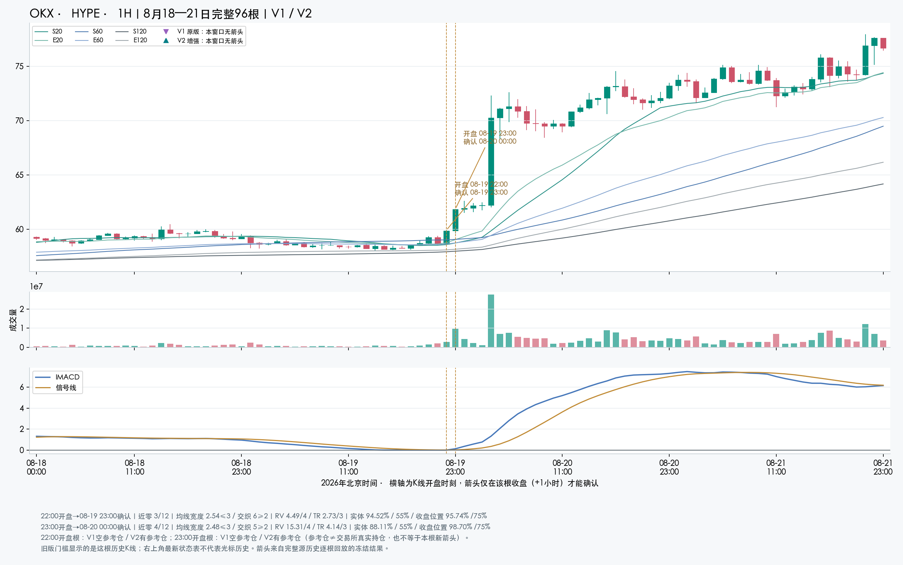
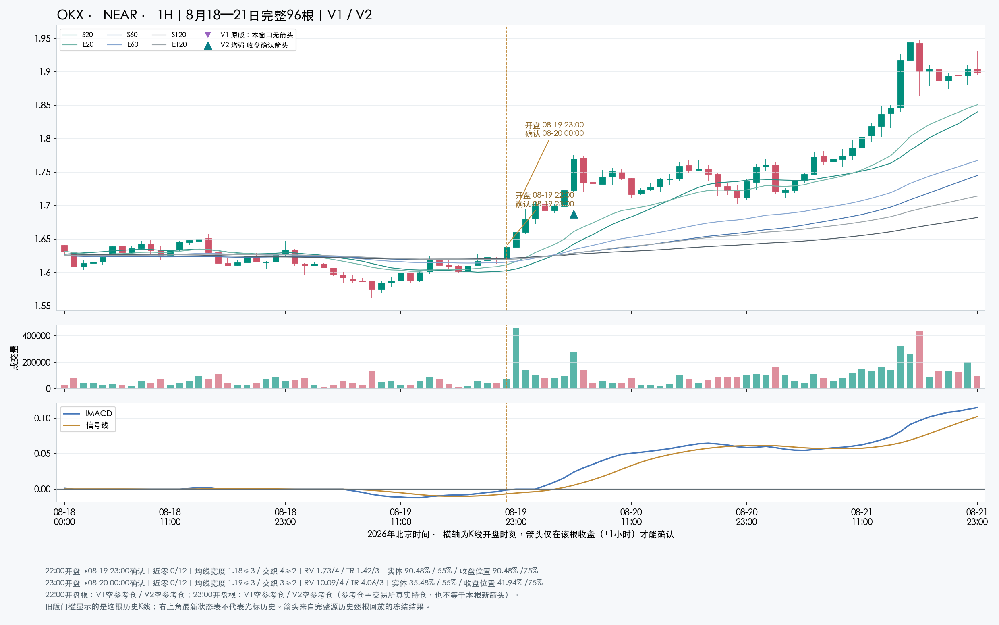
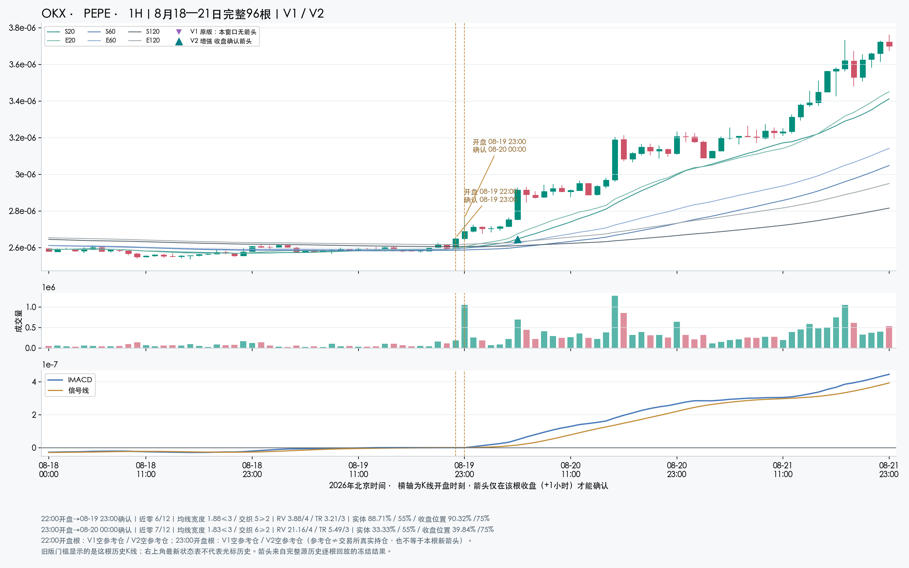
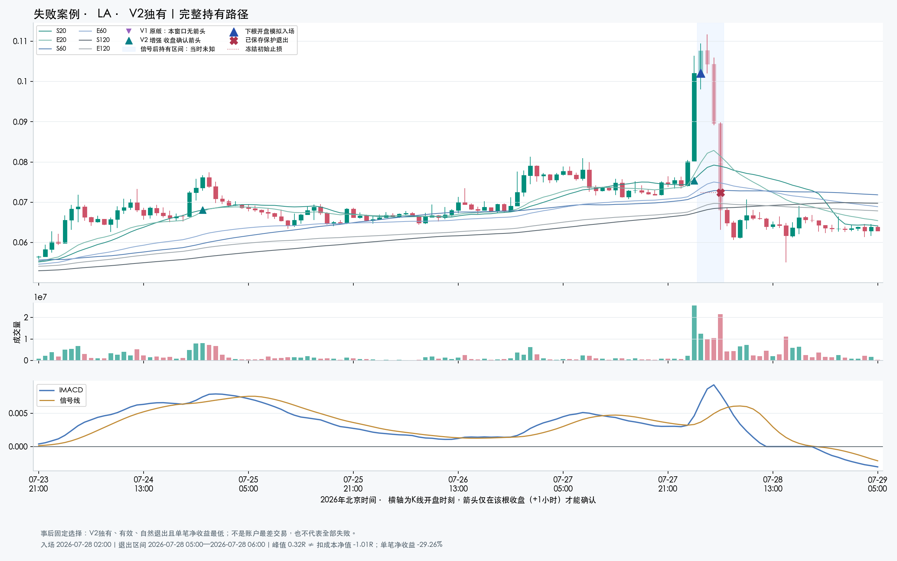

# SPIKE V2：渐进启动补漏与全池召回验证

## 结论与80%目标

V2 在**最多延后1根收盘确认**的主口径下，召回 10.84%（180/1660）；V1为 0.84%（14/1660）。**尚未达到80%目标。**这个分母来自全池独立价格事件，不是三张成功截图，也不是全部上涨币种。

当晚按北京时间确认时刻区间 **[8/19 18:00, 8/20 06:00)**（右端不含）统计，同口径从V1的3.47%（5/144）提高到V2的18.06%（26/144），仍不代表及时覆盖了所有启动。全期箭头从86增至1414；提醒变多必须同时检查精确率和误报，不能只看补到几个案例。

V2的全期事件匹配实际相对随机平均超额为-65.19 bp，两项主检验Holm p=0.436256。**新增路径尚未证明改善盈利。**这是单笔事件对照，不能换算成账户收益。

三个指定漏报的直接原因：

- **HYPE**：量比15.31、TR扩张4.14以及密集/方向/实体已通过，但此前仅4根近零，未达到原版12根资格。
- **NEAR**：主线仍在零轴下恢复（MD=-0.0009593966），虽可高于信号线，但近零仅0根，单根量比1.73、TR扩张1.42也低于4/3门槛。
- **PEPE**：此前近零6根不足12，量比3.88仍小于4；不是只要这根站上均线就一定满足V1资格。

这次增加的是一条**渐进启动**通路：此前12根曾形成六均线密集，当前收盘突破前12根高点并站上六均线；三根净推进≥1.5ATR、累计量比≥1.5、方向效率≥55%，当前收盘位置≥65%，且ZLEMA上升、主线≥信号线。不再要求连续近零12根或已进入6根释放窗。V1同根优先，宽止损和趋势退出不变。它是一项固定假设，并非已找到最优参数。

三例的22:00/23:00开盘根共6根中，V2实际新箭头0根、收盘仍有参考仓2根；已有参考仓不是本根新发现。96根图窗内，HYPE无V2新箭头；NEAR首个V2新确认 2026-08-20 06:00；PEPE首个V2新确认 2026-08-20 06:00。完整门槛解释在后文，迟到确认不会回填成当晚及时捕获。

这是已见历史上的一次固定工程改版，本V2配置首次消耗holdout（正式边界2026-05-04），不是盲测或新的样本外。只增加预登记的渐进通路，没有看结果后继续挪阈值。Python只评价多头；Pine空头镜像未获收益验证。

主池是既有OKX 1H历史研究池：278个连续源段、278个独立币、278个合约，395,158个合格bar。评价收盘为2026-07-10至09-09 UTC，期末不含；BTC/ETH为原池背景排除。它不等于当前OKX全部合约，缺口不补、缺失和预热不足不伪造覆盖。

## 全部延迟口径与误报

| 版本 | 正事件分母 | 当根召回 | +1根 | +2根 | +6根 | 之前已持有参考仓 | 峰值≥8%正事件 n | 大涨子组+1召回 |
| --- | --- | --- | --- | --- | --- | --- | --- | --- |
| V1 原版 | 1660 | 0.60%（10/1660） | 0.84%（14/1660） | 1.14%（19/1660） | 2.05%（34/1660） | 63 | 947 | 1.16% |
| V2 增强 | 1660 | 5.06%（84/1660） | 10.84%（180/1660） | 14.82%（246/1660） | 20.36%（338/1660） | 548 | 947 | 12.14% |

独立标签全期共有8046个候选：正事件1660、负事件6240、未知146。未知不足24根完整后续窗口不算负例，也不进入正事件召回分母。

原始事件是收盘首次突破此前12根最高价；先按时间去重24根，再观察未来完整24根收盘是否先到+4ATR且之前未到−2ATR。标签障碍只定义评价分母，不改变交易退出。尾部不完整为未知。未来最高价≥8%只作正事件子组，不把事后榜单当事前选币。

新箭头累计召回只计事件当根至规定延迟范围；更早已经存在的参考持仓单列，不混入新提醒。价格代理正例不等于Owner逐张金标，也不保证开仓获利。

| 版本 | 全部箭头 | 唯一匹配 | 无匹配 | 重复 | 未知尾部 | 全部精确率 | 已判断精确率 | 无匹配占全部比例 | 每100合约日无匹配提醒 |
| --- | --- | --- | --- | --- | --- | --- | --- | --- | --- |
| V1 原版 | 86 | 34 | 48 | 0 | 4 | 39.53% | 41.46% | 55.81% | 0.29 |
| V2 增强 | 1414 | 338 | 1057 | 0 | 19 | 23.90% | 24.23% | 74.75% | 6.42 |

精确率是全部箭头中唯一匹配正事件[0,+6]窗口的比例，不是交易胜率。全部分母保留未知信号；已判断分母另列。误报密度的分子仅无匹配提醒，重复和未知未偷偷并入或删除；合约日由真实合格小时除24。

| 版本 | 匹配提醒 n | 延迟中位根数 | 延迟P90 | 确认前已涨幅中位 % | 确认前推进中位 ATR |
| --- | --- | --- | --- | --- | --- |
| V1 原版 | 34 | 2.00 | 5.70 | 2.73 | 2.49 |
| V2 增强 | 338 | 1.00 | 5.00 | 1.96 | 2.02 |

## 分期与逐周稳定性

| 期间 | 版本 | 正事件 n | 当根 | +1 | +2 | +6 | 箭头 | 精确率 | 每100合约日无匹配 |
| --- | --- | --- | --- | --- | --- | --- | --- | --- | --- |
| full | V1 原版 | 1660 | 0.60%（10/1660） | 0.84%（14/1660） | 1.14%（19/1660） | 2.05%（34/1660） | 86 | 39.53% | 0.29 |
| first31 | V1 原版 | 630 | 0.48%（3/630） | 0.79%（5/630） | 0.95%（6/630） | 2.06%（13/630） | 35 | 37.14% | 0.26 |
| last30 | V1 原版 | 1030 | 0.68%（7/1030） | 0.87%（9/1030） | 1.26%（13/1030） | 2.04%（21/1030） | 51 | 41.18% | 0.32 |
| case_night | V1 原版 | 144 | 2.78%（4/144） | 3.47%（5/144） | 4.17%（6/144） | 5.56%（8/144） | 13 | 69.23% | 2.95 |
| week_2026-07-06 | V1 原版 | 51 | 1.96%（1/51） | 3.92%（2/51） | 3.92%（2/51） | 3.92%（2/51） | 4 | 50.00% | 0.25 |
| week_2026-07-13 | V1 原版 | 111 | 0.00%（0/111） | 0.00%（0/111） | 0.00%（0/111） | 0.90%（1/111） | 7 | 14.29% | 0.32 |
| week_2026-07-20 | V1 原版 | 172 | 0.00%（0/172） | 0.58%（1/172） | 0.58%（1/172） | 0.58%（1/172） | 2 | 50.00% | 0.05 |
| week_2026-07-27 | V1 原版 | 98 | 1.02%（1/98） | 1.02%（1/98） | 1.02%（1/98） | 4.08%（4/98） | 9 | 44.44% | 0.27 |
| week_2026-08-03 | V1 原版 | 198 | 0.51%（1/198） | 0.51%（1/198） | 1.01%（2/198） | 2.53%（5/198） | 13 | 38.46% | 0.42 |
| week_2026-08-10 | V1 原版 | 107 | 0.93%（1/107） | 0.93%（1/107） | 1.87%（2/107） | 1.87%（2/107） | 7 | 28.57% | 0.26 |
| week_2026-08-17 | V1 原版 | 549 | 0.91%（5/549） | 1.28%（7/549） | 1.46%（8/549） | 2.00%（11/549） | 20 | 55.00% | 0.47 |
| week_2026-08-24 | V1 原版 | 94 | 1.06%（1/94） | 1.06%（1/94） | 3.19%（3/94） | 6.38%（6/94） | 9 | 66.67% | 0.16 |
| week_2026-08-31 | V1 原版 | 261 | 0.00%（0/261） | 0.00%（0/261） | 0.00%（0/261） | 0.77%（2/261） | 10 | 10.00% | 0.47 |
| week_2026-09-07 | V1 原版 | 19 | 0.00%（0/19） | 0.00%（0/19） | 0.00%（0/19） | 0.00%（0/19） | 5 | 20.00% | 0.00 |
| full | V2 增强 | 1660 | 5.06%（84/1660） | 10.84%（180/1660） | 14.82%（246/1660） | 20.36%（338/1660） | 1414 | 23.90% | 6.42 |
| first31 | V2 增强 | 630 | 5.71%（36/630） | 12.06%（76/630） | 16.19%（102/630） | 21.90%（138/630） | 656 | 21.04% | 6.22 |
| last30 | V2 增强 | 1030 | 4.66%（48/1030） | 10.10%（104/1030） | 13.98%（144/1030） | 19.42%（200/1030） | 758 | 26.39% | 6.62 |
| case_night | V2 增强 | 144 | 10.42%（15/144） | 18.06%（26/144） | 24.31%（35/144） | 32.64%（47/144） | 80 | 60.00% | 23.62 |
| week_2026-07-06 | V2 增强 | 51 | 9.80%（5/51） | 15.69%（8/51） | 23.53%（12/51） | 35.29%（18/51） | 65 | 27.69% | 5.87 |
| week_2026-07-13 | V2 增强 | 111 | 2.70%（3/111） | 9.01%（10/111） | 10.81%（12/111） | 17.12%（19/111） | 135 | 14.07% | 6.19 |
| week_2026-07-20 | V2 增强 | 172 | 4.65%（8/172） | 9.30%（16/172） | 11.05%（19/172） | 13.95%（24/172） | 134 | 17.16% | 5.89 |
| week_2026-07-27 | V2 增强 | 98 | 6.12%（6/98） | 17.35%（17/98） | 25.51%（25/98） | 31.63%（31/98） | 123 | 26.02% | 4.83 |
| week_2026-08-03 | V2 增强 | 198 | 7.07%（14/198） | 12.63%（25/198） | 17.17%（34/198） | 23.23%（46/198） | 199 | 23.12% | 8.13 |
| week_2026-08-10 | V2 增强 | 107 | 0.93%（1/107） | 8.41%（9/107） | 14.95%（16/107） | 22.43%（24/107） | 111 | 21.62% | 4.60 |
| week_2026-08-17 | V2 增强 | 549 | 5.28%（29/549） | 9.84%（54/549） | 12.93%（71/549） | 17.12%（94/549） | 233 | 40.34% | 7.33 |
| week_2026-08-24 | V2 增强 | 94 | 9.57%（9/94） | 14.89%（14/94） | 22.34%（21/94） | 27.66%（26/94） | 150 | 17.33% | 6.52 |
| week_2026-08-31 | V2 增强 | 261 | 3.45%（9/261） | 9.96%（26/261） | 13.41%（35/261） | 20.31%（53/261） | 223 | 23.32% | 8.98 |
| week_2026-09-07 | V2 增强 | 19 | 0.00%（0/19） | 5.26%（1/19） | 5.26%（1/19） | 15.79%（3/19） | 41 | 9.76% | 3.31 |

first31为7/10—8/10，last30为8/10—9/9；week按UTC周切片并裁到评价窗。case_night按北京时间确认时刻 **[8/19 18:00, 8/20 06:00)**，右端不含，故NEAR/PEPE恰好06:00确认不计入当晚80条信号。所有期间都是已见回顾，同一夜不同币并非独立重复。

## 新增、被替代与更早

| 同根共有 | V2独有 | V1独有 | 两版均匹配正事件 | 其中V2更早 |
| --- | --- | --- | --- | --- |
| 56 | 1358 | 30 | 27 | 5 |

新增通路进入同一个参考持有状态，可能提前启动并压制后来的V1箭头。因此‘V1独有’不自动等于漏掉行情，‘V2独有’也不自动等于优质新交易；必须同时看独立事件召回和持仓时序。

## V2为什么仍然漏报

以下诊断只解释同一套冻结规则，未改标签或重新评分。在没有+1根内新箭头的正事件上，分别检查事件根和下一根。条件可同时失败，**各行不互斥、不能相加，也不能当作放宽该门槛后的因果收益**。正在跟踪旧参考仓与刚退出禁入单列，不误写成价格条件失败。

### 全期的阻断条件

| 漏报组 | 条件 | 该组分母 | 事件根未过 | +1根未过 | 两根均未过 | 两根均未过比例 |
| --- | --- | --- | --- | --- | --- | --- |
| 全部漏报 | 方向效率≥55% | 1480 | 1082 | 1061 | 843 | 56.96% |
| 全部漏报 | 近期六MA密集 | 1480 | 574 | 592 | 568 | 38.38% |
| 全部漏报 | 无现存参考仓 | 1480 | 548 | 548 | 548 | 37.03% |
| 全部漏报 | 三根量比≥1.5 | 1480 | 820 | 580 | 544 | 36.76% |
| 全部漏报 | 站上六MA | 1480 | 581 | 540 | 492 | 33.24% |
| 全部漏报 | 三根推进≥1.5ATR | 1480 | 698 | 647 | 436 | 29.46% |
| 全部漏报 | 方向侧收盘≥65% | 1480 | 273 | 908 | 167 | 11.28% |
| 全部漏报 | 主线≥信号线 | 1480 | 252 | 127 | 126 | 8.51% |
| 全部漏报 | ZLEMA上升 | 1480 | 12 | 12 | 2 | 0.14% |
| 全部漏报 | 突破前12根高点 | 1480 | 0 | 847 | 0 | 0.00% |
| 全部漏报 | 阳线 | 1480 | 0 | 605 | 0 | 0.00% |
| 全部漏报 | 无V1同根优先 | 1480 | 0 | 0 | 0 | 0.00% |
| 全部漏报 | 非退出当根 | 1480 | 0 | 0 | 0 | 0.00% |
| 全部漏报 | 预热就绪 | 1480 | 0 | 0 | 0 | 0.00% |
| 已有参考仓 | 无现存参考仓 | 548 | 548 | 548 | 548 | 100.00% |
| 已有参考仓 | 方向效率≥55% | 548 | 385 | 369 | 277 | 50.55% |
| 已有参考仓 | 近期六MA密集 | 548 | 191 | 204 | 190 | 34.67% |
| 已有参考仓 | 三根量比≥1.5 | 548 | 295 | 203 | 190 | 34.67% |
| 已有参考仓 | 三根推进≥1.5ATR | 548 | 246 | 218 | 143 | 26.09% |
| 已有参考仓 | 主线≥信号线 | 548 | 116 | 64 | 64 | 11.68% |
| 已有参考仓 | 方向侧收盘≥65% | 548 | 83 | 307 | 48 | 8.76% |
| 已有参考仓 | 站上六MA | 548 | 57 | 55 | 43 | 7.85% |
| 已有参考仓 | 突破前12根高点 | 548 | 0 | 289 | 0 | 0.00% |
| 已有参考仓 | 阳线 | 548 | 0 | 212 | 0 | 0.00% |
| 已有参考仓 | 无V1同根优先 | 548 | 0 | 0 | 0 | 0.00% |
| 已有参考仓 | 非退出当根 | 548 | 0 | 0 | 0 | 0.00% |
| 已有参考仓 | 预热就绪 | 548 | 0 | 0 | 0 | 0.00% |
| 已有参考仓 | ZLEMA上升 | 548 | 2 | 2 | 0 | 0.00% |
| 此前无参考仓 | 方向效率≥55% | 932 | 697 | 692 | 566 | 60.73% |
| 此前无参考仓 | 站上六MA | 932 | 524 | 485 | 449 | 48.18% |
| 此前无参考仓 | 近期六MA密集 | 932 | 383 | 388 | 378 | 40.56% |
| 此前无参考仓 | 三根量比≥1.5 | 932 | 525 | 377 | 354 | 37.98% |
| 此前无参考仓 | 三根推进≥1.5ATR | 932 | 452 | 429 | 293 | 31.44% |
| 此前无参考仓 | 方向侧收盘≥65% | 932 | 190 | 601 | 119 | 12.77% |
| 此前无参考仓 | 主线≥信号线 | 932 | 136 | 63 | 62 | 6.65% |
| 此前无参考仓 | ZLEMA上升 | 932 | 10 | 10 | 2 | 0.21% |
| 此前无参考仓 | 突破前12根高点 | 932 | 0 | 558 | 0 | 0.00% |
| 此前无参考仓 | 阳线 | 932 | 0 | 393 | 0 | 0.00% |
| 此前无参考仓 | 无现存参考仓 | 932 | 0 | 0 | 0 | 0.00% |
| 此前无参考仓 | 无V1同根优先 | 932 | 0 | 0 | 0 | 0.00% |
| 此前无参考仓 | 非退出当根 | 932 | 0 | 0 | 0 | 0.00% |
| 此前无参考仓 | 预热就绪 | 932 | 0 | 0 | 0 | 0.00% |

### 案例当晚的阻断条件

| 漏报组 | 条件 | 该组分母 | 事件根未过 | +1根未过 | 两根均未过 | 两根均未过比例 |
| --- | --- | --- | --- | --- | --- | --- |
| 全部漏报 | 方向效率≥55% | 118 | 82 | 93 | 74 | 62.71% |
| 全部漏报 | 近期六MA密集 | 118 | 43 | 44 | 43 | 36.44% |
| 全部漏报 | 站上六MA | 118 | 58 | 47 | 41 | 34.75% |
| 全部漏报 | 无现存参考仓 | 118 | 26 | 26 | 26 | 22.03% |
| 全部漏报 | 方向侧收盘≥65% | 118 | 30 | 93 | 23 | 19.49% |
| 全部漏报 | 三根量比≥1.5 | 118 | 33 | 12 | 12 | 10.17% |
| 全部漏报 | 三根推进≥1.5ATR | 118 | 26 | 22 | 10 | 8.47% |
| 全部漏报 | 主线≥信号线 | 118 | 15 | 6 | 6 | 5.08% |
| 全部漏报 | 突破前12根高点 | 118 | 0 | 53 | 0 | 0.00% |
| 全部漏报 | 阳线 | 118 | 0 | 31 | 0 | 0.00% |
| 全部漏报 | 无V1同根优先 | 118 | 0 | 0 | 0 | 0.00% |
| 全部漏报 | 非退出当根 | 118 | 0 | 0 | 0 | 0.00% |
| 全部漏报 | 预热就绪 | 118 | 0 | 0 | 0 | 0.00% |
| 全部漏报 | ZLEMA上升 | 118 | 0 | 1 | 0 | 0.00% |
| 已有参考仓 | 无现存参考仓 | 26 | 26 | 26 | 26 | 100.00% |
| 已有参考仓 | 方向效率≥55% | 26 | 13 | 19 | 12 | 46.15% |
| 已有参考仓 | 主线≥信号线 | 26 | 10 | 4 | 4 | 15.38% |
| 已有参考仓 | 近期六MA密集 | 26 | 4 | 4 | 4 | 15.38% |
| 已有参考仓 | 方向侧收盘≥65% | 26 | 4 | 19 | 3 | 11.54% |
| 已有参考仓 | 三根量比≥1.5 | 26 | 5 | 2 | 2 | 7.69% |
| 已有参考仓 | 站上六MA | 26 | 2 | 2 | 1 | 3.85% |
| 已有参考仓 | 三根推进≥1.5ATR | 26 | 2 | 3 | 0 | 0.00% |
| 已有参考仓 | 突破前12根高点 | 26 | 0 | 10 | 0 | 0.00% |
| 已有参考仓 | 阳线 | 26 | 0 | 7 | 0 | 0.00% |
| 已有参考仓 | 无V1同根优先 | 26 | 0 | 0 | 0 | 0.00% |
| 已有参考仓 | 非退出当根 | 26 | 0 | 0 | 0 | 0.00% |
| 已有参考仓 | 预热就绪 | 26 | 0 | 0 | 0 | 0.00% |
| 已有参考仓 | ZLEMA上升 | 26 | 0 | 0 | 0 | 0.00% |
| 此前无参考仓 | 方向效率≥55% | 92 | 69 | 74 | 62 | 67.39% |
| 此前无参考仓 | 站上六MA | 92 | 56 | 45 | 40 | 43.48% |
| 此前无参考仓 | 近期六MA密集 | 92 | 39 | 40 | 39 | 42.39% |
| 此前无参考仓 | 方向侧收盘≥65% | 92 | 26 | 74 | 20 | 21.74% |
| 此前无参考仓 | 三根推进≥1.5ATR | 92 | 24 | 19 | 10 | 10.87% |
| 此前无参考仓 | 三根量比≥1.5 | 92 | 28 | 10 | 10 | 10.87% |
| 此前无参考仓 | 主线≥信号线 | 92 | 5 | 2 | 2 | 2.17% |
| 此前无参考仓 | 突破前12根高点 | 92 | 0 | 43 | 0 | 0.00% |
| 此前无参考仓 | 阳线 | 92 | 0 | 24 | 0 | 0.00% |
| 此前无参考仓 | 无现存参考仓 | 92 | 0 | 0 | 0 | 0.00% |
| 此前无参考仓 | 无V1同根优先 | 92 | 0 | 0 | 0 | 0.00% |
| 此前无参考仓 | 非退出当根 | 92 | 0 | 0 | 0 | 0.00% |
| 此前无参考仓 | 预热就绪 | 92 | 0 | 0 | 0 | 0.00% |
| 此前无参考仓 | ZLEMA上升 | 92 | 0 | 1 | 0 | 0.00% |

### 三例目标根的渐进条件与参考状态

| 资产 | 开盘BJT | 确认BJT | 三根推进ATR | 三根量比 | 方向效率 | 收盘位置 | 未过的价格条件 | 未过的状态条件 | 本根新箭头 | 当前参考仓起点确认BJT |
| --- | --- | --- | --- | --- | --- | --- | --- | --- | --- | --- |
| HYPE | 2026-08-19 22:00 | 2026-08-19 23:00 | 2.65 | 3.42 | 40.13% | 95.74% | 主线≥信号线、方向效率≥55% | 无现存参考仓 | False | 2026-08-16 01:00 |
| HYPE | 2026-08-19 23:00 | 2026-08-20 00:00 | 5.66 | 7.85 | 58.69% | 98.70% | 无 | 无现存参考仓 | False | 2026-08-16 01:00 |
| NEAR | 2026-08-19 22:00 | 2026-08-19 23:00 | 1.38 | 1.24 | 45.65% | 90.48% | 三根推进≥1.5ATR、三根量比≥1.5、方向效率≥55% | 无 | False | 无 |
| NEAR | 2026-08-19 23:00 | 2026-08-20 00:00 | 2.44 | 4.43 | 39.78% | 41.94% | 方向效率≥55%、方向侧收盘≥65% | 无 | False | 无 |
| PEPE | 2026-08-19 22:00 | 2026-08-19 23:00 | 2.77 | 3.16 | 42.74% | 90.32% | 方向效率≥55% | 无 | False | 无 |
| PEPE | 2026-08-19 23:00 | 2026-08-20 00:00 | 4.00 | 9.23 | 35.38% | 39.84% | 方向效率≥55%、方向侧收盘≥65% | 无 | False | 无 |

若价格条件全过但‘无现存参考仓’未过，表示已有旧信号在跟踪，不能发成新的捕获；若效率/突破等仍不足，则新增渐进通路也不会出箭头。上述时点来自完整历史状态，未在这两根单独重置指标。

## 单笔交易结果与同条件随机对照

这里没有现金、容量或组合持仓分配，**不计算或宣称账户收益**。每个箭头独立按下一根真实开盘模拟入场，原5根结构/0.2ATR缓冲/2ATR最低距离、2R启动4ATR保护不变；固定20bp成本，资金费率和实际冲击未建模。

| 版本 | 候选 | 有效 | 无效 | 自然退出 | 边界估值 | 全部净胜率 | 自然净胜率 | 均毛bp | 均净bp | 有匹配n | 匹配实际净bp | 随机净bp | 资产均衡超额bp | 资产置换p | 两项Holm p |
| --- | --- | --- | --- | --- | --- | --- | --- | --- | --- | --- | --- | --- | --- | --- | --- |
| V1 原版 | 86 | 86 | 0 | 78 | 8 | 47.67%（41/86） | 47.44%（37/78） | 663.95 | 643.95 | 80 | 683.99 | 279.80 | 484.21 | 0.082992 | 0.165983 |
| V2 增强 | 1414 | 1414 | 0 | 1290 | 124 | 36.14%（511/1414） | 33.41%（431/1290） | 141.32 | 121.32 | 1394 | 115.20 | 180.39 | 4.38 | 0.436256 | 0.436256 |

随机按同币/同UTC周/同因果ATR桶最多3个，只排除当根及此前12根箭头，不排除未来信号。可以复用控制时点，是回顾条件零假设，不能当可部署随机系统；不以它代替召回分母。两个全期版本是预登记两项主检验，period表不另外宣称显著性。自然退出与边界估值胜率分母分开。

有效控制共4383条，独立instrument/decision_i时点4207个；跨事件或跨版本复用已保留。

| 版本 | 期间 | 有效交易n | 自然退出n | 边界n | 均净bp | 匹配实际bp | 匹配随机bp |
| --- | --- | --- | --- | --- | --- | --- | --- |
| V1 原版 | full | 86 | 78 | 8 | 643.95 | 683.99 | 279.80 |
| V1 原版 | first31 | 35 | 35 | 0 | -122.82 | -94.59 | 120.64 |
| V1 原版 | last30 | 51 | 43 | 8 | 1,170.16 | 1,230.66 | 391.54 |
| V1 原版 | case_night | 13 | 13 | 0 | 2,431.83 | 2,477.15 | 1,153.51 |
| V1 原版 | week_2026-07-06 | 4 | 4 | 0 | -199.46 | -84.69 | -11.49 |
| V1 原版 | week_2026-07-13 | 7 | 7 | 0 | -127.65 | -127.65 | 293.56 |
| V1 原版 | week_2026-07-20 | 2 | 2 | 0 | -280.09 | 73.17 | -195.30 |
| V1 原版 | week_2026-07-27 | 9 | 9 | 0 | -14.00 | -14.00 | 107.88 |
| V1 原版 | week_2026-08-03 | 13 | 13 | 0 | -147.77 | -147.77 | 91.16 |
| V1 原版 | week_2026-08-10 | 7 | 7 | 0 | -531.65 | -531.65 | -253.92 |
| V1 原版 | week_2026-08-17 | 20 | 20 | 0 | 2,037.60 | 2,045.47 | 969.79 |
| V1 原版 | week_2026-08-24 | 9 | 9 | 0 | 2,207.83 | 2,207.83 | 31.73 |
| V1 原版 | week_2026-08-31 | 10 | 6 | 4 | 305.64 | 305.64 | 165.25 |
| V1 原版 | week_2026-09-07 | 5 | 1 | 4 | -55.82 | -114.15 | -92.04 |
| V2 增强 | full | 1414 | 1290 | 124 | 121.32 | 115.20 | 180.39 |
| V2 增强 | first31 | 656 | 656 | 0 | -139.88 | -139.98 | 43.34 |
| V2 增强 | last30 | 758 | 634 | 124 | 347.37 | 334.94 | 298.41 |
| V2 增强 | case_night | 80 | 80 | 0 | 1,896.27 | 1,909.00 | 913.04 |
| V2 增强 | week_2026-07-06 | 65 | 65 | 0 | -353.08 | -349.66 | -77.76 |
| V2 增强 | week_2026-07-13 | 135 | 135 | 0 | -162.25 | -162.25 | 19.36 |
| V2 增强 | week_2026-07-20 | 134 | 134 | 0 | -217.01 | -216.23 | 61.39 |
| V2 增强 | week_2026-07-27 | 123 | 123 | 0 | -195.29 | -212.28 | 85.79 |
| V2 增强 | week_2026-08-03 | 199 | 199 | 0 | 31.13 | 36.62 | 59.30 |
| V2 增强 | week_2026-08-10 | 111 | 110 | 1 | -96.43 | -96.43 | 131.15 |
| V2 增强 | week_2026-08-17 | 233 | 231 | 2 | 1,126.92 | 1,113.73 | 652.78 |
| V2 增强 | week_2026-08-24 | 150 | 144 | 6 | -140.24 | -140.24 | 78.07 |
| V2 增强 | week_2026-08-31 | 223 | 133 | 90 | 128.27 | 109.38 | 202.42 |
| V2 增强 | week_2026-09-07 | 41 | 16 | 25 | 94.44 | 88.81 | 76.07 |

## 单特征基线：量比与TR扩张

| 版本 | 特征 | 有限值n | 描述AUC | Top10%n | Top有匹配n | 有效控制条数 | Top毛bp | Top净bp | Top胜率 | 匹配实际bp | 随机bp | 超额bp |
| --- | --- | --- | --- | --- | --- | --- | --- | --- | --- | --- | --- | --- |
| V1 原版 | relative_volume | 86 | 0.4585 | 9 | 7 | 21 | -105.01 | -125.01 | 44.44% | -100.84 | -244.61 | 143.77 |
| V1 原版 | tr_expansion | 86 | 0.5014 | 9 | 8 | 24 | 300.41 | 280.41 | 55.56% | 299.89 | 247.48 | 52.42 |
| V2 增强 | relative_volume | 1414 | 0.5185 | 142 | 137 | 404 | -91.46 | -111.46 | 33.10% | -108.37 | 90.04 | -198.41 |
| V2 增强 | tr_expansion | 1414 | 0.5336 | 142 | 136 | 402 | 170.97 | 150.97 | 40.14% | 151.04 | 117.09 | 33.95 |

无模型训练，模型val AUC不适用；表中只是同历史样本的描述排序。Top全部净收益与匹配净收益分母不同，未匹配不补零，不据此选新阈值。

## 当晚的两个时钟

| 口径 | 北京时间 | 版本 | 数量 | 币种 |
| --- | --- | --- | --- | --- |
| 22/23点开盘的信号根 | 2026-08-19 22:00 | V1 原版 | 7 | API3, BAT, DOGE, SPX, TRB, WIF, XRP |
| 22/23点开盘的信号根 | 2026-08-19 22:00 | V2 增强 | 26 | AAVE, AERO, ANIME, ASTER, BAT, CRV, DASH, DOGE, ENJ, FLOKI, GRVT, LPT, MOODENG, ONDO, RAY, SPX, TRB, TRUST, UMA, VANA, WCT, WIF, XRP, ZAMA, ZIL, ZK |
| 22/23点开盘的信号根 | 2026-08-19 23:00 | V1 原版 | 0 | 无 |
| 22/23点开盘的信号根 | 2026-08-19 23:00 | V2 增强 | 4 | AZTEC, BOME, CVX, PENDLE |
| 22/23点已收盘可知 | 2026-08-19 22:00 | V1 原版 | 0 | 无 |
| 22/23点已收盘可知 | 2026-08-19 22:00 | V2 增强 | 1 | NES |
| 22/23点已收盘可知 | 2026-08-19 23:00 | V1 原版 | 7 | API3, BAT, DOGE, SPX, TRB, WIF, XRP |
| 22/23点已收盘可知 | 2026-08-19 23:00 | V2 增强 | 26 | AAVE, AERO, ANIME, ASTER, BAT, CRV, DASH, DOGE, ENJ, FLOKI, GRVT, LPT, MOODENG, ONDO, RAY, SPX, TRB, TRUST, UMA, VANA, WCT, WIF, XRP, ZAMA, ZIL, ZK |

截图标22:00的1H K线，最早23:00收盘确认；23:00开盘那根到次日00:00才确认。不能把箭头画在信号根开盘位置，便当作开盘时已知。

## 三个指定案例：完整96根全局图

TradingView表格显示的是脚本最近一次绘制的状态，移动光标到历史K线不会令它变成那根的历史值。V2面板已标明‘最新收盘’，历史量比、TR与渐进指标应看Data Window。[TradingView官方Tables说明](https://www.tradingview.com/pine-script-docs/visuals/tables/)


### HYPE

截图显示的OHLC与认证OKX小时源一致；截图交易所文字不清，价格吻合仍不能独立证明场所或脚本参数。

| 开盘BJT | 确认BJT | 近零根数 | 宽度ATR | 交织 | 量比 | TR扩张 | V1阻断原因 |
| --- | --- | --- | --- | --- | --- | --- | --- |
| 2026-08-19 22:00 | 2026-08-19 23:00 | 3 | 2.54 | 6 | 4.49 | 2.73 | prior_quiet_count_below12 ／ price_first_md_vs_signal ／ price_first_tr3 |
| 2026-08-19 23:00 | 2026-08-20 00:00 | 4 | 2.48 | 5 | 15.31 | 4.14 | prior_quiet_count_below12 |

| 开盘BJT | V1本根新箭头 | V1参考持仓 | V2本根新箭头 | V2参考持仓 |
| --- | --- | --- | --- | --- |
| 2026-08-19 22:00 | False | 0 | False | 1 |
| 2026-08-19 23:00 | False | 0 | False | 1 |

参考持仓1表示当前仍在跟踪之前的启动，0表示没有；它不是交易所实际仓位，不能把之前的跟踪计为本根新提醒。

| 版本 | 信号根开盘BJT | 收盘确认BJT | 路径 |
| --- | --- | --- | --- |



### NEAR

截图显示的OHLC与认证OKX小时源一致；截图交易所文字不清，价格吻合仍不能独立证明场所或脚本参数。

| 开盘BJT | 确认BJT | 近零根数 | 宽度ATR | 交织 | 量比 | TR扩张 | V1阻断原因 |
| --- | --- | --- | --- | --- | --- | --- | --- |
| 2026-08-19 22:00 | 2026-08-19 23:00 | 0 | 1.18 | 4 | 1.73 | 1.42 | prior_quiet_count_below12 ／ price_first_known ／ price_first_frozen_box_break ／ price_first_md_direction ／ price_first_rv4 ／ price_first_tr3 |
| 2026-08-19 23:00 | 2026-08-20 00:00 | 0 | 1.19 | 3 | 10.09 | 4.06 | prior_quiet_count_below12 ／ price_first_known ／ price_first_frozen_box_break ／ price_first_body55 ／ price_first_end75 |

| 开盘BJT | V1本根新箭头 | V1参考持仓 | V2本根新箭头 | V2参考持仓 |
| --- | --- | --- | --- | --- |
| 2026-08-19 22:00 | False | 0 | False | 0 |
| 2026-08-19 23:00 | False | 0 | False | 0 |

参考持仓1表示当前仍在跟踪之前的启动，0表示没有；它不是交易所实际仓位，不能把之前的跟踪计为本根新提醒。

| 版本 | 信号根开盘BJT | 收盘确认BJT | 路径 |
| --- | --- | --- | --- |
| V2 增强 | 2026-08-20 05:00 | 2026-08-20 06:00 | progressive |



### PEPE

截图显示的OHLC与认证OKX小时源一致；截图交易所文字不清，价格吻合仍不能独立证明场所或脚本参数。

| 开盘BJT | 确认BJT | 近零根数 | 宽度ATR | 交织 | 量比 | TR扩张 | V1阻断原因 |
| --- | --- | --- | --- | --- | --- | --- | --- |
| 2026-08-19 22:00 | 2026-08-19 23:00 | 6 | 1.88 | 5 | 3.88 | 3.21 | prior_quiet_count_below12 ／ price_first_rv4 |
| 2026-08-19 23:00 | 2026-08-20 00:00 | 7 | 1.83 | 6 | 21.16 | 5.49 | prior_quiet_count_below12 ／ price_first_body55 ／ price_first_end75 |

| 开盘BJT | V1本根新箭头 | V1参考持仓 | V2本根新箭头 | V2参考持仓 |
| --- | --- | --- | --- | --- |
| 2026-08-19 22:00 | False | 0 | False | 0 |
| 2026-08-19 23:00 | False | 0 | False | 0 |

参考持仓1表示当前仍在跟踪之前的启动，0表示没有；它不是交易所实际仓位，不能把之前的跟踪计为本根新提醒。

| 版本 | 信号根开盘BJT | 收盘确认BJT | 路径 |
| --- | --- | --- | --- |
| V2 增强 | 2026-08-20 05:00 | 2026-08-20 06:00 | progressive |



## 失败案例也保留

事后固定选出V2独有、自然退出且净收益最低的事件：LA。单笔净收益-29.26%，峰值0.32R，扣成本净值-1.01R。2026-07-28 02:00入场；退出在2026-07-28 05:00—2026-07-28 06:00区间，盘中精确时刻未知（开盘退出时两端相同）。不表示实际账户曾持有。



## TradingView交付状态

独立私有脚本“SPIKE 强劲爆发 V2 · 渐进启动”已原生编译并添加到图表，界面版本显示“1 · 今天, 14:56”，模式为“增强”。原V1云脚本保留，仅旧图表实例被移除；盈亏框、六均线、零轴及风险规则保留。线上监控和推送未切换。证据核对了本地粘贴内容SHA与原生界面；无法导出完整远程源码，因此不把界面验收冒充远程源码逐字节认证。

后续另在OKX:PEPEUSDT.P 1H核对完整设置与盈亏双框，保留独立follow-up回执及截图，未覆盖首次HYPE验收记录。

## 风险与诚实声明

三张图是Owner事先指出的历史案例，不是随机独立样本；80%以完整研究池预登记正事件为分母。价格事件定义可能漏掉慢趋势、反复回踩或先下后上的走势，召回提升不等于盈利提升。未覆盖合约、预热不足、未知尾部与同夜相关性都限制外推。

成交量为同一市场相对自身历史的量比，跨市场单位不混用。真实数据发布时间延迟、逐笔滑点、资金费率、历史tick变化未完整模拟。盘中路径由OHLC不能确定精确先后，本轮沿用固定保守保护规则。截图价格一致不代表自动同步TradingView参数。

本次仅报告已冻结候选的标签与单笔结果；不训练模型，不修改线上监控、推送、实盘仓位或ACTIVE。若未达到80%，继续诚实报告差距，不能靠删除失败币、排除困难事件或挪动时间窗口达标。

覆盖状态：{"included": 278, "excluded": 3}。完整来源和每张图的SHA存入report_manifest.json。

## 下一步：独立冻结验证，而非本轮继续调阈值

当晚此前没有参考仓的92个+1根内漏报正事件中，62个在事件根与下一根都未过55%方向效率。三根净推进除以三根TR，会排除部分长影线或来回波动的初始突破；这提示当前‘推进必须整齐’的多条件组合值得重新检验。计数非互斥，不代表只放开效率就会多抓62个，更不代表这些新增提醒能盈利。

可以另行冻结‘更早的结构突破’假设，再独立检验仅用当时已收盘市场数据的广度确认。两项分别预登记，并同时检查正例召回、误报、成本和随机超额；保留新的前向观察窗口。本轮不按NEAR或PEPE逐个放宽阈值，不进行新网格搜索，也不承诺收益改善。

## 复现命令

先提交计划、检测/研究/报告builder；输出目录拒绝覆盖。运行顺序为先全池冻结，再统一评分，最后纯展示报告：

```bash
.venv/bin/python -m yoyo.evaluation.spike_burst_recall_study prepare
.venv/bin/python -m yoyo.evaluation.spike_burst_recall_study evaluate
.venv/bin/python -m yoyo.evaluation.spike_burst_recall_gates
.venv/bin/python -m yoyo.evaluation.spike_burst_recall_report
```

报告命令会立即调用 scripts/md_to_html.py，生成同名自包含HTML。输入包括 prepared/validation_manifest 链、matching.json、独立标签与检测表、事件交易及控制表、指定案例旧门槛审计。报告不重新回放信号、不调用交易模拟、不选择新参数。
