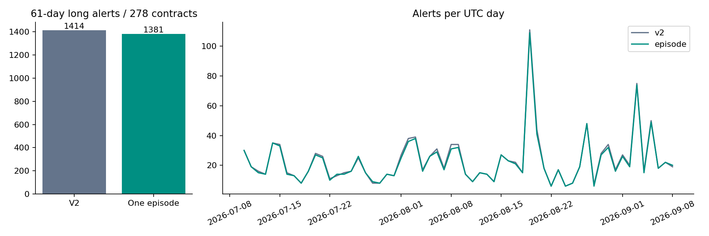

# SPIKE：频繁信号的定位与单项降噪实测

本轮当前原生TV确认使用 **SPIKE BURST V2**，不是尚未安装的V3。Owner的“无时无刻开单”按频繁箭头理解；本程序是离线信号研究，没有自动下单。V3早预警170条/日的数字不能解释当前TV实例。

## 结果先读

同一密集区限制一次渐进启动后，信号从 **1414 降至 1381**，减少 **2.33%**；全池每天 **23.18 → 22.64**。自然平仓净胜率 **33.41% → 33.28%**，事件均值相对匹配随机 **-70.89bp → -74.84bp**。

这项改动只检验“旧密集区被再次使用”这一机制，不能将减少提示等同提高盈利。没有据结果继续调参，没有替换TV、监控或通知。研究版仍不能当成已验证的开单系统。



## 数据、定义、时序

- 同一278个历史OKX 1H合约，UTC [2026-07-10,2026-09-09)，61天；BTC/ETH沿用原排除。不是当前全部合约，也不是3年验证。
- 原8046个事件锚点，1660个正例、6240个负例、146个未知。标签正例率20.63%；已知样本中21.01%。原标签逐字节保持。标签是首次12根突破后24根内+4ATR先于-2ATR，未要求均线密集，不是密集启动金标。
- 这是本配置第1次消耗holdout，边界仍≥2026-05-04。沿用Owner全日期授权；这些历史已研究过，不能称盲测/独立样本外。没有训练，因此训练val样本、val AUC不适用。
- 所有信号只读当根及之前；全池冻结之后才算结果。只有标签和结果看未来。确认时点为小时收盘；北京时间为UTC+8。
- 当前gap只重置新的密集证据归属；原价格/均线/风险遵循旧连续源合同。真实输入由执行器再次检查完整小时无缺口。

## 为什么旧机制可能重复

原版“参考止损触及”立即释放持有状态；下一根渐进启动仍可使用过去12根任意一次密集证明。关闭上一笔参考，不等于产生新一段蓄势。新机制把既有密集true连续段编号，读取此前12根最新ID，正式信号消费ID，止损不归还。只限制渐进路线，硬爆发路线保持原规则；密集false→true才算新ID。没有额外时间冷却、无新阈值。

完整重放变化：共有1369个相同时间信号，移除45个旧信号，新增12个不同时间信号；新状态中70个候选根被挡。被挡候选根不等于移除交易数，因为跳过参考持仓会改变后续可用状态。密集状态边界仍可能抖动，因此不是完美的趋势分段。

## 前后对照

百分比列以0–1表示；bp=万分之一。下面是独立事件结果，不是资金曲线或账户收益。

| arm | period | signals | alerts_per_day | hits_1 | positive_events | recall_1 | event_match_rate | forward_success_rate | random_forward_success_rate |
|---|---|---|---|---|---|---|---|---|---|
| v2 | full | 1414.0000 | 23.1803 | 180.0000 | 1660.0000 | 0.1084 | 0.2390 | 0.2538 | 0.2650 |
| v2 | first31 | 656.0000 | 21.1613 | 76.0000 | 630.0000 | 0.1206 | 0.2104 | 0.1845 | 0.2239 |
| v2 | last30 | 758.0000 | 25.2667 | 104.0000 | 1030.0000 | 0.1010 | 0.2639 | 0.3153 | 0.3010 |
| v2 | case_night | 80.0000 | 160.0000 | 26.0000 | 144.0000 | 0.1806 | 0.6000 | 0.8125 | 0.4672 |
| episode | full | 1381.0000 | 22.6393 | 177.0000 | 1660.0000 | 0.1066 | 0.2426 | 0.2542 | 0.2636 |
| episode | first31 | 638.0000 | 20.5806 | 75.0000 | 630.0000 | 0.1190 | 0.2147 | 0.1881 | 0.2227 |
| episode | last30 | 743.0000 | 24.7667 | 102.0000 | 1030.0000 | 0.0990 | 0.2665 | 0.3126 | 0.2993 |
| episode | case_night | 79.0000 | 158.0000 | 26.0000 | 144.0000 | 0.1806 | 0.6076 | 0.8101 | 0.4735 |

原锚点+6匹配率与每个信号后的24根障碍成功率是不同指标；未匹配并不等于亏损，可能只是原24根去重或+6匹配范围外的上涨。旧报告duplicates=0也不证明没有同趋势后续信号。

| arm | period | valid | natural_exits | natural_win_rate | mean_gross_bp | mean_net_bp | paired_random_net_bp | mean_excess_bp | permutation_p | holm_p |
|---|---|---|---|---|---|---|---|---|---|---|
| v2 | full | 1414.0000 | 1290.0000 | 0.3341 | 141.3215 | 121.3215 | 186.0882 | -70.8902 | 0.5302 | 1.0000 |
| v2 | first31 | 656.0000 | 656.0000 | 0.2409 | -119.8782 | -139.8782 | 45.8517 | -185.8326 | 1.0000 | NA |
| v2 | last30 | 758.0000 | 634.0000 | 0.4306 | 367.3729 | 347.3729 | 306.8525 | 28.0922 | 0.0034 | NA |
| v2 | case_night | 80.0000 | 80.0000 | 0.9625 | 1916.2669 | 1896.2669 | 940.0561 | 968.9488 | 0.0001 | NA |
| episode | full | 1381.0000 | 1259.0000 | 0.3328 | 142.0439 | 122.0439 | 190.3093 | -74.8373 | 0.6415 | 1.0000 |
| episode | first31 | 638.0000 | 638.0000 | 0.2398 | -116.5893 | -136.5893 | 48.0596 | -184.9684 | 1.0000 | NA |
| episode | last30 | 743.0000 | 621.0000 | 0.4283 | 364.1274 | 344.1274 | 312.0161 | 19.3893 | 0.0067 | NA |
| episode | case_night | 79.0000 | 79.0000 | 0.9620 | 1917.1596 | 1897.1596 | 958.8641 | 951.2363 | 0.0001 | NA |

匹配随机：同币×同UTC周×因果ATR百分比桶，最多3个；统一排除两臂当根与此前12根信号。不排除未来信号、不按未来盈亏选对照。新实验重新匹配，因此旧V2报告随机超额数值可能不同；相同旧V2实际事件和收益应相同。Holm两臂全期修正，分期数字仅描述。case_night是手选上涨夜，不当普遍有效证据。

## 单变量基线

量比/TR只描述排序，top-decile为各自指标最高10%，不是获利最高10%；未据此选阈值。descriptive_auc不是训练或验证AUC。

| arm | feature | n | descriptive_auc | top_n | top_gross_bp | top_net_bp | top_win_rate | top_random_bp | top_excess_bp |
|---|---|---|---|---|---|---|---|---|---|
| v2 | relative_volume | 1414.0000 | 0.5185 | 142.0000 | -91.4632 | -111.4632 | 0.3310 | 91.1872 | -199.5559 |
| v2 | tr_expansion | 1414.0000 | 0.5336 | 142.0000 | 170.9662 | 150.9662 | 0.4014 | 128.9914 | 22.0520 |
| episode | relative_volume | 1381.0000 | 0.5254 | 139.0000 | -93.7222 | -113.7222 | 0.3381 | 100.0820 | -210.7247 |
| episode | tr_expansion | 1381.0000 | 0.5401 | 139.0000 | 205.6366 | 185.6366 | 0.4101 | 131.6615 | 55.6181 |

## 复现命令

```bash
.venv/bin/python -m pytest -q tests/test_spike_burst_episode.py tests/test_spike_burst_noise_study.py tests/test_spike_burst_progressive.py
.venv/bin/python -m yoyo.evaluation.spike_burst_noise_study prepare
.venv/bin/python -m yoyo.evaluation.spike_burst_noise_study evaluate
.venv/bin/python -m yoyo.evaluation.spike_burst_noise_study report
```

先提交准确builder再运行；认证旧features输入。prepare/evaluate拒绝覆盖已存在产物；首次运行使用预注册的空results目录，已完成实验只做哈希核对，不能删除旧结果刷实验。

## 风险与诚实声明

- 止损、次根开盘、2R启动4ATR跟踪、无固定止盈、20bp入场名义往返成本不变；资金费、滑点与冲击未完整建模。没有账户最大回撤结论。
- Python只验证多头；原Pine空头镜像未在此轮验证。原生TV当前版本核对不等于所有用户图表设置相同；本轮没有编译/替换Pine。
- 多币同晚高度相关，不能按每条信号当独立成功证据。曾经看过的数据不是新样本外；不宣称最优参数。
- 80%覆盖率与低噪音是两个目标，旧V3靠普通突破取得高覆盖但未建立交易优势。预警不应该默认带入场框来暗示开单。本轮不将其上线。

## 下一步

若同段去重变化小，问题主要不是重复发送，而是初次突破质量；应另行冻结“压缩形成过程/突破后是否留在区间外”等假设并给误报代价。不要再通过遍历门槛追80%。TV或通知切换要在结果足够支持后明确交付；本轮没有切换。
