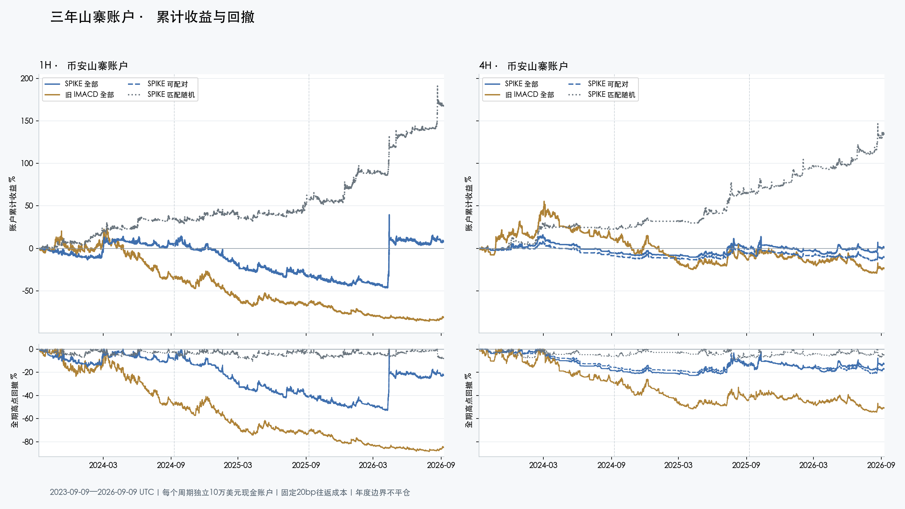
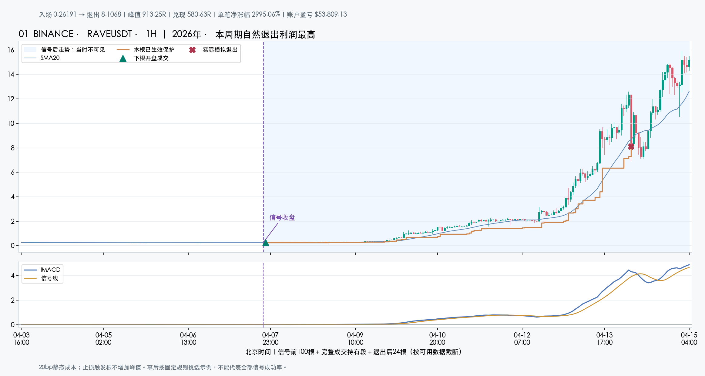
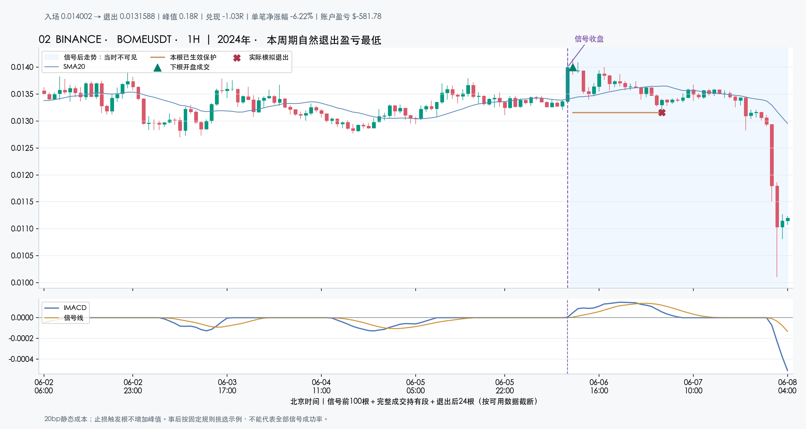
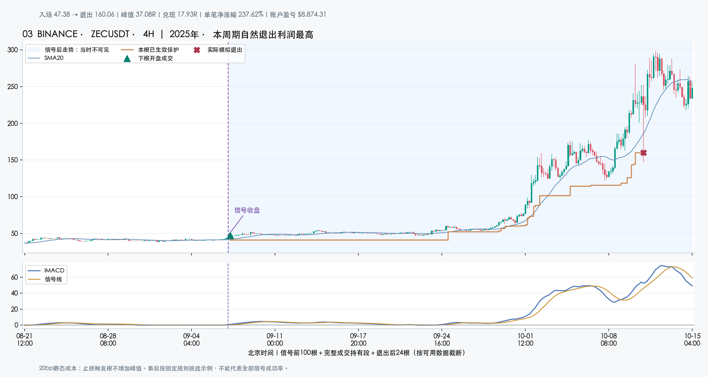
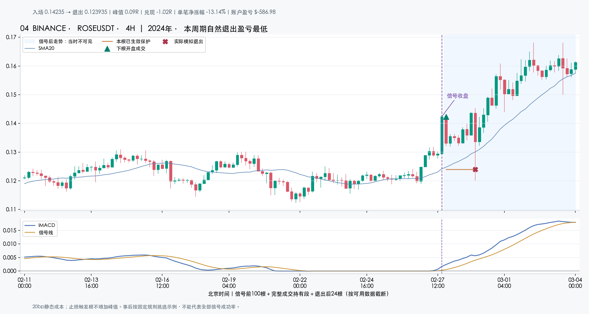

# SPIKE 强劲爆发 V1：三年冻结规则回顾

## 结果概览

**当前 V1 能抓到少数大波段，但三年固定规则回顾没有显示稳定的账户优势，不能称为找到了最优参数。** 币安山寨池1H账户净收益 **+7.73%**、最大回撤 **52.94%**；4H净收益 **+1.09%**、最大回撤 **22.68%**。两周期分别使用10万美元现金账户、最多10资产、每笔初始风险不超过权益0.5%，不是把每个币的涨幅累加。

1H实际成交1141笔，含期末/源尾估值的胜率28.05%；只看自然退出为 **315/1133＝27.80%**。4H实际成交289笔，含估值胜率28.72%；自然退出为 **78/278＝28.06%**。因此低胜率本身不是最主要的问题，主要问题是大赢家能否稳定补偿连续亏损、回撤和成本。

1H三个年度收益依次为 **+3.88%、−35.40%、+60.55%**，差异很大。最大赢家RAVE贡献$53,809，而全期账户只净赚$7,732；只从固定账本减去这一笔利润，余额贡献为 **−46.08%**。这是利润集中度归因，**没有删掉RAVE重新分配资金或重新回测**。4H同口径减去最大一笔贡献为−7.78%。

强劲爆发的可匹配账户也没有胜过其条件匹配随机对照，四项山寨主检验的Holm校正p均为1。随机对照是依赖历史事件匹配的研究零假设，不是一套能照着实盘执行的随机交易系统。固定成交的成本从20bp提高到40bp后，两周期收益归因都转负；资金费率、实际冲击和完整历史tick变更尚未建模，不能把基础账户数字当实盘保证。

**为什么只有多头、ETH很少信号？** 已实际查看当前Mac TradingView输入：方向选的是“多头”，脚本有“双向”和“空头”选项。本轮严格验证多头，没有把多头结果外推到空头。币安三年ETH1H仅6次爆发候选（6笔成交、1胜5负，账户−1.33%）；BTC1H为13次（3胜10负，−1.98%）。两者4H各只有1笔，ETH那笔盈利也不构成100%胜率能力的证据。

近两月OKX ETH1H另做了冻结重放：2026-07-10至09-09共1464根、0个多头箭头。4个蓄势释放窗口共24根，没有一根达到TR扩张≥3；价格先启动路径中两根虽量比/TR通过，却因收盘位置约62%和70%、低于75%门槛而未出箭头。量比≥4、TR≥3、收盘强度等是当前固定工程参数，**不是已经证明适合ETH或所有币种的最优值**。这轮没有为了增加ETH箭头而改阈值。

下方图展示实际模拟账户确实持有的完整路径，包括失败案例；历史最高浮盈与止损/保护退出后兑现R分别标注。RAVE属于极端个例，即使原始行情与计算一致，也不能由它推断此类收益可以重复。当前结论更支持继续研究入场后如何避开冲高回落、控制成本和持仓分配，而不是简单把强度门槛堆得更高。

独立复核已完成：36个账户、108个年度分段共130,841项核对无差异；13个极值事件另与19份原始文件核对。RAVE的15分钟原始记录呈连续上涨，未发现价格乘数/聚合错误，但OHLC只能支持保护价格被穿越，不能证明暴跌中实际按该价成交。图注中的盘中退出使用所在K线时间区间，上界用于账本结算。

失败形态也有区别：BOME 1H出现爆发后持续回落；ROSE 4H先扫止损、随后继续上涨。另一些极端4H案例的信号K线本身已涨约131%–190%，确认后入场对应的初始止损距离可达60%–67%。这些是已有失败记录的解释，不是新调参结果；后续应分别检验追价幅度、回踩后再入场和被扫出后的重新确认。

评价时间为 **2023-09-09 至 2026-09-09（UTC，1096天）**。本轮是币安 USDT 永续多头回顾，BTC、ETH 单列，不混入山寨池。此处山寨池是既定 COIN 池的报告简称，包含 XAUT 黄金代币，并非纯粹的热门山寨币集合；本轮保留原池，不因看过结果再删资产重算。[XAUT 官方介绍](https://gold.tether.to/) 原始数据从2023-05-01用于预热，新上市品种只从实际可得历史开始。

这是同一冻结配置第 **2** 次收益评估消耗 holdout，正式边界仍为2026-05-04，且与前次61天研究重叠。**不是新的盲测或未见样本外结果，也没有通过本轮数据调参。**

## 完整账户与匹配账户分别比较

全部账户回答整套候选能留下多少收益；可配对账户与随机账户只比较同一批可匹配事件。每周期均从10万美元现金开始，账户互相独立。旧 IMACD 使用原启动入场加同一套宽止损/趋势退出，不能称为原策略整体收益。

| 周期 | 账户 | 净收益 % | 最大回撤 % | 成交数 | 全部胜率（含估值） | 自然退出胜率 | 边界估值为正比例 | PF |
| --- | --- | --- | --- | --- | --- | --- | --- | --- |
| 1H | SPIKE 全部 | +7.73 | 52.94 | 1141 | 28.05%（320/1141） | 27.80%（315/1133） | 62.50%（5/8） | 1.03 |
| 1H | 旧 IMACD 全部 | -81.33 | 88.41 | 3330 | 25.86%（861/3330） | 25.72%（854/3320） | 70.00%（7/10） | 0.81 |
| 1H | SPIKE 可配对 | +8.08 | 52.82 | 1133 | 27.89%（316/1133） | 27.62%（311/1126） | 71.43%（5/7） | 1.03 |
| 1H | SPIKE 匹配随机 | +167.40 | 10.47 | 1424 | 40.24%（573/1424） | 40.14%（570/1420） | 75.00%（3/4） | 1.78 |
| 4H | SPIKE 全部 | +1.09 | 22.68 | 289 | 28.72%（83/289） | 28.06%（78/278） | 45.45%（5/11） | 1.01 |
| 4H | 旧 IMACD 全部 | -23.69 | 54.43 | 886 | 25.40%（225/886） | 25.14%（220/875） | 45.45%（5/11） | 0.91 |
| 4H | SPIKE 可配对 | -10.33 | 21.07 | 257 | 26.46%（68/257） | 25.20%（62/246） | 54.55%（6/11） | 0.86 |
| 4H | SPIKE 匹配随机 | +134.78 | 8.89 | 295 | 53.90%（159/295） | 52.80%（151/286） | 88.89%（8/9） | 3.13 |

胜率分母是账户实际成交；自然退出与边界估值互斥。边界包括评价期末及连续数据段末的存续仓估值，并非实际保护退出。PF也包括已按边界估值计入的账本盈亏；没有亏损时本实现记为不适用，不编成无限收益。

曲线使用保存的每根收盘权益，不以单笔涨幅叠加，不把1H与4H账户收益相加。下方回撤相对全期此前权益高点；两列使用相同纵轴范围。年度虚线只表示分段位置，不触发平仓或重开。



## 年度结果继承原持仓

年度范围依次为2023-09-09→2024-09-09、2024-09-09→2025-09-09、2025-09-09→2026-09-09。年度收益按连续权益首尾计算；本节最大回撤在各年度内重新建立高水位，不能与全期最大回撤直接相加。退出数与胜率按账本成交时序归属：年度边界的开盘退出归新年，盘中/收盘退出归旧年；未退出交易不借用未来结果。

### 全部信号账户

| 周期 | 账户 | 年度 | 起始权益 $ | 结束权益 $ | 年度收益 % | 年度内回撤 % | 退出/估值数 | 自然退出数 | 自然退出胜率 |
| --- | --- | --- | --- | --- | --- | --- | --- | --- | --- |
| 1H | SPIKE 全部 | 第1年 | 100,000.00 | 103,882.12 | +3.88 | 15.73 | 262 | 262 | 32.82% |
| 1H | SPIKE 全部 | 第2年 | 103,882.12 | 67,103.64 | -35.40 | 42.04 | 314 | 314 | 20.70% |
| 1H | SPIKE 全部 | 第3年 | 67,103.64 | 107,732.01 | +60.55 | 25.51 | 565 | 557 | 29.44% |
| 1H | 旧 IMACD 全部 | 第1年 | 100,000.00 | 65,037.64 | -34.96 | 48.66 | 941 | 941 | 27.63% |
| 1H | 旧 IMACD 全部 | 第2年 | 65,037.64 | 35,972.20 | -44.69 | 56.53 | 1060 | 1060 | 25.28% |
| 1H | 旧 IMACD 全部 | 第3年 | 35,972.20 | 18,669.72 | -48.10 | 62.64 | 1329 | 1319 | 24.72% |
| 4H | SPIKE 全部 | 第1年 | 100,000.00 | 94,559.68 | -5.44 | 18.46 | 73 | 72 | 27.78% |
| 4H | SPIKE 全部 | 第2年 | 94,559.68 | 100,188.39 | +5.95 | 11.33 | 60 | 60 | 33.33% |
| 4H | SPIKE 全部 | 第3年 | 100,188.39 | 101,090.78 | +0.90 | 18.30 | 156 | 146 | 26.03% |
| 4H | 旧 IMACD 全部 | 第1年 | 100,000.00 | 109,888.69 | +9.89 | 29.45 | 243 | 243 | 30.45% |
| 4H | 旧 IMACD 全部 | 第2年 | 109,888.69 | 90,688.13 | -17.47 | 35.69 | 256 | 256 | 21.09% |
| 4H | 旧 IMACD 全部 | 第3年 | 90,688.13 | 76,311.59 | -15.85 | 29.45 | 387 | 376 | 24.47% |

### SPIKE 配对账户

| 周期 | 账户 | 年度 | 起始权益 $ | 结束权益 $ | 年度收益 % | 年度内回撤 % | 退出/估值数 | 自然退出数 | 自然退出胜率 |
| --- | --- | --- | --- | --- | --- | --- | --- | --- | --- |
| 1H | SPIKE 可配对 | 第1年 | 100,000.00 | 104,877.72 | +4.88 | 15.71 | 259 | 259 | 33.20% |
| 1H | SPIKE 可配对 | 第2年 | 104,877.72 | 68,179.02 | -34.99 | 41.64 | 313 | 313 | 20.77% |
| 1H | SPIKE 可配对 | 第3年 | 68,179.02 | 108,082.47 | +58.53 | 25.04 | 561 | 554 | 28.88% |
| 1H | SPIKE 匹配随机 | 第1年 | 100,000.00 | 135,277.72 | +35.28 | 7.08 | 278 | 278 | 40.29% |
| 1H | SPIKE 匹配随机 | 第2年 | 135,277.72 | 157,680.20 | +16.56 | 10.47 | 396 | 396 | 36.62% |
| 1H | SPIKE 匹配随机 | 第3年 | 157,680.20 | 267,395.12 | +69.58 | 8.30 | 750 | 746 | 41.96% |
| 4H | SPIKE 可配对 | 第1年 | 100,000.00 | 91,308.57 | -8.69 | 15.65 | 60 | 59 | 25.42% |
| 4H | SPIKE 可配对 | 第2年 | 91,308.57 | 94,534.04 | +3.53 | 10.79 | 54 | 54 | 27.78% |
| 4H | SPIKE 可配对 | 第3年 | 94,534.04 | 89,674.39 | -5.14 | 19.15 | 143 | 133 | 24.06% |
| 4H | SPIKE 匹配随机 | 第1年 | 100,000.00 | 122,646.92 | +22.65 | 7.42 | 60 | 59 | 45.76% |
| 4H | SPIKE 匹配随机 | 第2年 | 122,646.92 | 166,195.14 | +35.51 | 8.89 | 59 | 59 | 62.71% |
| 4H | SPIKE 匹配随机 | 第3年 | 166,195.14 | 234,778.98 | +41.27 | 7.25 | 176 | 168 | 51.79% |

## 四项主检验：收益是否超出条件匹配随机

每个实际事件最多匹配3个同币、同周期、同UTC周、同因果ATR百分位桶随机时点。随机时点只排除本根及此前12根信号；不借用未来信号排除。控制可跨事件复用，不能当独立新样本。配对账户固定使用有效的control0；事件统计使用该事件全部有效控制的均值，两个分母可能不同。

| 周期 | 入场 | 候选 | 有效 | 有有效匹配 n | control0配对 n | 全有效均净 bp | 匹配实际净 bp | 匹配随机净 bp | 资产均衡超额 bp | 置换资产数 | 原始 p | 四项 Holm p |
| --- | --- | --- | --- | --- | --- | --- | --- | --- | --- | --- | --- | --- |
| 1H | SPIKE 爆发 | 1600 | 1600 | 1585 | 1585 | 82.05 | 85.96 | 330.57 | -140.62 | 551 | 0.607339 | 1.000000 |
| 1H | 旧 IMACD 入场 | 21918 | 21918 | 21847 | 21846 | -28.53 | -28.73 | 72.71 | -93.81 | 643 | 1.000000 | 1.000000 |
| 4H | SPIKE 爆发 | 380 | 380 | 314 | 314 | -196.02 | -366.46 | 968.28 | -1,387.02 | 235 | 1.000000 | 1.000000 |
| 4H | 旧 IMACD 入场 | 4493 | 4493 | 4271 | 4271 | -14.78 | -11.71 | 397.43 | -432.19 | 611 | 1.000000 | 1.000000 |

主检验仅山寨池2周期×2入场，共4项；缺失检验保留在校正家族中。超额先按资产×周平均，再按资产平均，置换单位是资产。只有净超额为正且Holm p<0.01才满足预登记的强于随机证据门槛；这里不自动把显著性解释为未来盈利保证。未匹配事件不能补零，也不能外推成全池超额。

## 胜率、自然大赢家和边界估值

| 周期 | 入场 | 有效事件 n | 事件净胜率 % | 自然退出 n | 边界估值 n | 自然净≥20% | 自然净≥50% | 自然净≥5R | 最大峰值 R | 最大净 R |
| --- | --- | --- | --- | --- | --- | --- | --- | --- | --- | --- |
| 1H | SPIKE 爆发 | 1600 | 27.06 | 1587 | 13 | 119 | 30 | 36 | 913.25 | 580.63 |
| 1H | 旧 IMACD 入场 | 21918 | 27.90 | 21818 | 100 | 623 | 125 | 686 | 785.73 | 499.51 |
| 4H | SPIKE 爆发 | 380 | 28.16 | 361 | 19 | 54 | 21 | 12 | 37.08 | 17.93 |
| 4H | 旧 IMACD 入场 | 4493 | 28.51 | 4347 | 146 | 332 | 102 | 146 | 117.29 | 67.44 |

本表是有效事件层，包含因现金、10资产上限或容量约束而未被账户买入的候选；不是实际持仓胜率。峰值R与净R的最大值也可能来自不同事件。自然大赢家计数明确排除尚未自然退出的边界估值。

## 量比与TR扩张：描述性排序，不是训练模型

| 周期 | 入场 | 单特征 | 有限值 n | 描述AUC | Top10% n | Top有匹配 n | 有效控制条数 | Top毛 bp | Top净 bp | Top胜率 % | Top匹配实际 bp | Top随机 bp | Top超额 bp |
| --- | --- | --- | --- | --- | --- | --- | --- | --- | --- | --- | --- | --- | --- |
| 1H | SPIKE 爆发 | 量比 | 1600 | 0.4808 | 160 | 157 | 469 | -125.52 | -145.52 | 26.88 | -153.90 | 333.66 | -487.57 |
| 1H | SPIKE 爆发 | TR扩张 | 1600 | 0.4850 | 160 | 157 | 468 | -257.53 | -277.53 | 28.75 | -275.07 | 350.16 | -625.23 |
| 1H | 旧 IMACD 入场 | 量比 | 21918 | 0.5030 | 2192 | 2165 | 6461 | -112.91 | -132.91 | 27.14 | -135.51 | 124.36 | -259.87 |
| 1H | 旧 IMACD 入场 | TR扩张 | 21918 | 0.4930 | 2192 | 2159 | 6451 | -107.36 | -127.36 | 26.46 | -129.71 | 138.27 | -267.97 |
| 4H | SPIKE 爆发 | 量比 | 380 | 0.4838 | 38 | 25 | 72 | -1,327.08 | -1,347.08 | 15.79 | -1,014.61 | 2,331.61 | -3,346.21 |
| 4H | SPIKE 爆发 | TR扩张 | 380 | 0.4847 | 38 | 26 | 77 | -727.08 | -747.08 | 26.32 | -348.03 | 2,407.81 | -2,755.84 |
| 4H | 旧 IMACD 入场 | 量比 | 4493 | 0.5036 | 450 | 372 | 1049 | -344.18 | -364.18 | 22.89 | -477.45 | 497.13 | -974.58 |
| 4H | 旧 IMACD 入场 | TR扩张 | 4493 | 0.5079 | 450 | 374 | 1069 | -109.79 | -129.79 | 28.89 | -200.50 | 704.79 | -905.28 |

没有训练或验证分类模型，模型val AUC不适用。这里AUC只描述同一历史样本中特征与净盈利标签的排序关系。Top10%按既定特征降序、event_id稳定打破同分；均值基于有效事件，并非因果可交易的当时横截面组合。Top全部净收益与Top匹配净收益的分母不同，上表显式列出实际匹配数，不把缺失控制当零。

## BTC与ETH单列：少信号也是结果

| 资产 | 周期 | 入场 | 候选 n | 有效 n | 成交 n | 自然退出胜率 | 边界估值为正比例 | 净收益 % | 最大回撤 % |
| --- | --- | --- | --- | --- | --- | --- | --- | --- | --- |
| BTC | 1H | SPIKE 爆发 | 13 | 13 | 13 | 23.08%（3/13） | 不适用（0/0） | -1.98 | 2.82 |
| BTC | 1H | 旧 IMACD 入场 | 66 | 66 | 62 | 27.42%（17/62） | 不适用（0/0） | +0.88 | 4.66 |
| BTC | 4H | SPIKE 爆发 | 1 | 1 | 1 | 0.00%（0/1） | 不适用（0/0） | -0.34 | 0.34 |
| BTC | 4H | 旧 IMACD 入场 | 11 | 11 | 11 | 18.18%（2/11） | 不适用（0/0） | -2.70 | 2.94 |
| ETH | 1H | SPIKE 爆发 | 6 | 6 | 6 | 16.67%（1/6） | 不适用（0/0） | -1.33 | 1.71 |
| ETH | 1H | 旧 IMACD 入场 | 68 | 68 | 62 | 27.42%（17/62） | 不适用（0/0） | -0.96 | 6.43 |
| ETH | 4H | SPIKE 爆发 | 1 | 1 | 1 | 100.00%（1/1） | 不适用（0/0） | +0.78 | 0.38 |
| ETH | 4H | 旧 IMACD 入场 | 16 | 16 | 14 | 42.86%（6/14） | 不适用（0/0） | +8.83 | 3.08 |

BTC、ETH分别建诊断账户，不计入山寨主检验；单资产不足以支持资产置换显著性结论。零信号时胜率为不适用，不能记为0%或100%；不能为了增加ETH信号而在本轮放宽参数。

## 实际账户成交的完整路径

按固定事后规则选择每周期自然退出利润最高与最低各一例，再选择两周期自然退出峰值回吐最大的一例，按event_id去重，最多5例。所有图都是账户确实持有的历史模拟成交；它们用于解释路径，不代表全部信号成功率。紫线为信号、绿三角为下一根开盘模拟入场、橙线为本根有效保护、红叉为保护成交。浅蓝区域是信号当时看不到的后续价格。

### 1 · RAVE 1H · 2026年 · 本周期自然退出利润最高

北京时间：2026-04-07 21:00 入场；2026-04-14 04:00—2026-04-14 05:00 这根 K 线内触及保护退出，盘中具体时刻未知。账户使用区间上界 2026-04-14 05:00 释放现金、计入结算，不能将此上界当作精确成交时刻。

已由山寨全部账户实际选入。入场 0.26191 → 退出 8.1068；最高浮盈 **913.25R**，退出扣成本后 **+580.63R**，单笔净收益 +2,995.06%。该笔名义仓位 $1,796.60，账户盈亏 $+53,809.13；单笔涨幅不能冒充账户收益。



### 2 · BOME 1H · 2024年 · 本周期自然退出盈亏最低

北京时间：2024-06-06 11:00 入场；2024-06-07 04:00—2024-06-07 05:00 这根 K 线内触及保护退出，盘中具体时刻未知。账户使用区间上界 2024-06-07 05:00 释放现金、计入结算，不能将此上界当作精确成交时刻。

已由山寨全部账户实际选入。入场 0.014002 → 退出 0.0131588；最高浮盈 **0.18R**，退出扣成本后 **-1.03R**，单笔净收益 -6.22%。该笔名义仓位 $9,350.33，账户盈亏 $-581.78；单笔涨幅不能冒充账户收益。



### 3 · ZEC 4H · 2025年 · 本周期自然退出利润最高

北京时间：2025-09-07 08:00 入场；2025-10-11 04:00—2025-10-11 08:00 这根 K 线内触及保护退出，盘中具体时刻未知。账户使用区间上界 2025-10-11 08:00 释放现金、计入结算，不能将此上界当作精确成交时刻。

已由山寨全部账户实际选入。入场 47.38 → 退出 160.06；最高浮盈 **37.08R**，退出扣成本后 **+17.93R**，单笔净收益 +237.62%。该笔名义仓位 $3,734.64，账户盈亏 $+8,874.31；单笔涨幅不能冒充账户收益。



### 4 · ROSE 4H · 2024年 · 本周期自然退出盈亏最低

北京时间：2024-02-27 20:00 入场；2024-02-29 00:00—2024-02-29 04:00 这根 K 线内触及保护退出，盘中具体时刻未知。账户使用区间上界 2024-02-29 04:00 释放现金、计入结算，不能将此上界当作精确成交时刻。

已由山寨全部账户实际选入。入场 0.14235 → 退出 0.123935；最高浮盈 **0.09R**，退出扣成本后 **-1.02R**，单笔净收益 -13.14%。该笔名义仓位 $4,468.31，账户盈亏 $-586.98；单笔涨幅不能冒充账户收益。



## 成本、集中度与覆盖局限

| 周期 | 账户 | 基础20bp净收益 % | 静态40bp % | 静态60bp % | 最大1笔占正利润 % | 最大5笔占正利润 % |
| --- | --- | --- | --- | --- | --- | --- |
| 1H | SPIKE 全部 | +7.73 | -1.27 | -10.26 | 20.27 | 31.08 |
| 1H | 旧 IMACD 全部 | -81.33 | -105.46 | -129.60 | 3.83 | 8.53 |
| 4H | SPIKE 全部 | +1.09 | -0.62 | -2.33 | 10.10 | 29.15 |
| 4H | 旧 IMACD 全部 | -23.69 | -32.80 | -41.92 | 7.04 | 17.52 |

40/60bp是对已固定成交的成本归因压力测试，不重新分配仓位；不会模拟加成本后改变后续现金、容量及入场排序。基础成本按入场名义计，出场名义手续费差额、资金费率、真实价差及冲击并未完整覆盖。正利润集中度不是全账户净利润占比。

每笔不超过账户权益10%，初始风险不超过0.5%，受现金、信号根成交额1%与此前24小时成交额0.1%限制；最多同时10资产。没有杠杆放大，选单优先级只用此前24小时成交额。

| 覆盖项目 | 数量或说明 |
| --- | --- |
| 目录市场数 | 897 |
| 完整 / 排除 / 空 / 拒绝市场 | 649 / 247 / 1 / 0 |
| 清理前源小时 | 11528983 |
| 清理后源小时 | 10442235 |
| 已知交割边界移除小时 | 1082836 |
| 其中正成交量小时 | 88 |
| 段首零活动占位移除小时 | 0 |
| 全零活动段移除小时 | 3912 |
| 已知上市快照前有正量小时（保留并报告） | 17 |
| 清理前 / 后连续1H源段 | 660 / 649 |
| 完全移除的源段 | 11 |
| 上市快照冲突币数 | 17 |
| 周期段状态 | {"included": 1298} |
| 记录的缺失月项 | 6 |
| 候选 / 随机控制条数 | 28573 / 83852 |

目录是既有档案收录与冻结近期目录的并集，包含部分非交易状态，仍不是完整历史退市全集，存在存活者和档案可得性偏差。上市不足三年的币没有凭空补足三年。缺失不插值，断档拆段并重新预热。上市前或退市后的零成交量固定价占位段不是实际交易覆盖；上表按清理后源段统计，不沿用原markets的archive/recent原始行数。段首零活动和全零段单列剔除，已知交割仅保留完整收盘不晚于交割边界的K线；尚有仓位的段尾估值不冒充结算成交。若上市快照之前已有正量，保留并报告冲突，不能仅凭当前上市快照删掉真实历史。

币安 USD-M K 线档案提供12列字段，含真实报价币成交额（quote asset volume），不是用收盘价乘基础币量代替。官方档案可能修订，并提供 CHECKSUM 文件；本轮使用固定文件哈希及独立源抽查记录保留所用版本。[币安官方公开数据说明](https://github.com/binance/binance-public-data)

档案的15分钟数据仅以完整四根合成1H；4H仅由完整UTC四根1H合成。档案与近期1H数据只检查接缝相邻，没有共同覆盖窗可作跨源价格一致性验证。历史公开数据的真实发布时间延迟未知，历史tick变化未重建；使用冻结目录步长近似，不能宣称历史撮合精度完全一致。

## 风险与诚实声明

本次全量结论不能直接与前次61天三交易所研究作因果比较：日期和品种/交易所构成都变了，本次还加入可交易边界清理。此前61天账户的已分配记录按已知币安交割日补查，没有在这些交割日之后入场或继续持有；但旧focus事件和控制中存在未被账户买入的交割后零量记录，因此不能将此前的事件对照称为完全无污染，也不推断其它交易所退市覆盖完整。所有年度都是同一冻结规则的历史切片，后年度不自动成为新的未见样本外。保留亏损、未匹配、少信号、拒单和边界估值，不把峰值R当已兑现收益。

## 下一步与待审问题

下一步先核对最终表格、图和账户拒单原因，再决定是否开展独立前向观察。本轮保持参数冻结，未据这些结果重选阈值或改变线上策略。需要额外证据的问题包括：扣除资金费率与实际冲击后是否仍成立、未被目录收录的退市币影响、边界估值对结论的影响、少数大赢家和账户容量的贡献。

## 复现命令与来源

先提交适配器、研究运行器、报告builder和预登记计划，再执行；输出目录拒绝覆盖旧产物。以下路径默认在仓库根目录。

```bash
.venv/bin/python -m yoyo.data.spike_burst_history --output experiments/active/exp-spike-burst-three-year-20260910-v1/data --start 2023-05-01T00:00:00Z --end 2026-09-09T00:00:00Z
SPIKE_RAW_MANIFEST_SHA=$(.venv/bin/python -c 'import hashlib; from pathlib import Path; print(hashlib.sha256(Path("experiments/active/exp-spike-burst-three-year-20260910-v1/data/history_manifest.json").read_bytes()).hexdigest())')
.venv/bin/python -m yoyo.data.spike_burst_history sanitize --input experiments/active/exp-spike-burst-three-year-20260910-v1/data/history_manifest.json --input-sha "$SPIKE_RAW_MANIFEST_SHA" --output experiments/active/exp-spike-burst-three-year-20260910-v1/data_tradable
.venv/bin/python -m yoyo.evaluation.spike_burst_long_history prepare --history experiments/active/exp-spike-burst-three-year-20260910-v1/data_tradable/history_manifest.json
.venv/bin/python -m yoyo.evaluation.spike_burst_long_history evaluate
.venv/bin/python -m yoyo.evaluation.spike_burst_long_report
.venv/bin/python scripts/md_to_html.py analysis/p1_spike_burst_three_year_20260910.md --out-dir analysis/html
```

来源：已完成的 validation_manifest、其认证的账户/年度/事件/单特征表和账本，以及与之链接的 dataset/history manifest。读取文件和图的SHA记录在 report_manifest.json。主结论由最终审阅者结合全部对照决定。
