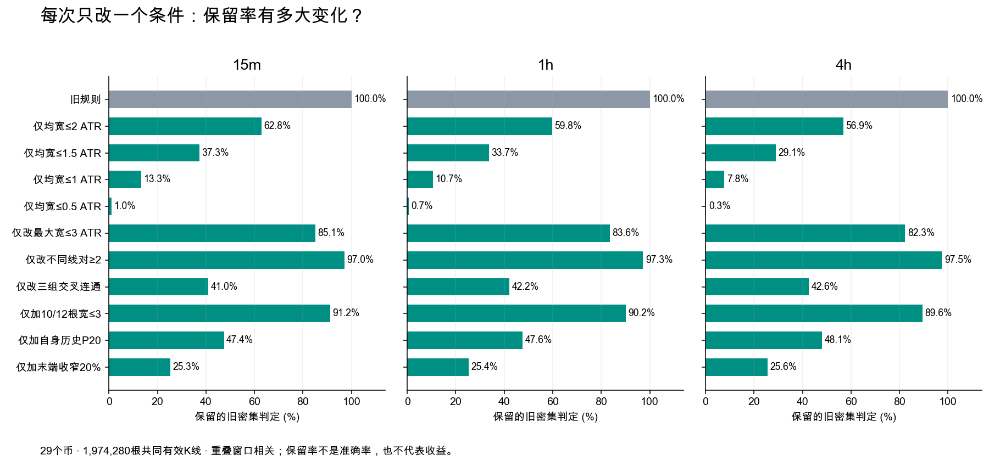

# SPIKE 六均线密集：单项拆分与语义反例

日期：2026-09-20。实验：`exp-spike-ma-density-20260920-v1`。结论状态：**机制审计完成，替代规则未验证**。没有修改 Pine、TV 脚本、默认参数、风控或生产；按 Owner 要求不生成 HTML。

现有条件适合宽泛地识别“近期均线有靠近和交叉”，不能等同于 Owner 所说的“六线收拢后启动”。29币全量扫描发现判定范围很宽；但把它简单收紧到1 ATR，也会排掉旧人工参考、留下部分否决样例。因此本轮不宣布一个“最优密集参数”，而是明确哪些条件在测什么、哪些语义还没有被表达。

## 1. 代码中的实际规则

当前 SPIKE V12.2 继承的 V9 背景：close 上 SMA/EMA20、60、120，共六条线。每根 `width=(max(六线)-min(六线))/ATR14`；t 时刻计算 **t−12..t−1** 的平均 width，<=3 即宽度通过。在同一窗口把15种线对的顺序翻转次数相加，>=2 即交叉通过。同一对重复交叉、同一周期的SMA/EMA交叉都计数。

然后 `recentDense` 在 **t−12..t−1 的密集判定** 中找任意一次成立。因此记忆条件的底层均线窗口合起来涉及 t−24..t−2；不能解释成“当前六线密集”。最终 V9 还经过结构待确认及BB等条件，老的结构证据可能更久。源代码 `yoyo/evaluation/pine/spike_burst_v12_2.pine:170` 和 Python `_legacy_v4` 已核对；不是旧 ETH 项目里同名的“Pine V9”。

ATR 衡量的是价格波动，线束绝对距离没收窄时，ATR上升仍可能让比值下降。参考 [TradingView ATR 官方说明](https://www.tradingview.com/support/solutions/43000501823-average-true-range-atr/)。本轮把这一数学机制与真实发生率分开检验。

## 2. 数据、时间与计数单位

固定29币：BTC、ETH、SOL、PEPE(1000PEPEUSDT)、WIF、ZEC、HYPE、USELESS、MUBARAK、UNI、PUMP、ARB、AR、BOME、ENA、ONE、PIEVERSE、AAVE、NEAR、ZEN、DASH、PENDLE、XTZ、JUP、AERO、OP、FIL、APT、API3；ARY按 Owner 指示排除。

复用上一轮已冻结的 Binance USD-M 5m 本地归档及逐文件SHA，聚合15m/1h/4h。分析收盘时间2024-09-10至2026-05-01(不含)，时间分界2025-09-10。按时间切分，不随机分割。新上市币只使用实际覆盖；不是当前全市场的随机样本。没有为本研究补拉或替换数据。

| 周期 | 共同有效K线 | 旧核心密集判定 | 占有效K线 | 近期12根有密集 | 原始V9候选 |
|---|---:|---:|---:|---:|---:|
|15m|1,507,646|739,491|49.05%|950,874（63.07%）|3,360|
|1h|374,938|181,901|48.51%|234,293（62.49%）|985|
|4h|91,696|44,229|48.23%|56,732（61.87%）|271|

共同有效总数1,974,280，原始V9候选4,616。**这些不是交易笔数、不是独立样本、也不是人工标注正类。** 旧判定连续段分别29,943/7,344/1,789，重叠窗口强相关。真实正类率、准确率与召回率未知。

共享比较对断档/非法OHLC要求340根有效预热；另排除旧ready行917/805/708根。归档继承的1h/4h不完整聚合桶6/10个已披露，15m为0；不是填充后的数据。EMA沿用原计算，断档前状态未重置，预热不能把它描述成完全独立的新序列。87流共同有效范围的旧均宽/交叉字段全部一致。初始历史不足与新币覆盖见 `run_v1/delivery_v1/coverage.csv`。

## 3. 每次只改一个条件

下表每项都独立对照旧规则，不是逐行叠加。数字为**保留的旧密集判定比例**，不是准确率或收益。

| 独立改动 | 15m | 1h | 4h | 它实际检验什么 |
|---|---:|---:|---:|---|
|旧规则|100%|100%|100%|均宽<=3 ATR，交叉>=2|
|只把均宽改为<=2 ATR|62.82%|59.82%|56.91%|全线距离|
|只把均宽改为<=1.5 ATR|37.26%|33.70%|29.05%|全线距离|
|只把均宽改为<=1 ATR|13.31%|10.66%|7.77%|全线距离|
|只把均宽改为<=0.5 ATR|1.01%|0.70%|0.31%|极严格距离|
|均值改为12根最大值<=3 ATR|85.13%|83.56%|82.33%|平均值是否掩盖分离|
|总交叉数改为不同线对>=2|97.02%|97.25%|97.51%|同一对反复交叉|
|交叉改为20/60/120三组连通|41.02%|42.21%|42.63%|不同周期组是否共同参与|
|增加至少10/12根宽度<=3 ATR|91.20%|90.16%|89.57%|窗口覆盖率，不等于连续10根|
|增加相对自身历史宽度P20|47.43%|47.64%|48.10%|是否处在自身较窄状态|
|增加末4根比首4根收窄20%|25.32%|25.44%|25.58%|当前正在收拢，还是已经平行/扩张|

三组连通：20/60、20/120、60/120三种组间交叉边至少两种出现，连接三组；不保证六条线逐条参与，更不证明全线接近。相对宽度用span/close的核心中位数，与核心之前256根的P20比较。收拢比也用span/close，避免当下ATR分母变化冒充收拢。

替换ATR分母为**核心之前64根ATR中位数**不是旧集合的子集：15m移除51,277、加入64,908；1h移除11,922、加入18,312；4h移除3,617、加入4,458。总判定数753,122/188,291/45,070。它可避免核心内波动跳升直接压小比值，也可能因旧波动较高而变宽松，不能说固定旧ATR天然更准确。

仅缩短旧密集记忆，12→6→3根时判定数分别：15m 950,874→857,845→795,270；1h 234,293→211,045→195,627；4h 56,732→51,144→47,491。记忆缩短降低陈旧背景覆盖，但不能替代结构时效规则。



## 4. 具体问题有多常见

分母均为该周期旧核心密集判定；各问题重叠，不能相加。

| 诊断现象 | 15m | 1h | 4h |
|---|---:|---:|---:|
|三组没有形成交叉连通|58.98%|57.79%|57.37%|
|仅同一对重复交叉|2.98%|2.75%|2.49%|
|交叉全部发生在同周期SMA/EMA内部|10.99%|10.05%|9.33%|
|均宽<=3，但至少一根宽>3 ATR|14.87%|16.44%|17.67%|
|当前ATR口径通过，核心前ATR口径不通过|6.93%|6.55%|8.18%|
|宽度并不处在自身历史最窄20%|52.57%|52.36%|51.90%|
|末4根比首4根宽50%以上|13.70%|13.55%|13.60%|

所以同一对重复交叉确实是漏洞，但不是覆盖率过宽的主要来源。更加关键的是宽度门、跨周期组参与，以及把正在扩张的窗口也当作当前密集。

最终原始V9候选里，有37/13/4个候选在确认时已没有近期12根密集，合计54/4,616=1.17%。最近一次旧密集判定最远69根15m、47根1h、19根4h；这是距**密集判定**的年龄，不是精确核心结束距，也不是每一单的入场延迟。多数V9仍有近期背景，不能说整个系统都在使用陈旧信号。

分时段检查也保留相同机制方向：15m旧覆盖48.55%→49.72%，1h48.65%→48.34%，4h50.39%→45.36%；三组连通保留率分别40.60%→41.58%、42.21%→42.22%、43.14%→41.86%。这只说明诊断现象没有局限于一个时间段；没有据此选择最优阈值。

## 5. 真实图例和旧人工参考

8张新图采用固定条件挑机制，再在每流内取时间哈希最小的合格时点。跨流选BTC/ETH/SOL以方便比较；属于目的性抽样，不能估计误报率。每图只展示判定bar及之前80根，金色是此前12根，右图放大此前24根；同色同周期，实线SMA、虚线EMA。纵轴是相对右端收盘价百分比，局部与全景独立缩放，不能拿像素距离跨图比较。价格仅用于展示，特征不使用未来。

- `BTCUSDT_15m_same_pair_repeat.png`：均宽2.32 ATR，两次交叉仅一对；120组明显分离，旧规则仍通过。
- `ETHUSDT_15m_not_all_groups_connected.png`：局部交叉而三组不连通。
- `SOLUSDT_1h_mean_hides_over3.png`：均宽2.95，最大宽3.36 ATR。
- `BTCUSDT_4h_atr_denominator_sensitive.png`：当下与历史分母判断不同，不把差异直接叫误判。
- `BTCUSDT_15m_recent_but_not_now.png`：均宽已经4.21 ATR，近期记忆仍成立；图上可见先前靠近、之后离开。
- `SOLUSDT_15m_compact_interwoven.png`：线束较近且三组参与，但价格已离束。这证明**几何密集候选仍不等于正确的启动核心定位**。
- `ETHUSDT_1h_compact_without_cross.png`：核心前ATR归一均宽0.69，仅一次交叉，旧条件拒绝；可作靠近候选，不能直接宣称漏掉一个有效交易。
- `BTCUSDT_4h_compact_converging.png`：末端收拢候选。

图片和逐图特征在 `run_v1/delivery_v1/`，所有指标可联结原时间与原OHLC窗口。

Luna Max进一步定位旧review50的9个明确Owner语义判断：6个否决03/08/20/21/22/34；3个参考42 FIL、44 NEIRO、48 NMR。原v5均记载 `sample_owner_geometry_confirmed=false`。因此只在原提案窗口做描述，**不是将提案边界升级成人工金标**。否决样例没有Owner认可的核心，只测原机器L5提案；OKX样本单独列示，不并入上述Binance全池。

| 旧样例 | Owner语义 | 原提案末端的旧12根均宽 | 交叉次数 | 组间边 |
|---|---|---:|---:|---:|
|03 LINK|否决|1.207|6|2|
|08 ETHFI|否决|2.456|6|1|
|20 MMT|否决|0.861|7|2|
|21 MASK|否决|0.474|10|2|
|22 FLOKI|明确认为平、看不出密集|1.445|3|1|
|34 APT|明确认为不密集|1.114|6|1|
|42 FIL|认可参考|1.775|7|3|
|44 NEIRO|最佳参考|1.332|9|2|
|48 NMR|形态可、但位置太迟|1.360|4|3|

旧条件在9个提案末端全通过，无法区分其语义。**收紧到1 ATR会拒绝3个参考，却保留MMT和MASK**；这是否决“越窄越真”的反例，不是9样本分类准确率。3个参考在原5根提案窗中，平均每根实体内含MA数为0.2/0.2/0.6，也不支持直接硬加“每根实体必须穿过多条线”。很可能需要区分密集形成区与离束/启动区；不能擅自把边界挪到更符合算法的位置。

原记录：`analysis/p0_15m_ma_launch_owner_strict_review50_20260827.md`、v5 preregistration owner_decisions、原v1/v5 review_manifest。原始OHLC及原图哈希在 `run_v1/anchor_audit_v1/receipt.json`；指标在 `anchors.csv`。

## 6. 零假设与验证

数学零假设：固定seed92027，每根独立打乱六条线的身份，保留这一根的六个值、span、OHLC与波动。87流均宽和稳定ATR最大宽逐值不变；此操作破坏真实线的时间连续身份，不是可交易的市场模拟。

15m旧条件739,491→887,882，三组连通条件303,341→887,882；1h旧181,901→215,745，连通76,781→215,745；4h旧44,229→52,426，连通18,853→52,426。说明交叉会被身份扰乱人为制造，不能代替几何接近；**也不证明三组连通这个条件有更高识别准确率**。其他零假设结果见 `null.csv`。

6项行为测试通过：同一对交叉但三组分离、ATR膨胀冒充收拢、前缀/未来扰动/价格缩放不变、当根排除、断档预热、紧凑平行无交叉。合成特征用于数学反例，不冒充由OHLC物理生成的市场案例。87流旧特征一致与29份输入/输出收据校验通过。Luna Max独立复核见实验目录的 `QA.md`。

本轮无收益标签与学习模型：val AUC、top-decile毛/净收益、胜率、交易成本、随机入场收益对照不适用。以上span不变的身份扰乱零假设与原逻辑/单项条件是对应的机制对照；没有捏造置换p值、净R或策略收益。历史收益变化要另用完整串行回放，不能把被删bar数量当成策略改进。

## 7. 建议采用的逻辑结构及边界

优先研究**带明确起止点的状态过程**：

1. **收拢**：跟踪全六线距离及20/60/120组间距离，记录是否相对自身变窄，避免只有20组抖动。
2. **密集区**：定位连续的紧凑局部段；同时记录水平窄束与交织窄束，交叉是形态类别/质量信息，不是“够两次就算密集”的替代品。最大值/分位数约束比纯均值更能解释远离的一条线，但本轮尚未决定阈值。
3. **启动**：核心结束后才判断价格离束、突破、动能与方向；同时记录价格实体从靠束到离束的过程。不能要求已经离束的每根继续穿线，也不能用启动后的大ATR反推先前更密集。
4. **失效**：核心有固定时间戳，超过允许时间或结构破坏即失效；不用滚动“近期有过一次”无限继承背景。

15m/1h/4h分别评估核心长度、允许离束时间和波动尺度。相同12根分别是3小时/12小时/48小时，旧参数没有表达一致的物理时长；但不同周期也不必机械折算成同样小时数。测试表显示阈值保留率明显不同，本轮没有证据给三个周期指定所谓最优值。

下一步可执行研究是用现有Owner原标与来源可追溯的真实样例，固定核心/启动的语义边界后，盲评以上各组件的形态识别；已有提案不自动升级为标签。只有在几何语义成立后，再独立对比V9完整交易回放。候选逻辑组合、具体长度/阈值及新Pine仍未被本轮实验验证；TV继续V12.2。

## 风险与诚实声明

- 全量覆盖率和保留率不能回答真实准确率，197万根也不等于197万个独立形态；9个人工语义样例数量小且边界未确认。
- 回顾性样例、预先选出的29币、当前本地历史范围及跨交易所来源限制都保留。没有声称与当前OKX/Bybit图上的每根K线完全一致。
- 宽度1ATR、P20、三组连通、收拢20%均为单项研究条件；筛得更少不代表更好。没有将多项叠加后挑一个漂亮结果。
- body位置只做8张新图及9个旧提案的描述性诊断，未跑全池body门控，也未估计收益。
- 特征因果检查通过不等于语义或策略验证。没有训练、promote、真实交易或新TV脚本。
- Luna Max复核指出：诊断用 `legacy_age` 按行计龄并全局前向填充，不在gap重置，不能通用地换算为跨断档真实时长；`legacy_recent`本身也没有shared-known门。本次所有4,616个V9候选均known且年龄最大69<339，在340根有效预热内，因此当前候选年龄不跨gap；主比例全部显式使用共同有效mask。后续复用必须保留此校验或改为分段时间年龄。partial聚合桶仅统计总数，未按split独立列数。

## 复现

扫描源码提交 `67411473aa`，图表提交 `a9c6c011e4`，旧语义锚点提交 `da19593578`。均先提交builder再生成对应结果。冻结输入清单是本实验 `run_v1/identity.json`，源于上轮HTF SMA `run_v1/identity.json`；数据不入git。

```bash
.venv/bin/python -m pytest -q tests/evaluation/test_spike_ma_density.py
.venv/bin/python -m yoyo.evaluation.spike_ma_density_study --workers 3
.venv/bin/python -m yoyo.evaluation.spike_ma_density_delivery
.venv/bin/python -m yoyo.evaluation.spike_ma_density_anchors
```

后三个生成器面向干净输出目录；现有结果保留，不删除或覆盖已交付版本。重跑使用同源码/依赖/输入的干净检出副本或新增输出版本，而不是篡改旧产物。实验目录包含逐流收据、聚合CSV、PNG、语义来源链、交付清单及QA。
