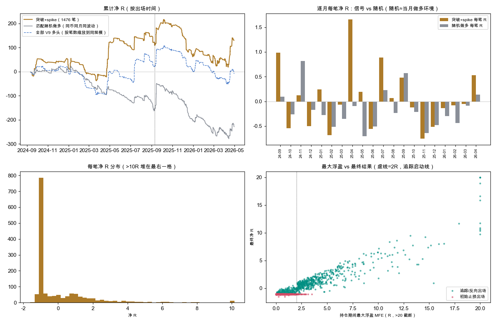

# SPIKE V10.4 · 1h「突破+spike」只做多——逐笔拆解：挑点比随机好，但盈亏基本跟着大盘走

2026-09-18 · 数据 = 上一份六周期回测里 1h 的 1,476 笔已平仓交易（`exp-spike-v10-4-joint-multitf-20260918-v1`），
**没有重跑、没有改任何规则或参数**，只是把已发生的交易拆开看。**holdout 消耗 0。**

## 0. 先说「啥意思」

- **R 是什么**：1R = 这一笔「入场价到初始止损」的距离，也就是止损时亏的钱。+0.09R/笔 = 平均每笔赚到初始风险的 9%。
  1h 的初始止损中位数离入场价 **4.0%**，0.2% 往返手续费折合每笔约 **0.05R**。
- **20 个月总账**：1,476 笔，胜率 32.8%，平均赢 +2.25R、平均亏 −0.97R，合计 **+130R**。
- **但路径很难看**：前 13 个月冲到 **+205R**（2025-09），之后 2025-10 → 2026-04 回撤 **198R**，4 月才拉回到 +130R。
  最大回撤比整段利润还大。
- **「比随机好」是什么意思**：在同一个币、同一个月、同样波动的时点随便做多，同样的止损和追踪，平均每笔 **−0.155R**；
  这个信号平均 **+0.088R**，每笔多出 **0.24R**（月块 p=0.009）。所以信号**真的会挑点**。
  但它挑出来的点照样跟着大盘涨跌：**BTC 上涨的 11 个月每笔 +0.44R（+338R），BTC 下跌的 9 个月每笔 −0.29R（−208R）**。
- **翻成账户**（简单累加，不复利）：每笔拿 0.25% 本金冒险 → 20 个月 **+32%**，但中途最大回撤 **−49%**；
  每笔 0.1% → +13% / −20%。收益回撤比 0.66，**这个样子不能上实盘**。



左上：累计净 R（金 = 突破+spike；灰 = 匹配随机做多；蓝虚线 = 全部 V9 多头按笔数缩放）；右上：逐月每笔 R，信号 vs 随机；
左下：每笔 R 分布；右下：持仓期间最大浮盈（MFE）vs 最终结果。

## 1. 钱从哪来、亏在哪

| 每笔结果 | 笔数 | 占比 | 合计 R | 持仓中位（小时） |
|---|---:|---:|---:|---:|
| ≤ −1R（打到初始止损） | 826 | 56.0% | −873.5 | 22 |
| −1R ~ 0 | 166 | 11.2% | −84.3 | 70 |
| 0 ~ 1R | 184 | 12.5% | +97.2 | 65 |
| 1 ~ 3R | 198 | 13.4% | +341.9 | 80 |
| 3 ~ 10R | 91 | 6.2% | +445.2 | 113 |
| ≥ 10R | 11 | 0.7% | +203.2 | 125 |

| 出场方式 | 笔数 | 占比 | 每笔 R | 合计 R | 持仓中位（小时） | 最大浮盈中位 |
|---|---:|---:|---:|---:|---:|---:|
| 初始止损 | 826 | 56.0% | −1.06 | −873.5 | 22 | 0.48R |
| 追踪止损 | 474 | 32.1% | +2.27 | +1,077.4 | 75 | 3.85R |
| V9 空头确认平仓 | 176 | 11.9% | −0.42 | −74.3 | 84 | 1.27R |

典型的趋势跟踪结构：一半多的单子一天内被扫掉，赚钱全靠三成多被追踪拿住的单子，其中 **102 笔（6.9%）≥3R 贡献了 +648R**。

## 2. 浮盈回吐：很多亏损单曾经是赚的

追踪止损要等**收盘**到 2R 才启动，在那之前止损一直停在初始位置。

| 持仓期间最大浮盈达到 | 全部交易中 | 占全部 | 其中最后打到初始止损的 | 占全部初始止损单 |
|---|---:|---:|---:|---:|
| ≥ 0.5R | 1,030 | 69.8% | 405 | 49.0% |
| ≥ 1.0R | 801 | 54.3% | 215 | 26.0% |
| ≥ 1.5R | 657 | 44.5% | 111 | 13.4% |
| ≥ 2.0R | 538 | 36.5% | 34 | 4.1% |

**826 笔整笔止损里，有 215 笔（26%）曾经浮盈 ≥1R，111 笔曾经 ≥1.5R**，然后原路跌回 −1R。
看上去「到 1R 就推保本」能省很多钱——**但仓库已经试过，结论是反的**：
V8 上「浮盈 0.5R 推开仓价」让累计净 R 少了 2,492R（`p1_spike_v1_v8_be05_20260914.md`），
因为推保本同时把很多后来走成大单的交易提前洗出去了；退出规则总评（`p1_spike_exit_policy_20260912.md`）里
第一年选出的 6 个替代出场，第二年 0 个跑赢原出场。**所以这张表只说明回吐存在，不说明改出场能赚回来。**

## 3. 逐月：绝对盈亏跟大盘，超额不跟

| 月份 | 笔数 | 胜率 | 每笔 R | 合计 R | 随机做多每笔 R | 超额 R | BTC 当月 |
|---|---:|---:|---:|---:|---:|---:|---:|
| 2024-09 | 54 | 63.0% | +0.99 | +53.4 | +0.09 | +0.90 | +7.4% |
| 2024-10 | 25 | 16.0% | −0.54 | −13.6 | −0.26 | −0.28 | +11.1% |
| 2024-11 | 27 | 55.6% | +0.13 | +3.4 | +0.82 | −0.69 | +37.2% |
| 2024-12 | 57 | 10.5% | −0.50 | −28.7 | −0.17 | −0.34 | −3.0% |
| 2025-01 | 63 | 44.4% | +0.24 | +15.4 | −0.28 | +0.52 | +9.4% |
| 2025-02 | 56 | 17.9% | −0.68 | −38.2 | −0.52 | −0.17 | −17.7% |
| 2025-03 | 87 | 28.7% | −0.06 | −5.6 | −0.35 | +0.29 | −2.1% |
| 2025-04 | 83 | 66.3% | **+1.66** | **+137.5** | −0.10 | +1.75 | +14.1% |
| 2025-05 | 27 | 29.6% | +0.20 | +5.3 | −0.70 | +0.90 | +11.1% |
| 2025-06 | 50 | 22.0% | −0.56 | −27.9 | −0.51 | −0.05 | +2.4% |
| 2025-07 | 46 | 50.0% | +0.89 | +40.9 | +0.23 | +0.66 | +8.0% |
| 2025-08 | 81 | 40.7% | +0.07 | +5.7 | −0.24 | +0.31 | −6.5% |
| 2025-09 | 119 | 42.9% | +0.48 | +57.0 | +0.57 | −0.09 | +5.3% |
| 2025-10 | 97 | 29.9% | −0.12 | −11.7 | −0.22 | +0.09 | −3.9% |
| 2025-11 | 61 | 11.5% | −0.76 | −46.1 | −0.64 | −0.11 | −17.6% |
| 2025-12 | 136 | 15.4% | −0.51 | **−69.5** | −0.48 | −0.03 | −3.0% |
| 2026-01 | 57 | 38.6% | −0.14 | −7.9 | −0.29 | +0.16 | −10.2% |
| 2026-02 | 76 | 19.7% | −0.08 | −6.0 | −0.43 | +0.36 | −15.0% |
| 2026-03 | 137 | 28.5% | −0.05 | −6.8 | −0.09 | +0.04 | +1.9% |
| 2026-04 | 137 | 35.0% | +0.53 | +72.8 | +0.14 | +0.41 | +11.8% |

- 20 个月里 **9 个月赚、11 个月亏**；超额为正的 12 个月。
- 每月每笔 R 与 BTC 当月涨跌的相关系数 **0.51**，随机做多与 BTC 的相关 **0.67**，而**超额与 BTC 的相关只有 0.10**。
  也就是说：信号的「挑点能力」基本不随行情变，但**赚不赚钱由行情决定**。
- 后段亏损集中在 **2025-10 → 2026-03 连续 6 个月为负（−148R）**，同期 BTC 六个月里五个月下跌；
  其中 11–12 月两个月 −116R。2026-04 大盘回升，一个月回来 +73R。
- 「BTC 当月涨跌」是**事后**才知道的，不能直接当过滤器；要做大盘过滤必须用入场当时已知的量，而且仓库里市场广度过滤试过、
  没通过（`p1_spike_market_breadth_20260913.md`，6 组配对 p 全部不显著）。

## 4. 持仓时间：活过两天的单子才赚钱

| 持仓时长 | 笔数 | 胜率 | 每笔 R | 合计 R |
|---|---:|---:|---:|---:|
| ≤ 3 小时 | 74 | 0% | −1.07 | −78.9 |
| 4–12 小时 | 192 | 3.6% | −0.99 | −190.5 |
| 13–48 小时 | 548 | 18.4% | −0.58 | −317.2 |
| 2–7 天 | 606 | 55.1% | +0.90 | +546.0 |
| > 7 天 | 56 | 75.0% | +3.04 | +170.1 |

这张表几乎是同义反复（没被止损的才会拿得久），**入场时并不知道会拿多久，不能当规则用**。
它说明的是节奏：做这个信号，头两天内会看到大量 −1R，赚钱的单子要拿 2–7 天。

## 5. 按信号类型拆（事后分组，只是线索）

| 分组 | 笔数 | 胜率 | 每笔 R | 合计 R | 随机 | 超额 | p |
|---|---:|---:|---:|---:|---:|---:|---:|
| 先突破、后 SPIKE | 689 | 34.1% | **+0.17** | +116.7 | −0.27 | **+0.43** | 0.005 |
| 同根 | 493 | 30.0% | −0.03 | −13.2 | −0.01 | −0.02 | 0.553 |
| 先 SPIKE、后突破 | 294 | 34.4% | +0.09 | +26.1 | −0.14 | +0.23 | 0.034 |
| 完整影线定的线 | 1,013 | 32.8% | +0.10 | +102.2 | −0.20 | +0.30 | 0.004 |
| 削尖影线定的线 | 463 | 32.8% | +0.06 | +27.4 | −0.06 | +0.12 | 0.235 |

分前后段看「先突破、后 SPIKE」：前段 335 笔每笔 +0.40R（超额 +0.59），**后段 354 笔每笔 −0.05R**（超额 +0.29，p=0.094）——
**后段它也是负的**，只是比别的组亏得少。「同根」最差：前段 +0.08、后段 −0.14，超额接近 0。

止损宽窄（按初始止损距离四等分）没有单调规律：最窄 25% 每笔 +0.25R、25–50% −0.08R、50–75% +0.21R、最宽 25% −0.02R。

## 6. 币种：盈利集中在前 10 个币

- 519 个币出过信号，**211 个（41%）合计为正**；116 个币 20 个月只出过 1 次。
- 前 10 个币合计 **+200R**，其余 509 个币合计 **−70R**。
- 贡献最大：LYNUSDT +33.0R（1 笔）、PROMUSDT +32.9R（2 笔）、ALPINEUSDT +28.3R（2 笔）、PENGUUSDT +19.6R、ZENUSDT +16.1R。
- 亏最多的是一连串每笔 −1R 的币（AIXBT、1000CHEEMS、BAND、CATI、NEO、CTSI、ETH、KSM…），单币都不超过 −6.6R。
  **ETHUSDT 5 笔全亏 −5.3R。**

## 7. 尾部依赖

| 口径 | 笔数 | 每笔 R | 合计 R | 随机 | 超额 | p |
|---|---:|---:|---:|---:|---:|---:|
| 全部 | 1,476 | +0.088 | +129.6 | −0.155 | +0.244 | 0.009 |
| 去掉最好的 1%（15 笔） | 1,462 | −0.070 | −102.0 | −0.205 | +0.136 | 0.100 |
| 去掉 ≥10R 的 11 笔 | 1,465 | −0.050 | −73.6 | −0.205 | +0.156 | 0.071 |

**正的总账完全靠最好的十几笔**；去掉它们变负，但仍然比随机做多好（超额 +0.14~0.16，不再显著）。
这对追踪止损型策略是正常结构，但意味着**漏掉几笔大单，整年就是亏的**——实盘里滑点、漏单、仓位上限都会先砍掉这部分。

## 8. 同时持仓与连亏

| 项目 | 数值 |
|---|---:|
| 最长连亏（按出场时间排序） | **46 笔** |
| 最大回撤（R 累加） | **197.7R**（2025-10-07 → 2026-04-13） |
| 同时持仓中位数 / 最大 | 9 笔 / **57 笔** |
| 持仓中位 | 41 小时 |
| 每笔毛 R / 净 R | +0.144 / +0.088 |

同时最多 57 个币一起持仓，大部分时候 9 个；这些单子大都在同一段行情里一起赚、一起亏，所以回撤会叠加。
第 0 节的账户换算（0.25% 风险 → +32% / −49%）就是这么来的。

## 9. 结论

1. **信号本身有东西**：在 1h 上，突破+spike 选出来的做多点，比同币同月随机做多每笔好 0.24R，而且这个优势在前后两段都在（+0.31 / +0.17），与大盘涨跌几乎无关。
2. **但它是一个「做多 beta + 择时」的组合**：绝对盈亏主要由当月大盘方向决定。大盘下跌的 9 个月每笔 −0.29R，择时优势填不上。
3. **利润依赖十几笔大单**，最大回撤比 20 个月总利润还大，账户层面不可用。
4. 能改善的方向（**都需要 Owner 决定、事前登记、并在新数据上验证**，不能在这 20 个月上继续切）：
   - 大盘状态过滤（只在入场时已知的量上做；注意市场广度过滤已经失败过一次）；
   - 只做「先突破、后 SPIKE」（本报告事后发现，后段仍为负）；
   - 改出场（回吐很明显，但推保本在 V8 上已经被证明更差）。
5. 我的建议仍是**不上实盘、不为它烧 holdout**。若 Owner 想继续，最干净的一步是**从现在（2026-09-18）起**只做前向记录：
   1h 联合信号原样跟踪、不加任何过滤，攒够样本后看择时优势（超额）是否还在。
   2026-05-04 之后的历史是 holdout，回头去看它需要 Owner 单独批准，并记为该配置第 1 次消耗。

## 10. 风险与诚实声明

- 第 2–7 节全部是**事后描述**，不是事前登记的检验；多个分组的 p 值没有做多重比较校正，不能当证据。
- 「BTC 当月涨跌」列用的是当月收盘价，只用来解释，不是可交易的信息。
- 账户换算是把所有币的 R 简单相加、不复利、不考虑保证金与仓位上限，只用来说明量级。
- 其余口径（数据、出场借用 V9、幸存者偏差、拐点规则、非盲测）同上一份报告 `p1_spike_v10_4_joint_multitf_20260918.md` 第 12 节。
- 未训练、未调参、未 promote、未改仓、未动真金。

## 11. 复现命令

```bash
E=experiments/active/exp-spike-v10-4-joint-multitf-20260918-v1/statistics/run_v1
# 需要先按上一份报告第 10 节生成 $E/trades.csv.gz 与 $E/controls.csv.gz
PYTHONPATH=. python3 -W ignore -m yoyo.evaluation.spike_v10_4_1h_detail --stats $E --out $E/detail_1h
python3 scripts/md_to_html.py analysis/p1_spike_v10_4_1h_detail_20260918.md --out-dir analysis/html
```
