# SPIKE V10.4 · 1h 复现与趋势线增量验证：原结果逐笔复现；联合门的「改善」主要是少做，不是做得更好

2026-09-18 · RUN_ID `v104-1h-incr-20260918-01` · 实验 `exp-spike-v10-4-1h-increment-20260918-v1` · 只做 1h、只做多 · **holdout 消耗 0** · 未 push

## 首页：四个问题的回答

**1. 原报告能否复现？** 能，逐笔一致。原 run_v1 的 1h 8,041 笔交易（V9 多头 6,565 笔含 14 笔期末删失，联合 1,476 笔），
用原提交 ccc52dff29 的代码只读导出重跑、用当前 runner 重跑，**14 个字段全部 0 差异**；1,608 个联合事件、8,041 条随机对照也 0 差异。
**与 TradingView 的一致性尚未验证**（没有 TV 导出）；Python 移植只对照过逐行照抄的 Python 版 Pine 循环，这不等于证明 TV 一致。

**2. C（联合）相比 A（原 V9 多头）得到了什么、付出了什么？**
- **每笔**：C +0.0878R vs A −0.0051R，差 **+0.093R**，按 UTC 月份整块重抽样的 95% 区间 **[−0.046, +0.223]**，**包含 0**；
  按名义 bp 差 +52bp [−9, +114]。
- **频次**：C 只有 A 的 22.5% 笔数（1,476 vs 6,551）。
- **筛选（影子路径，事后描述）**：7,757 个 V9 事件里 1,528 个后来成了联合。没配上的 6,229 个事件，若都按 V9 做，
  亏损合计 −4,263R、盈利合计 +4,061R；联合门把它们一起丢掉，净少亏 202R，
  但也**漏掉了 V9 的 60 笔 ≥10R 大单中的 48 笔、485 笔 ≥3R 单中的 372 笔**。
- **等待**：80% 的联合（先突破后 SPIKE 714 + 同根 509 = 1,223，见 §9）就发生在 V9 那根，**零等待**；只有 305 笔「先 SPIKE 后突破」平均多等 2.1 根，
  入场价平均贵 **83bp**，同一批事件每笔净收益从 +173bp 降到 +83bp。
- **持仓占用**：C 有 131 笔交易（+44.2R）是 A 当时正持仓、按规则接不了的；反过来 C 自己因持仓跳过 52 个联合事件（影子 +20.8R）。

**3. 后段（2025-09-10 → 2026-05-01）怎样？少亏，没有转正。** C 每笔 −0.0773R（729 笔，合计 −56.4R），A 每笔 −0.1593R（2,926 笔，−466.0R）。
每笔差 +0.082R，区间 [−0.088, +0.247]，同样包含 0。后段 C 相对 A 的 +410R 里，
**约 350R 来自「只做了 A 的 1/4 笔数」**，约 60R 来自每笔少亏（算法见 §6）。前段则相反：C 合计比 A **少赚 246R**。

**4. 更支持辅助展示、联合提示，还是硬过滤？** 证据**不支持硬过滤**（取代 V9）：每笔改善的区间包含 0，
前段总量明显少赚，后段仍为负，且丢掉八成的 V9 大单。**最多支持「联合提示」**：在 V9 当根就能知道的「现在已有突破线」这一类，
前后两段每个事件都比「当根没有可用线」的 V9 事件好（前段 +0.24 vs +0.09R，后段 −0.09 vs −0.19R），但这是同一段已看过历史上的描述，未经前向验证。
**辅助展示**要注意：19.6% 的联合用的线在前一根并不是屏幕上显示的「当前主线」（§4.6）。

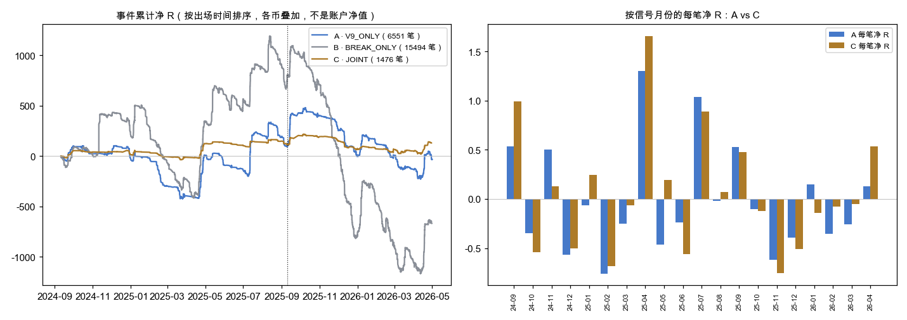

左：三臂各自的**事件累计净 R**（按出场时间排序、所有币叠加；**不是账户净值**，也不是可实现的回撤）；右：按信号月份的每笔净 R，A vs C。

## 1. 范围、冻结与数据边界

- 冻结计划与配置先于任何新计算提交（ca0c536574）：`experiments/active/exp-spike-v10-4-1h-increment-20260918-v1/plan.md`、`config.json`。
  计划里写明「这 20 个月已经看过，不是盲测」。
- 参数：沿用原 manifest（Owner Pine 默认值，联合窗口 6 根，拐点两侧严格），出场/成本/串行规则不变；没有调任何阈值。
- 币池：原 638 个 Binance 永续（2026-08-28 exchangeInfo 快照，sha256 dccd2fa8…）。数据：原 5m 档案，1h 由同源 5m 按 UTC 整点聚合，预热 1500 根。
- 窗口：信号收盘 ∈ [2024-09-10, 2026-05-01)，前后段分界 2025-09-10。**读取边界**：批量计算前先检查全部 638 个文件，
  任何 5m 行开盘 ≥ 2026-05-01 00:00 UTC 即报错（全部通过，最后一根 5m 开盘 2026-04-30 23:55）；没有补 5 月 1–3 日，也没有为了等出场延长数据。
- 期末未平仓记 `censored_boundary`，断档记 `censored_gap`，均不计入已实现盈亏。

## 2. 复现

| 比较 | 原笔数 | 对方笔数 | 仅原有 | 仅对方有 | 14 个字段差异 |
|---|---:|---:|---:|---:|---:|
| 原 run_v1 vs 原代码（ccc52dff29 只读导出）重跑 | 8,041 | 8,041 | 0 | 0 | 0 |
| 原 run_v1 vs 当前 runner（含 trace 钩子） | 8,041 | 8,041 | 0 | 0 | 0 |
| 原联合事件 vs 当前（含预热期） | 1,608 | 1,608 | 0 | 0 | 0（spike/break/顺序/线号/分数） |
| 原随机对照 vs 当前（同 trade_key） | 8,041 | 8,041 | 0 | 0 | 0（抽中的 K 与净 R） |

字段：signal_i、entry_i、entry_time、entry_price、initial_stop、initial_risk、exit_i、exit_time、exit_price、exit_reason、net_r、gross_r、censored、mfe_r；
整数/字符串精确比较，浮点 rtol=atol=1e-10（沿用仓库既有 parity 标准，没有放宽）。原报告数字全部对上：
V9 多头 6,551 笔已平仓、每笔 −0.0051、后段 −0.1593；联合 1,476 笔、+0.0878、总 +129.6、后段 −0.0773；联合信号 1,528 个（=1,476 成交 + 52 因持仓跳过）。

## 3. 联合规则与三臂的入场门

| 门 | A · V9_ONLY | B · BREAK_ONLY | C · JOINT |
|---|---|---|---|
| V9 结构确认（SPIKE） | 必需 | **不要求** | 必需（配对的一方） |
| BB 压缩门、V9 标的/量比/周日门、离六线 ≤3ATR | 必需 | **不要求** | 必需，并且在第二事件当根**再查一次** |
| 下降线突破 | 不要求 | 必需（引擎当根的突破赢家） | 必需（配对的另一方） |
| 六线之上、IMACD 动量、站上母区间上沿 | V9 确认本身包含 | **不要求** | 第二事件当根必需 |
| 出场、成本、每币一笔 | 相同 | 相同（含原始 V9 空头确认平仓） | 相同 |

B 是模块消融参照：它和 A/C 差的不只是「线」，还差所有 V9 门，所以 B 与 C 的差不能全部归因于线的几何形状。

## 4. 实现审计（逐项）

1. **止损冻结与 R 分母**：止损只用信号 K 及之前的数据（近 5 根最低 −0.2ATR 与信号收盘 −2ATR 取低，按 tick 向下取整），
   入场是**次根实际开盘价**，R = 实际入场价 − 冻结止损。联合入场用联合 K 当时的数据重新冻结，**不借用更早的 V9 价格**。
   跳空开盘低于止损时该笔记为 `risk_invalid` 不开仓，止损从不因跳空移动。1h 三臂 `risk_invalid` 均为 0。
2. **线的确认时间 ≠ A/B/C 锚点时间**：线在「三点确认」那根才入池（C 之后至少 8 根的拐点确认延迟），配对要求确认早于两个事件：
   实测确认到第一个事件最少 1 根，确认到联合中位 26 根；联合时刻 = SPIKE 与突破中较晚的那根（测试钉住）。
3. **次根成交按 K 线序号**：entry_i = signal_i + 1（测试钉住），不用时间戳相等判断。
4. **追踪止损时序**：每根先用**旧保护**检查止损（含跳空开盘成交于开盘价），再用本根收盘更新追踪，新保护只从下一根生效（新增测试钉住）。
5. **联合提示不改变 V9**：V9 的原始/最终信号在联合之前独立算好，联合只读取；同一 SPIKE 只被消费一次、窗口外拒绝、第二事件门不过即拒（既有测试）。
   原始 V9 空头确认平仓与入场门无关：同一笔交易在三个臂里得到完全相同的出场（新增测试）。
   **补充发现**：V9 确认那根本身就满足第二事件的全部门槛（六线之上、动量、BB/标的/量比/时段、距离、站上母区间都是 V9 确认的前提），
   所以「先突破后 SPIKE」和「同根」配对不会在 V9 当根被拒；实测 1h 在 V9 当根被拒 0 次，所有拒绝都发生在「先 SPIKE 后突破」的突破那根。
6. **后台结构 vs 屏幕主线**：回测用的是后台候选池里分数最低的合格线（Pine 注释：「当前主线只控制画面，不决定后台结构是否有资格发信号」）。
   trace 逐根记录了 Pine 的显示主线：1,528 个联合里 **1,229（80.4%）** 的线在前一根就是屏幕主线，**299（19.6%）是后台线**，
   联合触发时 Pine 另画一条冻结线，不会用后来的线回填。
7. **数据断档差异**：已发布 V9 引擎在断档后不清空 20 根量能中位数、`ready` 不要求段内 ≥12 根（Pine 会）；SMA/EMA 两边都不重置。
   受影响的最远范围是断档后 24 根。1h 共 8 条流各 1 个断档，**这 8 个窗口里原始信号（多空）、V9 最终信号、突破、联合全部为 0**，
   也没有交易因断档删失；Pine 在这些窗口只会更严格（量比未知即拒）。**结论：该差异对 1h 结果影响为 0**，无需修正版。
8. **相等高点口径**：只重跑既有两种（两侧严格 / 右侧可相等），结论不变（§6）；**不据收益判断哪种才是 TV 行为**。

## 5. 三臂主表

| 臂 | 段 | 信号 | 成交 | 已平仓 | 期末删失 | 因持仓跳过 | 胜率 | 每笔毛R | 每笔净R | 净bp | PF | 总净R | 事件累计R回撤 | 持仓中位(h) | 并发 中位/最大 |
|---|---|---:|---:|---:|---:|---:|---:|---:|---:|---:|---:|---:|---:|---:|---:|
| A V9_ONLY | 全期 | 7,757 | 6,565 | 6,551 | 14 | 1,192 | 29.7% | +0.051 | **−0.005** | −34.3 | 0.992 | −33.6 | 707.9 | 40 | 24 / 212 |
| A | 前段 | 4,332 | 3,625 | 3,625 | 0 | 707 | 33.3% | +0.174 | +0.119 | −3.6 | 1.188 | +432.4 | 527.0 | 46 | 22 / 212 |
| A | 后段 | 3,425 | 2,940 | 2,926 | 14 | 485 | 25.3% | −0.103 | **−0.159** | −72.3 | 0.778 | −466.0 | 709.6 | 33 | 27 / 160 |
| B BREAK_ONLY | 全期 | 23,291 | 15,529 | 15,494 | 35 | 7,762 | 28.1% | +0.024 | −0.043 | −36.8 | 0.939 | −668.5 | 2,356.8 | 32 | 58 / 251 |
| B | 前段 | 10,660 | 7,266 | 7,262 | 4 | 3,394 | 33.8% | +0.229 | +0.157 | +37.8 | 1.238 | +1,140.0 | 924.2 | 37 | 42 / 246 |
| B | 后段 | 12,631 | 8,263 | 8,232 | 31 | 4,368 | 23.1% | −0.158 | −0.220 | −102.6 | 0.706 | −1,808.5 | 2,308.4 | 28 | 70 / 247 |
| C JOINT | 全期 | 1,528 | 1,476 | 1,476 | 0 | 52 | 32.8% | +0.144 | **+0.088** | +17.7 | 1.135 | +129.6 | 197.7 | 41 | 9 / 57 |
| C | 前段 | 772 | 747 | 747 | 0 | 25 | 39.5% | +0.306 | +0.249 | +72.5 | 1.426 | +186.0 | 93.1 | 48 | 7 / 57 |
| C | 后段 | 756 | 729 | 729 | 0 | 27 | 25.9% | −0.022 | **−0.077** | −38.5 | 0.892 | −56.4 | 197.7 | 35 | 10 / 46 |

数量守恒：每个臂 信号 = 已平仓 + 期末删失 + 断档删失 + 因持仓跳过 + 风险无效 + 缺下一根（1h 后三项均为 0），成交行数 = 已平仓 + 删失，全部核对通过（`conservation.csv`）。

辅助（原随机对照方法，种子 91918；p 为相对随机的月块符号翻转）：随机做多每笔 A −0.085 / B −0.152 / C −0.155；
相对随机的配对超额 A +0.082（p=0.139）、B +0.107（p=0.040）、C +0.244（p=0.009）。**这些 p 检验的是「比随机好」，不是「C 比 A 好」。**

## 6. C − A（主增量）

| 段 | 月数 | A 笔数 | C 笔数 | C/A 频次 | A 每笔R | C 每笔R | **差** | 95% 区间 | A bp | C bp | 差 bp | 95% 区间 | A 总R | C 总R | 总R差 |
|---|---:|---:|---:|---:|---:|---:|---:|---|---:|---:|---:|---|---:|---:|---:|
| 全期 | 20 | 6,551 | 1,476 | 22.5% | −0.005 | +0.088 | **+0.093** | [−0.046, +0.223] | −34.3 | +17.7 | +52.0 | [−9.5, +114.2] | −33.6 | +129.6 | +163.2 |
| 前段 | 13 | 3,625 | 747 | 20.6% | +0.119 | +0.249 | +0.130 | [−0.071, +0.337] | −3.6 | +72.5 | +76.1 | [−18.8, +172.7] | +432.4 | +186.0 | **−246.4** |
| 后段 | 8 | 2,926 | 729 | 24.9% | −0.159 | −0.077 | +0.082 | [−0.088, +0.247] | −72.3 | −38.5 | +33.8 | [−40.5, +115.3] | −466.0 | −56.4 | **+409.6** |

- 区间方法：按信号所属 UTC 月份整块有放回重抽，每次带上该月两个臂的**全部**已平仓交易，各自用自己的笔数重算每笔均值再相减；
  种子 91509，2,000 次，有效 2,000 次；零交易月 0；期末删失（A 14 笔）不计入。前后段月数合计 21 是因为 2025-09 被分界切成两半。
  **这是在已看过历史上的描述性不确定性，不是显著性检验。**
- **总 R 差的拆分**（公式：C总R − A总R = 每笔效应 + 频次效应；每笔效应 = C 总R − C笔数×A每笔R，频次效应 = C笔数×A每笔R − A 总R）：
  后段 频次效应 729×(−0.1593) − (−466.0) = −116.1 + 466.0 = **+350R**（少做 3/4 的亏钱交易），每笔效应 −56.4 − (−116.1) = **+60R**；
  前段 频次效应 747×0.1193 − 432.4 = **−343R**（少做了赚钱的交易），每笔效应 186.0 − 89.1 = **+97R**。
- **相等高点敏感性**（右侧可相等，同一 runner）：C 1,594 笔，每笔 +0.093R，差 +0.098 [−0.023, +0.216]；后段 C −0.094，差 +0.066 [−0.088, +0.219]。结论不变。

## 7. 事件账本：V9 事件为什么没成联合

每个 V9 最终多头事件有稳定 ID（`币|1h|V9L|信号K开盘时间`），结构 `币|1h|L|确认时间|轨道|A|B|C`，突破 `币|1h|BRK|时间`，联合 `币|1h|J|时间`。
原因取自 trace（逐线记录的 SPIKE 证据保存/丢弃与配对尝试），不是事后推断。

| 结果 | V9 事件 | 占比 | 影子路径 每笔R | 影子 合计R | ≥3R | ≥10R |
|---|---:|---:|---:|---:|---:|---:|
| 成为联合 | 1,528 | 19.7% | +0.147 | +225.2 | 113 | 12 |
| V9 当根没有任何已确认可用线 | 5,161 | 66.5% | −0.025 | −129.0 | 305 | 39 |
| 已挂在线上，6 根内线没被突破（超时） | 527 | 6.8% | +0.278 | +146.6 | 47 | 9 |
| 等待中失去六线支撑或出现原始空头确认 | 373 | 4.8% | −0.648 | −241.6 | 8 | 0 |
| 突破那根动量不过 | 71 | 0.9% | +0.091 | +6.4 | 6 | 0 |
| 突破那根 BB/标的/量比/距离门不过 | 58 | 0.7% | +0.421 | +24.4 | 3 | 0 |
| 被同线上更新的 V9 事件覆盖 | 14 | 0.2% | +0.477 | +6.7 | 2 | 0 |
| 突破那根未站上母区间 | 10 | 0.1% | −0.652 | −6.5 | 0 | 0 |
| V9 参考盈亏框在等待中结束 | 9 | 0.1% | −1.079 | −9.7 | 0 | 0 |
| 线到寿命过期 | 6 | 0.1% | +0.209 | +1.3 | 1 | 0 |
| 期末未决（等不满 6 根） | 0 | 0 | — | — | — | — |

交易层原因单独记在 `candidate_statuses.csv.gz`（因持仓跳过、风险无效、缺下一根、断档），与「信号不成立」分开。

## 8. 筛选了什么（4.1，影子路径，事后描述）

影子路径 = 对每个 V9 事件都按原 V9 方法独立入场出场，**彼此可以重叠，不是可执行账户**；按「后来是否配对」分组用了未来最多 6 根的信息，
**不能说成 V9 当时就能执行的过滤**。15 条删失路径单列，没有按 0 收益处理。

| 段 | 分组 | V9 事件 | 已平仓 | 删失 | 每笔R | 合计R | 亏损合计 | 盈利合计 | ≥3R | ≥10R | 每笔bp |
|---|---|---:|---:|---:|---:|---:|---:|---:|---:|---:|---:|
| 全期 | 配成联合 | 1,528 | 1,528 | 0 | +0.147 | +225.2 | −968.6 | +1,193.8 | 113 | 12 | +39.2 |
| 全期 | 没配上 | 6,229 | 6,214 | 15 | −0.032 | −201.6 | −4,263.1 | +4,061.5 | 372 | 48 | −43.9 |
| 前段 | 配成联合 | 772 | 772 | 0 | +0.307 | +237.0 | −436.7 | +673.7 | 71 | 3 | +96.5 |
| 前段 | 没配上 | 3,560 | 3,560 | 0 | +0.087 | +310.1 | −2,330.8 | +2,640.9 | 246 | 32 | −11.5 |
| 后段 | 配成联合 | 756 | 756 | 0 | −0.016 | −11.8 | −531.9 | +520.1 | 42 | 9 | −19.3 |
| 后段 | 没配上 | 2,669 | 2,654 | 15 | −0.193 | −511.7 | −1,932.3 | +1,420.6 | 126 | 16 | −87.4 |

**按「V9 当根就能知道的」重新切**（这一刀不用未来信息）：

| 段 | V9 当根的状态 | 事件 | 每笔R | 合计R | ≥3R | ≥10R |
|---|---|---:|---:|---:|---:|---:|
| 全期 | 当根就是联合（同根/先突破） | 1,223 | +0.074 | +90.5 | 82 | 10 |
| 全期 | 当根没有可用线 | 5,161 | −0.025 | −129.0 | 305 | 39 |
| 全期 | 挂在未突破的线上，等后面 6 根 | 1,373 | +0.045 | +62.1 | 98 | 11 |
| 前段 | 当根就是联合 / 无线 / 挂起 | 611 / 3,048 / 673 | +0.240 / +0.091 / +0.185 | +146.8 / +275.9 / +124.4 | | |
| 后段 | 当根就是联合 / 无线 / 挂起 | 612 / 2,113 / 700 | −0.092 / −0.193 / −0.089 | −56.4 / −404.9 / −62.3 | | |

- 真正「筛」的是**当根有没有已确认的下降线**：没有线的 V9 事件占三分之二，前段仍然赚钱（+276R），后段亏得最多（−405R）。
- 「挂起后失去支撑」那 373 个事件的 −242R 不是趋势线的功劳：丢弃证据的原因（跌回六线下/原始空头）和 V9 自己止损是同一件事，
  所以这部分「避开的亏损」有同因果，不能算成可提前知道的筛选收益。

## 9. 等待确认付出了什么（4.2）

对每个联合，比较「V9 确认后次根开盘」与「联合确认后次根开盘、重新按当时信息冻结风险」两条影子路径。

| 顺序 | 联合 | 平均等待(根) | 入场价差 bp 均值/中位 | 初始风险% V9/联合（中位） | 净R V9路径 | 净R 联合路径 | 联合路径折成 V9 的 R | 净bp V9 | 净bp 联合 | 同一出场 |
|---|---:|---:|---|---|---:|---:|---:|---:|---:|---:|
| 先突破后 SPIKE | 714 | 0 | 0 / 0 | 3.77 / 3.77 | +0.147 | +0.147 | +0.147 | +68.2 | +68.2 | 100% |
| 同根 | 509 | 0 | 0 / 0 | 4.45 / 4.45 | −0.028 | −0.028 | −0.028 | −81.8 | −81.8 | 100% |
| 先 SPIKE 后突破 | 305 | 2.1（最多 6） | **+82.6 / +51.4** | 3.89 / 3.75 | +0.442 | +0.181 | +0.203 | **+173.4** | **+82.6** | 65.9% |

- 零等待两组两条路径逐笔相同（核对通过）。只有「先 SPIKE 后突破」付出等待成本：每笔约 **−91bp**。
- 「折成 V9 的 R」= 联合路径净收益率 ÷ V9 路径初始风险比例（共同风险基准），避免把两个不同分母的 R 直接相减。
- **挂起事件的两种做法**（1,373 个挂起事件，影子路径，事后描述）：全部在 V9 次根进场 +62.1R（名义 bp 合计 −35,049）；
  等联合、只做配上的 305 个 +55.1R（名义 bp 合计 +25,191）；同样这 305 个若在 V9 次根进场 +134.7R。
  前段 等 +37.7R vs 不等 +124.4R；后段 等 +17.4R vs 不等 −62.3R——**等待本身也是在「少做」**，
  下跌段有利、上涨段吃亏。R 与 bp 方向相反是因为止损宽窄不同时 R 的分母不同。

## 10. 持仓占用改变了什么（4.3）

| 情况 | 笔数 | 每笔R | 合计R |
|---|---:|---:|---:|
| C 的全部成交 | 1,476 | +0.088 | +129.6 |
| └ 其 V9 事件 A 也成交了 | 1,345 | +0.064 | +85.4 |
| └ 其 V9 事件 A 因持仓没接 | 131 | +0.338 | +44.2 |
| C 成交时 A 正持仓（该币） | 388 | +0.132 | +51.3 |
| 配成联合但 C 因持仓没接（V9 影子） | 52 | +0.400 | +20.8 |
| A 因持仓跳过的 V9 事件（影子） | 1,192 | +0.048 | +57.1 |
| └ 其中后来配成联合 | 182 | +0.375 | +68.3 |

C 有 131 笔（+44.2R）是 A 规则下接不到的；这部分收益来自「C 做得少、所以常空仓」，不是线的判断力。
「事件选择」「确认等待」「持仓机会」三者互相重叠（同一笔交易可以同时属于三类），**不能直接相加成 C−A 的因果分解**。

## 11. 原结果勘误（不覆盖原文件，只在这里记录）

| 项目 | 原文 | 实际 | 影响 |
|---|---|---|---|
| 1h 拆解报告第 7 节「去掉最好的 1%（15 笔）」 | 15 笔，剩 1,462 | `len//100 = 1476//100 = 14` 笔，剩 1,462；被删 ID 见 `errata_top1pct_removed_ids.csv` | 标签「15」写错；表内数值本来就是按 14 笔算的，结论不变 |
| 配对超额 +0.2436 与「+0.0878 − (−0.1550) = +0.2428」不等 | — | 配对超额只在 1,473 对匹配成功的交易上计算（3 笔无同层随机点），配对内信号均值 +0.0886 | 分母不同，不是算错；原表应加注 |

## 12. 账户级：未完成（只补了已实现余额账本）

仓库已有 `spike_account_growth.simulate_shared_account`（已实现余额记账，10% 组合初始风险上限、3 倍名义上限、20% 余额下限锁）及其既有固定配置（固定/复利 × 3%/5%/10%）。
用它回放 A、C 的结果**极度依赖路径**：组合风险上限让 A 只收进 1–341 笔、C 只收进 1–360 笔；
同为 C，复利 10% 为 +750%，复利 5% 为 −24%，固定 10% 只收进 1 笔。A 在全部配置下为 −11%~−81%。
这个账本**没有逐时浮动盈亏，也没有滑点、资金费率**，这些数字只说明「入选哪几笔决定一切」，**不能当账户验证**。
**含未平仓浮动盈亏的逐时账户净值验证尚未完成**；本轮不新建组合框架、不猜仓位（明细 `cashbook.csv`）。

## 13. 核对图（固定种子 91509 随机抽，不按收益挑）

三种联合顺序各 2 个 + 6 个未联合的 V9 事件（ID 与种子见 `check_samples.csv`）。每张左边是「决策 K 收盘时可见」的 K 线、六条均线和当时已确认的结构
（联合：冻结的 A-B 线延到联合 K，灰点划线=线的三点确认时刻，金虚线=突破，蓝点线=V9，红线=联合；未联合：只画当时池里真实存在的线，没有就不画），
右边是之后的交易路径（绿三角=次根开盘入场，红虚线=初始止损，×=出场；未联合事件用 V9 影子路径）。**未经 Owner 人工验收，不能声称形态识别精确率/召回率通过。**

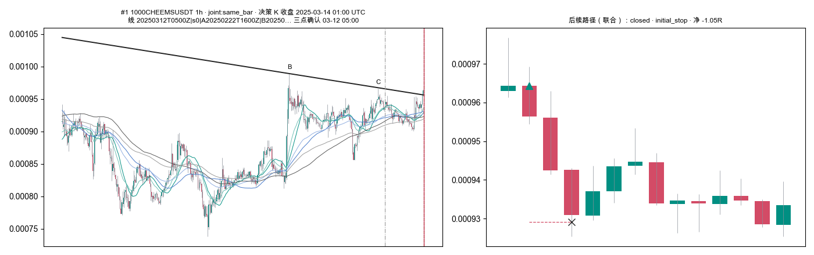
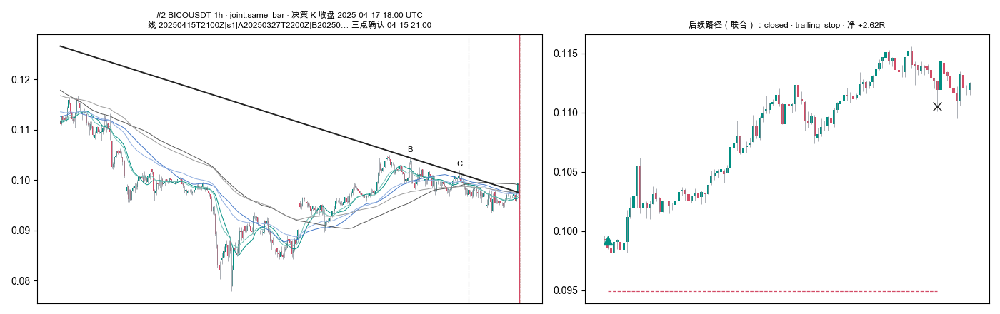
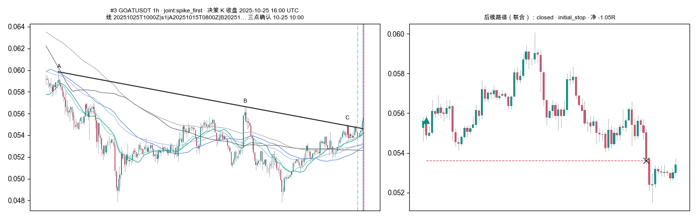
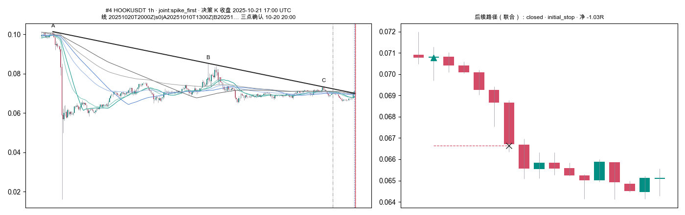
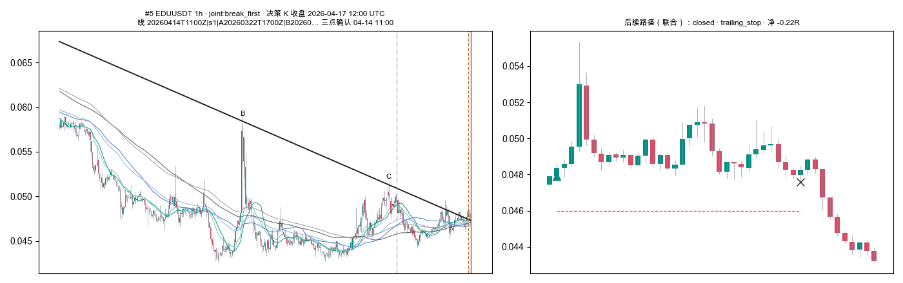
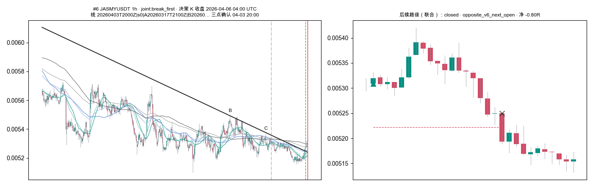
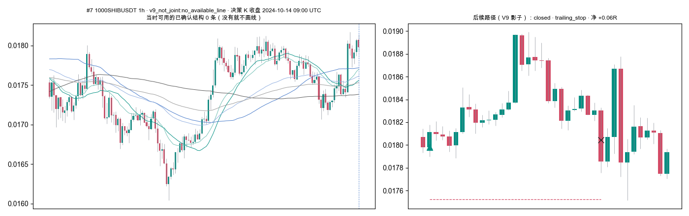
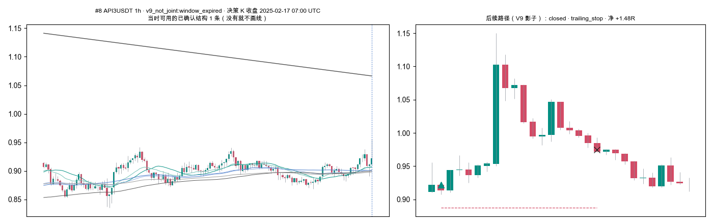
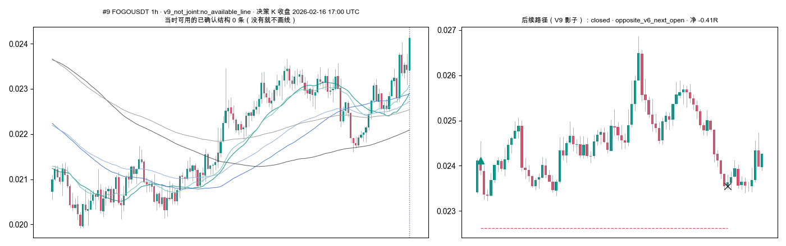
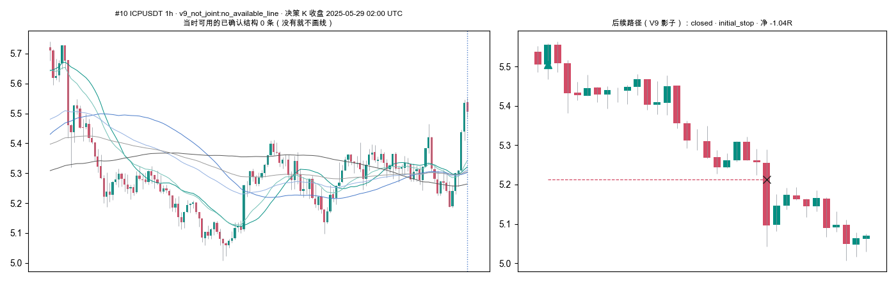
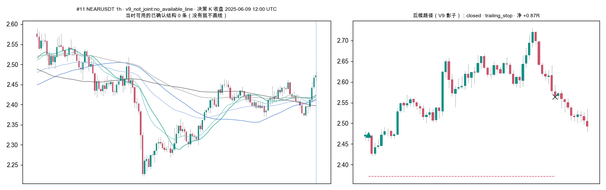
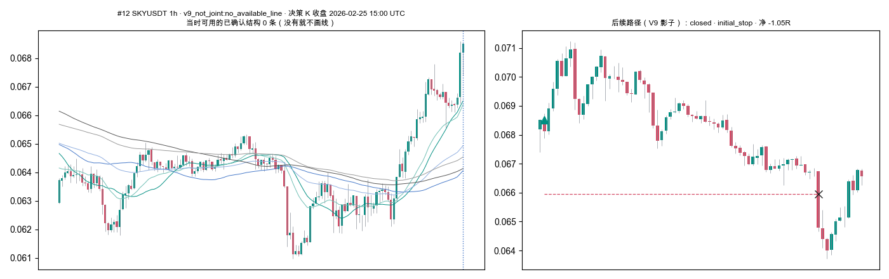

## 14. 必报项说明

- **val AUC、top-decile**：没有模型与打分，按字面不适用；对应的零假设对照 = 匹配随机做多（§5 辅助）+ A 臂（不加联合门的同引擎基线）+ B 臂（只有线、没有 V9 门）。
- **置换检验**：C−A 用月块共同重抽样区间（§6）；相对随机用原月块符号翻转 p（§5）。两者不混用。

## 15. 风险与诚实声明

- **不是盲测、不是新样本**：这 20 个月的 1h 结果此前已在六周期与 1h 拆解报告里读过；1h 本身就是从六个周期里被挑出来关注的，
  只跑 1h 消除不了之前的选择与多重比较。顺序、影线、月份、币种分组只做诊断，没有据此删组或发布「最优配置」。
- **TV 一致性未验证**；相等高点规则 TV 未公开，两种口径都跑了、结论相同，但哪种是 TV 行为仍未知。
- 影子路径彼此重叠，只做归因；「是否配对」分组用了未来最多 6 根信息。
- 币池有幸存者偏差（只含 2026-08-28 仍在交易的币）；tick 用当前值；滑点、资金费率未建模。
- 事件累计 R 是所有币叠加，不是账户净值，也不是可实现回撤。
- 本轮修改：给 V10.4 移植加了**只记录**的 trace 钩子（测试与逐流断言均证明不改变任何事件）；没有改生产 Pine、没有调阈值、没有改出场、没有建 V10.5、
  没有读 holdout、没有 push、没有启动前向服务、没有下单或 promote。

## 16. 下一步（均需 Owner 决定；本轮不自动执行）

1. **推荐：不把联合作为硬过滤。** 若要保留，只作为 V9 之上的**提示标签**（「当根已有突破线」），V9 仍按原规则交易。
2. 若要前向验证，固定配置：V10.4 Owner 默认参数、拐点两侧严格、1h、只做多、联合窗口 6、出场与成本同本报告；
   **从 2026-09-18 之后的新数据起记录**，每个 V9 事件记：`v9_event_id, signal_close, joint_status_at_v9_bar(joint_now/no_line/pending), final_pair_status, joint_id, order, wait_bars, line_id, line_displayed_main, entry_price, initial_stop, exit_time, exit_price, exit_reason, net_r, net_bp`。
   可复用的命令：`python3 -m yoyo.evaluation.spike_v10_4_increment --output <新目录>`（需先在新数据上建立新的数据边界与 manifest；不得读取 2026-05-04 之后的 holdout 历史，除非 Owner 单独批准并记为该配置第 1 次消耗）。
3. 含浮动盈亏的账户级验证、TV 逐根对照（需要 Owner 提供 TV 导出）尚未完成。

## 17. 文件

输出目录 `experiments/active/exp-spike-v10-4-1h-increment-20260918-v1/runs/v104-1h-incr-20260918-01/`（按仓库 .gitignore 不入 git，留在本机；
小文件——各表 CSV、图、manifest、命令、测试日志、哈希——另存一份到已跟踪的 `statistics/v104-1h-incr-20260918-01/`）：
`analysis/`（主表、C−A、事件原因、筛选、实时切分、等待、持仓、勘误、断档审计、账本、逐笔 trades/statuses/v9 事件/联合/结构/突破/配对尝试、月度、核对图与抽样 ID）、
`strict/` 与 `right_inclusive/`（逐币原始输出与 manifest）、`repro_original/`（原代码重跑）、`commands.md`（实际命令与耗时）、`test_log.txt`、`hashes.json`。
复现：见 `commands.md`。
