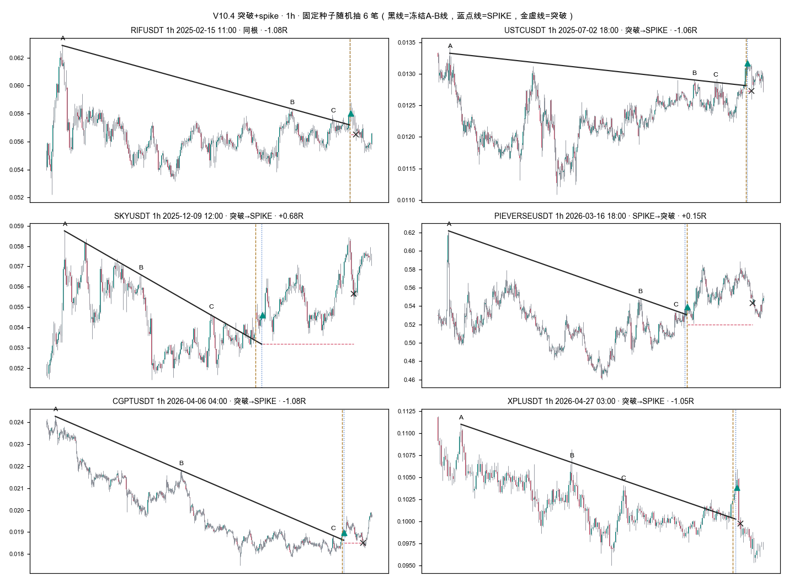

# SPIKE V10.4「突破+spike」只做多 · 6 个周期回测——没有一个周期通过；1h 最接近

2026-09-18 · Owner Pine「SPIKE V10.4 · 突破+spike」· Binance USD-M 638 个永续 · 5m/15m/30m/1h/4h/1d · **holdout 消耗 0**

**结论一句话：6 个周期都未通过事前门槛。** 5m、15m 全期每笔为负（−0.24R、−0.06R）：5m 扣费前就是负的（毛 −0.04R），15m 毛 +0.05R 被每笔约 0.09R 的成本吃掉；
30m、1h 全期为正（+0.12R、+0.09R），但**后段 2025-09-10→2026-05-01 两个都转负**；
4h 后段 −0.55R/笔、还跑输随机入场；1d 20 个月只有 8 笔，无法判断。
1h 是唯一「稳定强于随机入场」的周期：全期配对超额 +0.24R（月块 p=0.009），后段也 +0.17R（p=0.033）——
信号**挑点比随机好**，但后段整个多头环境为负（随机多头 −0.25R/笔），好得不够抵消。

## 1. 规则（按 Owner Pine 默认值逐字落地）

Owner：「跑一下回测吧 只做多 只做突破➕spike信号的 5min 15min 30min 1h 4h 1d 周期都跑一下 币种数据你都有的 不用新拉数据」。

- **信号 = V10.4 联合事件**：V9 多头最终确认（SPIKE）与「双轨三点下降线」的收盘突破，
  **先 SPIKE 后突破或先突破后 SPIKE 都算，间隔 ≤6 根**；第二个事件的当根还要满足：收在六线之上、
  IMACD 动量向上（md>sb 且 md 上升）、BB 压缩门 + V9 标的/量比/UTC 周日门、离六线 ≤3ATR、收盘站上原启动区间上沿。
  趋势线：完整影线与削尖影线（上影最多保留 0.6ATR）两套高点各自找 A/B/C，A、B 定线、C 贴线 ≤0.35ATR，
  反弹间回落 ≥2ATR，实体越线 >0.15ATR 淘汰，最多 2 根不连续针刺，连续 2 根收盘高于线 +0.2ATR 算突破。全部是 Pine 默认值，**没调任何参数**。
- **只做多，只在联合信号上开仓。** 普通 V9 信号、单独突破都不开仓。
- **出场**：Pine 里联合信号「不重置原盈亏框」，没有它自己的出场，所以沿用 V9 盈亏框的规则（与已发布 V9 回测同一个引擎）：
  联合 K 收盘后**下一根开盘入场**；初始止损 = min(近 5 根最低 − 0.2ATR, 收盘 − 2ATR)；收盘到 2R 后启动 4ATR 收盘追踪；
  原始 V9 空头确认 → 次根开盘平仓；数据断档记为删失。**没有固定止盈。**
- **成本** 往返 0.2%。**持仓**：每个 币种×周期 同时最多一笔，信号收盘时空仓才接。

参照臂 `v9_long` = 所有 V9 多头确认都做多，其余完全相同——用来看「联合门」比「只用 V9 多头」多了什么。

## 2. 数据、分母、holdout

| 项目 | 本次 |
|---|---|
| 数据 | 本地 Binance USD-M 官方月度 5m 归档（`data/kline_preholdout_binance_um5m`），638 个永续（2026-08-28 exchangeInfo 快照中仍在交易的），**没有新拉数据** |
| 周期 | 15m/30m/1h/4h/1d 全部由同一份 5m 按 UTC 整点分桶聚合（4h 在 00/04/08…，1d 在 00:00 UTC） |
| 评估窗 | 信号收盘 ∈ [2024-09-10, 2026-05-01)，与已发布 V9/V10 同窗；前段 →2025-09-10，后段 2025-09-10→2026-05-01（7.7 个月） |
| 预热 | 每个周期向前 1500 根（1d 从 2020-08 起），是否就绪由指标自己判断 |
| **holdout** | 数据源最后一根 5m 开盘 2026-04-30 23:55；加载器对 ≥2026-05-04 的任何行报错。**消耗 0** |

| 周期 | 评估窗 K 数 | 就绪的币 | V9 多头信号 | 生成的线 | 线突破 | **联合信号** | 有联合的币 | 实际开仓 |
|---|---:|---:|---:|---:|---:|---:|---:|---:|
| 5m | 82,622,997 | 624 | 92,432 | 205,646 | 212,030 | **13,533** | 619 | 13,171 |
| 15m | 27,540,770 | 623 | 26,939 | 78,870 | 81,302 | **4,867** | 609 | 4,711 |
| 30m | 13,770,253 | 623 | 14,259 | 42,037 | 43,438 | **2,809** | 577 | 2,709 |
| 1h | 6,885,049 | 622 | 7,757 | 22,641 | 23,291 | **1,528** | 519 | 1,476 |
| 4h | 1,721,128 | 624 | 1,834 | 6,086 | 6,177 | **354** | 247 | 341 |
| 1d | 286,708 | 453 | 43 | 436 | 427 | **8** | 8 | 8 |

联合信号约是 V9 多头信号的 15%–20%；其中 76%–80% 落在 V9 信号那根（同根或先突破后 SPIKE），其余是「先 SPIKE、后面几根才突破」，入场比 V9 晚。
1d 的 V9 多头本身就极少（BB 压缩 + 均线密集在日线上很少同时成立），所以日线几乎没有样本。

**不是全盲。** 30m/1h/4h 这 20 个月已被 V9/V10 在另一个币池（Binance+OKX+Gate）上按方向切过，多头后段为负是已知的；
事前计划（`PROJECT_PLAN.md`，跑之前提交）写明了「预期多数周期不通过」。5m/15m/1d 此前没有全池 V9 结果。

## 3. 主结果：联合信号只做多（`joint` 臂）

配对超额 = 同币种×周期、同月、同时段、同 ATR/价格分桶的**一次确定性随机做多**，走同一套出场与成本，
配对差的均值；p = 整月块符号翻转（检验对象是配对超额，不是池子自身收益）。
各币种×周期是叠加的，没有共同资金，「总净R」不是账户收益，「事件回撤」也不是账户回撤。

| 周期 | 段 | 已平仓 | 胜率 | **每笔净R** | PF | 总净R | 每笔净 bp | 成本(R)中位 | 随机均值R | **配对超额R** | p(月块) |
|---|---|---:|---:|---:|---:|---:|---:|---:|---:|---:|---:|
| 5m | 全期 | 13,165 | 27.3% | **−0.2401** | 0.701 | −3,161.6 | −28.1 | 0.171 | −0.3327 | +0.0922 | 0.033 |
| 5m | 前段 | 6,625 | 28.0% | −0.2209 | 0.721 | −1,463.5 | −26.4 | 0.165 | −0.2961 | +0.0757 | 0.143 |
| 5m | 后段 | 6,540 | 26.6% | −0.2596 | 0.682 | −1,698.1 | −29.9 | 0.178 | −0.3697 | +0.1090 | 0.055 |
| 15m | 全期 | 4,708 | 30.8% | **−0.0560** | 0.921 | −263.5 | −10.0 | 0.094 | −0.1764 | +0.1203 | 0.045 |
| 15m | 前段 | 2,501 | 35.5% | +0.1160 | 1.177 | +290.0 | +23.3 | 0.094 | −0.1836 | +0.2996 | 0.004 |
| 15m | 后段 | 2,207 | 25.4% | −0.2508 | 0.672 | −553.5 | −47.8 | 0.096 | −0.1681 | −0.0832 | 0.940 |
| 30m | 全期 | 2,703 | 30.1% | **+0.1242** | 1.182 | +335.6 | +15.0 | 0.068 | −0.0994 | +0.2241 | 0.053 |
| 30m | 前段 | 1,356 | 33.3% | +0.2897 | 1.447 | +392.8 | +35.7 | 0.069 | −0.0113 | +0.3010 | 0.109 |
| 30m | 后段 | 1,347 | 26.8% | −0.0425 | 0.941 | −57.2 | −5.9 | 0.068 | −0.1884 | +0.1465 | 0.194 |
| **1h** | 全期 | 1,476 | 32.8% | **+0.0878** | 1.135 | +129.6 | +17.7 | 0.050 | −0.1550 | **+0.2436** | **0.009** |
| 1h | 前段 | 747 | 39.5% | +0.2490 | 1.426 | +186.0 | +72.5 | 0.051 | −0.0615 | +0.3105 | 0.082 |
| 1h | 后段 | 729 | 25.9% | **−0.0773** | 0.892 | −56.4 | −38.5 | 0.050 | −0.2511 | +0.1748 | 0.033 |
| 4h | 全期 | 330 | 30.9% | **+0.0233** | 1.035 | +7.7 | −17.4 | 0.025 | +0.2288 | −0.1958 | 0.847 |
| 4h | 前段 | 160 | 46.9% | +0.6378 | 2.291 | +102.0 | +406.9 | 0.023 | +0.7056 | −0.0678 | 0.605 |
| 4h | 后段 | 170 | 15.9% | −0.5549 | 0.326 | −94.3 | −416.7 | 0.027 | −0.2281 | −0.3184 | 0.860 |
| 1d | 全期 | 8 | 50.0% | +6.4563 | 13.78 | +51.7 | — | 0.010 | +11.4318 | −4.9755 | 0.883 |

**事前判定**（每个周期单独判：全期与后段每笔净 R > 0、配对超额 > 0、月块 p < 0.01）：

| 周期 | 全期>0 | 后段>0 | 超额>0 | p<0.01 | 判定 |
|---|---|---|---|---|---|
| 5m | ✗ | ✗ | ✓ | ✗ | 未过 |
| 15m | ✗ | ✗ | ✓ | ✗ | 未过 |
| 30m | ✓ | ✗ | ✓ | ✗ | 未过 |
| 1h | ✓ | ✗ | ✓ | ✓ | 未过（只差后段为负） |
| 4h | ✓ | ✗ | ✗ | ✗ | 未过 |
| 1d | ✓ | ✗ | ✗ | ✗ | 未过（8 笔，无法判断） |

6 个周期是 6 次检验，未做多重比较校正；1h 的 p=0.009 按 Bonferroni ×6 = 0.054，校正后也不显著。

## 4. 与「只用 V9 多头」对照（同数据、同出场）

| 周期 | V9多头 笔数 | V9多头 每笔R | V9多头 超额 | 联合 笔数 | 联合 每笔R | 联合 超额 | V9多头 后段 | 联合 后段 |
|---|---:|---:|---:|---:|---:|---:|---:|---:|
| 5m | 78,095 | −0.2761 | +0.0450 | 13,165 | −0.2401 | +0.0922 | −0.3114 | −0.2596 |
| 15m | 23,205 | −0.0999 | +0.0487 | 4,708 | −0.0560 | +0.1203 | −0.2338 | −0.2508 |
| 30m | 12,152 | +0.0385 | +0.1274 | 2,703 | +0.1242 | +0.2241 | −0.1525 | −0.0425 |
| 1h | 6,551 | −0.0051 | +0.0816 | 1,476 | +0.0878 | +0.2436 | −0.1593 | −0.0773 |
| 4h | 1,578 | +0.0049 | −0.1672 | 330 | +0.0233 | −0.1958 | −0.5127 | −0.5549 |
| 1d | 41 | +1.3766 | −0.7441 | 8 | +6.4563 | −4.9755 | −0.9686 | −1.0068 |

- 在 5m/15m/30m/1h 上，联合门让**每笔**和**配对超额**都变好（1h 超额 +0.08 → +0.24R），笔数只剩约 20%。
  30m/1h 的后段也少亏（−0.15→−0.04、−0.16→−0.08），但**没有转正**。
- 4h 两个臂都跑输随机入场（随机多头在前段 +0.71R/笔，是 2024 年底的单边行情，任何做多都赚），联合门没救它。
- 这是「同一批入场里挑出更好的 20%」，不是「多赚了钱」：30m 联合总净 R +336 小于 V9 多头 +468；1h 从 −34 变成 +130。

## 5. 利润集中在极少数大单上

| 周期 | 联合 总净R | ≥10R 的单 | 它们合计 | 去掉最好的 1% 之后 | 贡献最大的币 |
|---|---:|---:|---:|---:|---|
| 30m | +335.6 | 22 | +520.4 | **−233.5** | RAVEUSDT 一笔 +134.7R（2026-04-07），占全期 40% |
| 1h | +129.6 | 11 | +203.2 | **−102.0** | LYNUSDT +33.0R、PROMUSDT +32.9R，较分散 |
| 4h | +7.7 | 2 | +32.0 | −33.2 | — |

追踪止损本来就靠少数大单吃肥尾，这本身不是缺陷；但 30m 的正结果**近一半来自一笔**，去掉它后段就是 −192R。
1h 更分散，月块检验也更稳，这是它排在最前的原因。

## 6. 联合顺序（同根 / 先 SPIKE 后突破 / 先突破后 SPIKE）

| 周期 | 顺序 | 已平仓 | 每笔R | PF | 配对超额 | p |
|---|---|---:|---:|---:|---:|---:|
| 30m | 突破→SPIKE | 1,184 | +0.2726 | 1.390 | +0.3223 | 0.066 |
| 30m | 同根 | 882 | −0.0192 | 0.970 | +0.1189 | 0.173 |
| 30m | SPIKE→突破 | 637 | +0.0468 | 1.067 | +0.1869 | 0.185 |
| 1h | 突破→SPIKE | 689 | +0.1694 | 1.259 | +0.4345 | 0.004 |
| 1h | 同根 | 493 | −0.0268 | 0.959 | −0.0163 | 0.553 |
| 1h | SPIKE→突破 | 294 | +0.0887 | 1.143 | +0.2319 | 0.033 |
| 15m | 突破→SPIKE | 2,157 | −0.1055 | 0.854 | +0.0407 | 0.309 |
| 15m | 同根 | 1,561 | −0.0108 | 0.984 | +0.1475 | 0.062 |
| 15m | SPIKE→突破 | 990 | −0.0191 | 0.973 | +0.2510 | 0.012 |

30m/1h 上「先突破、后 SPIKE」最好，「同根」最差。**这是事后分组，不是事前假设**，只能当下一轮的候选线索，不能当结论。

## 7. 拐点相等高点敏感性（事前追加）

TradingView 没有公开 `ta.pivothigh` 遇到相等高点怎么算。主跑用两侧严格大于；跑之前（只看过信号数量、没看任何收益）
发现粗 tick 币在 5m 上这个选择会让拐点数差到 20% 以上，于是事前追加一次复跑，**只改这一个变量**：
左侧严格、右侧可以相等（平台高点取最左一根）。

| 周期 | 联合信号 严格→单侧 | 每笔净R 严格 | 每笔净R 单侧 | 配对超额 严格 | 配对超额 单侧 | p 严格 | p 单侧 | 后段每笔R 严格 | 后段 单侧 | 判定 |
|---|---:|---:|---:|---:|---:|---:|---:|---:|---:|---|
| 5m | 13,533 → 16,758 (+24%) | −0.2401 | −0.2493 | +0.0922 | +0.0914 | 0.033 | 0.010 | −0.2596 | −0.2726 | 未过 / 未过 |
| 15m | 4,867 → 5,519 (+13%) | −0.0560 | −0.0352 | +0.1203 | +0.1446 | 0.045 | 0.023 | −0.2508 | −0.2269 | 未过 / 未过 |
| 30m | 2,809 → 3,084 (+10%) | +0.1242 | +0.1346 | +0.2241 | +0.2518 | 0.053 | 0.038 | −0.0425 | −0.0493 | 未过 / 未过 |
| 1h | 1,528 → 1,651 (+8%) | +0.0878 | +0.0926 | +0.2436 | +0.2292 | 0.009 | 0.009 | −0.0773 | −0.0937 | 未过 / 未过 |
| 4h | 354 → 367 (+4%) | +0.0233 | +0.0394 | −0.1958 | −0.2191 | 0.847 | 0.879 | −0.5549 | −0.5660 | 未过 / 未过 |
| 1d | 8 → 8 | +6.4563 | +6.4563 | −4.9755 | −4.9755 | 0.883 | 0.883 | −1.0068 | −1.0068 | 未过 / 未过 |

信号数量随周期变短而差得越多（5m +24%），但**每一格的正负号都不变，每个周期的判定都不变**，
每笔净 R 的差 ≤0.03R。结论不依赖这个未公开细节。

## 8. 画出来核对（固定种子随机抽 6 笔 1h 联合交易，不按结果挑）



黑线 = 冻结的 A-B 线延伸到联合当根；A/B/C 标在对应高点；蓝点线 = V9 SPIKE；金虚线 = 突破；绿三角 = 次根开盘入场；红虚线 = 初始止损；× = 出场。
6 条线都是「三次反弹高点、依次走低、中间有明显回落」的下降线，突破在右端，和 Pine 的定义一致。

## 9. 必报指标说明

- **val AUC、top-decile 毛/净收益**：本轮没有模型、没有打分排序，只有一个 0/1 规则信号，这两项按字面不适用。
  对应的零假设对照用**匹配随机入场**（同币种×周期、同月、同时段、同波动桶，同出场同成本）+ 整月块符号翻转，
  以及同数据同出场的 `v9_long` 参照臂（相当于「单特征基线」：不加联合门）。
- **置换检验 p**：见上表的月块符号翻转 p（2,000 次，种子 91509，与 V9 同）。

## 10. 复现命令

```bash
git checkout ccc52dff29   # 主跑的代码（port + runner + tests + plan + config）
PYTHONPATH=. python3 -m pytest tests/evaluation/test_spike_v10_4.py -q
E=experiments/active/exp-spike-v10-4-joint-multitf-20260918-v1
PYTHONPATH=. python3 -W ignore -m yoyo.evaluation.spike_v10_4_study --output $E/results/run_v1 --workers 8
git checkout 9e98a0068e   # 敏感性开关 + 统计脚本（两侧严格的路径不变，测试钉住）
PYTHONPATH=. python3 -W ignore -m yoyo.evaluation.spike_v10_4_study --output $E/results/run_ties_v1 --workers 8 --pivot-ties right_inclusive
PYTHONPATH=. python3 -W ignore -m yoyo.evaluation.spike_v10_4_report --run $E/results/run_v1 --out $E/statistics/run_v1
PYTHONPATH=. python3 -W ignore -m yoyo.evaluation.spike_v10_4_report --run $E/results/run_ties_v1 --out $E/statistics/run_ties_v1
PYTHONPATH=. python3 -W ignore -m yoyo.evaluation.spike_v10_4_figures --stats $E/statistics/run_v1 --out $E/statistics/run_v1/examples_1h.png --timeframe 1h
```

主跑 638 个币 × 6 周期约 11 分钟（8 进程）。

## 11. 移植怎么验证的

- `tests/evaluation/test_spike_v10_4.py`（19 项）：向量化的三点搜索和线校验，与**逐行照抄 Pine 循环**的参考实现在合成行情和真实 SOL 1h 上逐条相等（候选顺序、分数、淘汰原因、针刺计数）；
  截断任意未来 K 线不改变过去任何事件；突破与 SPIKE 间隔 0/±3/±6 根触发、±7 根不触发；第二事件当根门不过就拒绝；
  一次 SPIKE 只被消费一次；V9 参考止损当根结束；5m→高周期聚合正确；runner 构造的 V8 掩码与已发布低周期 V8 掩码逐根相同。
- V9 部分没有重写，直接调用已发布引擎。
- 第 8 节随机抽样的画图核对。

## 12. 风险与诚实声明

- **不是 TradingView 结果。** 这是 Python 移植；Pine 未在 TV 上跑过对照。`ta.pivothigh` 的相等高点规则 TV 未公开（见第 7 节）；
  V9 引擎的 `ready`/量比中位数在数据断档处不重置（Pine 会重置），只影响断档附近少数 K 线（5m–4h 每周期共 8 个断档，1d 共 92 个）。
- **幸存者偏差**：币池是 2026-08-28 仍在交易的 638 个，已下架的币不在里面；tick 用当前 tickSize。
- **不是盲测**：30m/1h/4h 的这 20 个月已被 V9/V10 看过（另一币池）。
- **1h 的 p=0.009 未做多重比较校正**，按 6 个周期 Bonferroni 为 0.054。
- **30m 的正结果近一半来自一笔**（RAVEUSDT +134.7R）。
- 1d 只有 8 笔，任何日线结论都没有统计意义。
- 出场不是 Owner 给的：联合信号在 Pine 里不开自己的盈亏框，这里借用 V9 的出场规则。换出场是另一个变量，本轮没动。
- 没有训练、没有调参、没有 promote、没有改仓、没动真金。

## 13. 下一步选项

1. **留档不动**（推荐）。6 个周期都没过；最好的 1h 也是「比随机好但后段绝对为负」，和 V9/V10 的后段问题同源。
2. 若 Owner 想继续挖 1h：事前登记「只做 1h × 先突破后 SPIKE」作为**单一**假设，只在新的前向数据上验证（不用这 20 个月再切），
   或申请 holdout（**需要 Owner 批准**，将是该配置第 1 次消耗）。不建议现在做——第 6 节是事后分组。
3. 若 Owner 想要联合信号有自己的出场（而不是借 V9 的），那是换出场这一个变量，需要 Owner 先给出出场规则。

**需要 Owner 决策的**：是否留档（选项 1），或是否为 1h 单一假设做前向/holdout（选项 2，涉及 holdout 则必须 Owner 批准）。
