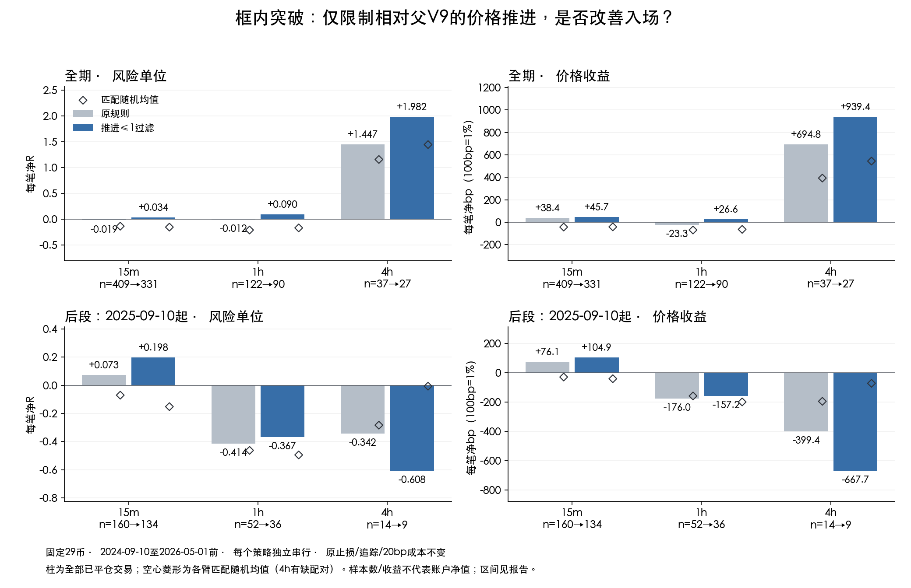

# V11.2：限制入场前价格推进，三个周期均未通过研究筛查

2026-09-20 · `exp-spike-v112-entry-extension-20260920-v1`

结论：固定29币，只试一个因果入场门——突破收盘相对父V9收盘的推进，不超过父信号收盘到原止损的一份距离。15m和1h全期净R从负转正，但不足以接受此规则：三个周期的全期改善区间都跨0，1h后段仍亏，4h后段更差。保留15m时机线索；拒绝本规则准入，不搜索新阈值，不修改Pine/监控/实盘。

## 唯一改动与因果口径

令父V9信号为s，框内首次突破为i。`S_s=floor(min(min(low[s-4:s+1])-0.2ATR_s, close_s-2ATR_s)/tick)*tick`；`E=(close_i-close_s)/(close_s-S_s)`。B臂只接受原A臂首破且E<=1的候选。该分母是父信号收盘到止损的尺度，不是实际成交R；公式不读取父次根开盘、父MFE或未来退出。负推进、零等待都保留；无效锚点拒绝，本轮无无效值。

原`box_joints`先消费每框首破，再过滤；拒绝不允许同框重试。A/B各自完整串行，可能释放新候选，但这次实际新增成交为0，全部差异来自直接拒绝120笔原交易。原下一开盘入场、五根低点/2ATR止损、收盘2R激活、收盘减4ATR单向追踪并下一根生效、反向信号下一开盘退出及20bp成本全部保持。

实验计划、实现和19项相关测试先提交为`a744bb3e72`再跑行情。阈值1.0没有网格搜索。最近6次收盘变化效率另记为Q6，七个收盘、平价为0，只描述不参与过滤。

## 数据完整性与范围

- 原Binance USDT永续5m档案，信号窗2024-09-10 UTC至2026-05-01 UTC之前；15m←1h、1h←4h、4h←1d。沿用Owner选定29币（ARY除外、PEPE=1000PEPE），新币上市历史不同，日线预热覆盖继承原限制。
- 29个币全部重跑；571候选/状态完整复现，基线570入场/568平仓复现。一个15m候选因占仓跳过。过滤后450入场/448平仓，原PEPE和XTZ两笔4h边界持仓保留且不计已实现收益。
- 基线570笔的入场/退出/价格/时间/止损/风险/MFE/状态/随机控制逐项一致；共享450笔全部一致。571个候选与旧状态集合一致。源行情前后SHA、代码、元数据、源账本和逐币产物都有回执。
- Luna Max有界只读复核未发现阻塞错误；另核对控制信号索引、时间和分层身份，原570与共享450均一致。主程序控制身份断言覆盖不足由交付附加核验补齐，未改原运行代码。
- 原始候选E<=0/0<E<=1/E>1：15m为138/194/78，1h为38/52/32，4h为17/12/10；按chart/htf、通过/占仓细分见`statistics/candidate_counts.csv`。负推进被允许，不把该门称为完整“择时正确”证明。
- 2025-09-10 UTC切分。早段要求入场信号和退出都在切点前；1h原3笔跨界、新2笔跨界单列，不能混进早段。早段随机控制跨切点也剔除配对。后段已被以前研究看过，不是新盲测。

## 全期与后段结果

表中均为已平仓；R基于各笔自己的初始风险距离，bp为无杠杆价格收益扣原20bp成本。总R、总bp均是事件加总，不是账户复利/净值，也不能合并不同周期当同一账户。

| 时段 | 周期 | 笔数 原→新 | 胜率 原→新 | 总净R 原→新 | 每笔净R 原→新 | 每笔净bp 原→新 | R利润因子 原→新 |
| --- | --- | ---: | ---: | ---: | ---: | ---: | ---: |
| 全期 | 15m | 409→331 | 31.54%→32.63% | −7.97→+11.21 | −0.0195→+0.0339 | +38.40→+45.73 | 0.973→1.049 |
| 全期 | 1h | 122→90 | 32.79%→35.56% | −1.47→+8.08 | −0.0121→+0.0898 | −23.34→+26.55 | 0.982→1.136 |
| 全期 | 4h | 37→27 | 48.65%→55.56% | +53.55→+53.50 | +1.4474→+1.9815 | +694.82→+939.44 | 4.008→5.331 |
| 后段 | 15m | 160→134 | 30.00%→32.09% | +11.64→+26.47 | +0.0728→+0.1975 | +76.12→+104.87 | 1.098→1.279 |
| 后段 | 1h | 52→36 | 21.15%→25.00% | −21.55→−13.23 | −0.4144→−0.3675 | −175.97→−157.23 | 0.480→0.504 |
| 后段 | 4h | 14→9 | 28.57%→22.22% | −4.78→−5.47 | −0.3417→−0.6075 | −399.43→−667.70 | 0.533→0.236 |

全期毛R均值原→新分别0.1061→0.1622、0.0541→0.1601、1.4791→2.0123；毛bp均为净bp加20。早段15m仍−15.26R，1h+15.46R，4h+58.97R；新1h跨界两笔+5.85R。所有时段、毛净指标见`statistics/summary.csv`。

不能把15m均值提高直接说成“总收益提高”：全期净bp加总15705.60→15137.33，反而少568.27bp，而净R增加19.18R。这是按风险等权与按名义金额等权的差异。4h也类似：均值上升主要因为少做10笔，总净R略降0.0534R、总净bp少343.41。

## 匹配随机与改善区间

每笔沿用同币×同月份×同时间折叠×ATR/价格桶的固定随机入场，同退出、成本、seed；共同trade_key随机对照相同。随机入场不要求满足新E门，不是随机账户回放。图中黑色菱形只对应匹配子集；4h缺配对的一笔为原AERO随机控制边界未闭合。

| 全期 | 臂 | 配对数 | 配对策略均值R | 随机均值R | 超额R：95%月块区间 | 单侧符号置换p |
| --- | --- | ---: | ---: | ---: | --- | ---: |
| 15m | 原 | 409 | −0.0195 | −0.1368 | +0.1173 [−0.0930,+0.3468] | 0.1639 |
| 15m | 新 | 331 | +0.0339 | −0.1547 | +0.1886 [−0.0730,+0.4639] | 0.0840 |
| 1h | 原 | 122 | −0.0121 | −0.2105 | +0.1984 [−0.1355,+0.6021] | 0.1644 |
| 1h | 新 | 90 | +0.0898 | −0.1694 | +0.2592 [−0.0918,+0.6339] | 0.1084 |
| 4h | 原 | 36 | +1.4422 | +1.1547 | +0.2874 [−1.4831,+2.1987] | 0.3778 |
| 4h | 新 | 26 | +1.9948 | +1.4426 | +0.5522 [−1.9054,+3.0795] | 0.3483 |

三周期预注册调整p分别0.2519、0.3253、1.0，均未达到0.01。原控制不新增E条件，因而只能回答被选事件相对原匹配随机的表现，不能独立识别E的因果贡献。

新−原均值差按共同UTC月份成块重抽样2000次，各臂用自己的交易数作为分母：

| 周期 | 全期净bp差：95%区间 | 后段净bp差：95%区间 | 全期净R差：95%区间 | 后段净R差：95%区间 |
| --- | --- | --- | --- | --- |
| 15m | +7.33 [−18.34,+33.39] | +28.76 [+7.49,+54.38] | +0.0533 [−0.0283,+0.1346] | +0.1248 [+0.0490,+0.1885] |
| 1h | +49.89 [−25.40,+132.09] | +18.75 [−106.55,+89.42] | +0.1019 [−0.0627,+0.2637] | +0.0469 [−0.2875,+0.2664] |
| 4h | +244.62 [−84.62,+699.84] | −268.26 [−470.32,−52.27] | +0.5341 [−0.0783,+1.4367] | −0.2658 [−0.5707,+0.0065] |

15m/1h全期20月块、后段8；4h全期11、后段仅4。15m后段改善区间为正是真实线索，但全期不稳定且随机优势门未过；4h后段价格收益变差。不能从局部区间挑一句“已验证有效”。三周期预先冻结的综合筛查全部失败，详见`statistics/verdict.csv`。

## 少亏了什么，又漏掉了什么

| 周期全期 | 被过滤 | 避开亏单 | 亏损R绝对值 | 漏掉赢家 | 放弃盈利R | 新增成交 | 总R净变化 |
| --- | ---: | ---: | ---: | ---: | ---: | ---: | ---: |
| 15m | 78 | 57 | 60.66 | 21 | 41.49 | 0 | +19.18 |
| 1h | 32 | 24 | 24.65 | 8 | 15.09 | 0 | +9.56 |
| 4h | 10 | 7 | 5.45 | 3 | 5.51 | 0 | −0.05 |

总差逐项满足“新增净额−消失净额”，没有用已成交账本简单删行代替串行回放。此次占仓变化没有新增/替代成交，所以过滤成分可以直接核对。被漏的赢家包括ENA 15m +7.16R（E4.03）、PUMP 1h +5.68R（E1.38）、PEPE 15m +4.49R（E1.50）和ZEC 4h +3.32R（E2.41）。强趋势走得远后还能继续走；只用距离上限会误伤。

上一轮8张图对照如下，原交易结果没有被重写：

| 案例 | 原净R | E | 本门结果 |
| --- | ---: | ---: | --- |
| PENDLE 1h / 15516 | −1.051 | 6.766 | 拒绝；确实避开晚入场失败案例 |
| ZEN 1h / 6819 | −1.112 | 0.751 | 保留；盘中冲高却收盘未激活的问题仍存在 |
| ETH 15m / 29561 | −0.785 | 0.014 | 保留；激活追踪仍未保本的问题仍存在 |
| BTC 15m / 22776 | −1.763 | 0.981 | 保留；小风险距离放大成本仍存在 |
| BTC 4h / 2728 | −1.054 | 0.000 | 保留；零等待也能很快失败 |
| APT 4h / 3323 | −0.240 | 1.017 | 拒绝；反向退出小亏 |
| DASH 4h / 1860 | +32.485 | 0.625 | 保留最大赢家 |
| AERO 1h / 3340 | +8.380 | 0.228 | 保留最大1h赢家 |

尾部敏感性：新15m去掉最大两笔后总净R−8.37；新1h仅去掉AERO最大赢家后即−0.30R；新4h去掉DASH/BTC两笔后还+8.56R，但相对匹配随机均值−0.675R。这里只检验依赖性，不据此删真实赢家。完整变化逐笔见`statistics/changed_trades.csv`。

## 继续研究什么，不能推出什么

Q6只作描述：1h效率<=0的8笔均值−1.068R，(0,.5]的39笔−0.304R，>.5的75笔+0.252R；但高效率组随机超额区间仍跨0，4h也不呈单调关系。完整分段与对照都留在`statistics/feature_groups.csv`。这只支持把“信号前推进是否连续”登记为另一条待检验假设，不允许本轮临时加第二个门。

本轮能支持的判断是：部分入场确认过迟，但“已经涨了多少”无法独立区分耗尽与强趋势延续。后续优先级可选持续推进的独立单变量检验，或另开利润保护单变量研究；本轮没有完成这两项、没有声称最优参数。生产门、阈值预设、真实下单仍由Owner单独决策。

## 风险与诚实声明

- 这是Owner事后指定币池和已经多次看过的历史档案；单次冻结阈值不能消除既有选择偏差，不是新盲测、也不是当前OKX/TV信号一致性证明。
- 因果特征并不能证明价格推进是亏损原因；单边门保留负E，并无法描述突破根内部先冲高再回落。使用原引擎旧MFE口径，上一轮查到的两个退出根内微小修正不影响本轮入场/退出。
- 月块少、4h样本极少；CI/符号置换用于研究筛查，不代表稳定实盘优势。没有新增模型，val AUC、top-decile排序及模型单特征基线不适用；这里的单变量E与原规则/匹配随机构成对应的可检验对照。
- 收益已扣固定20bp但不是执行级滑点/资金费率/容量重建。不同风险尺度导致R与价格收益不等价，未提供真实组合仓位或杠杆收益。
- 失败实验完整保存，三周期均不接受，训练/生产资格false。无HTML、无默认策略修改。

## 复现与证据入口

在原仓根目录、主环境和既有原始档案下：

```bash
.venv/bin/python -m pytest -q tests/evaluation/test_spike_v112_entry_extension.py tests/evaluation/test_spike_v112_support.py
.venv/bin/python -W ignore -m yoyo.evaluation.spike_v112_entry_extension
.venv/bin/python -W ignore -m yoyo.evaluation.spike_v112_entry_extension_figure
```

回放在输入/代码已提交且SHA相同情况下可验证续跑；不覆盖不同身份运行。若要从原始行情重算，应在已有本实验目录完成归档后使用空运行输出目录，保留旧证据；原始大档案不入git。

- [冻结计划](../experiments/active/exp-spike-v112-entry-extension-20260920-v1/PROJECT_PLAN.md)
- [完成回执](../experiments/active/exp-spike-v112-entry-extension-20260920-v1/completion.json)、`run/identity.json`和29个`run/streams/*/completion.json`
- [逐笔两臂账本](../experiments/active/exp-spike-v112-entry-extension-20260920-v1/statistics/trades.csv.gz)、[完整候选](../experiments/active/exp-spike-v112-entry-extension-20260920-v1/statistics/decisions.csv.gz)
- [全分段指标](../experiments/active/exp-spike-v112-entry-extension-20260920-v1/statistics/summary.csv)、[独立复核](../experiments/active/exp-spike-v112-entry-extension-20260920-v1/independent_review.md)
- [Notion实验记录](https://app.notion.com/p/3e08856479af818bb35dfb97ca51f890)已标记拒绝，原观察与失败结果均保留。


