# 突破+spike 逐笔明细 + 抽样 50 张图（框内规则）

2026-09-19 · 15m（看 1h 突破）/ 1h（看 4h 突破）· Binance 638 个永续 · 2024-09-10 ~ 2026-04-30 · 未 push

这页只是把上一份「框内突破就算」回测（[p1_spike_v11_box_joint_20260918](p1_spike_v11_box_joint_20260918.html)）的**每一笔都摊开**，
没有改任何规则或参数。逐笔重算的进场价、出场 K 和账本 9,287 笔全部一致（有一笔对不上程序就会报错停下）。

- **全部明细（Excel，中文列名）**：[逐笔明细_突破spike.xlsx](../../experiments/active/exp-spike-v11-box-joint-20260918-v1/statistics/trade_book/逐笔明细_突破spike.xlsx)
  —— 「全部」表 9,287 行（15m 7,088、1h 2,199），「抽样50张」表是下面 50 张图对应的那 50 行。
- **50 张图怎么抽的**：每个周期从已平仓的单子里随机抽 25 笔（随机种子 91509），**不看盈亏**，按时间排序编号。

## 1. 每一行 / 每张图说的是什么

同一个 V9 多头框，放两笔交易对照着看：

| | 什么时候进 | 止损 | 出场 |
|---|---|---|---|
| **V9 从信号进场**（绿▲ → 白×，绿红框） | V9 多头信号 K 收盘后，下一根开盘 | 进场 K 前 5 根最低 −0.2ATR 与 收盘 −2ATR 取低 | 到 2R 后按 收盘−4ATR 追踪；V9 空头确认下一根开盘平；碰止损平 |
| **等突破+spike 再进场**（橙▲ → 橙X，橙点线=止损） | 框还开着时第一次出现突破（本周期线或上级线），突破那根收盘后下一根开盘 | 同一套公式，按突破那根**重新算** | 同上 |

- **回测统计的是第二笔**（等突破+spike 再进场）。第一笔只是放在旁边对照。
- 每笔都扣了 0.2% 往返成本。**R** = 盈亏 ÷ 进场到止损的距离，−1R 左右就是打到止损（加成本约 −1.05~−1.15R）。
- **距V9信号根数** = 突破比 V9 信号晚几根。0 = 同一根，这时两笔完全是同一笔交易。

**Excel 列：**
V9信号K / 进场价 / 止损 / 出场时间 / 出场价 / 出场原因 / 净R / 最大浮盈R；
突破来源（本周期 / 上级 1h / 上级 4h）；突破+spike K；距V9信号根数；
联合（= 等突破+spike 再进场）的进场价 / 止损 / 出场 / 出场原因 / 净R / 净收益bp / 最大浮盈R；
那条被突破的趋势线的 A、B、C 三点（时间、价格）和三点确认时间。时间一律北京时间，K 线时间是开盘时间。

## 2. 一张图怎么看

- 蓝/紫 K 线、六条均线（青=20，蓝=60，灰=120，SMA 与 EMA 各一条）、下面是 IMACD，和你 TV 上的配色接近。
- **白线** = 本周期趋势线，**浅蓝线** = 上级（1h 或 4h）趋势线，标了 A/B/C 和「三点确认」；A 太远画不下时，左上角写「A 在图外左侧：时间 · 价格」。
- **金色标签「突破+spike」**（上级来的写「突破+spike（上级突破）」）+ 竖线 = 回测认定的那根。
- 绿红框 = V9 从信号进场那笔的盈亏框，虚线 1R/2R/3R，绿实线 = 这笔最高摸到过几 R（峰值）。
- 标题第二行直接写两笔的结果和出场原因。

## 3. 汇总（全部已平仓单）

| 周期 | 段 | 笔数 | V9 从信号进场 每笔R | V9 胜率 | **等突破+spike 再进场 每笔R** | 胜率 |
|---|---|---:|---:|---:|---:|---:|
| 15m | 前段 2024-09~2025-09 | 3,769 | +0.702 | 50.5% | **+0.078** | 33.9% |
| 15m | 后段 2025-09~2026-04 | 3,313 | +0.252 | 38.9% | **−0.292** | 24.3% |
| 15m | 全期 | 7,082 | +0.491 | — | **−0.095** | 29.4% |
| 1h | 前段 | 1,122 | +0.630 | 48.5% | **+0.038** | 32.5% |
| 1h | 后段 | 1,077 | +0.431 | 40.4% | **−0.228** | 22.9% |
| 1h | 全期 | 2,199 | +0.532 | — | **−0.092** | 27.8% |

「等突破+spike 再进场」这一列就是上一份报告里的「框内+任一」，数字一致；
同币同月同波动的随机做多对照和 p 值在那份报告里（15m 比随机多 +0.089R、p=0.086；1h +0.013R、p=0.393，都没过）。

**为什么 V9 那列这么好看、却用不上：**
这张表只收录「框里后来出现了突破」的 V9 单。框能一直开着等到突破，本身就说明这单那会儿还没被止损——
亏得快的 V9 单根本等不到突破，不在表里。所以 +0.49R / +0.53R 是**事后挑出来的**，下单那一刻你不知道后面会不会突破。
能真做的只有第二列：等突破出现再进，价格已经走高了一段、止损按新位置算，结果每笔 −0.09R。

**两笔差在哪（逐笔对比）：**
- V9 赚、等突破再进却亏：15m 1,221 笔、1h 385 笔；反过来（V9 亏、等突破再进赚）只有 109 笔、18 笔。
- 同一根就突破（距=0，两笔完全相同）：15m 1,568 笔、1h 494 笔。
- 典型样子看图 #04（RIFUSDT）：V9 从 0.0824 进场拿到 +10.96R，第 169 根才出现上级 1h 突破，那时追进 0.0975，
  止损只差 1.4%，一个回踩就 −1.15R 出局。#18、#21、#35、#36、#43 也是这种。

**50 张抽样本身**：等突破再进场每笔 −0.074R，V9 从信号进场 +0.807R，和全体差不多，抽样没有偏。

## 4. 风险与诚实声明

- 没有新的收益结论，只是把已有结果逐笔展开；「匹配随机对照」「置换检验」在上一份报告，本页不重复算。
- 图是 Python 按回测数据画的，不是 TradingView 截图；线和信号用的是回测复刻的规则，和 TV 上 V11.2 的一致性没有逐根核对过。
- 趋势线画的是「这次突破用的那条线」，别的线没画，所以图上线会比 TV 少。
- 这 20 个月被反复看过，不是盲测；滑点、资金费率没算；币池有幸存者偏差。

## 5. 下一步（你决定）

1. 翻几张图，如果发现某笔「这不该算突破+spike」或「线画错了」，告诉我图号，我逐根查。
2. 想看更多：可以按币种 / 月份 / 突破来源再抽，或者把某一笔单独画长一点。

## 复现命令

```bash
PYTHONPATH=. python3 -W ignore -m yoyo.evaluation.spike_v112_trade_book --out experiments/active/exp-spike-v11-box-joint-20260918-v1/statistics/trade_book --workers 8
python3 scripts/md_to_html.py analysis/p1_spike_v11_box_trade_book_20260919.md --out-dir analysis/html
```

## 6. 抽样 50 张

### 15m（25 张）

**#01 ETHUSDT 15m** · 2024-09-13 23:30 · 来源 本周期 · V9 信号后第 1 根 · V9 从信号进场 **+0.19R**（V9空头确认平仓）· 等突破+spike 再进场 **+0.27R**（V9空头确认平仓）

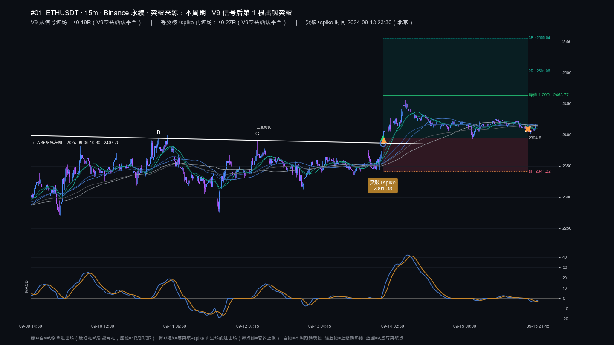

**#02 MANAUSDT 15m** · 2024-09-24 15:15 · 来源 本周期 · V9 信号后第 0 根 · V9 从信号进场 **-1.15R**（初始止损）· 等突破+spike 再进场 **-1.15R**（初始止损）

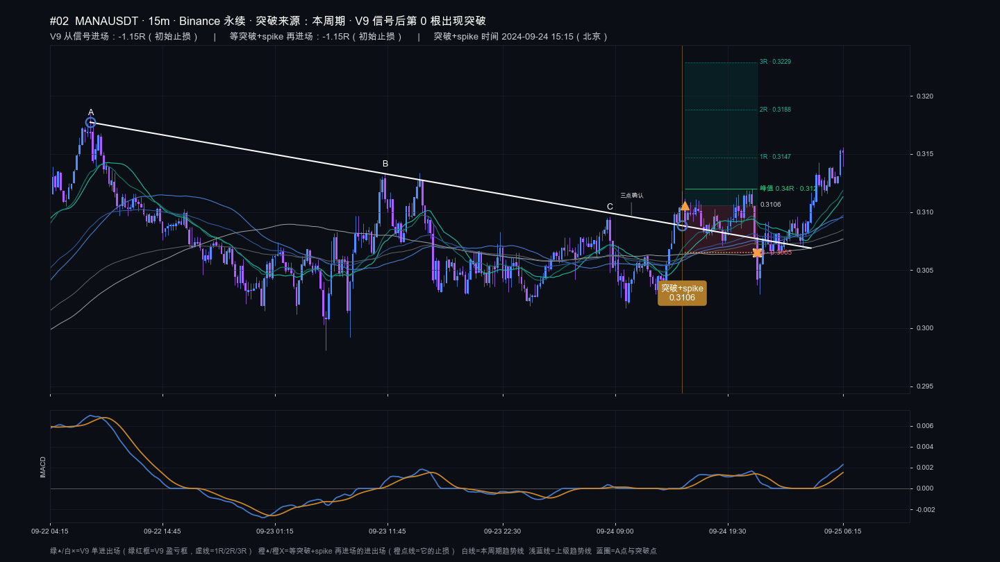

**#03 MKRUSDT 15m** · 2024-10-06 09:15 · 来源 本周期 · V9 信号后第 10 根 · V9 从信号进场 **-0.14R**（追踪止损）· 等突破+spike 再进场 **-1.18R**（初始止损）

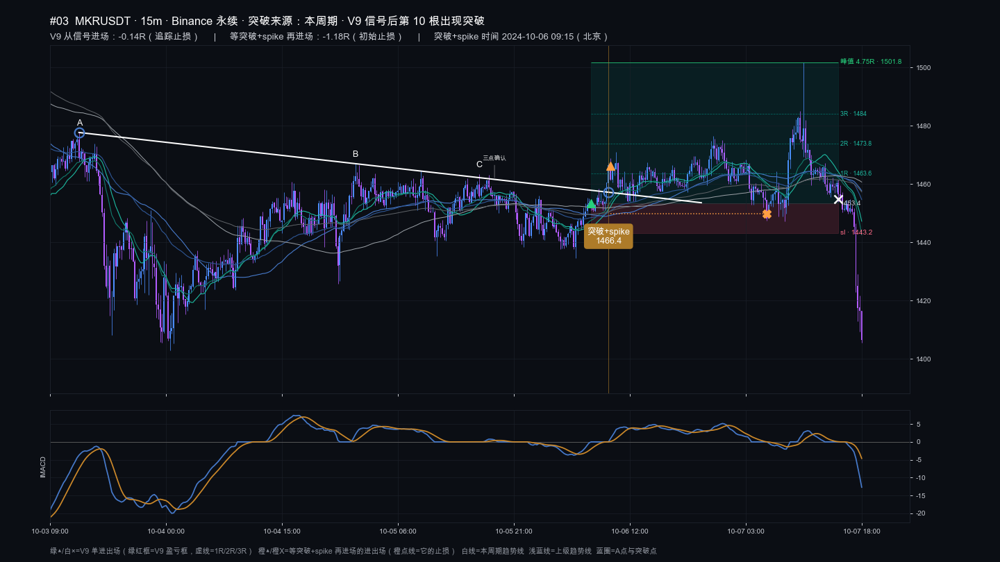

**#04 RIFUSDT 15m** · 2024-11-07 10:00 · 来源 上级 1h · V9 信号后第 169 根 · V9 从信号进场 **+10.96R**（追踪止损）· 等突破+spike 再进场 **-1.15R**（初始止损）

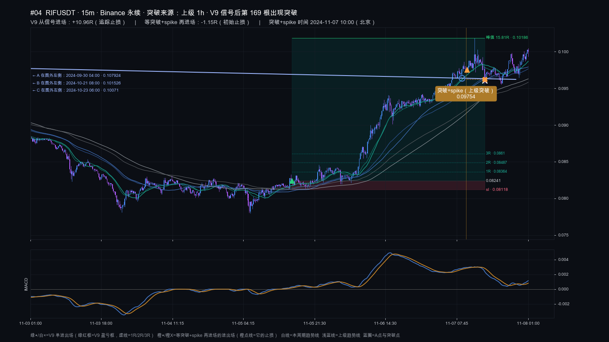

**#05 ADAUSDT 15m** · 2024-11-20 04:15 · 来源 本周期 · V9 信号后第 4 根 · V9 从信号进场 **-1.08R**（初始止损）· 等突破+spike 再进场 **-1.09R**（初始止损）

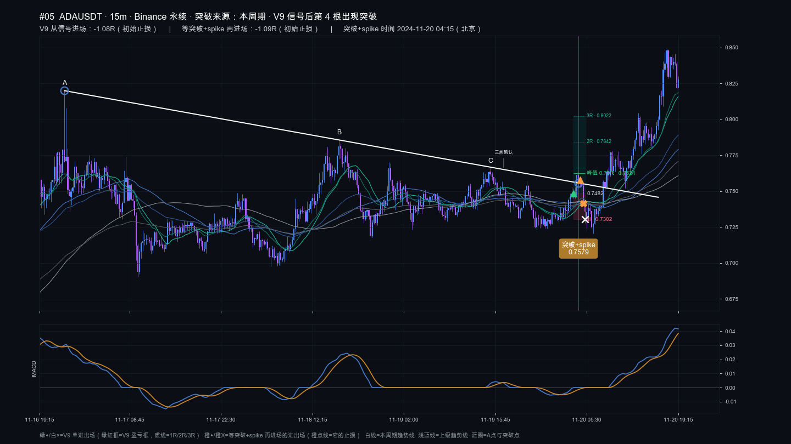

**#06 MANAUSDT 15m** · 2024-11-21 20:30 · 来源 本周期 · V9 信号后第 1 根 · V9 从信号进场 **+9.91R**（追踪止损）· 等突破+spike 再进场 **+10.88R**（追踪止损）

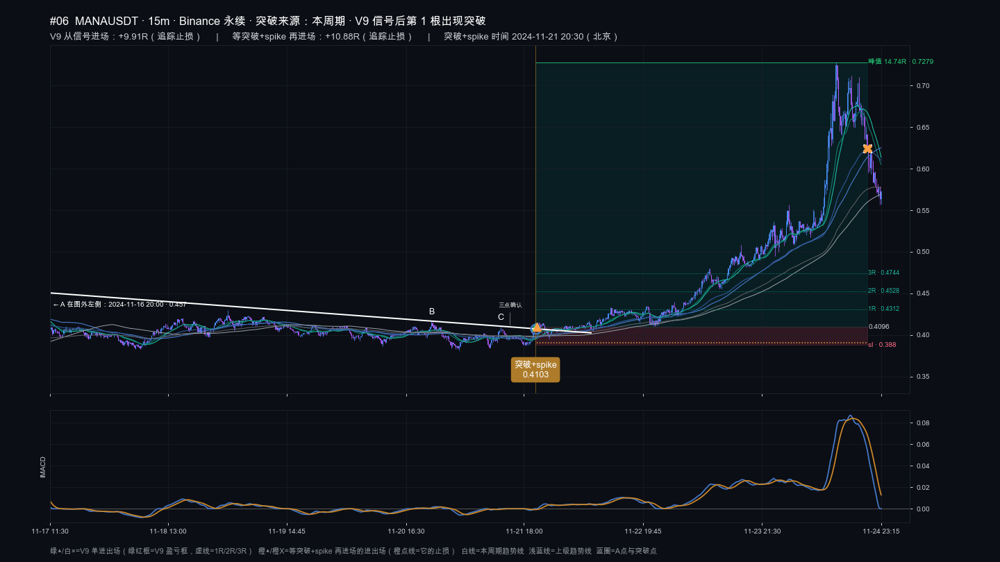

**#07 SAGAUSDT 15m** · 2024-12-24 04:30 · 来源 本周期 · V9 信号后第 4 根 · V9 从信号进场 **+1.46R**（追踪止损）· 等突破+spike 再进场 **+0.69R**（追踪止损）

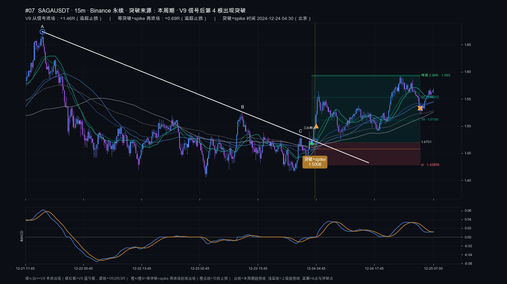

**#08 RAYSOLUSDT 15m** · 2025-02-07 22:00 · 来源 本周期 · V9 信号后第 0 根 · V9 从信号进场 **-1.03R**（初始止损）· 等突破+spike 再进场 **-1.03R**（初始止损）

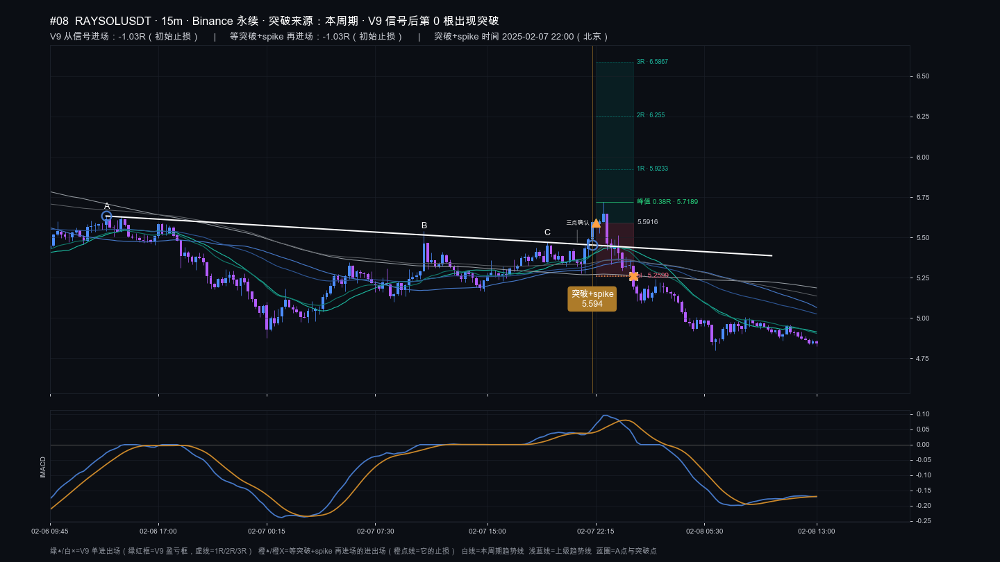

**#09 MYROUSDT 15m** · 2025-02-09 01:00 · 来源 本周期 · V9 信号后第 14 根 · V9 从信号进场 **+0.14R**（V9空头确认平仓）· 等突破+spike 再进场 **-0.60R**（V9空头确认平仓）

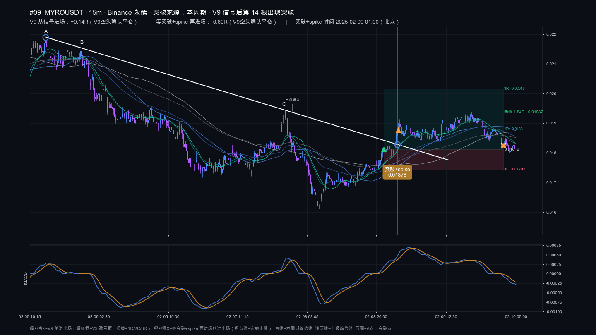

**#10 DIAUSDT 15m** · 2025-02-16 23:45 · 来源 本周期 · V9 信号后第 383 根 · V9 从信号进场 **+0.09R**（V9空头确认平仓）· 等突破+spike 再进场 **-1.13R**（初始止损）

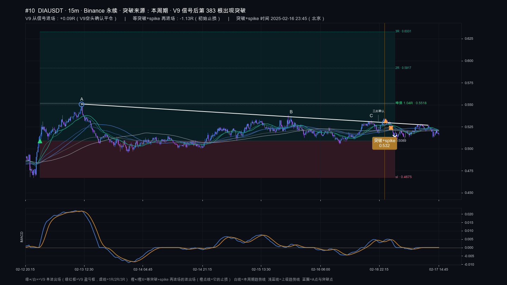

**#11 BOMEUSDT 15m** · 2025-02-21 16:00 · 来源 本周期 · V9 信号后第 14 根 · V9 从信号进场 **+0.91R**（追踪止损）· 等突破+spike 再进场 **+1.12R**（追踪止损）

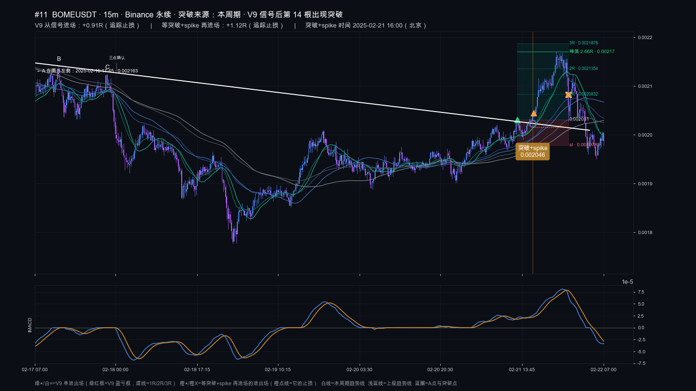

**#12 BCHUSDT 15m** · 2025-03-15 17:00 · 来源 本周期 · V9 信号后第 17 根 · V9 从信号进场 **+1.09R**（追踪止损）· 等突破+spike 再进场 **-1.06R**（初始止损）

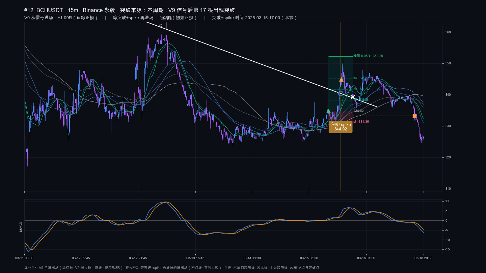

**#13 POPCATUSDT 15m** · 2025-05-21 05:00 · 来源 上级 1h · V9 信号后第 1 根 · V9 从信号进场 **+1.95R**（追踪止损）· 等突破+spike 再进场 **+1.84R**（追踪止损）

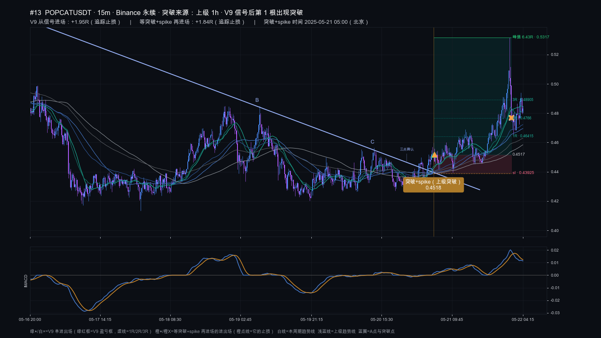

**#14 FISUSDT 15m** · 2025-06-03 10:00 · 来源 上级 1h · V9 信号后第 2 根 · V9 从信号进场 **-1.10R**（初始止损）· 等突破+spike 再进场 **-1.13R**（初始止损）

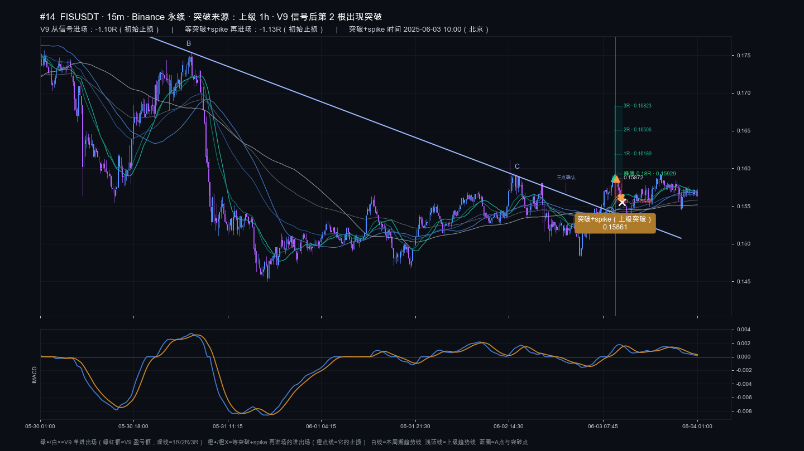

**#15 SANDUSDT 15m** · 2025-06-04 00:00 · 来源 上级 1h · V9 信号后第 72 根 · V9 从信号进场 **-0.91R**（V9空头确认平仓）· 等突破+spike 再进场 **-1.19R**（初始止损）

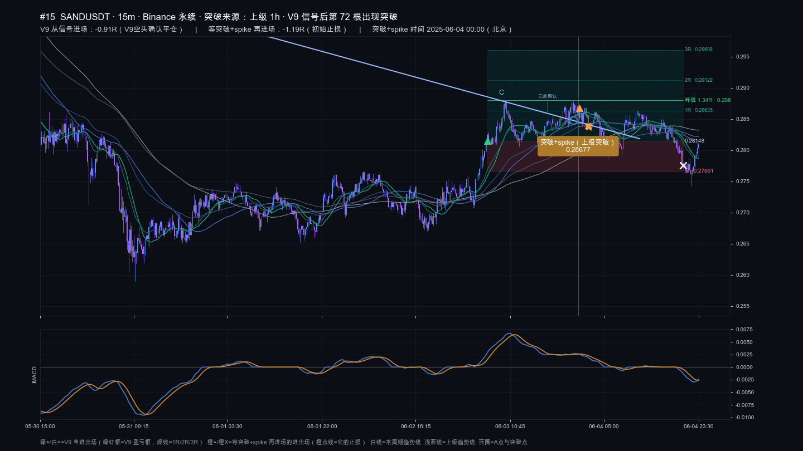

**#16 CHESSUSDT 15m** · 2025-06-14 10:45 · 来源 本周期 · V9 信号后第 37 根 · V9 从信号进场 **-1.06R**（初始止损）· 等突破+spike 再进场 **-1.08R**（初始止损）

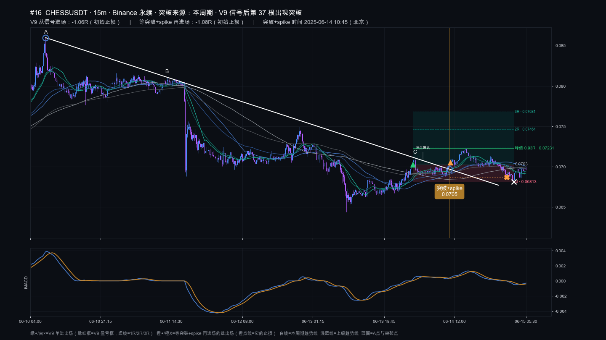

**#17 BANANAUSDT 15m** · 2025-06-28 23:45 · 来源 本周期 · V9 信号后第 96 根 · V9 从信号进场 **+1.68R**（追踪止损）· 等突破+spike 再进场 **+3.24R**（追踪止损）

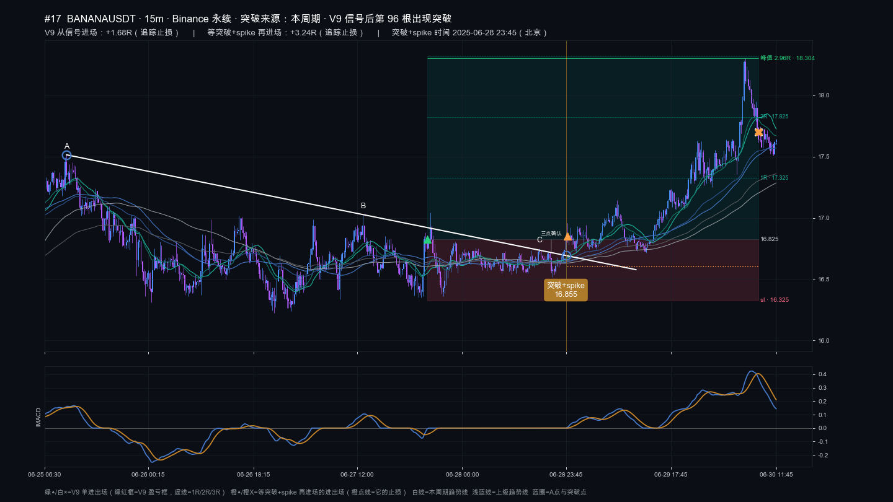

**#18 EIGENUSDT 15m** · 2025-07-09 20:15 · 来源 本周期 · V9 信号后第 23 根 · V9 从信号进场 **+3.90R**（追踪止损）· 等突破+spike 再进场 **-1.09R**（初始止损）

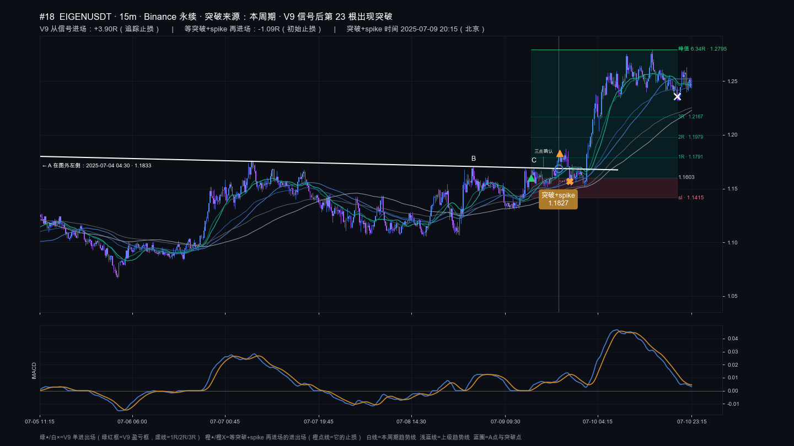

**#19 AIOUSDT 15m** · 2025-08-26 16:15 · 来源 本周期 · V9 信号后第 1 根 · V9 从信号进场 **+0.29R**（V9空头确认平仓）· 等突破+spike 再进场 **+0.60R**（追踪止损）

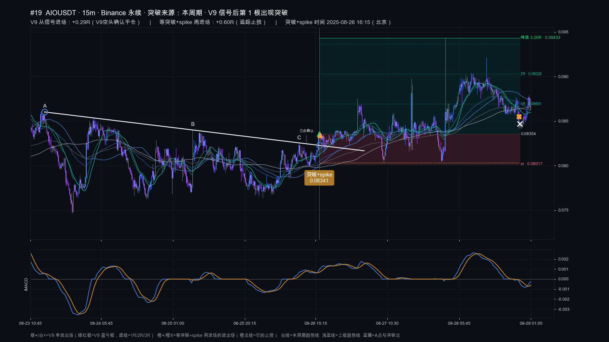

**#20 DOTUSDT 15m** · 2025-10-26 02:00 · 来源 上级 1h · V9 信号后第 22 根 · V9 从信号进场 **-0.16R**（V9空头确认平仓）· 等突破+spike 再进场 **-0.62R**（V9空头确认平仓）

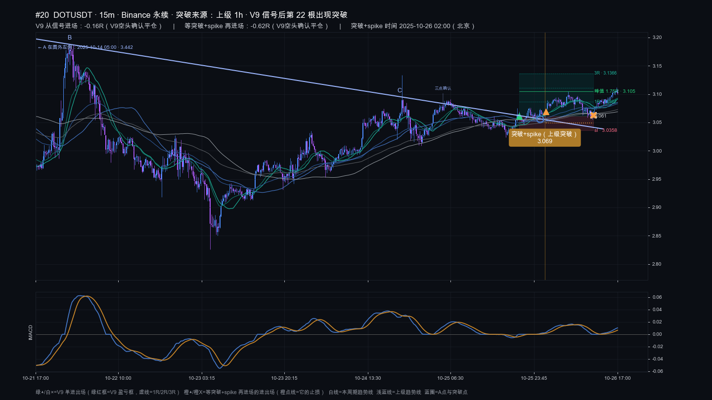

**#21 ETCUSDT 15m** · 2025-10-26 02:15 · 来源 本周期 · V9 信号后第 149 根 · V9 从信号进场 **+2.89R**（追踪止损）· 等突破+spike 再进场 **-1.40R**（初始止损）

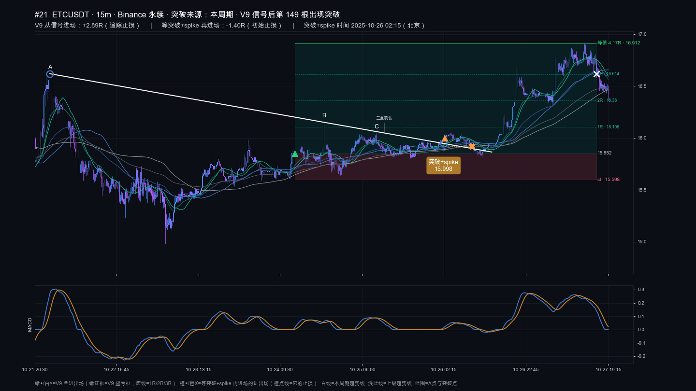

**#22 SSVUSDT 15m** · 2026-01-24 00:00 · 来源 本周期 · V9 信号后第 0 根 · V9 从信号进场 **-0.76R**（V9空头确认平仓）· 等突破+spike 再进场 **-0.76R**（V9空头确认平仓）

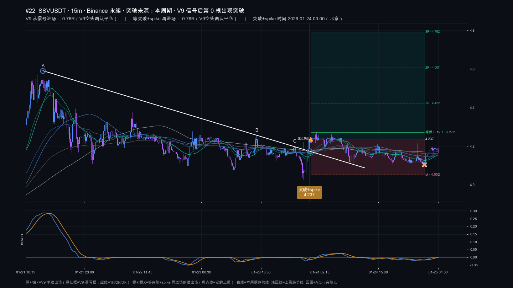

**#23 TRUMPUSDT 15m** · 2026-01-24 13:00 · 来源 上级 1h · V9 信号后第 52 根 · V9 从信号进场 **-0.19R**（V9空头确认平仓）· 等突破+spike 再进场 **+1.45R**（追踪止损）

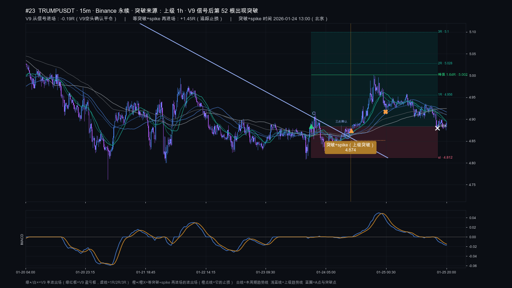

**#24 AKEUSDT 15m** · 2026-01-24 20:15 · 来源 本周期 · V9 信号后第 21 根 · V9 从信号进场 **-1.09R**（初始止损）· 等突破+spike 再进场 **-1.12R**（初始止损）

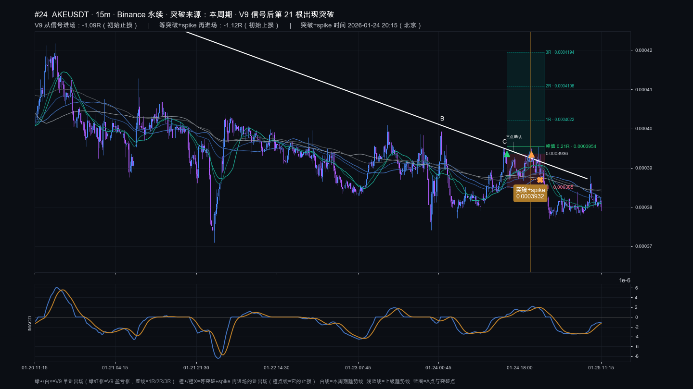

**#25 QUSDT 15m** · 2026-02-05 14:30 · 来源 本周期 · V9 信号后第 79 根 · V9 从信号进场 **-1.04R**（初始止损）· 等突破+spike 再进场 **-1.08R**（初始止损）

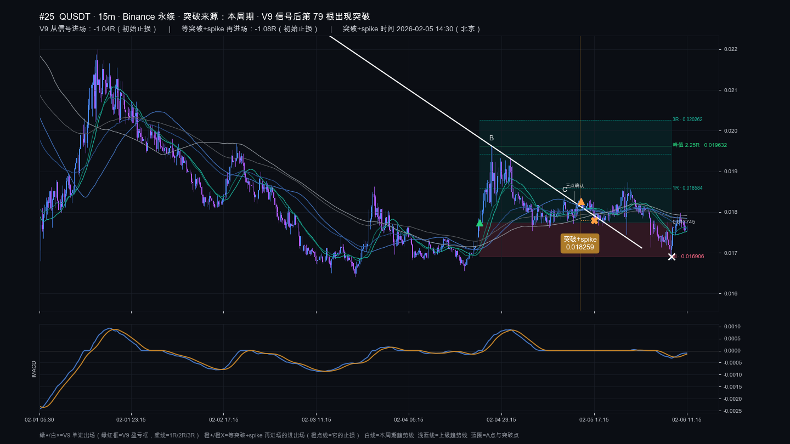

### 1h（25 张）

**#26 BANANAUSDT 1h** · 2024-10-28 20:00 · 来源 本周期 · V9 信号后第 0 根 · V9 从信号进场 **+0.70R**（追踪止损）· 等突破+spike 再进场 **+0.70R**（追踪止损）

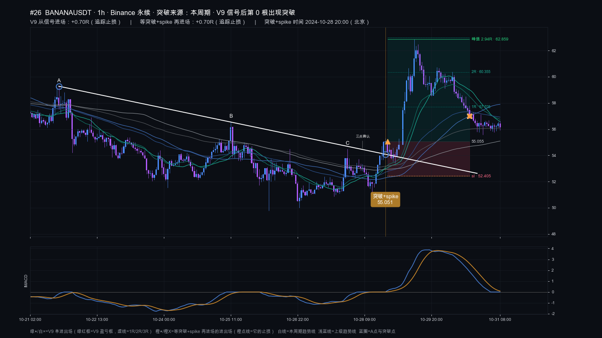

**#27 ONTUSDT 1h** · 2024-12-29 06:00 · 来源 本周期 · V9 信号后第 5 根 · V9 从信号进场 **-1.06R**（初始止损）· 等突破+spike 再进场 **-1.08R**（初始止损）

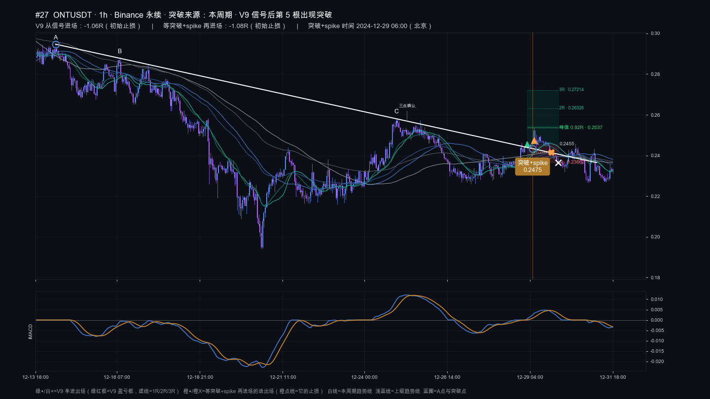

**#28 1INCHUSDT 1h** · 2025-01-03 20:00 · 来源 本周期 · V9 信号后第 0 根 · V9 从信号进场 **-0.27R**（V9空头确认平仓）· 等突破+spike 再进场 **-0.27R**（V9空头确认平仓）

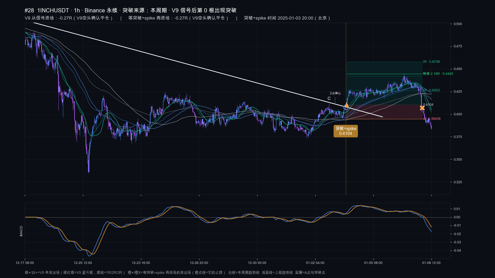

**#29 KSMUSDT 1h** · 2025-02-13 02:00 · 来源 本周期 · V9 信号后第 1 根 · V9 从信号进场 **-1.03R**（初始止损）· 等突破+spike 再进场 **-1.03R**（初始止损）

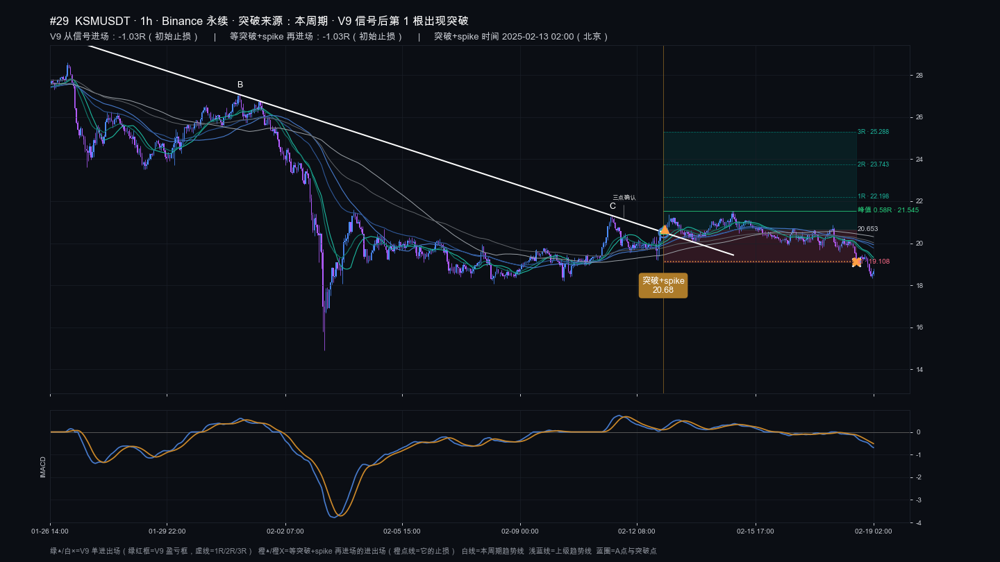

**#30 BSWUSDT 1h** · 2025-03-17 16:00 · 来源 本周期 · V9 信号后第 4 根 · V9 从信号进场 **+0.11R**（V9空头确认平仓）· 等突破+spike 再进场 **-0.62R**（V9空头确认平仓）

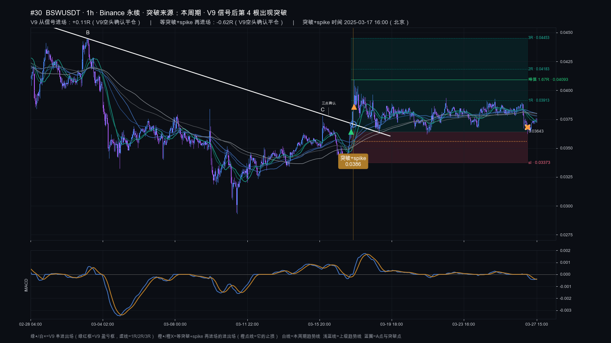

**#31 PHAUSDT 1h** · 2025-03-24 20:00 · 来源 上级 4h · V9 信号后第 53 根 · V9 从信号进场 **-0.22R**（V9空头确认平仓）· 等突破+spike 再进场 **-1.06R**（初始止损）

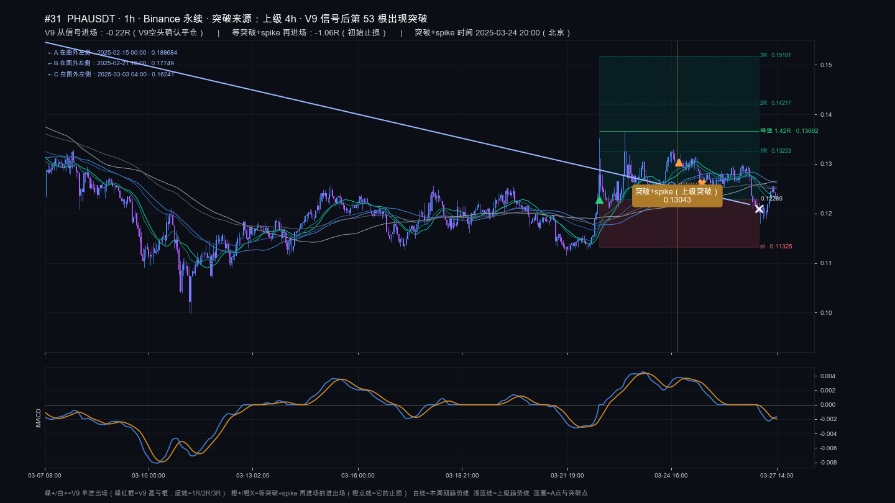

**#32 JUPUSDT 1h** · 2025-04-19 11:00 · 来源 本周期 · V9 信号后第 0 根 · V9 从信号进场 **+3.24R**（追踪止损）· 等突破+spike 再进场 **+3.24R**（追踪止损）

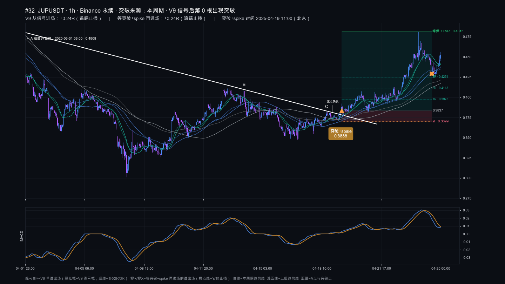

**#33 LISTAUSDT 1h** · 2025-04-23 11:00 · 来源 本周期 · V9 信号后第 1 根 · V9 从信号进场 **-1.03R**（初始止损）· 等突破+spike 再进场 **-1.03R**（初始止损）

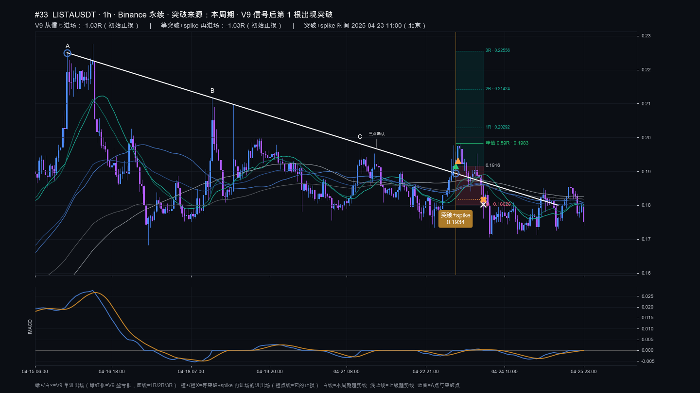

**#34 QNTUSDT 1h** · 2025-08-13 11:00 · 来源 本周期 · V9 信号后第 11 根 · V9 从信号进场 **-0.86R**（V9空头确认平仓）· 等突破+spike 再进场 **-1.11R**（初始止损）

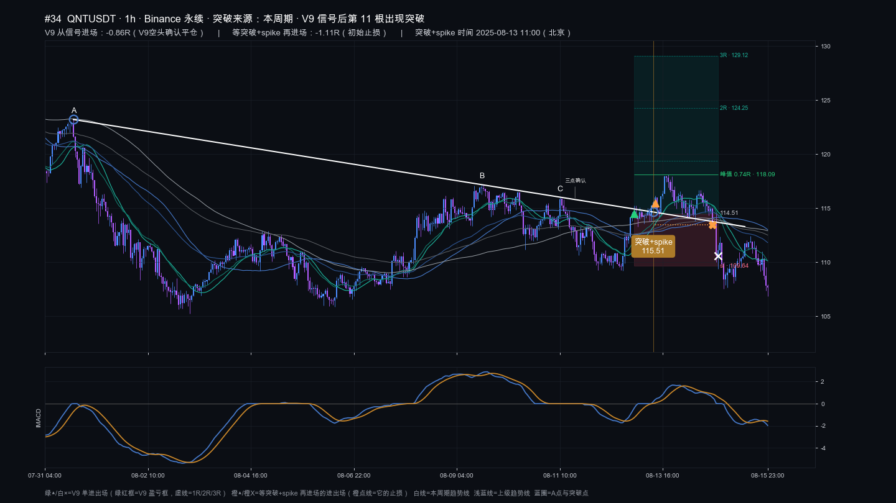

**#35 SPELLUSDT 1h** · 2025-08-24 05:00 · 来源 本周期 · V9 信号后第 30 根 · V9 从信号进场 **+1.28R**（追踪止损）· 等突破+spike 再进场 **-1.02R**（初始止损）

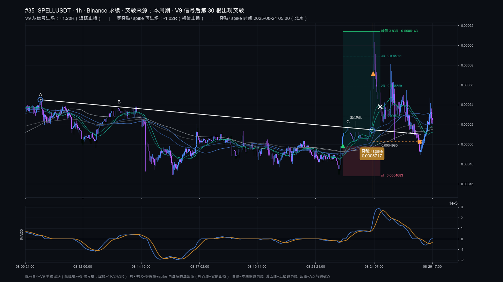

**#36 ICPUSDT 1h** · 2025-09-13 14:00 · 来源 本周期 · V9 信号后第 117 根 · V9 从信号进场 **+1.11R**（追踪止损）· 等突破+spike 再进场 **-1.12R**（初始止损）

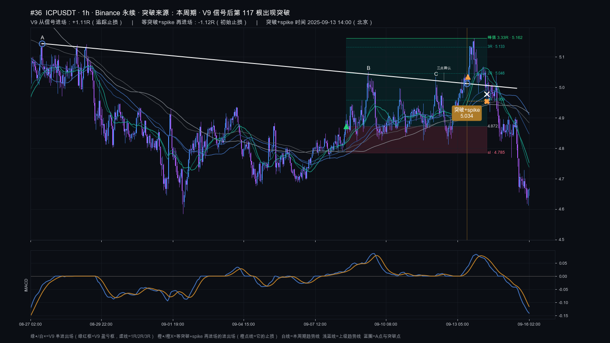

**#37 SUSHIUSDT 1h** · 2025-10-04 00:00 · 来源 本周期 · V9 信号后第 56 根 · V9 从信号进场 **-0.36R**（V9空头确认平仓）· 等突破+spike 再进场 **-1.07R**（初始止损）

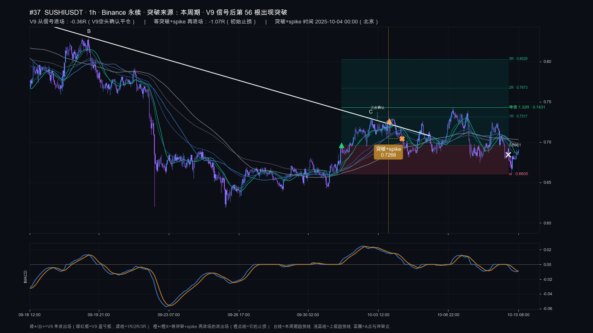

**#38 PNUTUSDT 1h** · 2025-10-07 00:00 · 来源 本周期 · V9 信号后第 126 根 · V9 从信号进场 **+0.08R**（V9空头确认平仓）· 等突破+spike 再进场 **-1.04R**（初始止损）

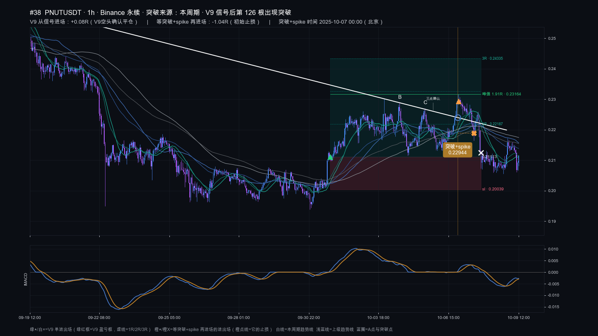

**#39 BICOUSDT 1h** · 2025-10-07 04:00 · 来源 上级 4h · V9 信号后第 128 根 · V9 从信号进场 **+1.00R**（追踪止损）· 等突破+spike 再进场 **-1.07R**（初始止损）

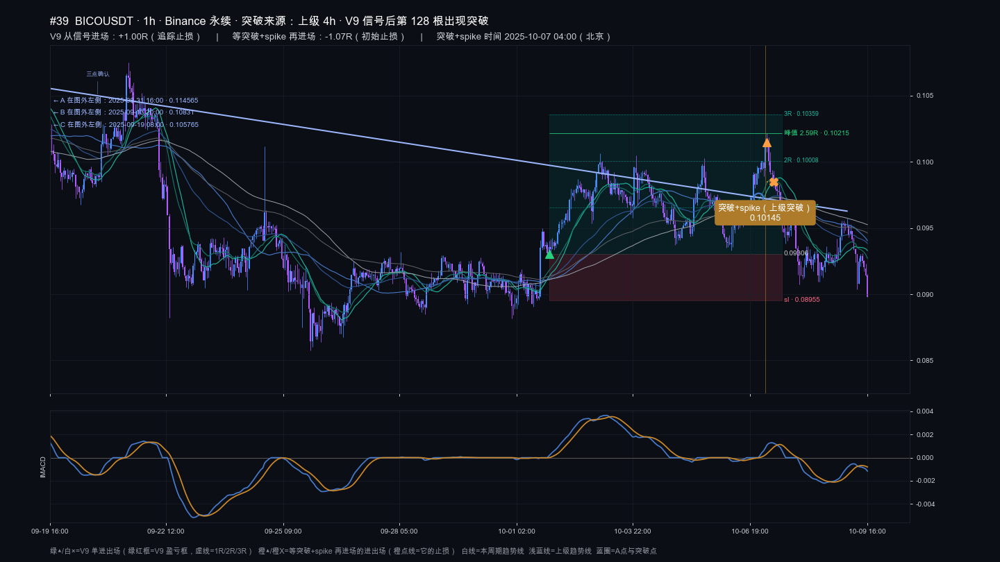

**#40 TRUUSDT 1h** · 2025-11-27 20:00 · 来源 上级 4h · V9 信号后第 3 根 · V9 从信号进场 **-1.06R**（初始止损）· 等突破+spike 再进场 **-1.08R**（初始止损）

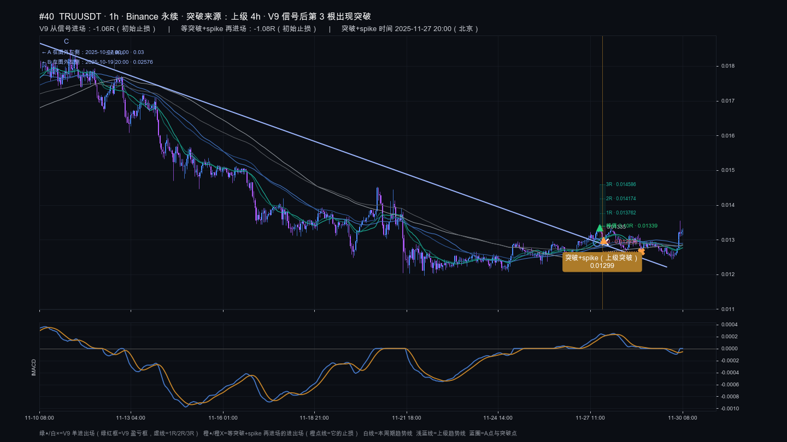

**#41 SCRUSDT 1h** · 2025-12-09 23:00 · 来源 本周期 · V9 信号后第 2 根 · V9 从信号进场 **-1.04R**（初始止损）· 等突破+spike 再进场 **-1.02R**（初始止损）

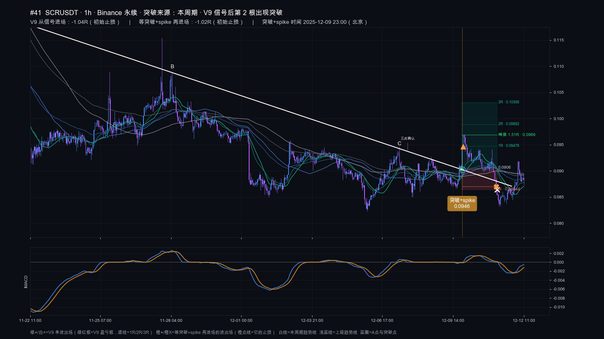

**#42 ONEUSDT 1h** · 2025-12-28 02:00 · 来源 本周期 · V9 信号后第 2 根 · V9 从信号进场 **+0.40R**（追踪止损）· 等突破+spike 再进场 **+0.16R**（追踪止损）

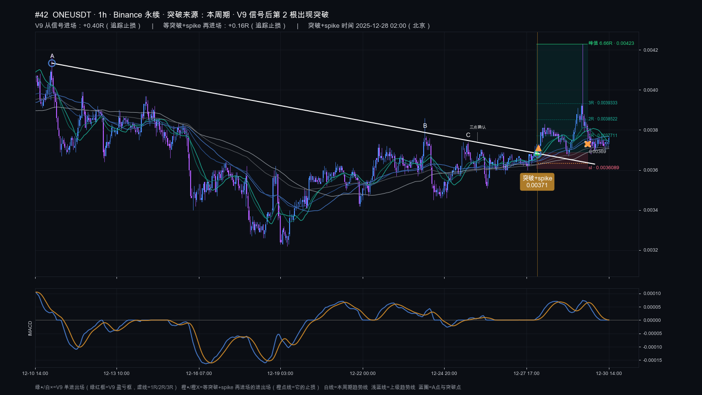

**#43 ORDIUSDT 1h** · 2025-12-28 12:00 · 来源 上级 4h · V9 信号后第 48 根 · V9 从信号进场 **+2.98R**（追踪止损）· 等突破+spike 再进场 **-1.10R**（初始止损）

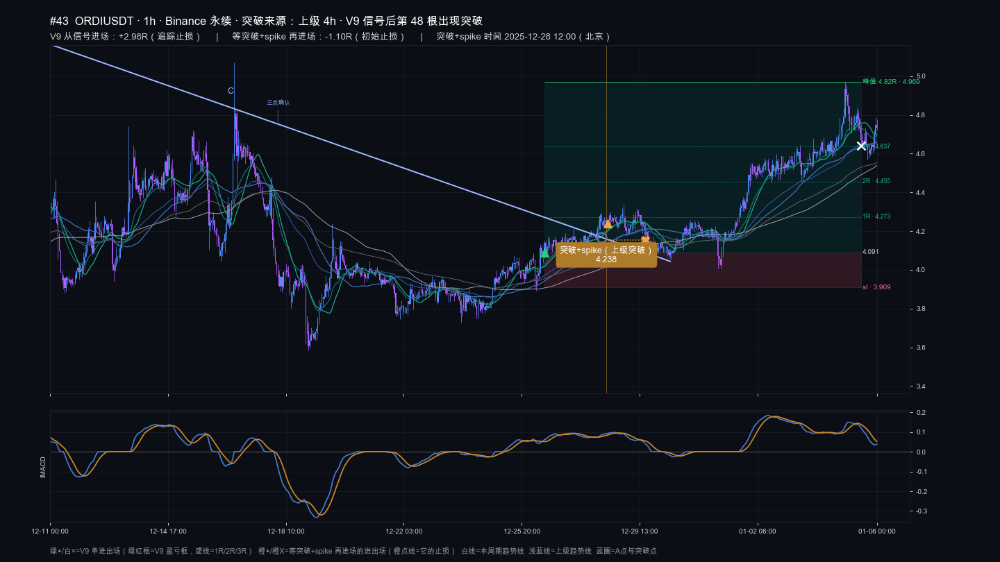

**#44 LINKUSDT 1h** · 2026-01-02 16:00 · 来源 上级 4h · V9 信号后第 14 根 · V9 从信号进场 **+4.29R**（追踪止损）· 等突破+spike 再进场 **+2.59R**（追踪止损）

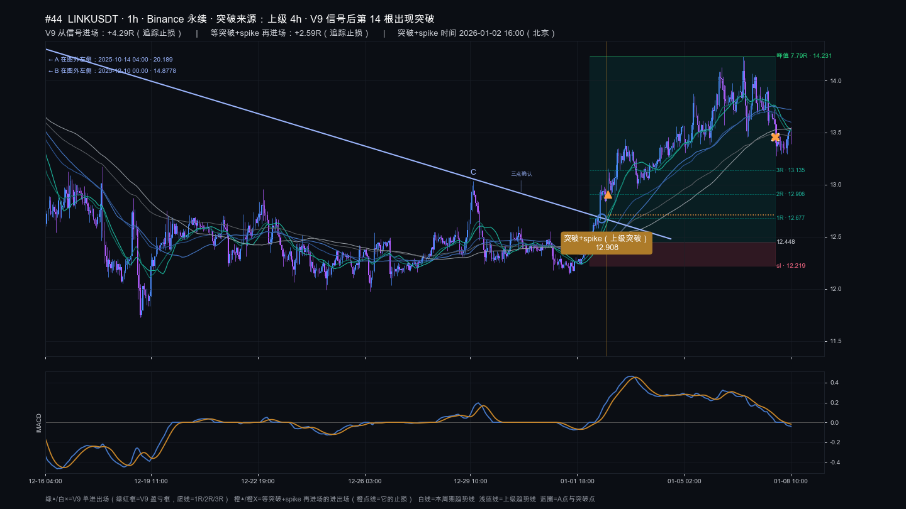

**#45 ARCUSDT 1h** · 2026-01-10 20:00 · 来源 上级 4h · V9 信号后第 50 根 · V9 从信号进场 **+11.64R**（追踪止损）· 等突破+spike 再进场 **+6.83R**（追踪止损）

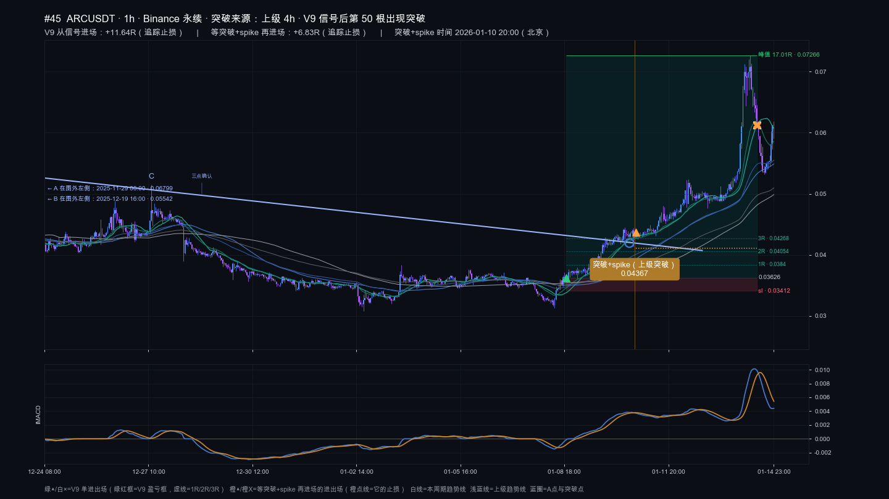

**#46 DOGSUSDT 1h** · 2026-02-14 00:00 · 来源 本周期 · V9 信号后第 0 根 · V9 从信号进场 **-1.06R**（初始止损）· 等突破+spike 再进场 **-1.06R**（初始止损）

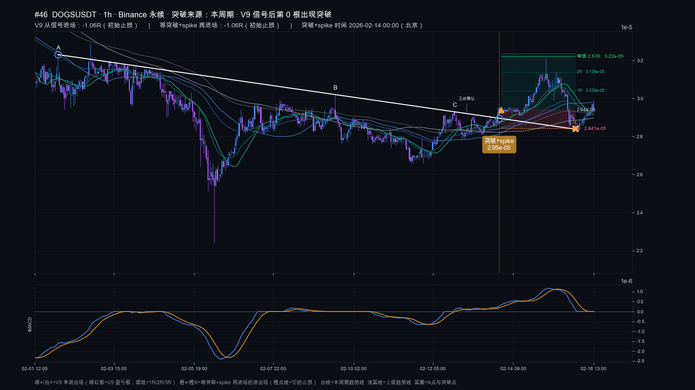

**#47 CLOUSDT 1h** · 2026-02-20 09:00 · 来源 本周期 · V9 信号后第 4 根 · V9 从信号进场 **-1.02R**（初始止损）· 等突破+spike 再进场 **-1.03R**（初始止损）

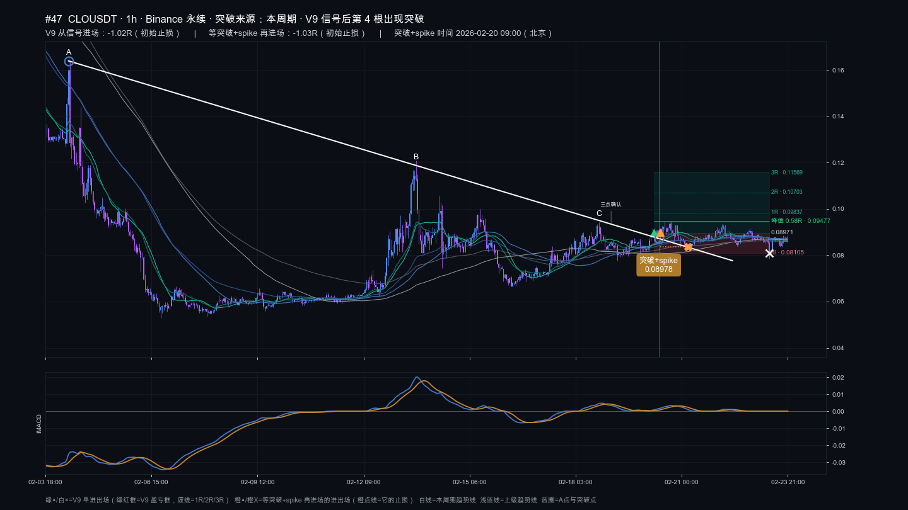

**#48 MMTUSDT 1h** · 2026-03-06 10:00 · 来源 本周期 · V9 信号后第 0 根 · V9 从信号进场 **-1.06R**（初始止损）· 等突破+spike 再进场 **-1.06R**（初始止损）

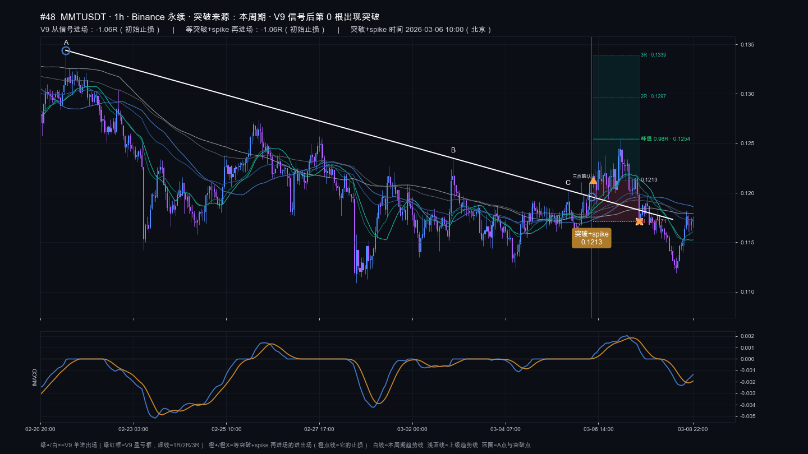

**#49 ORDERUSDT 1h** · 2026-03-13 10:00 · 来源 本周期 · V9 信号后第 1 根 · V9 从信号进场 **-1.09R**（初始止损）· 等突破+spike 再进场 **-1.10R**（初始止损）

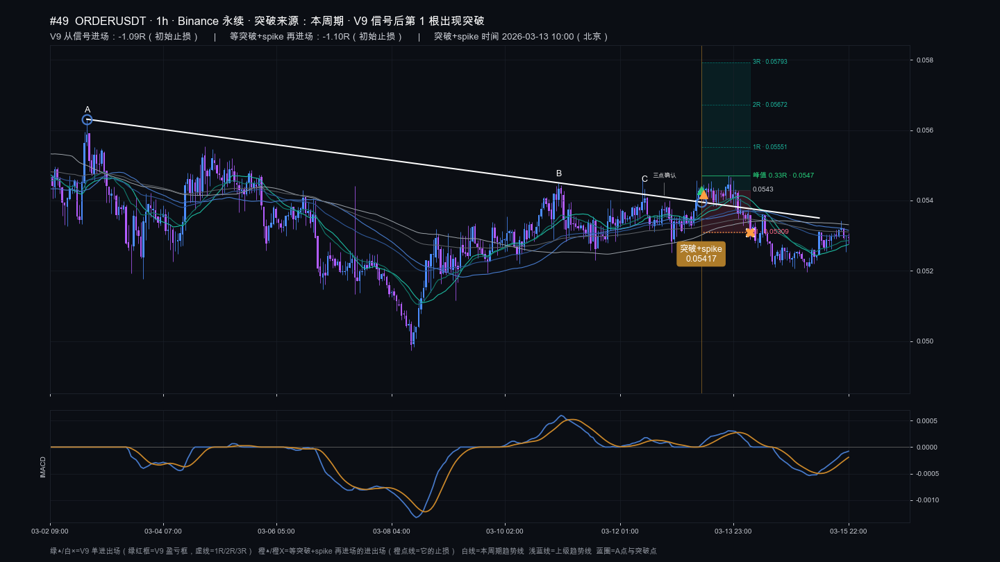

**#50 RENDERUSDT 1h** · 2026-04-03 16:00 · 来源 上级 4h · V9 信号后第 4 根 · V9 从信号进场 **-1.05R**（初始止损）· 等突破+spike 再进场 **-0.46R**（V9空头确认平仓）

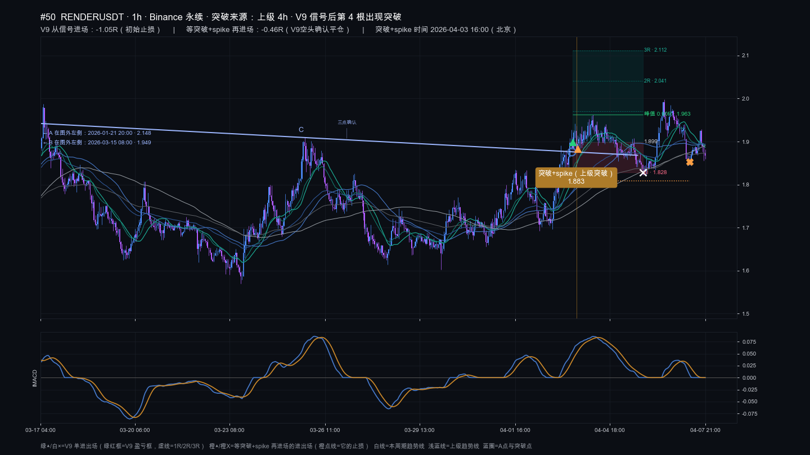

