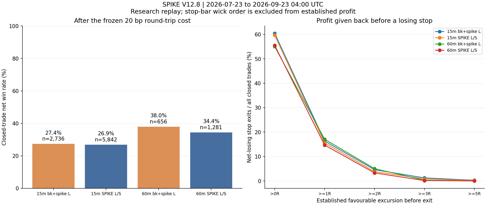

# SPIKE V12.8：近两个月 15 分钟与 1 小时详细回测

日期：2026-09-23。实验：`exp-spike-v128-recent-20260923-v1`。状态：**全量回放及独立复核完成；未验证相对随机优势**。

## 直接结论

普通 SPIKE 在本窗的候选信号为 **15m 7,060 个、1h 1,615 个**，已平仓净胜率分别为 **26.87% 和 34.43%**。联合多头另有 **15m 2,790 个、1h 689 个**，净胜率分别为 **27.38% 和 37.96%**。两种信号族重叠，不能相加当成独立交易数。

一小时全窗的平均净收益高于十五分钟，但**四个主组相对匹配随机入场的平均净 bp 差全部为负，Holm 校正 p 全为 1；没有证据表明跑赢随机**。后一段（8 月 23 日起）四组的平均净 bp 也全部为负。不能把一小时联合的全窗 PF≈1.95 或正平均 R 当成稳定优势。

浮盈回吐数量很大：可确认曾有价格浮盈、最后净亏止损的普通 SPIKE 为 **15m 3,486 笔、1h 711 笔**；联合多头分别 **1,653、361 笔**。这些是有可观察价格顺序支撑的下界；另有止损柱内顺序不明的少量交易单列如下。

## 数据与信号分母

固定 638 合约 × 两周期 = **1,276 条流全部回放完成，零回放错误**。底层近期共 11,422,752 根 5m，所有合约各 17,904 根，近期没有时间缺口。全输入含预热共 56,304,804 行；只有 AIA、LIT 两处旧缺口，均早于本窗。近期聚合网格为 3,807,584 根 15m 和 951,896 根 1h。

**583 个合约在两个周期均有完整 ready 特征；55 个合约均零 ready。** 对全部 55 个的专项复查确认，本窗每个都是 17,904 根平价、零成交量输入，唯一收盘价为 1 个；本轮 builder 没有补造这些记录。它们的时间轴虽完整，不能描述为活跃可交易行情。保留其覆盖台账，原 ATR/ready 门自动不给信号。`coverage.csv` 的 1,166 complete / 110 partial 指“时间覆盖＋特征就绪”的联合状态，110 partial 实际都是零就绪，近期缺 K 线数仍为零；原始提供者及历史交易状态未据此断言。

以下成交均是下一根开盘的研究执行。没有缺下一根、风险无效或断档删失；未结束均为截止边界删失。

| 组别 | 候选 | 占仓跳过 | 入场 | 已平仓 | 净赢 | 截止仍未结束 |
| --- | --- | --- | --- | --- | --- | --- |
| 15m 普通 SPIKE 多空 | 7,060 | 1,147 | 5,913 | 5,842 | 1,570 | 71 |
| 15m bk+spike 联合多头 | 2,790 | 1 | 2,789 | 2,736 | 749 | 53 |
| 1h 普通 SPIKE 多空 | 1,615 | 293 | 1,322 | 1,281 | 441 | 41 |
| 1h bk+spike 联合多头 | 689 | 0 | 689 | 656 | 249 | 33 |


## 全窗收益及同版本基线

V12.8 基础规则与 V12.6 相同，下面各行的 V12.6/V12.8 基础仓位值相同；这是源码身份基线，未伪装成另一次独立实盘测试。V12.8 新增候选提示没有增加仓位。bp 为标的收益率单位，100bp=1%；每笔扣20bp。

| V12.6/V12.8 同规则组 | 净胜率 | 均毛bp | 均净bp | 均净R | 中位净R | 净R PF | 随机配对n | 配对净超额bp |
| --- | --- | --- | --- | --- | --- | --- | --- | --- |
| 15m 普通 SPIKE 多空 | 26.87% | -3.54 | -23.54 | -0.0865 | -1.0767 | 0.886 | 5,799 | -20.70 |
| 15m bk+spike 联合多头 | 27.38% | 15.02 | -4.98 | 0.0242 | -1.0759 | 1.032 | 2,697 | -10.05 |
| 1h 普通 SPIKE 多空 | 34.43% | 63.48 | 43.48 | 0.2638 | -1.0326 | 1.409 | 1,269 | -48.69 |
| 1h bk+spike 联合多头 | 37.96% | 153.27 | 133.27 | 0.5893 | -1.0283 | 1.952 | 651 | -51.90 |


15m 联合平均净 R 为 +0.0242、R PF 为 1.032，但平均净 bp 为 −4.98：风险分母不同会改变加权，不能混用等风险和等名义资金口径。这里没有指定账户仓位，因此不把任何合计 R 或逐笔均值冒充账户总收益。

## 浮盈后最终净亏止损

表中各档是“曾达到至少该浮盈，最后净亏且以保护止损退出”的笔数，彼此包含。>0R 是价格浮盈，不要求覆盖费用；“扣费浮盈”要求曾足以覆盖20bp。反向信号亏损不混入此表。此处描述路径，经济优势仍以匹配随机结果判定。

| 组别 | 全部净亏止损 | 确认>0R | 占已平仓 | ≥0.5R | ≥1R | ≥2R | ≥3R | ≥5R | ≥10R | 曾扣费浮盈 | 另有>0R顺序不明 |
| --- | --- | --- | --- | --- | --- | --- | --- | --- | --- | --- | --- |
| 15m 普通 SPIKE 多空 | 3,658 | 3,486 | 59.67% | 1,690 | 908 | 222 | 49 | 10 | 1 | 2,915 | 28 |
| 15m bk+spike 联合多头 | 1,739 | 1,653 | 60.42% | 791 | 447 | 126 | 34 | 8 | 1 | 1,390 | 17 |
| 1h 普通 SPIKE 多空 | 722 | 711 | 55.50% | 357 | 188 | 42 | 2 | 0 | 0 | 652 | 5 |
| 1h bk+spike 联合多头 | 367 | 361 | 55.03% | 201 | 112 | 33 | 2 | 0 | 0 | 329 | 1 |


例如普通15m为3,486笔确定曾浮盈，另28笔只有止损柱的极值提示可能浮盈；因此该宽口径数量区间是3,486–3,514，不把3,514全说成确定。联合15m为1,653–1,670；普通1h为711–716；联合1h为361–362。逐笔证据见 `floating_profit_stop_losses.csv`。

| 组别 | 已平仓中曾≥1R | 随后净亏止损 | 条件占比 | 已平仓中曾≥2R | 随后净亏止损 | 条件占比 | 其中收盘未达2R |
| --- | --- | --- | --- | --- | --- | --- | --- |
| 15m 普通 SPIKE 多空 | 2,803 | 908 | 32.39% | 1,761 | 222 | 12.61% | 126 |
| 15m bk+spike 联合多头 | 1,326 | 447 | 33.71% | 877 | 126 | 14.37% | 64 |
| 1h 普通 SPIKE 多空 | 692 | 188 | 27.17% | 466 | 42 | 9.01% | 30 |
| 1h bk+spike 联合多头 | 385 | 112 | 29.09% | 278 | 33 | 11.87% | 21 |


达到2R的亏损止损中，普通15m有126/222笔、联合15m有64/126笔、普通1h有30/42笔、联合1h有21/33笔的收盘从未达到2R。原规则以收盘2R激活，影线越过2R不会自动激活。即使已激活，4ATR保护也可能仍低于成本覆盖价；激活不等于立刻保本。

## 同币、同周、同波动桶的匹配随机对照

这张表的目标和随机均严格使用同一批可配对已结束交易，不与全样本均值直接相减。四组均覆盖10个UTC周；单侧检验针对“策略超额为正”，精确周块符号置换最小分辨率为1/1024。置信区间为周块bootstrap，单次抽样未被调优。

| 组别 | 配对n | 目标均净bp | 随机均净bp | 随机净胜率 | 净超额bp | 周块95%区间 | 单侧p | Holm p |
| --- | --- | --- | --- | --- | --- | --- | --- | --- |
| 15m 普通 SPIKE 多空 | 5,799 | -22.95 | -2.25 | 27.50% | -20.70 | [-40.03, -1.03] | 0.948242 | 1.000 |
| 15m bk+spike 联合多头 | 2,697 | -3.81 | 6.24 | 29.29% | -10.05 | [-36.97, 19.11] | 0.733398 | 1.000 |
| 1h 普通 SPIKE 多空 | 1,269 | 44.36 | 93.05 | 37.67% | -48.69 | [-117.64, 34.52] | 0.852539 | 1.000 |
| 1h bk+spike 联合多头 | 651 | 137.68 | 189.58 | 41.17% | -51.90 | [-176.30, 76.56] | 0.773438 | 1.000 |


一小时联合全窗正收益相当一部分可由同期同方向行情解释：在配对样本中目标+137.68bp，而随机+189.58bp。描述性盈利和相对随机优势是两件事；本窗未验证优势。

## 普通 SPIKE 多空拆分

| 方向 | 已平仓 | 净胜率 | 均净bp | 均净R | PF | 随机配对n | 配对净超额bp |
| --- | --- | --- | --- | --- | --- | --- | --- |
| 15m 多头 | 3,023 | 27.42% | -3.60 | 0.0434 | 1.057 | 2,983 | -26.12 |
| 15m 空头 | 2,819 | 26.29% | -44.93 | -0.2258 | 0.705 | 2,816 | -14.96 |
| 1h 多头 | 673 | 38.48% | 146.08 | 0.6059 | 1.991 | 664 | -18.95 |
| 1h 空头 | 608 | 29.93% | -70.09 | -0.1149 | 0.832 | 605 | -81.32 |


空头在两种周期均为负平均净收益；一小时多头虽然全窗为正，配对超额仍为负。没有据此删除方向或修改本次信号池。

## 按时间切分，检查后段是否保持

早段7月23日至8月23日，要求退出也在切点之前；后段从8月23日起。跨切点交易单列。前后段和配对结果不能混淆为训练/测试模型验收，本轮没有训练。

| 组别 | 分段 | 已平仓 | 净胜率 | 均净bp | 均净R | 随机配对n | 配对净超额bp |
| --- | --- | --- | --- | --- | --- | --- | --- |
| 15m 普通 SPIKE 多空 | 早段 | 2,755 | 28.13% | -1.18 | 0.0309 | 2,739 | -21.34 |
| 15m 普通 SPIKE 多空 | 跨切点 | 6 | 33.33% | 224.27 | 0.2507 | 6 | 664.54 |
| 15m 普通 SPIKE 多空 | 后段 | 3,081 | 25.74% | -44.02 | -0.1921 | 3,038 | -21.81 |
| 15m bk+spike 联合多头 | 早段 | 1,323 | 29.33% | 34.27 | 0.2654 | 1,318 | 5.25 |
| 15m bk+spike 联合多头 | 跨切点 | 2 | 0.00% | -844.99 | -0.5653 | 2 | -402.28 |
| 15m bk+spike 联合多头 | 后段 | 1,411 | 25.58% | -40.58 | -0.2012 | 1,372 | -24.39 |
| 1h 普通 SPIKE 多空 | 早段 | 767 | 40.68% | 153.25 | 0.5598 | 764 | 11.60 |
| 1h 普通 SPIKE 多空 | 跨切点 | 9 | 44.44% | 453.33 | 2.1441 | 9 | -138.20 |
| 1h 普通 SPIKE 多空 | 后段 | 505 | 24.75% | -130.55 | -0.2193 | 493 | -138.40 |
| 1h bk+spike 联合多头 | 早段 | 402 | 42.29% | 245.35 | 0.9029 | 398 | 17.80 |
| 1h bk+spike 联合多头 | 跨切点 | 1 | 100.00% | 2,406.93 | 17.4505 | 1 | -36.98 |
| 1h bk+spike 联合多头 | 后段 | 253 | 30.83% | -53.79 | 0.0244 | 248 | -174.91 |


后一段四组平均净bp均负；1h联合净胜率降至30.83%，平均−53.79bp，配对超额−174.91bp。1h普通降至24.75%，平均−130.55bp。全窗一小时较好的平均值不能代表最近一个月持续有效。

## 月度拆分

按信号月份分组：7月和9月均是部分月份，不能拿总笔数作完整月频率比较。完整周度和逐币表另存CSV。

| 组别 | 月份 | 已平仓 | 净胜率 | 均净bp | 随机配对n | 配对净超额bp |
| --- | --- | --- | --- | --- | --- | --- |
| 15m 普通 SPIKE 多空 | 2026-07 | 718 | 31.48% | -31.31 | 718 | -27.16 |
| 15m 普通 SPIKE 多空 | 2026-08 | 3,283 | 24.25% | -31.89 | 3,283 | -31.49 |
| 15m 普通 SPIKE 多空 | 2026-09 | 1,841 | 29.77% | -5.63 | 1,798 | 1.59 |
| 15m bk+spike 联合多头 | 2026-07 | 305 | 22.62% | -65.93 | 305 | -20.02 |
| 15m bk+spike 联合多头 | 2026-08 | 1,551 | 26.43% | 8.55 | 1,551 | -9.32 |
| 15m bk+spike 联合多头 | 2026-09 | 880 | 30.68% | -7.69 | 841 | -7.79 |
| 1h 普通 SPIKE 多空 | 2026-07 | 282 | 34.04% | 20.93 | 282 | -1.61 |
| 1h 普通 SPIKE 多空 | 2026-08 | 611 | 38.46% | 126.24 | 610 | -47.23 |
| 1h 普通 SPIKE 多空 | 2026-09 | 388 | 28.35% | -70.47 | 377 | -86.26 |
| 1h bk+spike 联合多头 | 2026-07 | 91 | 14.29% | -72.32 | 91 | -79.10 |
| 1h bk+spike 联合多头 | 2026-08 | 347 | 47.84% | 287.15 | 347 | 22.91 |
| 1h bk+spike 联合多头 | 2026-09 | 218 | 32.11% | -25.84 | 213 | -162.16 |


## BTC、ETH 单独看

单币样本极少，一小时普通各仅3笔。BTC一小时联合只有1笔尚未结束，净胜率不可计算。

| 组别 | 合约 | 已平仓 | 净胜率 | 均净bp | 随机配对n | 配对净超额bp |
| --- | --- | --- | --- | --- | --- | --- |
| 15m 普通 SPIKE 多空 | BTCUSDT | 8 | 50.00% | 30.57 | 8 | 111.44 |
| 15m 普通 SPIKE 多空 | ETHUSDT | 12 | 25.00% | -30.10 | 12 | -2.41 |
| 15m bk+spike 联合多头 | BTCUSDT | 6 | 33.33% | -2.84 | 6 | 78.99 |
| 15m bk+spike 联合多头 | ETHUSDT | 7 | 28.57% | -10.42 | 7 | 18.40 |
| 1h 普通 SPIKE 多空 | BTCUSDT | 3 | 66.67% | 97.87 | 2 | -9.88 |
| 1h 普通 SPIKE 多空 | ETHUSDT | 3 | 33.33% | 681.85 | 3 | -237.94 |
| 1h bk+spike 联合多头 | BTCUSDT | 0 | — | — | — | — |
| 1h bk+spike 联合多头 | ETHUSDT | 2 | 50.00% | 1,077.20 | 2 | -110.89 |


ETH一小时普通的一笔大赢家已独立核对：8月18日16:00UTC按1916.88入场，初始止损1891.22、风险25.66，8月23日04:00UTC柱内按此前有效保护2383.05退出。净价格收益24.1192%，已实现18.0178R；24.6500R是途中最高浮盈，不是已实现收益。

## 尾部、持仓时长与回撤口径

以下为路径/分布诊断。去掉最好5笔只是事后尾部敏感性检查，不是新的筛选策略或可交易规则；原始结果不改。事件顺序累计R回撤没有账户资金约束，不是账户最大回撤。

| 组别 | 最好净R | 最差净R | 净>10R笔数 | 去最好5笔均净R | 均持仓小时 | 中位小时 | 非账户回撤R | 原配对净超额bp |
| --- | --- | --- | --- | --- | --- | --- | --- | --- |
| 15m 普通 SPIKE 多空 | 80.74 | -2.89 | 45 | -0.1393 | 14.10 | 8.25 | 1,015.19 | -20.70 |
| 15m bk+spike 联合多头 | 78.61 | -2.09 | 38 | -0.0658 | 12.61 | 7.25 | 442.03 | -10.05 |
| 1h 普通 SPIKE 多空 | 49.91 | -1.37 | 13 | 0.1514 | 60.21 | 45.00 | 172.58 | -48.69 |
| 1h bk+spike 联合多头 | 49.91 | -1.37 | 11 | 0.3716 | 52.84 | 43.00 | 66.05 | -51.90 |


## 典型浮盈回吐明细

时间为UTC信号收盘，最终结果扣20bp。以下事后案例用于解释原退出，不能拿来反向挑选入场。

| 合约 | 信号收盘UTC | 周期min | 确认最高浮盈R | 最高收盘R | 最终净R | 退出 |
| --- | --- | --- | --- | --- | --- | --- |
| USUSDT | 2026-07-27 04:00:00+00:00 | 15 | 10.366 | 3.224 | -1.0605 | initial_stop |
| GUNUSDT | 2026-08-17 07:00:00+00:00 | 15 | 8.983 | 1.783 | -1.1019 | initial_stop |
| ACEUSDT | 2026-08-03 02:15:00+00:00 | 15 | 7.288 | 4.748 | -0.0376 | trailing_stop |
| SOMIUSDT | 2026-08-25 14:30:00+00:00 | 15 | 7.250 | 3.750 | -0.0740 | trailing_stop |
| ALPINEUSDT | 2026-08-15 18:45:00+00:00 | 15 | 6.793 | 1.828 | -1.2187 | initial_stop |


GUN的影线浮盈接近9R，但最高收盘仅1.78R，原收盘2R激活条件从未达到。ACE和SOMI的最终净亏很小，须区分保护退出的毛收益与20bp成本，不能一概说全部回到原始−1R止损。US路径已独立核实：7月27日04:00入场0.046406，初始止损0.044872。06:15柱收盘0.051351、ATR0.001908049，触发2R激活后候选保护价却只有0.043718，低于原止损，故未收紧；11:00柱低点0.044198触发初始止损。**收盘2R已激活，不保证4ATR保护价已提高。**

最大赢家APR也已按原始5m聚合抽查：8月11日17:15以0.2021入场、风险0.0035，8月12日23:30的收盘把后续保护价提高至0.4851，8月13日00:45柱内触发。净价格收益139.8297%、净80.7417R。极端值与已冻结数据路径一致，不等于上游行情真实性已经独立证实。

## V12.8 两次加仓候选提示

提示依附原V9多头图表参考框，按Pine收盘参考价计算；它们不是上述下一根开盘账本的加仓成交，更不是联合多头臂追加仓位。

| 周期 | 本窗新参考框(多空) | 其中多头框 | 本窗第1次候选 | 本窗第2次候选 | 候选合计 | 候选所属框早于本窗 |
| --- | --- | --- | --- | --- | --- | --- |
| 15m | 6,060 | 3,154 | 407 | 164 | 571 | 3 |
| 1h | 1,364 | 733 | 163 | 115 | 278 | 3 |


两周期各有3条提示属于窗口前建立的参考框，故提示与“本窗新参考框”不是完全相同母体。本轮没有定义候选加多少、何时真实成交或加仓后新成本，不给虚构的滚仓收益。



## 口径与版本

- 用户要求同时测 15 分钟和 1 小时。信号收盘时间窗固定为 **2026-07-23 00:00 UTC（北京时间 08:00）至 2026-09-23 04:00 UTC（北京时间 12:00），右端不含**。运行期间不滚动截止时间。
- 固定既有 Binance USD-M 638 合约归档池；不是按本次涨跌幅选币，也不是声称覆盖交易所当前全部合约。新上市但不在旧池的合约不纳入。本机 OKX 缓存不足以覆盖整个近期窗，因此使用并明确披露 Binance 数据源。
- 使用官方 5m 归档和 REST 尾部，复用已经核验的本地缓存；逐源 SHA、归档校验和与时间覆盖写入新研究数据清单。数据进入独立 `data/research/spike_v128_recent_20260923`，未写生产缓存。
- 所有周期按 UTC 完整桶聚合；15m 结构高周期为 1h，1h 结构高周期为 4h。预热从 2025-11-15 开始：589/638 个合约具备完整 1,500 根四小时预热，49 个较短，最短 506 根；AIA、LIT 各有一处预热期旧缺口。638 个合约的近期时间轴均完整；这不代表全部仍活跃交易或每根柱的策略特征均可用，需同时看 ready 覆盖。残缺桶、数据缺口、无近期数据都单独记录，不以无交易掩盖缺失。
- V12.8 直接继承 V12.6 基础信号和退出，只增加两次加仓候选显示，没有移植 V12.7 的时限实验，也没有定义加仓数量或真实成交。故本报告的基础仓位表现同时是同规则 V12.6 的身份基线；没有“加两次仓后账户赚多少”的收益结论。
- `v9_both` 是 V12.8 原有准入后的 SPIKE 多空信号；`joint` 是 bk+spike 联合多头信号。两者各自运行单仓状态，存在重叠，**不能把两个信号族的笔数相加当成去重交易总数**。

## 入场、退出及统计定义

研究成交在信号确认后下一根开盘执行；图表参考框则按 Pine 信号收盘价单独回放。两份账本不混用。初始止损保留原五根极值加 0.2ATR、至少 2ATR、tick 取整的规则；收盘盈利达到 2R 才启动原 4ATR 跟踪退出，原始反向信号按既有规则退出。默认提前退出关闭。每笔扣固定 **0.2%（20bp）往返成本**，未改变任何阈值。

- 候选数：时间窗内规则发出的信号，包括当时已有持仓而无法再次开仓的信号。
- 入场数：能取得下一根开盘且风险参数有效、该信号族当时空仓的交易。窗口开始前建立的仓位仍占仓，不能人为从起点重置为空仓。
- 触价退出时间记为所在 K 线的开盘时间，实际退出发生于该柱内；因此持仓时长为柱级近似，不能声称逐笔成交时点精确到分钟。
- 已结束交易：窗口内信号入场并在数据截止前可确定退出的交易；净胜率 = 净收益严格大于零的笔数 / 已结束笔数。截止仍持有、断档后结果未知均删失，不算输赢。
- R = 该笔原始风险距离；bp = 标的百分比收益 × 10,000。PF 按净 R 计算。所有币并行的合计 R、事件顺序回撤不是账户收益或账户最大回撤，未假设杠杆、资金分配或同时持仓上限。
- “浮盈变止损”：最终净亏、由初始止损或跟踪止损退出，且退出前可确定曾有浮盈。再分曾达到 0.5/1/2/3/5/10R；各档是包含关系，不能相加。
- **已确认浮盈下界**只取入场之后完整存活 K 线及退出开盘的可见有利价格。5m 数据用于聚合，执行与这项统计按各自 15m/1h 柱处理，未启用更小周期逐根放大。触及止损的该根 K 线，其最高/最低价先于还是晚于止损无法由该周期 OHLC 判断；只计入上界和“顺序不明”列，不混入确定数量。
- 另列“浮盈足以覆盖 20bp 成本后仍变亏损止损”。只要价格一度略高于入场不等于账户一度扣费盈利；反向信号亏损另计，不冒充止损。

## 对照和不确定性

每笔交易固定种子只抽一次同币、同方向、同 UTC 周、同早/后时间段、同因果 ATR/close 波动桶的随机入场，执行同退出和成本。失败或删失不补抽。主比较使用配对净 bp 差，避免不同风险分母导致 R 超额偏差。周块重采样保留同周跨币相关性；单侧周块符号置换检验检验正超额，四个主单元使用 Holm 校正。周数有限，p 值有离散分辨率；单次随机抽样也是局限。CSV中的胜率Wilson区间假定单笔独立，仅可作参考，主要统计推断采用周块。

按 2026-08-23 切分时间：早段要求目标交易退出也早于切点，配对早段还要求随机退出早于切点；跨切点交易单列。没有随机训练切分，没有使用未来收益选择参数。月/周/逐币结果是描述性拆分，不自动变成可执行筛选规则。

无模型、无入场排序分数，因此 val AUC、评分置换 p、top-decile 毛/净收益及模型单特征基线不适用；不能编造这些指标。对应严格对照为同币×时间块×波动桶随机入场和不变的 V12.6 身份基线，统计 p 是收益差的周块检验。

## 风险与诚实声明

这是 Python 研究移植回放，尚未取得 TradingView 原生逐事件市场对账。已有源身份、继承代码、状态和因果测试不能替代原生市场事件一致性。该限制同时适用于图表参考框和加仓候选数量。

固定旧合约池存在成员选择/新币遗漏风险；元数据 tick 来自冻结快照，不保证还原每个历史时点的 tick 变更。预热虽长，仍不是无限历史。固定 20bp 不是逐笔真实手续费、滑点、盘口深度、资金费率或冲击成本；跨币相关性、尾部极端交易和窗口右端删失会影响结果。加仓候选仅显示，不是加仓成交或风险审批。training_eligible=false，production_eligible=false；没有训练、promote、实盘交易或参数调整。

## 复现命令与产物

先使用仓库契约依赖环境。数据构建依赖已有冻结638合约归档及元数据；各源路径和SHA完整保存在输入清单，缺少原始资产的空仓库不能只靠这几行恢复全部历史输入。官方缺失月份/REST尾部由数据构建器补齐；网络源可能随时间变化，精确复核优先使用冻结快照。

```bash
cd /Users/zhangzc/fable-trading
.venv/bin/python -m yoyo.evaluation.spike_v128_recent_data --workers 8
OPENBLAS_NUM_THREADS=1 OMP_NUM_THREADS=1 .venv/bin/python -m yoyo.evaluation.spike_v128_recent --workers 8 --output experiments/active/exp-spike-v128-recent-20260923-v1/run_v1
.venv/bin/python -m yoyo.evaluation.spike_v128_recent_report --run experiments/active/exp-spike-v128-recent-20260923-v1/run_v1 --output experiments/active/exp-spike-v128-recent-20260923-v1/summary_v1
.venv/bin/python -m yoyo.evaluation.spike_v128_input_diagnostics --run experiments/active/exp-spike-v128-recent-20260923-v1/run_v1 --output experiments/active/exp-spike-v128-recent-20260923-v1/input_diagnostics_v1
```

大体积逐事件账本未提交Git：完整本机归档为 `archive/consolidated/spike_v128_recent_20260923/frozen_replay_and_ledgers_v1.tar`（含原始运行输出、输入清单和试跑；不含底层行情CSV），SHA及文件大小见实验目录 `delivery.json`。紧凑汇总表、图、运行身份和收据入Git；原实验输出路径保留，可直接查看逐笔CSV。

已有运行目录只允许同身份续跑，身份变化须新目录；报告输出目录必须尚不存在。逐事件及逐币文件保留于实验目录，行情源在忽略的数据目录。先提交 builder 再执行：数据/计划 `7741ba08ca`，统计初版 `d5502bf788`，回放/提示及行为测试 `2bafa22f9c`。报告覆盖修复 `3cf36c32b8`、V12.8身份绑定 `84a53d74ac`、中文合约URL编码修复 `1387ad9355` 均早于完整回放。零就绪输入诊断 `a95a348d1a` 先于诊断执行。完整身份见交付清单。

新增模块行为测试当前20项通过（回放7、提示7、数据3、统计3），另有既有父版和层间约束组合检查通过；不同组合存在重叠，不把各次通过数相加。已独立复核全部闭合交易算术、状态分母、汇总哈希与匹配均值；主p值和Holm由父代理独立枚举复算。BTC/ETH正式六份账本均与原试跑逐字节一致。首次取数635/638成功，三个中文币名URL编码失败，修复后638/638成功；原失败记录保留。详见 `review_notes.md`、`data_failure_v1.json`、`pvalue_audit.json`。

## 下一步选项

1. 原生 TradingView 与 Python 逐事件核对信号、参考框和 H1 候选。属于一致性补证，本轮未把未验证移植宣称为原生回测。
2. 若希望减少“到达 1R/2R 后仍净亏”的交易，可另开单变量、同成本、同随机对照的退出实验；具体保本/保护阈值须由 Owner 决定，本轮未试参或修改原退出。
3. 若希望回答“两次加仓到底多赚或少亏多少”，须先定义每次数量、风险预算、成本和真实退出会计，再独立回测；图表候选不能代替这个实验。仓位与实盘动作仍须 Owner 明确授权。
