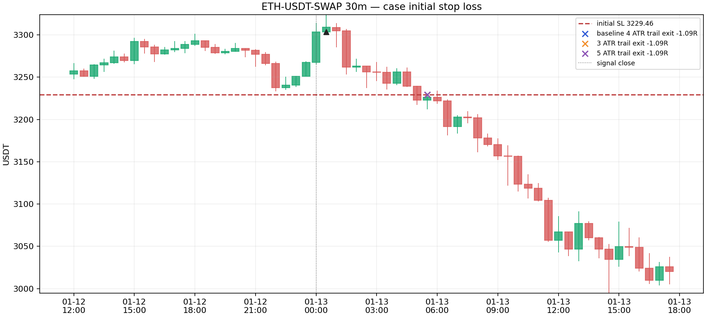
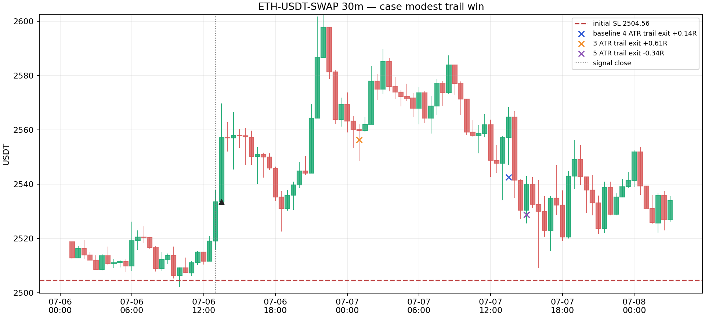
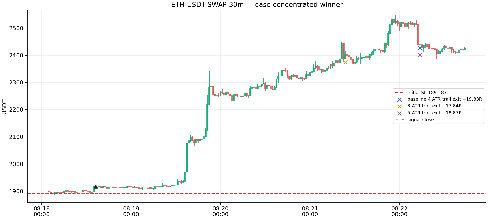

# ETH-USDT-SWAP：原版 SPIKE Burst V1 / V6 的止损敏感性

日期：2026-09-11。研究专用；不改 Pine、监控、模型、通知或账户。本报告使用 OKX `ETH-USDT-SWAP` 的冻结 30 分钟 OHLC，评估窗口为 2024-09-10 至 2026-09-10；源文件从 2023-08-30 起，故有足够预热。这里的后半段并不是从未看过的盲样本：同一两年历史此前已经被项目研究使用，以下“验证”只是不参与本轮参数选择的后段切分。

## 结论

原版 V1 的 ETH 样本过小，不能命名“最优止损”。30 分钟有 11 笔，表现主要由一笔 +19.83R 交易贡献；1 小时只有 3 笔且全亏，4 小时只有 1 笔。因此，保持默认初始止损与 4 ATR 跟随止损是唯一合理的本轮结论：初始 ATR 倍数从 1.5 到 3.0 在全部 15 笔冻结事件上完全没有改变结果；3 ATR 会在开发和后段都降低 30 分钟净 R；5 ATR 没有稳定改善，并在后段留下了一笔窗口末尾未平仓事件。

Freqtrade 2026.8 已实际运行三周期基线回测和两个 30 分钟、单线程、小预算 Hyperopt。它用预先由原始 V1 replay 计算的“上一根收盘已知”止损桥接，因此不会犯“本根收盘上移止损、又用本根 low 触发”的前视错误。基线 30 分钟的 11 笔开/平仓价与冻结账本逐笔一致；Freqtrade 的 stop 平仓时间标签是该根开盘，研究账本记录该根结束，价格相同。

V6 已按其冻结 Pine/结构镜像的闭合 bar 条件做了独立、因果的**结构 oracle**计数和止损敏感性，但尚未完成原生 Pine 信号逐笔 parity 或 Freqtrade 的 long/short adapter。因此 V6 表只能说明下一步需要验证的假设，不能称为 V6 收益回测，更不能据此调参或推广。

## 原版 V1 基线

V1 保持原始 long-only 信号和实际执行：信号 bar 收盘后，以下一根实际 open 入场。初始 SL 的锚点是**信号 bar 收盘**和最近五根 low，而不是下一根成交价：

`SL = floor_to_tick(min(low[-4:0] − 0.2×ATR, signal_close − 2×ATR))`

实际风险分母是 `(next_open − frozen_initial_SL) / next_open`。保护性初始止损遇跳空穿透按该根 open 平仓；否则按预先已知止损先检查 low。收盘达到 `2R` 后，`close − 4×ATR` 只从**下一根**开始生效。每笔扣固定 20bp 往返成本；未纳入 funding、点差、冲击、杠杆、账户资金曲线或实际交易所费率。交易独立记账，`event_sequence_drawdown_r` 只是按事件时间顺序累计 R 的回撤，不是账户 MDD。

| 周期 | 已实现笔数 | 胜率 | 净 R | PF | event-sequence DD |
|---|---:|---:|---:|---:|---:|
| 30m | 11 | 63.64% | +32.214 | 8.612 | -3.143R |
| 1h | 3 | 0.00% | -3.117 | 0.000 | -3.117R |
| 4h | 1 | 100.00% | +1.561 | 不适用 | 0.000R |

30m 的最大赢家是 2026-08-18，+19.827R；移除它后，30m 净 R 从 +32.214 降为 +12.387。该集中度、1h 的三连亏和 4h 单笔样本都禁止把这个结果解释为策略优势。

1h 三笔基线交易如下：

| 信号日期 (UTC) | next-open 入场 | 初始 SL | 出场 | 净 R |
|---|---:|---:|---:|---:|
| 2024-12-16 | 3960.21 | 3837.17 | 3837.17 | -1.064 |
| 2025-08-22 | 4612.15 | 4192.35 | 4192.35 | -1.022 |
| 2026-03-02 | 2046.44 | 1913.36 | 1913.36 | -1.031 |

## 单变量止损敏感性

开发段截至 2025-09-10；后段从该日开始。每次只变一个参数：初始 SL 的 ATR floor 为 1.5 / 2.0 / 2.5 / 3.0，或跟随 stop 为 3 / 4 / 5 ATR。扩大初始 stop 时采用相同风险预算缩小仓位；所有数值均是扣成本 R，不靠增加名义仓位获益。

| 30m 方案 | 开发：n / 净R / PF | 后段：n / 净R / PF | 结论 |
|---|---|---|---|
| 默认：2 ATR 初始，4 ATR trail | 5 / +8.740 / 9.024 | 6 / +23.474 / 8.469 | 参考 |
| 初始 1.5 ATR | 5 / +8.740 / 9.024 | 6 / +23.474 / 8.469 | 与默认逐笔相同 |
| 初始 2.5 ATR | 5 / +8.740 / 9.024 | 6 / +23.474 / 8.469 | 与默认逐笔相同 |
| 初始 3.0 ATR | 5 / +8.740 / 9.024 | 6 / +23.474 / 8.469 | 与默认逐笔相同 |
| trail 3 ATR | 5 / +7.028 / 7.452 | 6 / +21.711 / 7.908 | 两段均较差 |
| trail 5 ATR | 5 / +8.318 / 6.829 | 6 / +22.100 / 8.032 | 无稳定改善 |

全三周期合计时，开发段 7 笔的默认净 R 为 +6.654，后段 8 笔为 +24.004；这个合计仍然被 30m 主导，不能掩盖 1h 的负结果。初始止损触发比例为 30m 开发 20%、后段 50%；被初始 stop 的交易在其后 20 根中的平均 MFE 分别为 -2.10% 和 -3.30%，没有看到“普遍只是被过早洗掉”的证据。跟随 stop 触发比例为 30m 开发 80%、后段 50%。

Freqtrade 的开发段 Hyperopt 也证实该结论，而非自行策略模拟：初始 floor 小网格的候选均产生相同 5 笔和 $319.47 固定 stake 收益，框架任意列出的 1.5 ATR 不是可解释的最优值；trail 网格在相同 5 笔上列出 4 ATR。Hyperopt 只跑了 8 epoch、单 worker，重复离散候选被跳过，目的仅是验证框架和小空间的排序，不是大规模搜索。

## V1 真实 K 线案例



2025-01-13 的失败例：下一根 3303.51 入场，3229.46 初始 SL，-1.089R；随后 20 根 MFE 仍为 -2.10%。





图中箭头为 next-open 实际入场；叉号为同一信号下默认、3 ATR、5 ATR 跟随方案的实际退出。图只用于逐笔止损敏感性，不是对 V1 的匹配随机对照或盈利证明。

## V6：目前能说什么

V6 使用当前冻结 bytes：Pine `spike_burst_v6.pine` SHA-256 `e15854bc…7c882`，结构镜像 `spike_burst_v6_structure.py` SHA-256 `e84690c0…14d4b`。它的真实默认是 long + short；以下另列 long-only 以与 V1 方向一致。计数是每周期各自独立的信号事件，不把 `max_open_trades=1` 的重叠拒单误报为漏信号。

| 周期 / 方向 | 开发：n / 净R / PF | 后段：n / 净R / PF |
|---|---|---|
| 30m long-only | 123 / +9.948 / 1.104 | 111 / +38.475 / 1.419 |
| 30m short-only | 110 / +38.252 / 1.481 | 121 / -18.967 / 0.808 |
| 1h long-only | 58 / -2.350 / 0.950 | 60 / -11.641 / 0.779 |
| 1h short-only | 61 / +4.004 / 1.099 | 66 / -2.855 / 0.943 |
| 4h long-only | 14 / +30.257 / 5.883 | 17 / +8.117 / 1.646 |
| 4h short-only | 16 / -2.090 / 0.798 | 13 / +1.996 / 1.240 |

这不是可行动的 V6 参数选择：结构 oracle 对保留的 V4 状态做了泛周期的因果转换，但还没有针对原生 Pine 的 ETH 逐笔 signal parity，也没有 Freqtrade long/short 路径。接下来应先做这种 parity；失败即停止，不应继续 Hyperopt。

## 可复现命令与产物

```bash
# 仅使用冻结数据，重建 V1/V6 独立事件账本、止损网格与 Freqtrade plan
python3 experiments/active/exp-spike-v1-eth-stops-20260911/run_eth_stops.py

# 画三笔真实 30m OHLC 案例
python3 experiments/active/exp-spike-v1-eth-stops-20260911/render_trade_cases.py

# Freqtrade 实际 V1 30m 基线（同样的命令分别以 60m / 240m 运行）
ETH_FT_PLAN_DIR="$PWD/experiments/active/exp-spike-v1-eth-stops-20260911/freqtrade/plans" \
NUMEXPR_MAX_THREADS=1 OMP_NUM_THREADS=1 OPENBLAS_NUM_THREADS=1 \
/Users/zhangzc/.local/share/crypto-toolkit/venvs/freqtrade/bin/python -m freqtrade backtesting \
  --config experiments/active/exp-spike-v1-eth-stops-20260911/freqtrade/config.json \
  --userdir experiments/active/exp-spike-v1-eth-stops-20260911/freqtrade/user_data \
  --datadir experiments/active/exp-spike-v1-eth-stops-20260911/data \
  --data-format-ohlcv feather --strategy FrozenV1BaselineBridge \
  --strategy-path experiments/active/exp-spike-v1-eth-stops-20260911/freqtrade/strategies \
  --timeframe 30m --timerange 20240910-20260910 --fee 0.001 --export trades \
  --backtest-directory experiments/active/exp-spike-v1-eth-stops-20260911/freqtrade/results --cache none
```

核心账本为 `experiments/active/exp-spike-v1-eth-stops-20260911/results/eth_stop_sensitivity_ledger.csv.gz`，摘要为同目录 CSV，manifest 记录冻结数据 SHA、V6 bytes SHA 和 V1 15/15 对齐。Freqtrade 结果 zip 与两个 Hyperopt 日志保留在实验目录。

## 风险与诚实声明

- 没有匹配随机对照，本研究只比较**同一信号**在不同 stop 下的配对敏感性，因此不能声称 V1 或 V6 相对市场/随机入场的优势。
- 固定 20bp 是研究假设，不能当作账户手续费；OKX 永续合约的 funding 也没有计入。OKX 的 trailing stop 有触发价与实际成交价的差别，历史模拟不等同真实订单成交。
- V1 的 15 笔、尤其 4h 单笔，不足以选最优参数；V6 还不是原生 Pine / Freqtrade parity 完成的收益结果。
- 本轮未消费项目定义的 holdout；开发/后段都属于已被研究过的冻结两年历史，不能改称首次未见样本外。

下一步应维持 V1 默认 2 ATR / 4 ATR，不改生产规则；若要继续 V6，先完成 frozen native Pine 对 ETH 每周期/方向的信号与 entry-bar parity，再在同样的单变量空间中运行 Freqtrade long/short adapter。
