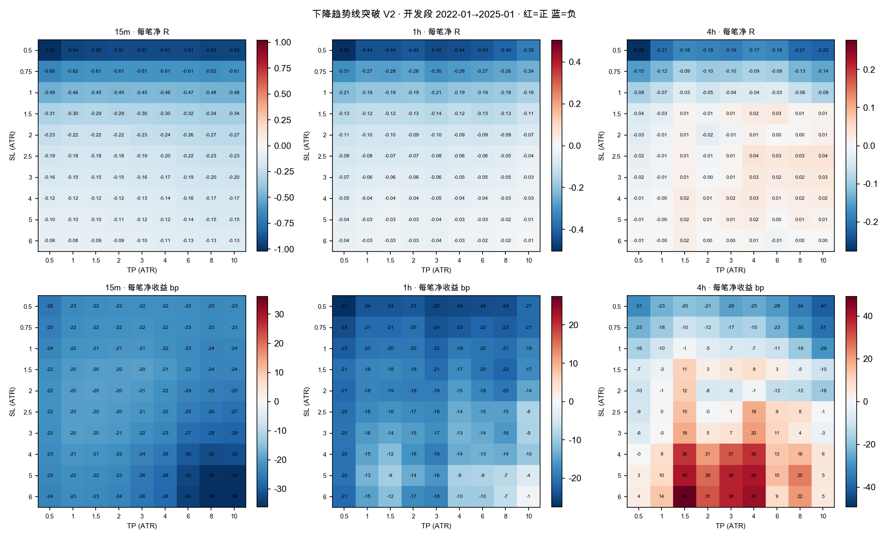

# 下降趋势线突破 V2 · 止盈止损网格与多周期回测

## 结论

**三个周期全部未通过事前三条标准。没有一组止盈止损参数值得拿去消耗 holdout。**

开发段（2022-01-03 → 2025-01-01）在 10 档止损 × 9 档止盈 = 90 格上评分，三个周期共 270 个配置；按事前写死的邻域中位数规则各选一格，选择结果提交之后才读复查段（2025-01-01 → 2026-05-04）。

- **15m**：入选 SL 6 / TP 0.5。开发段每笔 -0.0847R （31755 笔），复查段每笔 -0.0799R（21471 笔）、毛 R -304.5、配对超额 -0.0048R、月块 p 0.809。**未通过**。
- **1h**：入选 SL 6 / TP 10。开发段每笔 -0.0073R （8424 笔），复查段每笔 -0.1831R（5545 笔）、毛 R -843.9、配对超额 -0.0328R、月块 p 0.800。**未通过**。
- **4h**：入选 SL 2.5 / TP 10。开发段每笔 +0.0368R （2249 笔），复查段每笔 -0.0053R（1248 笔）、毛 R +38.0、配对超额 +0.0933R、月块 p 0.215。**未通过**。

### 搜出来的那一格，输给了没搜的参照格

- **1h**：事前参照格 SL 2 / TP 4 复查段每笔 -0.0952R、PF 0.869；按规则选出来的那一格是 -0.1831R。
- **4h**：事前参照格 SL 1 / TP 2 复查段每笔 -0.0028R、PF 0.996；按规则选出来的那一格是 -0.0053R。
- **4h**：事前参照格 SL 2 / TP 4 复查段每笔 +0.0298R、PF 1.045；按规则选出来的那一格是 -0.0053R。

**搜索没有找到更好的参数，找到的是更差的。**这是本仓第三次看到同一个形态（ETH 与 BTC 的 BB×Stoch 参数搜索各一次）。邻域中位数规则防住了「孤立尖峰」，但防不住「整片区域在开发段本身就是噪声」。

### 为什么会这样：两件事，都不是调参能修的

**第一，成本在 R 轴上的占比随周期变，而且决定了网格往哪边走。**往返成本固定 0.2%，R = 止损倍数 × ATR；ATR 占价格越小，同一档止损里交给手续费的份额越大。下表取开发段 1 ATR 止损那一行：

| 周期 | 1 ATR 止损的每笔成本（R） | 名义额/R 中位 | 推得的 ATR/价格 |
| --- | --- | --- | --- |
| 15m | 0.422 | 175 | 0.57% |
| 1h | 0.198 | 85 | 1.17% |
| 4h | 0.093 | 41 | 2.46% |

同一个周期里，止损放宽 k 倍，成本在 R 轴上就缩小 k 倍。**所以网格的赢家贴在最宽止损那一边，主要是同一笔固定百分比费用被更大的 R 除小了，不是择时变准了。**报告因此并列「每笔净收益 bp」：它不含仓位假设，两列在 4h 上直接打架——R 轴较好的格子在 bp 轴上多数是负的，说明 R 轴上的正值集中在 ATR 小（R 小、被放大）的那些交易里。

**唯一站得住的正面信息在 4h：入场比随机好，但不够付手续费。**复查段三格的配对超额全为正（+0.0703 到 +0.0933R），毛 R 合计 +38.0 到 +108.0——线的突破在 4h 上确实比同月同波动的随机做多强一点。但月块 p 都在 0.1 以上，而且扣掉 0.2% 往返之后每笔净 R 在零附近、bp 口径全负。**优势的量级比成本小，这不是换止盈止损能修的。**

**第二，这个指标的「突破」不等于「上涨」。**信号条件是收盘价高于趋势线加缓冲，而趋势线本身是向下倾斜的。一条足够陡的线会自己降到横盘价格上，于是在完全没有上涨的行情里也照样触发。`tests/evaluation/test_trendline_v2.py::test_a_steep_line_descending_into_flat_price_still_fires_a_break`就是把这件事钉住的用例：价格从头到尾是 100，照样出一个突破信号。所以原始突破数应该读成「穿越次数」，不是「突破次数」。

## 数据与信号统计

| 周期 | 参与币种 | 开发段信号 | 复查段信号 | 只在放宽平局时才算枢轴的 bar（占全部 bar） | 尾部窗口不足而丢弃 |
| --- | --- | --- | --- | --- | --- |
| 15m | 48 | 31755 | 21471 | 32464（0.53%） | 74 |
| 1h | 48 | 8424 | 5545 | 3392（0.22%） | 89 |
| 4h | 46 | 2249 | 1248 | 370（0.10%） | 138 |

- 来源：`data/kline_deep` 的 OKX USDT 永续 15m CSV，54 个合约，最早 bar 2022-01-03，最晚 bar 2026-05-03。
- 1h / 4h 由冻结的 `aggregate()` 从 15m 合成，只用成分完整的 bar。
- **holdout 消耗 0**：读取经 `release_eth_prefix.read_prefix`，端点 2026-05-04，它在第一条越界行就停止解析。
- 杠杆闸（名义额/R 中位数 ≤ 1000）**一次都没触发**：全网格最高 350。它是护栏，没有筛掉任何格子。
- 匹配对照每信号 5 个；开发段未配上对照的信号 0 个（按事前约定剔除，不降级匹配轴）。

## 开发段网格（选择依据）



### 15m

| 角色 | 格子 | 信号数 | 每笔净 R | 每笔净收益 bp | 每笔成本 R | 名义额/R 中位 | 毛 R 合计 | 胜率 | PF | 止盈/止损/到期 |
| --- | --- | --- | --- | --- | --- | --- | --- | --- | --- | --- |
| **入选** | SL 6 / TP 0.5 | 31755 | -0.0847 | -24.0 | 0.070 | 29 | -459.0 | 0.673 | 0.212 | 28870/2846/39 |
| 网格最高 #1 | SL 6 / TP 1 | 31755 | -0.0836 | -22.5 | 0.070 | 29 | -423.2 | 0.812 | 0.500 | 26798/4841/116 |
| 网格最高 #2 | SL 6 / TP 1.5 | 31755 | -0.0873 | -23.0 | 0.070 | 29 | -540.0 | 0.776 | 0.619 | 24865/6674/216 |
| 网格最高 #3 | SL 6 / TP 2 | 31755 | -0.0916 | -23.9 | 0.070 | 29 | -678.7 | 0.727 | 0.677 | 23128/8267/360 |
| 网格最高 #4 | SL 5 / TP 1 | 31755 | -0.0973 | -22.0 | 0.084 | 35 | -410.8 | 0.791 | 0.501 | 26097/5610/48 |
| 网格最高 #5 | SL 5 / TP 0.5 | 31755 | -0.0990 | -23.4 | 0.084 | 35 | -466.9 | 0.663 | 0.213 | 28436/3303/16 |
| 参照格 | SL 1 / TP 2 | 31755 | -0.4543 | -21.1 | 0.422 | 175 | -1038.3 | 0.322 | 0.529 | 10240/21515/0 |
| 参照格 | SL 2 / TP 4 | 31755 | -0.2410 | -22.0 | 0.211 | 88 | -959.0 | 0.324 | 0.706 | 10235/21452/68 |

入选规则：max neighbourhood median of mean net R; ties to smaller sl then smaller tp。入选格自身每笔 -0.0847R，邻域中位数 -0.0847R，合格候选 90 格。

### 1h

| 角色 | 格子 | 信号数 | 每笔净 R | 每笔净收益 bp | 每笔成本 R | 名义额/R 中位 | 毛 R 合计 | 胜率 | PF | 止盈/止损/到期 |
| --- | --- | --- | --- | --- | --- | --- | --- | --- | --- | --- |
| **入选** | SL 6 / TP 10 | 8424 | -0.0073 | -0.7 | 0.033 | 14 | +216.2 | 0.406 | 0.987 | 2541/4250/1633 |
| 网格最高 #1 | SL 5 / TP 10 | 8424 | -0.0130 | -3.8 | 0.040 | 17 | +224.0 | 0.369 | 0.979 | 2364/4835/1225 |
| 网格最高 #2 | SL 6 / TP 8 | 8424 | -0.0155 | -6.7 | 0.033 | 14 | +147.2 | 0.440 | 0.971 | 3137/4061/1226 |
| 网格最高 #3 | SL 5 / TP 8 | 8424 | -0.0184 | -7.4 | 0.040 | 17 | +178.1 | 0.403 | 0.969 | 2929/4617/878 |
| 网格最高 #4 | SL 6 / TP 6 | 8424 | -0.0246 | -9.8 | 0.033 | 14 | +70.3 | 0.496 | 0.949 | 3887/3740/797 |
| 网格最高 #5 | SL 5 / TP 6 | 8424 | -0.0261 | -8.5 | 0.040 | 17 | +113.1 | 0.459 | 0.951 | 3645/4244/535 |
| 参照格 | SL 1 / TP 2 | 8424 | -0.1917 | -19.7 | 0.198 | 85 | +51.0 | 0.335 | 0.759 | 2825/5599/0 |
| 参照格 | SL 2 / TP 4 | 8424 | -0.0859 | -15.3 | 0.099 | 43 | +109.9 | 0.338 | 0.882 | 2842/5576/6 |

入选规则：max neighbourhood median of mean net R; ties to smaller sl then smaller tp。入选格自身每笔 -0.0073R，邻域中位数 -0.0130R，合格候选 90 格。

### 4h

| 角色 | 格子 | 信号数 | 每笔净 R | 每笔净收益 bp | 每笔成本 R | 名义额/R 中位 | 毛 R 合计 | 胜率 | PF | 止盈/止损/到期 |
| --- | --- | --- | --- | --- | --- | --- | --- | --- | --- | --- |
| **入选** | SL 2.5 / TP 10 | 2249 | +0.0368 | -0.7 | 0.037 | 16 | +167.0 | 0.226 | 1.046 | 457/1728/64 |
| 网格最高 #1 | SL 2.5 / TP 4 | 2249 | +0.0351 | +18.2 | 0.037 | 16 | +163.1 | 0.412 | 1.058 | 927/1319/3 |
| 网格最高 #2 | SL 2.5 / TP 8 | 2249 | +0.0329 | +8.2 | 0.037 | 16 | +158.1 | 0.260 | 1.043 | 558/1655/36 |
| 网格最高 #3 | SL 3 / TP 10 | 2249 | +0.0290 | -2.9 | 0.031 | 14 | +135.3 | 0.261 | 1.038 | 510/1641/98 |
| 网格最高 #4 | SL 2.5 / TP 6 | 2249 | +0.0289 | +9.4 | 0.037 | 16 | +149.2 | 0.315 | 1.041 | 698/1534/17 |
| 网格最高 #5 | SL 3 / TP 4 | 2249 | +0.0280 | +20.5 | 0.031 | 14 | +133.1 | 0.454 | 1.050 | 1019/1225/5 |
| 参照格 | SL 1 / TP 2 | 2249 | -0.0543 | -5.1 | 0.093 | 41 | +88.0 | 0.346 | 0.924 | 779/1470/0 |
| 参照格 | SL 2 / TP 4 | 2249 | +0.0114 | -1.3 | 0.047 | 20 | +130.8 | 0.353 | 1.017 | 793/1454/2 |

入选规则：max neighbourhood median of mean net R; ties to smaller sl then smaller tp。入选格自身每笔 +0.0368R，邻域中位数 +0.0309R，合格候选 90 格。

## 复查段（选择提交之后才评分）

主口径 `adverse_first`：同一根 K 同时触及止盈与止损时记为止损。

### 15m

| 格子 | 信号数 | 每笔净 R | 每笔净收益 bp | 毛 R 合计 | 胜率 | PF | 配对数 | 随机每笔 R | 配对超额 R | 月块 p |
| --- | --- | --- | --- | --- | --- | --- | --- | --- | --- | --- |
| **SL 6 / TP 0.5（入选）** | 21471 | -0.0799 | -25.2 | -304.5 | 0.725 | 0.226 | 21471 | -0.0751 | -0.0048 | 0.8090 |
| SL 1 / TP 2 | 21471 | -0.4241 | -21.6 | -642.6 | 0.323 | 0.550 | 21471 | -0.4071 | -0.0171 | 0.7573 |
| SL 2 / TP 4 | 21471 | -0.2246 | -24.2 | -590.8 | 0.325 | 0.721 | 21471 | -0.2292 | +0.0046 | 0.4021 |

敏感性口径 `favorable_first`（同一根先止盈，乐观上界）：

| 格子 | 信号数 | 每笔净 R | 每笔净收益 bp | 毛 R 合计 | 胜率 | PF | 配对数 | 随机每笔 R | 配对超额 R | 月块 p |
| --- | --- | --- | --- | --- | --- | --- | --- | --- | --- | --- |
| **SL 6 / TP 0.5（入选）** | 21471 | -0.0797 | -25.2 | -300.2 | 0.725 | 0.226 | 21471 | -0.0750 | -0.0047 | 0.8006 |
| SL 1 / TP 2 | 21471 | -0.4176 | -21.1 | -501.6 | 0.325 | 0.556 | 21471 | -0.4004 | -0.0171 | 0.7602 |
| SL 2 / TP 4 | 21471 | -0.2231 | -24.1 | -557.8 | 0.325 | 0.723 | 21471 | -0.2279 | +0.0048 | 0.3983 |

### 1h

| 格子 | 信号数 | 每笔净 R | 每笔净收益 bp | 毛 R 合计 | 胜率 | PF | 配对数 | 随机每笔 R | 配对超额 R | 月块 p |
| --- | --- | --- | --- | --- | --- | --- | --- | --- | --- | --- |
| **SL 6 / TP 10（入选）** | 5545 | -0.1831 | -178.1 | -843.9 | 0.342 | 0.706 | 5545 | -0.1503 | -0.0328 | 0.8004 |
| SL 1 / TP 2 | 5545 | -0.1973 | -23.1 | -61.0 | 0.330 | 0.751 | 5545 | -0.2100 | +0.0127 | 0.3792 |
| SL 2 / TP 4 | 5545 | -0.0952 | -27.3 | -11.5 | 0.333 | 0.869 | 5545 | -0.1218 | +0.0265 | 0.3137 |

敏感性口径 `favorable_first`（同一根先止盈，乐观上界）：

| 格子 | 信号数 | 每笔净 R | 每笔净收益 bp | 毛 R 合计 | 胜率 | PF | 配对数 | 随机每笔 R | 配对超额 R | 月块 p |
| --- | --- | --- | --- | --- | --- | --- | --- | --- | --- | --- |
| **SL 6 / TP 10（入选）** | 5545 | -0.1831 | -178.1 | -843.9 | 0.342 | 0.706 | 5545 | -0.1503 | -0.0328 | 0.8004 |
| SL 1 / TP 2 | 5545 | -0.1903 | -22.5 | -22.0 | 0.332 | 0.759 | 5545 | -0.2046 | +0.0143 | 0.3669 |
| SL 2 / TP 4 | 5545 | -0.0947 | -27.2 | -8.5 | 0.333 | 0.870 | 5545 | -0.1217 | +0.0270 | 0.3110 |

### 4h

| 格子 | 信号数 | 每笔净 R | 每笔净收益 bp | 毛 R 合计 | 胜率 | PF | 配对数 | 随机每笔 R | 配对超额 R | 月块 p |
| --- | --- | --- | --- | --- | --- | --- | --- | --- | --- | --- |
| **SL 2.5 / TP 10（入选）** | 1248 | -0.0053 | -73.4 | +38.0 | 0.213 | 0.993 | 1248 | -0.0986 | +0.0933 | 0.2149 |
| SL 1 / TP 2 | 1248 | -0.0028 | -11.9 | +108.0 | 0.362 | 0.996 | 1248 | -0.0767 | +0.0739 | 0.1078 |
| SL 2 / TP 4 | 1248 | +0.0298 | -27.7 | +93.0 | 0.358 | 1.045 | 1248 | -0.0405 | +0.0703 | 0.1819 |

敏感性口径 `favorable_first`（同一根先止盈，乐观上界）：

| 格子 | 信号数 | 每笔净 R | 每笔净收益 bp | 毛 R 合计 | 胜率 | PF | 配对数 | 随机每笔 R | 配对超额 R | 月块 p |
| --- | --- | --- | --- | --- | --- | --- | --- | --- | --- | --- |
| **SL 2.5 / TP 10（入选）** | 1248 | -0.0053 | -73.4 | +38.0 | 0.213 | 0.993 | 1248 | -0.0986 | +0.0933 | 0.2149 |
| SL 1 / TP 2 | 1248 | -0.0004 | -11.1 | +111.0 | 0.363 | 0.999 | 1248 | -0.0719 | +0.0715 | 0.1151 |
| SL 2 / TP 4 | 1248 | +0.0322 | -26.6 | +96.0 | 0.359 | 1.048 | 1248 | -0.0405 | +0.0727 | 0.1749 |

## 三条事前标准逐条判定

| 周期 | 入选格 | ① 每笔净 R 为正 | ② 配对超额为正 | ③ 月块 p<0.01 | 判定 |
| --- | --- | --- | --- | --- | --- |
| 15m | SL 6 / TP 0.5 | ❌ -0.0799 | ❌ -0.0048 | ❌ 0.8090 | **未通过** |
| 1h | SL 6 / TP 10 | ❌ -0.1831 | ❌ -0.0328 | ❌ 0.8004 | **未通过** |
| 4h | SL 2.5 / TP 10 | ❌ -0.0053 | ✅ +0.0933 | ❌ 0.2149 | **未通过** |

三条全中才算通过。**通过也只意味着值得向 owner 申请一次 holdout 读取**，不等于可交易、可 promote、可下单。

## 一个位置一笔（可实现路径）

上面的统计是**每信号**口径：同一个币重叠的信号各自计一笔，这是估计入场优势最干净的口径，也是匹配对照所对应的口径。下表把同一个币的重叠信号按时间顺序挤掉，只留真正能同时持有的那些。

| 周期 | 格子 | 每信号笔数 | 串行笔数 | 被挤掉 | 串行净 R 合计 | 串行每笔 R | 单币最大回撤 R | 单币最大连亏 |
| --- | --- | --- | --- | --- | --- | --- | --- | --- |
| 15m | SL 6 / TP 0.5 | 21471 | 20017 | 1454 | -1563.4 | -0.0781 | 82.9 | 159 |
| 15m | SL 1 / TP 2 | 21471 | 20839 | 632 | -8821.4 | -0.4233 | 431.4 | 29 |
| 15m | SL 2 / TP 4 | 21471 | 17076 | 4395 | -3686.1 | -0.2159 | 168.6 | 28 |
| 1h | SL 6 / TP 10 | 5545 | 2480 | 3065 | -339.0 | -0.1367 | 24.6 | 10 |
| 1h | SL 1 / TP 2 | 5545 | 5388 | 157 | -1051.2 | -0.1951 | 63.1 | 20 |
| 1h | SL 2 / TP 4 | 5545 | 4449 | 1096 | -339.3 | -0.0763 | 34.6 | 19 |
| 4h | SL 2.5 / TP 10 | 1248 | 837 | 411 | -88.6 | -0.1059 | 19.6 | 19 |
| 4h | SL 1 / TP 2 | 1248 | 1236 | 12 | +0.7 | +0.0006 | 18.4 | 10 |
| 4h | SL 2 / TP 4 | 1248 | 1038 | 210 | +32.9 | +0.0317 | 13.6 | 9 |

## 非方向性指标为什么不适用

CLAUDE.md 要求必报 val AUC、top-decile 毛/净收益、单特征基线。**这一轮按字面不适用**：这里没有模型、没有打分、没有可排序的样本——规则要么触发要么不触发，不存在十分位。不许编造，所以这三项写明不适用，并用同等严格的东西顶上：

1. **匹配随机对照**（同币 × 同 UTC 月 × 同因果波动桶 × 同障碍 × 同成本）——替代基线对照，每张复查表都带；
2. **月块符号翻转置换检验**——替代 p 值，按月分块而不是逐笔，因为同一个月的交易高度相关；
3. **两条成交路径**（adverse_first / favorable_first）——给出 OHLC 分辨率下无法判定的那部分的区间，而不是挑一个好看的。

## 风险与诚实声明

1. **复查段不是新鲜盲验。** 2025-01 → 2026-05 是 pre-holdout 数据，本仓在别的实验里已经整体看过多次。它是已观察数据内部的时间留出，真正未接触的只有 holdout（≥ 2026-05-04），**本轮不碰，holdout 消耗 0**。
2. **多重比较。** 90 格 × 3 个周期 = 270 个配置。选择规则事前固定为邻域中位数而非峰值，就是为了不挑噪声尖峰；但复查段的 p 值没有再为这 270 次做多重比较校正，读的时候要记得。
3. **幸存者偏差。** 54 个合约是仓库早前为别的用途下载的**当前在架**的 OKX 永续，退市合约不在其中。这不是全市场，正收益若出现，一部分可能来自「这些币活到了今天」。
4. **枢轴平局规则是猜的。** TradingView 未公布 `ta.pivothigh` 的相等处理，本移植取两侧严格大于（只会更少信号），并把「只有放宽才算枢轴」的 bar 计数报出来。
5. **实盘比图上晚 8 根。** 枢轴需要右侧 8 根确认，所以线在实盘出现得比历史图上看起来晚。画线只用当时已有的 K，不是前视，但延迟是真的。
6. **资金费率与滑点未建模。** 只算了 0.2% 往返手续费；两者都只会更差。
7. **每段末尾 200 根不出信号。** 持有窗必须完整，所以序列最后那段的信号被剔除而不是截断计入——在 4h 上这相当于复查段末尾约 33 天没有样本。这是对称的、事前定义的，但确实缩短了每个周期的有效评分区间。
8. **有第二份独立移植。** 同一份 Pine 被并行会话另行移植为 `yoyo/evaluation/trendline_break.py`（用途是给 SPIKE V9 做门控，双向），两份由 `tests/evaluation/test_trendline_break.py` 互相钉住。本研究用的是 `trendline_v2_signals.py`。
9. **指标没被偷偷调过。** owner 贴的 V1 原文逐字存为 `yoyo/evaluation/pine/trendline_key_high_v1_owner.pine`，`tests/evaluation/test_trendline_v2_pine_contract.py` 逐行断言 V1 的每一条选点/容差/突破规则都原样出现在 V2 策略里——单变量这件事是机器保证的，不是我说的。
10. **运行日志里的 `RuntimeWarning: ... in matmul` 是假警报。** macOS Accelerate BLAS 在输入输出全有限时也会置浮点异常标志；用全有限的随机输入单独复现过，输出有限、数值正确。置换检验的 p 值不受影响。
11. **未训练、未 promote、未改仓、未动真金、未开新分支。**

## 下一步选项

1. **不申请 holdout。** 三个周期都没过事前标准，拿没过的配置去烧 holdout 是浪费一次不可退款的额度。
2. **（需 owner 决策）如果要继续这个形态**，下一个该动的变量不是止盈止损，而是**入场本身**：给突破加一个「线的斜率不能太陡 / 突破时价格必须比线出现时更高」的条件，把「线自己降下来碰到横盘价格」这一类穿越滤掉。这是改入场，属于新实验。
3. **（需 owner 决策）成本口径**。0.2% 往返是项目固定假设。若 owner 实际能拿到 maker 费率，这条规则的经济性需要重算——但那是改假设，不是改参数，要 owner 点头。
4. **Pine 策略已就绪**：`yoyo/evaluation/pine/trendline_break_strategy_v2.pine`，可以直接贴进 TradingView 看图。默认参数填的是参照格 SL 1.0 / TP 2.0，**不是「最优值」**——因为本轮的结论是没有一格在复查段站住。

## 复现命令

```bash
# 1. 冻结：三个 builder、Pine、config、计划必须先提交，否则程序拒绝读价
git add yoyo/evaluation/trendline_v2_*.py \
        yoyo/evaluation/pine/trendline_break_strategy_v2.pine \
        experiments/active/exp-trendline-v2-tbsl-20260918-v1/config.json experiments/active/exp-trendline-v2-tbsl-20260918-v1/PROJECT_PLAN.md
git commit -m 'freeze trendline v2 builders'

# 2. 开发段：跑满网格（约 25 分钟）
python3 -m yoyo.evaluation.trendline_v2_study dev

# 3. 选参：事前规则，写出 selection.json，并提交
python3 -m yoyo.evaluation.trendline_v2_study select
git add experiments/active/exp-trendline-v2-tbsl-20260918-v1/selection.json && git commit -m 'freeze selection'

# 4. 复查段：程序会核对 selection.json 与 HEAD 逐字节一致，否则拒绝运行
python3 -m yoyo.evaluation.trendline_v2_study review

# 5. 报告
python3 -m yoyo.evaluation.trendline_v2_report
python3 scripts/md_to_html.py analysis/p1_trendline_v2_tbsl_20260918.md --out-dir analysis/html

# 6. 聚焦测试
python3 -m pytest tests/evaluation/test_trendline_v2.py -q
```

源码 commit：开发段 `6d5c8644d3`，复查段 `8c2867f0c1`；selection.json sha256 `71736a48a7c63beb`。

