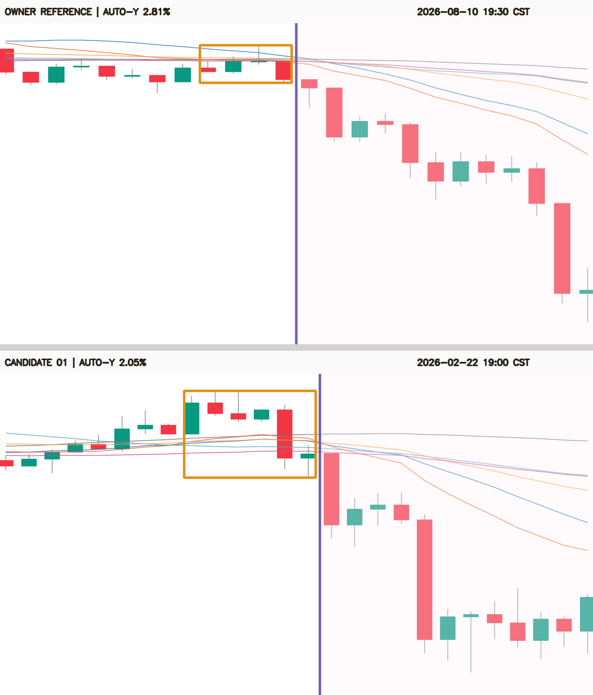

# ETH 2026 同类空头形态计数（冻结门 v1）

## 一句话结论

按本轮在扫描前冻结的 `eth_yearly_morphology_gate_v1_20260813`，2026-01-01 至
2026-08-13 17:15 CST 的 ETHUSDT 永续 15m 行情里共有 **2 个事件簇**：

1. **2026-08-10 19:30–20:15 CST**：Owner 提供的参考事件本身；
2. **2026-02-22 19:00–20:15 CST**：1 个新的机器候选，Codex 视觉复核为相似，等待 Owner
   逐样本确认。

因此当前必须分两种口径回答：**机器冻结门命中 2 次；Owner 已确认语义 1 次，另 1 次待确认**。
不能在 Owner 点第二张 YES 之前把“金标总数”写成 2。



橙框是建议核心，紫线右侧是独立的事后复核区。参考样本的类别语义来自 Owner；两张图的核心
几何都只是冻结模型对齐提议，`sample_owner_confirmed_geometry=false`。

## 数据与纪律

| 项 | 结果 |
|---|---:|
| 标的 / 周期 | ETH_USDT_SWAP / 15m |
| 扫描范围 | 2026-01-01 00:00 UTC → 2026-08-13 09:15 UTC |
| 北京时间范围 | 2026-01-01 08:00 → 2026-08-13 17:15 |
| 2026 已收盘 K 线 | 21,542 |
| 连续性缺口 / 多余时间戳 | 0 / 0 |
| 本地规范数据截止 | 2026-08-05 12:45 UTC |
| OKX 只读内存补齐 | 3 次请求、900 行，至 2026-08-13 09:15 UTC |
| 本地新增原始 K 线文件 | 0 |
| 合并序列 SHA-256 | `d4c90429061037260edc7df4f0a98d5bb75ff3dbb7f058ea1f20055294001410` |
| holdout | 本冻结门第 **1** 次；Owner 本轮“找今年有多少”的请求明确授权 |
| holdout 行数 | 9,734 |
| 模型 / conf / NMS | 未使用 / 不适用 / 不适用 |
| training / production eligible | false / false |

数据源仍是 OKX `ETH-USDT-SWAP` 历史 K 线；公共接口采用官方
[history-candles 文档](https://www.okx.com/docs-v5/en/)，只在内存与本地旧快照合并，未修改
`data/kline_fetched`。扫描后没有改任何门槛。

## 形态合同

### 核心特征（无前视）

候选核心宽度只试 4–7 根；核心侧只使用结束 bar 及以前的 OHLC、8 根前文、ATR14 和
SMA/EMA 20/60/120。最长均线窗口 120 根，`feature_future_bars=0`。

| 门 | 冻结值 |
|---|---:|
| 六均线最大跨度 | ≤ 0.153465% |
| 核心高低跨度 | ≤ 0.647682% |
| 核心净变化绝对值 | ≤ 0.45% |
| 核心倒数第二根前净变化 | ≥ -0.25% |
| 前 8 根高低跨度 | ≤ 0.75% |
| 前 8 根净变化绝对值 | ≤ 0.50% |
| 核心跨度 / 前置 ATR14 | 1.0–4.5 |
| 核心与均线束相交 | 必须 |

### 事后确认标签（明确有前视）

下面 5 根只作“历史上完整形态是否释放”的标签，不是检测特征：

| 门 | 冻结值 |
|---|---:|
| 第 3 根收盘相对核心结束 | ≤ -0.25% |
| 第 5 根收盘相对核心结束 | ≤ -0.612929% |
| 前 5 根最低价相对核心结束 | ≤ -0.731131% |
| 前 5 根最高价相对核心结束 | ≤ +0.15% |
| 前 5 根阴线数 | ≥ 3 |

这些阈值只从 8 月 10 日参考事件派生，并在打开全年命中结果前冻结。相似距离只用于同一事件簇
内选代表核心，不参与候选准入。

## 扫描结果

| 层级 | 数量 |
|---|---:|
| 通过门的“端点 × 核心宽度” | 11 |
| 唯一核心结束端点 | 4 |
| 12-bar 邻近去重后的事件簇 | **2** |
| 参考事件 | 1 |
| 新候选 | **1** |
| Owner 已确认语义 | 1 |
| 待 Owner 逐样本确认 | **1** |
| 事件 / 21,542 bars | 0.0093% |

| 角色 | 核心时间（CST） | 核心根数 | MA跨度 | 核心跨度 | D3 | D5 | 视觉状态 |
|---|---|---:|---:|---:|---:|---:|---|
| 参考 | 08-10 19:30–20:15 | 4 | 0.061% | 0.370% | -0.410% | -0.817% | Owner参考 |
| 新候选 | 02-22 19:00–20:15 | 6 | 0.124% | 0.629% | -0.370% | -1.348% | Codex建议，Owner待确认 |

2 月 22 日的共同点是均线束附近短平台、核心末端向下释放，随后 3–5 根继续走弱；差异是它的
核心波幅与均线跨度都更大，且下跌更猛烈。因此它是合理候选，但不能用一次 Codex 目测替代
Owner 金标。

## 与上一版本对照

| 版本 | 数据范围 | 计数口径 | 事件数 | 裁决 |
|---|---|---|---:|---|
| 之前 | 无全年冻结扫描 | 未知 | — | 不能回答 |
| 本轮 v1 | 2026-01-01 → 08-13 | 核心无前视门 + 5 根事后确认 + 12-bar 去重 | 2 | 1参考 + 1待确认 |

本轮没有训练模型，也没有策略收益评估。因此 val AUC、置换 p、top-decile 毛/净收益、胜率、
单特征基线和匹配随机对照组均为 **不适用**；把这些栏填上数字反而会把形态计数冒充交易绩效。

## 风险与诚实声明

- **不是自然基率**：这是参考锚定的严格冻结门计数；更松的语义可能多于 2，更严的边界也可能
  只有参考本身。
- **holdout 已消费**：本门已读取 ≥2026-05-04 的 9,734 根 K 线，登记为该配置第 1 次。
  禁止看完结果后调门，再把新结果冒充独立验证。
- **参考几何未被 Owner 逐 bar 确认**：参考语义是 Owner 提供的，但 11:30–12:15 UTC 的 4 根
  核心来自冻结模型对齐；不升级为 `sample_owner_confirmed_geometry=true`。
- **事后检测，不是盘口信号**：第 3/5 根确认有明确未来信息，所有产物保持
  `production_eligible=false`，不得进入 tip、forward、ACTIVE 或部署。
- **只确认空头**：本轮不生成多头镜像，也不把多头样本当负例。
- **没有收益筛选**：候选准入不看 TP/SL、未来 72 根或策略回报，只看合同规定的 5 根形态确认。

## 复现命令

builder 已先由 commit `afad164` 入库，再生成本报告产物：

```bash
cd /Users/zhangzc/fable-trading
git branch --show-current  # 必须为 main
PYTHONPATH=.:/Users/zhangzc/yoyo-trading \
  .venv/bin/python -m pytest -q tests/test_find_eth_yearly_morphology.py
ETH_MORPH_REPRO_DIR=$(mktemp -d)
.venv/bin/python scripts/find_eth_yearly_morphology.py \
  --scan-end 2026-08-13T09:15:00Z \
  --out "$ETH_MORPH_REPRO_DIR/eth_yearly_morphology_gate_v1"
.venv/bin/python scripts/md_to_html.py \
  analysis/p2_eth_yearly_morphology_count_20260813.md \
  --out-dir analysis/html
```

验证结果：定向测试 **3 passed**；完整测试在正确项目环境下为 **712 passed、2 skipped、14 warnings**。
首次误用系统 `python3` 时，测试收集因环境没有 `yoyo` / `ultralytics` 失败；改用上面的 `.venv`
与显式 `PYTHONPATH` 后全绿，未把环境失败隐去或误报成代码通过。

核心审计文件：

- `analysis/output/eth_yearly_morphology_gate_v1/scan_summary.json`
- `analysis/output/eth_yearly_morphology_gate_v1/reference_features.json`
- `analysis/output/eth_yearly_morphology_gate_v1/review_manifest.jsonl`
- `analysis/output/eth_yearly_morphology_gate_v1/comparison.png`

## 下一步选项

唯一需要 Owner 决策的是：查看 2 月 22 日候选后回复 **YES / NO**。YES 时机器计数 2 可升级为
Owner 语义确认 2；NO 时本轮严格金标计数仍为 1。无论选择哪一个，都不自动训练、promote、
部署或接入实盘。
