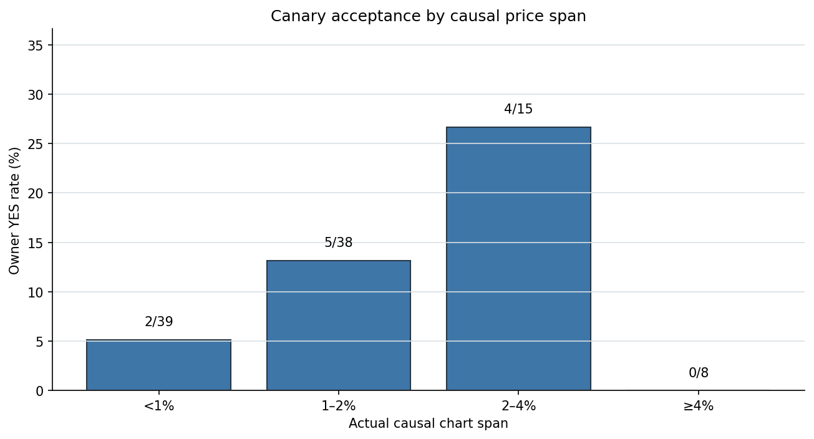
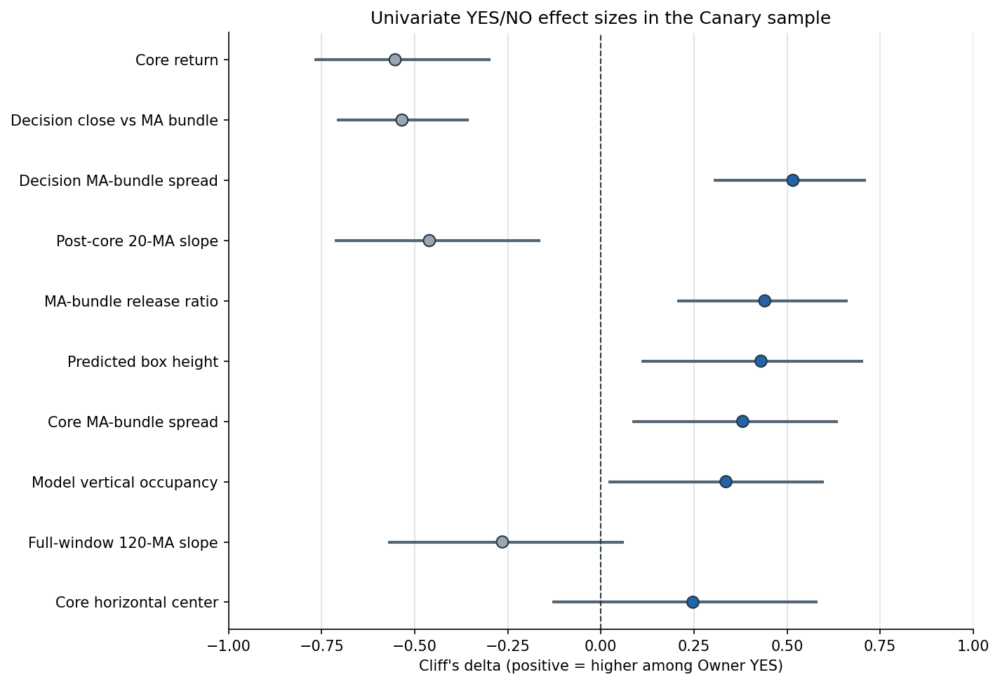
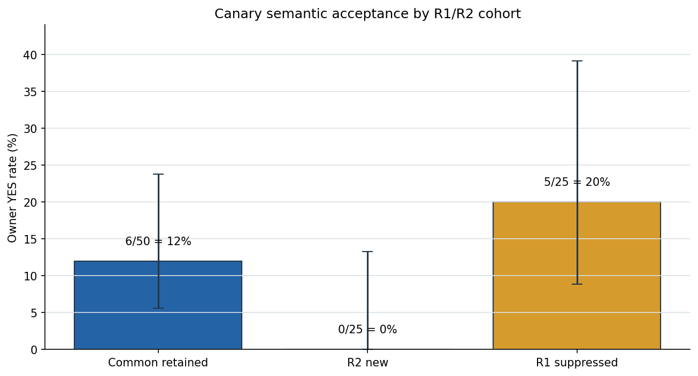

# Local Signal V2：模型为什么把普通形态也认成正信号

## Executive Summary

- **结论不是“只要取消 6% 压缩就能修好”。** 当前模型输入确实存在明显的尺度分布偏移：Canary 的纵轴内容占用中位数只有 **18.0%**，旧 Positive Pool 为 **51.0%**；中位单根 K 高度分别为 **29.0 px / 55.2 px**。但 100 个 Canary 中 97 个都触发 6% floor，缺少足够的 floor-off 对照；而真实跨度 ≥4% 的 8 个样本仍是 **0 YES / 8 NO**。因此尺度是高可信风险项，不是已证实的唯一根因。
- **Owner 真正认可的是“开始失守并释放”，模型误把“只有密集”也当成正例。** Canary YES 相比 NO，核心跌幅中位数为 **-45.4 bp vs -13.7 bp**，decision 收盘相对六线束为 **-73.0 bp vs -9.8 bp**，六线 decision 跨度为 **75.4 bp vs 35.0 bp**，20 线框后斜率为 **-4.68 vs -1.24 bp/bar**。这些方向共同指向“价格离开密集边缘、短线向下张口”，而非单纯均线密集。
- **框横向位置不是主因。** YES / NO 的核心横向中心中位数为 **57.1% / 56.3%**，效应置信区间跨 0；模型置信度的分离同样较弱。不能再用“固定最右、固定中间或提高 conf”代替语义学习。
- **现有 positive 语义大体正确，但比最终目标更成熟、更靠后。** Positive YES 的 decision 收盘相对六线束为 **-147.2 bp**、框后跌幅 **-60.1 bp**；Canary YES 只有 **-73.0 bp / -13.1 bp**。这说明旧正例大量是明显、已经释放较多的形态，不能完整覆盖 Owner 要的“启动前沿”。下一轮应先构建“早期 YES vs 相似 NO”的语义对照集，再做单变量 renderer 实验；当前不应直接开 R3、加 hard negative 或调阈值。

## 审计对象与口径

本轮只读分析使用已冻结的 200 条 Owner 审核：Positive Pool 100 条（85 YES / 15 NO）和 Canary 100 条（11 YES / 89 NO）。`owner_verdict` 是 Owner 看过独立未来走势后给出的语义裁决，因此是**未来走势辅助裁决**；所有解释特征仍严格只读取 decision 及之前的 OHLC 和 SMA/EMA 20/60/120。

每条样本的特征窗口固定为：尺度使用完整 causal detector window；核心结构使用 `box_start..box_end`；释放结构使用 `box_end..decision`；pre-core 最多只用核心前 3 根。没有读取 future review 图片、future OHLC 或 holdout。

| 数据质量检查 | 结果 |
|---|---:|
| review rows / 唯一 ID | 200 / 200 |
| source lineage 成功联结 | 200 / 200 |
| model input SHA 校验 | 200 / 200 |
| 模型图片尺寸 | 200 × `1280x742` |
| `visible_end_bar == decision_bar` | 200 / 200 |
| 最大物化时间 | 2026-05-03 19:45 UTC |
| holdout rows | 0 |
| future 图片 / future OHLC 读取 | 0 / 0 |
| causality audit | PASS |
| 仓库主测试 `tests/` | 697 passed / 2 skipped |

## 6% 纵轴让 Canary 更扁，但单改尺度没有充分证据

Positive 与 Canary 的输入不是被压缩成更小文件，而是模型 renderer 在真实跨度不足 6% 时仍使用至少 6% 的价格纵轴。相同 1280×742 像素下，Canary 的结构因此只占更小的垂直区域。

| 因果输入尺度 | Positive Pool | Canary | Canary YES | Canary NO |
|---|---:|---:|---:|---:|
| 真实跨度中位数 | 3.43% | 1.20% | 1.81% | 1.12% |
| 模型纵轴占用中位数 | 51.0% | 18.0% | 26.9% | 16.6% |
| 单根 K 高度中位数 | 55.2 px | 29.0 px | 40.4 px | 28.9 px |
| 触发 6% floor | 87 / 100 | 97 / 100 | 11 / 11 | 86 / 89 |



真实跨度从 `<1%` 到 `2–4%` 时 YES 率从 **2/39=5.1%** 升到 **4/15=26.7%**，说明极低占用确实更容易产生普通密集误报；但 `≥4%` 又是 **0/8**，关系并不单调。Canary YES 的纵轴占用相对 NO 有中等正向效应（Cliff's delta **+0.336**，bootstrap 95% **+0.019 到 +0.600**），多重比较后 `q=0.142`。结论应是“尺度值得做受控单变量实验”，不是“已经证明换 auto-Y 就会成功”。

## 真正的边界是“释放是否成立”，不是框放在哪里

下面的 Cliff's delta 只衡量这 100 个分层 Canary 中 YES 与 NO 的单变量分离；正值表示 YES 更大，负值表示 YES 更小。它不是新分类器，也不是因果效应。



| causal 特征 | YES 中位数 | NO 中位数 | Cliff's delta | bootstrap 95% | BH q |
|---|---:|---:|---:|---:|---:|
| 核心区间收益 | -45.4 bp | -13.7 bp | -0.553 | [-0.769, -0.297] | 0.076 |
| decision 收盘相对六线 | -73.0 bp | -9.8 bp | -0.534 | [-0.710, -0.354] | 0.055 |
| decision 六线跨度 | 75.4 bp | 35.0 bp | +0.516 | [+0.303, +0.712] | 0.055 |
| 20 线框后斜率 | -4.68 bp/bar | -1.24 bp/bar | -0.461 | [-0.714, -0.162] | 0.055 |
| 六线释放倍数 | 1.27× | 1.07× | +0.440 | [+0.205, +0.663] | 0.198 |
| 预测框纵向高度 | 16.1% | 10.3% | +0.430 | [+0.109, +0.704] | 0.055 |
| 核心六线跨度 | 61.5 bp | 35.8 bp | +0.381 | [+0.085, +0.636] | 0.055 |
| 模型纵轴占用 | 26.9% | 16.6% | +0.336 | [+0.019, +0.600] | 0.142 |
| 核心横向中心 | 57.1% | 56.3% | +0.247 | [-0.130, +0.582] | 0.659 |
| 模型置信度 | 0.460 | 0.381 | +0.160 | [-0.150, +0.467] | 0.338 |

多项结构特征在相同方向上形成一致证据：Owner YES 不是“线挤在一起”，而是密集之后价格已经来到或跌破线束边缘，短周期线开始向下，六线跨度开始释放。没有任何单个数字可以直接写成硬阈值；本轮的价值是明确训练语义必须同时覆盖这些连续变化。

框位置则没有显示可靠分离。横向中心、框宽、decision delay 都有较大重叠；delay 3 根的 YES 率为 **8/46=17.4%**，delay 4 根为 **2/37=5.4%**，delay 5 根为 **0/11**，但 `>5` 只有 3 条且出现 1 个 YES，样本过小。现有证据支持“3 根优先、尽量早”，不支持把 3 写死为标签规则。

## Positive 纯度高，但训练分布比“启动前沿”更成熟

旧 Positive Pool 的 85% Owner YES 证明正例主语义并未整体错掉；问题是这些正例在 causal decision 时已经比最新目标走得更远。

| 结构中位数 | Positive YES | Canary YES | Canary NO |
|---|---:|---:|---:|
| 模型纵轴占用 | 49.5% | 26.9% | 16.6% |
| 核心跌幅 | -76.2 bp | -45.4 bp | -13.7 bp |
| 框后至 decision 跌幅 | -60.1 bp | -13.1 bp | 0.0 bp |
| decision 收盘相对六线 | -147.2 bp | -73.0 bp | -9.8 bp |
| decision 六线跨度 | 77.3 bp | 75.4 bp | 35.0 bp |
| 20 线框后斜率 | -10.01 bp/bar | -4.68 bp/bar | -1.24 bp/bar |
| 六线释放倍数 | 1.32× | 1.27× | 1.07× |

这解释了为何训练集看起来“很多标准做空图”、离线 mAP 也高，连续市场却仍乱报：训练正例主要教会了模型**明显释放后的标准形态**，而需要在实盘中分开的恰恰是更早、更细的边界——Canary YES 与大量相似 NO。Positive Pool 内部的 85 YES / 15 NO 在多重比较后没有稳定单变量可直接清洗，不能靠一条过滤规则把 15 个 NO 自动剔掉。

## R2 不只没有解决误报，还新增了最弱的一批候选



| 内部来源（审核后解盲） | YES / 总数 | YES rate | 核心六线跨度中位数 | 框后收益中位数 | 原始重复触发中位数 |
|---|---:|---:|---:|---:|---:|
| common retained | 6 / 50 | 12% | 35.2 bp | -2.5 bp | 10.5 |
| R2 new | 0 / 25 | 0% | 24.6 bp | +10.7 bp | 2.0 |
| R1 suppressed | 5 / 25 | 20% | 60.2 bp | -13.1 bp | 6.0 |

R2 new 是三组里最不像“启动释放”的一组：没有 Owner YES，核心线束最窄、框后价格反而小幅向上、事件也最不稳定。相反，被 R2 抑制的 R1 候选有 20% YES，结构更接近目标。共同保留的 6 个 YES 中，R2 相比配对 R1 的核心与 decision 中位都晚 **1.5 根**、峰值置信度低 **0.197**、原始触发少 **4 次**；共同 NO 的位置变化中位数为 0。这里只含 6 个共同 YES，属于方向性诊断，但足以否定“R2 已经朝正确边界稳定收敛”。

## 推荐下一步：先补“早期语义对照”，再做单变量 renderer 实验

1. **保持当前模型 blocked。** 不 promote、不部署、不调 conf/NMS，不开 R3/R4，不把 398 events/day 交给 L2 当成正常状态。
2. **把本轮 96 个 YES / 104 个 NO 继续保持为开发审计证据，不自动转训练。** 其中最重要的是 11 个 Canary YES 与 89 个 Canary NO；它们比旧 positive 更接近真正的连续市场边界，但 11 个 YES 太少，且当前 100 个 Canary 是分层审核样本，不能独立承担训练与验收。
3. **从新的 pre-holdout 时间块扩一轮“早期启动前沿”盲审。** 检索只使用 decision 前的连续结构相似度，参考 11 个 Canary YES 与 89 个 NO，目标是补足不同币种、波动和自然位置的早期 YES，同时保留相似 NO；不因为未来跌了就预选，不读取 holdout。
4. **数据身份、时间 split、框和训练配方固定后，只改 renderer 纵轴表示做单变量臂。** 对照当前 6% floor 与“保留相对密集语义但提高低波幅分辨率”的自适应表示；不能同时改窗口、标签、negative 数量或 conf。当前 200 条只作开发诊断，最终必须在新的独立 pre-holdout 连续块和新的 Owner 审核样本上裁决。
5. **只有视觉单变量臂仍无法分开时，再评估任务拆分。** 这时可让 YOLO 专注定位平台，让独立 causal 判断层学习“跌破线束、20 线向下、释放倍数”等连续语义；但不能在本轮证据不足时直接把这些统计量硬编码成盘口规则。

## Further Questions

- 自适应纵轴在提高低波幅分辨率时，会不会把普通噪声也放大，从而丢失“均线密集”的相对视觉语义？这必须由同数据、同配方的单变量臂回答。
- 早期启动 YES 是否能扩到足够的币种和波动环境，还是 Owner 目标本身天然极少？当前 11 个 Canary YES 不能给出稳定频率结论。
- 新的独立 pre-holdout 连续块上，R1、R2 和未来 renderer 臂分别能保留多少 Owner YES、拒绝多少 NO？不能复用本轮 100 个 Canary 同时调参和验收。

## Caveats and Assumptions

- 本轮样本是分层抽样且要求安全未来对照可用，不能把 11% 称为市场自然 precision，也不能把各桶率外推为日频。
- Owner verdict 使用了未来走势对照；它适合语义审计，不等同于纯 causal 实盘裁决。所有解释特征仍是 causal。
- Cliff's delta、bootstrap 区间和 permutation p/q 都是探索性单变量证据。17 个特征做了 BH 校正；最强几项 `q≈0.055–0.076`，接近但没有跨过 0.05，不能声称已经找到因果公式。
- 6% floor 在 97/100 Canary 上生效，floor-off 只有 3 条；因此没有足够内部对照直接估计“取消 floor”的效果。
- 本轮没有训练模型、修改标签、改阈值、读 holdout、运行收益回测、生成订单或发送信号。
- `pytest -q tests` 全绿（697 passed / 2 skipped）；若从仓库根裸跑 pytest，会额外收集 `external/Kronos` 的第三方示例，并因本机未安装其可选 `qlib/model` 依赖在 collection 阶段报错。这不是本轮主测试回归，也没有为隐藏它而安装或修改外部依赖。
- val AUC、置换检验收益 p、top-decile 毛/净收益、胜率、单特征收益基线和匹配随机入场对照均为 **N/A**：本轮是 semantic/data audit，不是 L2 收益实验或方向性回测。用这些指标评价本轮会改变问题口径。

## Reproduction

冻结起点：`72bee9a70937e2998cf3fc743c21e9c3d8410a4e`。输入审核包 manifest SHA256：`015074dcb9f874804425b73191227a336b08aea62f2d6ba849301a18f40a7834`；Owner verdict log SHA256：`7a350788230567acde054c3a8ee40e16eba095a4f60d2d156ff0385b25cb88a7`。

```bash
cd /Users/zhangzc/fable-trading
PYTHONPATH=.:/Users/zhangzc/yoyo-trading .venv/bin/python \
  scripts/diagnose_local_signal_v2_semantic_boundary.py
PYTHONPATH=.:/Users/zhangzc/yoyo-trading .venv/bin/pytest -q \
  tests/test_diagnose_local_signal_v2_semantic_boundary.py \
  tests/test_md_to_html.py
PYTHONPATH=. .venv/bin/python scripts/md_to_html.py \
  analysis/p2_local_signal_v2_semantic_boundary_diagnosis_20260812.md \
  --out-dir analysis/html
```

关键机器产物：

- `analysis/output/local_signal_v2_semantic_boundary_diagnosis_20260812/boundary_features.jsonl`
- `analysis/output/local_signal_v2_semantic_boundary_diagnosis_20260812/boundary_summary.json`
- `analysis/output/local_signal_v2_semantic_boundary_diagnosis_20260812/causality_audit.json`
- `analysis/output/local_signal_v2_semantic_boundary_diagnosis_20260812/source_read_audit.jsonl`
