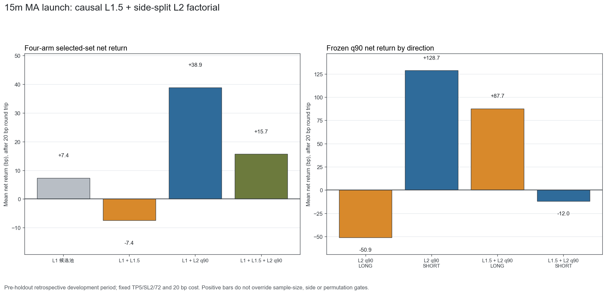
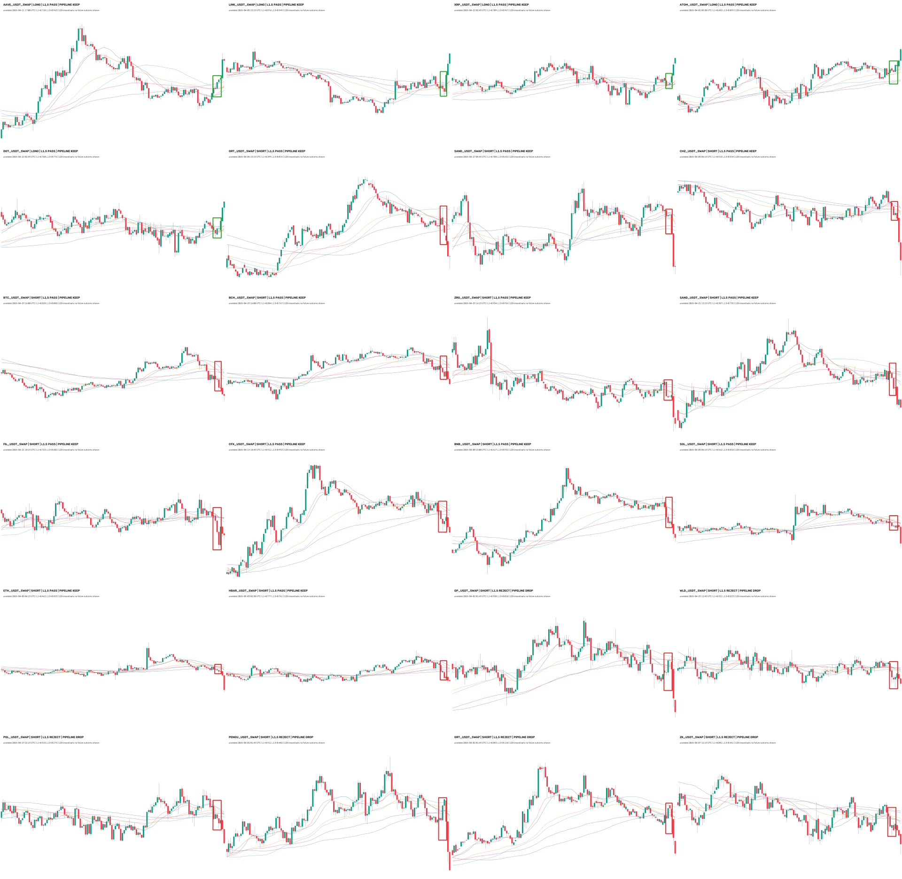

# 15m 均线密集启动：因果 L1.5 + 多空 L2 全链路审计（2026-09-01）

## 技术结论：整条链路未通过，不能开启

本轮把用户要求的路径完整做成四组冻结对照：原 L1、L1+全局形态 L1.5、L1+多空分开收益 L2、
L1+L1.5+L2。最终结论是 **全部不可上线**。L1.5 的 LONG 分类通过，但 SHORT 的最终误报率
15.70% 超过预注册 12.00% 上限；完整
L1.5+L2 只选出 18 个独立事件，少于最少 30 个，置换
`p=0.2304`，而且 SHORT 净收益为
-12.0 bp。

最重要的诊断是：**全局形态分类和未来收益判断不是一回事**。L1.5 能很好地复现现有自动标签，并不
代表这些标签就是 Owner 眼里的完美全局形态；即使局部图看起来标准，也不自动拥有稳定的 TP5/SL2/72
收益排序。

## 四组对照：加层并没有稳定提高收益

左图按四个实际输出集合比较扣 20 bp 后净均值；右图拆开 L2 的 LONG/SHORT。正柱不等于通过：
样本数、两边方向和置换检验必须同时过门。



| 配置 | 入选独立事件 | 净均值 | 置换 p | 减匹配对照 | 裁决 |
|---|---|---|---|---|---|
| L1 候选池 | 242 | +7.4 bp | — | — | 基线 |
| L1 + L1.5 | 146 | -7.4 bp | — | +19.5 bp | FAIL |
| L1 + L2 q90 | 34 | +38.9 bp | 0.1921 | +76.8 bp | FAIL |
| L1 + L1.5 + L2 q90 | 18 | +15.7 bp | 0.2304 | +50.8 bp | FAIL |

只加 L1.5 后，原 L1 池的净均值从 +7.4 bp 变成
-7.4 bp，说明当前全局弱标签过滤器没有保住经济价值。
只加 L2 的 34 个事件看似有 +38.9 bp，也完整超过 8 组匹配随机对照，
但 `p=0.1921` 且 LONG 为负，因此仍是未确认的探索性结果。

## 多空必须分开看：正负方向会互相掩盖

| 配置 | 方向 | q90 n | q90净均值 | top-decile净均值 | 收益正负AUC | 置换p |
|---|---|---|---|---|---|---|
| L2 q90 | LONG | 17 | -50.9 bp | -65.9 bp | 0.4793 | 0.8654 |
| L2 q90 | SHORT | 17 | +128.7 bp | +143.8 bp | 0.4900 | 0.0504 |
| L1.5 + L2 q90 | LONG | 5 | +87.7 bp | +28.8 bp | 0.6032 | 0.2031 |
| L1.5 + L2 q90 | SHORT | 13 | -12.0 bp | -9.1 bp | 0.4118 | 0.5745 |

L2-only 的 SHORT 为正、LONG 为负；加上 L1.5 后恰好反过来。这个翻转说明样本选择不稳定，不能在看完
结果后临时宣布“只做空”或“只做多”。若要验证某一方向，必须新预注册并等待新的未见时期。

## L1.5 看起来很准，但它学的是协议弱标签，不是 Owner 全局金标

| 方向 | final n | L1.5 AUC | 单一密集度AUC | 精确率 | 召回率 | 误报率 | 裁决 |
|---|---|---|---|---|---|---|---|
| LONG | 207 | 0.9505 | 0.5752 | 85.07% | 82.61% | 7.25% | PASS |
| SHORT | 258 | 0.8906 | 0.5397 | 70.00% | 73.26% | 15.70% | FAIL |

L1.5 使用 128 根历史，但输入右端严格停在每个样本的 `core_end`：启动确认段可见 K 线为 **0**。
训练单位是一事件一行，3129 个独立事件中 1043 个自动 Grade-A 正例、2086 个同形态 hard negatives；
LONG/SHORT 独立建模。它确实显著优于“只看当前均线宽度”的单特征基线，但标签来自原自动协议，
未经过 Owner 对“全局是否完美”的逐样本确认，因此高 AUC 只能证明模型能复现这套协议。

## 为什么第一版 AUC=1.0 被作废

第一版让 L1.5 看到了核心框之后的确认 K，同时标签本身也用这段启动进度区分正负；单独一个
`aligned_core_to_decision_atr` 就能把 LONG/SHORT 全部分开，AUC 都是 1.0。这是标签构造捷径，
不是全局形态能力。发现后没有继续拿它筛候选或训练 L2，而是先冻结失败证据，再预注册 v2：
物理截断全部 post-core K，并删除两个确认段字段。这个修正解释了为何 v2 的指标回到可信范围。

## 38 张实际全局图：像素一致，但肉眼也能看到边界不稳定

下面的联系表来自模型实际候选，展示 128 根已收盘 K 和冻结 L1 原框，不画未来结果。38/38 张高清图
全部通过输入哈希与坐标重投影检查，像素一致失败为 0。



逐张高清查看：[38 张全局审核图](p3_15m_ma_launch_l15_precore_l2_pipeline_gallery_20260901.html)。

总览同时说明当前弱标签的局限：部分保留图的框已经包含明显释放，部分被拒绝图肉眼仍像有效启动。
这不是渲染偏移，而是“自动 Grade-A/自动 hard negative”没有等价于 Owner 的全局好坏判断。

## 数据、时间与模型合同

| 项目 | 冻结值 |
|---|---:|
| L1.5 独立事件 | 3,129（正 1,043 / hard负 2,086） |
| L1.5 train / tune / final | 2,050 / 614 / 465 |
| L1.5 上下文 | 128 根，右端=core_end，post-core=0 |
| L1.5 特征 | 33 个因果全局形态特征 |
| 候选账本 | 3,779 行；最终独立事件 242 |
| L2 特征 | 17 个预先选定的因果特征，多空分开 |
| 结果标签 | next-open；TP 5.0 ATR / SL 2.0 ATR / 72 根 |
| 往返成本 | 0.20% |
| 最大暴露末端 | 2026-05-03T23:45:00+00:00 |
| holdout 起点 | 2026-05-04T00:00:00Z |
| holdout 消耗 | 0 |
| 渲染像素一致失败 | 0 |
| 机械验证 | 12/12 PASS |

所有切分按时间完成，没有随机切分；同一依赖事件只贡献一个 representative。收益评估继续使用原冻结
TP5/SL2/72、next-open、同根先判 SL、20 bp 成本和 8 组同币同时间块同波动桶随机对照。

## 风险与诚实声明

- 本次没有读取 `>=2026-05-04` holdout，没有 promote、部署、修改 ACTIVE/frozen、写 forward、发 Telegram 或下单。
- 经济 final 已在此前实验中使用过，因此这只是回顾式开发诊断，不是新的确认集。
- L1.5 的标签仍是协议弱标签；没有 Owner 全局金标时，不能宣称它真正懂“完美形态”。
- L2-only SHORT 的正结果是看完 final 后发现的，不得原地改成 SHORT-only 成功版本。
- 完整链路只有 18 个入选事件，任何漂亮均值都非常脆弱。
- 匹配随机对照只控制已定义的同币、时间块与波动桶，不能替代新时期前向确认。

## 正确路径：下一轮只解决标签，不再继续堆模型

1. **冻结本轮为失败基线。** 不调现有阈值，不把某个正方向单独挑出来上线。
2. **先建立真正的全局形态监督。** 从 L1.5 高分保留、低分拒绝和两者分歧区各抽样，直接标
   `global_shape_good`；LONG/SHORT 分开。若不做这一步，后续只能继续拟合自动协议。
3. **L1.5 只做形态，不看未来收益。** 仍严格截止 core_end；正例是 Owner 认可的全局图，hard negative
   是“局部框像，但全局不对”的图。
4. **L2 继续预测实际收益。** 只在 L1.5 合格候选上训练，LONG/SHORT 分开，并用全新未见时期验收。
5. **只有形态门和经济门都通过，才申请一次 holdout。** 本轮没有资格消耗 holdout。

## 复现命令

```bash
PYTHONPATH=. .venv/bin/python -m scripts.research_15m_ma_launch_l15_precore_l2_pipeline --build-l15-dataset
PYTHONPATH=. .venv/bin/python -m scripts.research_15m_ma_launch_l15_precore_l2_pipeline --train-l15
PYTHONPATH=. .venv/bin/python -m scripts.research_15m_ma_launch_l15_precore_l2_pipeline --apply-l15
PYTHONPATH=. .venv/bin/python -m scripts.research_15m_ma_launch_l15_precore_l2_pipeline --train-l2
PYTHONPATH=. .venv/bin/python -m scripts.research_15m_ma_launch_l15_precore_l2_pipeline --render
PYTHONPATH=. .venv/bin/python -m scripts.research_15m_ma_launch_l15_precore_l2_pipeline --verify
PYTHONPATH=. .venv/bin/python scripts/build_15m_ma_launch_l15_precore_l2_pipeline_report.py
PYTHONPATH=. .venv/bin/python scripts/md_to_html.py analysis/p3_15m_ma_launch_l15_precore_l2_pipeline_20260901.md --out-dir analysis/html
```

## 仍需回答的问题

- Owner 是否愿意把“全局形态好/不好”作为独立监督问题确认一小批校准样本？如果明确不要任何人工标签，
  下一轮只能做无监督聚类/分歧检索，不能诚实称为 Owner 完美形态分类器。
- SHORT 的 L2-only 正值能否在全新 pre-holdout 或获批 holdout 上复现？当前 final 已被观察，不能再作答案。
