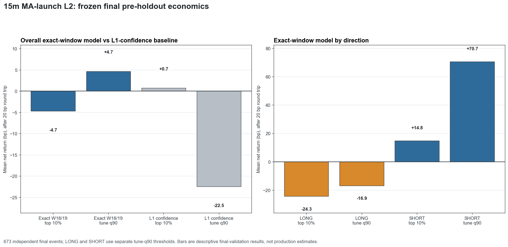
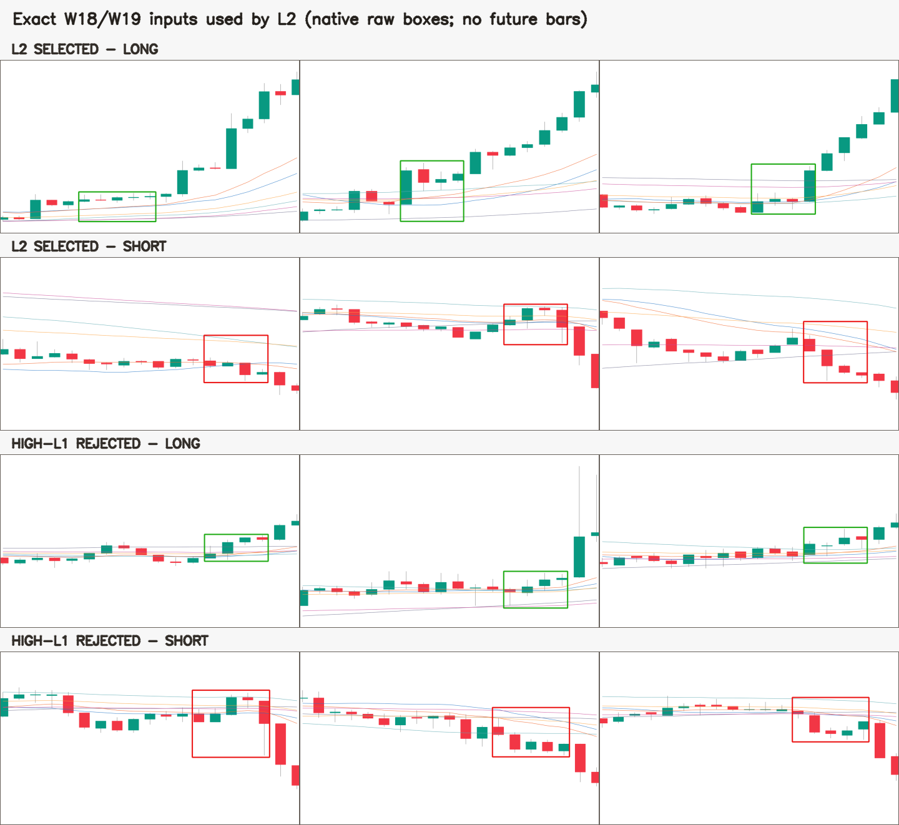

# 15m 均线密集启动：精确短窗 L2 多空回归审计（2026-09-01）

## 技术结论：局部形态输入没有学到稳定的未来收益排序

本轮把 L2 严格改成与 L1 相同的 **18/19 根、1280×742 原始输入**，只使用图里可见的 OHLC、
SMA/EMA 20/60/120、当前原始检测框与当前 confidence，并为 LONG、SHORT 分别训练收益回归。
结果是 **预注册门 FAIL，不可用于过滤、部署或下单**：673 个最终独立事件的 top 10% 扣 0.2%
往返成本后平均 -4.7 bp，单尾置换
`p=0.377162`，AUC `0.4519`，
Spearman `-0.1201`。

最重要的分化是：SHORT 的 tune-q90 组 15 个事件净均值
+70.7 bp，但 LONG 的 46 个事件为
-16.9 bp。这个方向差异是**探索性结果**；它是在本次
final validation 上看到的，不能现在删除 LONG、保留 SHORT 后再把同一段数据称为独立验证。

## 经济结果图：总体不显著，LONG 与 SHORT 方向相反

下图所有柱都使用同一最终 pre-holdout 时段和 20 bp 成本。左侧比较精确短窗模型与只用 L1
confidence 的基线；右侧拆开 LONG/SHORT。q90 偶然为正不能覆盖 top-decile、置换检验与随机对照失败。



| 模型口径 | final 独立事件 | best iter LONG/SHORT | q90 n | q90净收益 | top-decile净收益 | 置换p | AUC |
|---|---:|---:|---:|---:|---:|---:|---:|
| 本轮精确 W18/W19，多空分开 | 673 | 1 / 4 | 61 | +4.7 bp | -4.7 bp | 0.3772 | 0.4519 |
| 本轮仅 L1 confidence 基线 | 673 | 2 / 6 | 141 | -22.5 bp | +0.7 bp | 0.2985 | 0.5010 |
| 旧 168 根上下文，多空分开 | 242 | 17 / 17 | 20 | +123.1 bp | +93.9 bp | 0.0721 | 0.4972 |
| 旧 168 根上下文，混合方向 | 242 | 2 | 41 | +3.4 bp | -15.0 bp | 0.6564 | 0.5646 |

旧模型只作方向性背景：它使用不同的 168 根特征、旧 episode/依赖块，最终独立事件仅 242 个，不能与本轮 673 个事件当作严格单变量胜负。

## 实际输入图：框和局部形态没坏，失败的是收益预测

40 张抽样图均从**模型实际使用的原始 1280×742 输入**重新读取并逐文件验哈希；红/绿框是冻结 L1
原框，没有未来 K 线。局部形态看起来合理并不矛盾：L1 的任务是找“像不像均线密集启动”，本轮 L2
的任务却是预测“此后 TP5/SL2/72 的实际收益”。前者成立，不等于后者存在可泛化优势。



高清逐图浏览：[40 张实际输入图（点击可切换无框原图）](p3_15m_ma_launch_l2_short_window_side_split_gallery_20260901.html)。

## LONG 模型几乎退化，SHORT 也没有显著排序能力

| 方向 | 独立 train/tune/final | best iter | final 唯一分数 | q90 n | q90净收益 | top-decile净收益 | 置换p | AUC | Spearman |
|---|---:|---:|---:|---:|---:|---:|---:|---:|---:|
| LONG | 480 / 283 / 442 | 1 | 10 | 46 | -16.9 bp | -24.3 bp | 0.5363 | 0.4675 | -0.1397 |
| SHORT | 647 / 300 / 231 | 4 | 183 | 15 | +70.7 bp | +14.8 bp | 0.3768 | 0.4265 | -0.0716 |

LONG 在 480 个训练独立块、238 个特征下早停于第 1 棵树，442 个 final 事件只有
10 个不同分数；46 个 q90 入选事件全部落在
同一个最高分并列组。这不是精细排序，而是低分辨率分桶。SHORT 早停于第 4 棵树，分数更细，但
置换 `p=0.3768`、AUC
`0.4265`，仍不能证明稳定优势。

当前配置的有效样本/特征比例也很紧：LONG 480/238，SHORT 647/238。LightGBM 的早停行为与
final 上负 Spearman 一致，说明这批“局部可见像素坐标特征”对未来收益信号弱，而不是模型还没多跑几轮。

## 严格随机对照揭示 q90 正收益由缺配样本驱动

随机对照固定同币、同月、同 UTC 8 小时时段、同因果 ATR 五分位、同方向、同 TP/SL/期限/成本；
每个 assignment 内控制点至少相隔 72 根，并且只有凑齐 8/8 assignments 的事件才进入对照账本。
673 个最终独立事件中，354 个能完整匹配，319 个诚实缺样。

本轮 q90 共 61 个事件，其中只有 32 个有完整对照：

- 全部 q90：净均值 +4.7 bp；
- 有完整对照的 32 个：净均值 -49.0 bp；
- 无完整对照的 29 个：净均值 +63.9 bp；
- 8 组已配对样本的事件减随机对照平均为
  -2.4 bp，并非 8/8 为正。

因此“q90 总体略正”不能当作成功：正数主要来自无法按预注册标准配对的事件，
`matched_controls_cover_every_selected_event=false` 与 `beats_matched_controls_every_assignment=false` 都是实质失败。

## 数据范围与指标定义

| 项目 | 数值 |
|---|---:|
| 冻结 L1 原始框 | 25,911 |
| 分方向重聚类 episode | 3,827（LONG 1,837 / SHORT 1,990） |
| 完整标签行 | 3,798（不可用 outcome 29） |
| 原图逐像素校验 | 3,827 / 3,827，失败 0 |
| W18 / W19 | 1,861 / 1,937 |
| 依赖块 | 2,496 |
| train / tune / final 全量行 | 1,791 / 825 / 1,024 |
| final 独立块 | 673（LONG 442 / SHORT 231） |
| 决策时间范围 | 2026-01-01T01:30:00+00:00 → 2026-05-03T05:45:00+00:00 |
| 最大标签暴露末端 | 2026-05-03T23:45:00+00:00（holdout 从 2026-05-04T00:00:00Z 开始） |
| 模型输入 | 238 个精确短窗可见坐标特征 |
| 标签 | TP 5.0 ATR / SL 2.0 ATR / 72 根 / next-open |
| 成本 | 0.20% 往返 |
| holdout / 网络读取 | 0 / 0 |

`top-decile` 是按各方向 tune 分布经验百分位合并后最高 10%；`q90` 是 LONG、SHORT 各自在 tune
分数上固定第 90 百分位阈值，再原样应用到 final。置换检验固定模型分数、随机打乱 final 收益
10,000 次，检验真实 top-decile 毛收益是否显著更高。AUC 只把 TP-first 当诊断标签，不是收益回归成功门。

## 模型与时间纪律

- 原候选账本 SHA-256：`430aff683cdd9518a061aa335b6048a5f8d63b269a1af1e98057f8c1a5d00214`；没有重扫 L1，也没有改 confidence/NMS。
- LONG/SHORT 按 `symbol + side` 重新聚类，19 个旧混方向 episode 不再混成一条训练记录。
- 决策时刻是完整 W18/W19 最后一根收盘；标签未来仅用于监督，完整 72 根 exposure 在调用 labeler
  **之前**检查，超过 2026-05-04 会 fail closed。
- 训练、tune、final 按时间切分，保留 60 小时 purge；直接或传递重叠的同币事件只取依赖块首条。
- 六条可见 SMA/EMA 20/60/120 本身会因定义而总结窗口前 close；这是 L1 图里真实可见状态，已在
  prereg 明示。没有额外的 48/96/168 根原始 K、volume、symbol、EMA200、旧 global-context 特征或
  后续 episode 最大 confidence 进入模型。
- LightGBM 固定 CPU、单线程、deterministic 与全部 seed；没有参数搜索，阈值只来自 tune。

## 特征贡献不是因果解释

| 方向 | 排名 | 特征 | gain |
|---|---:|---|---:|
| LONG | 1 | `t03_ema120_y` | 0.0100617 |
| LONG | 2 | `prediction_cx_norm` | 0.00942979 |
| LONG | 3 | `t16_low_y` | 0.00462498 |
| LONG | 4 | `t04_sma60_y` | 0.00428852 |
| LONG | 5 | `t00_high_y` | 0.00344313 |
| SHORT | 1 | `t18_ema120_y` | 0.0185007 |
| SHORT | 2 | `prediction_h_norm` | 0.0139899 |
| SHORT | 3 | `t05_close_y` | 0.0132162 |
| SHORT | 4 | `t18_ema20_y` | 0.012362 |
| SHORT | 5 | `t02_ema120_y` | 0.0112792 |

这些 gain 只描述少数树如何切分当前训练数据。尤其 LONG 只有 1 棵树，不能把
`t03_ema120_y` 或框横坐标解释成稳定交易因子；SHAP 或更复杂解释也无法把一个未通过验证的模型变成有效模型。

## 预注册门

| 门 | 结果 |
|---|---:|
| `beats_matched_controls_every_assignment` | FAIL |
| `each_side_minimum_10_selected_dependency_blocks` | PASS |
| `frozen_threshold_net_positive` | PASS |
| `matched_controls_cover_every_selected_event` | FAIL |
| `minimum_30_selected_dependency_blocks` | PASS |
| `neither_side_frozen_threshold_net_negative` | FAIL |
| `outcome_permutation_p_lt_0_01` | FAIL |
| `top_decile_net_positive` | FAIL |

总判定：**FAIL**。校验回执 `passed=true`，共
15 项全部为真；失败来自模型证据，不是文件、标签或渲染校验坏掉。

## 为什么“图看起来不错”与“模型失败”可以同时成立

1. **L1 与 L2 的真值不同。** 这 3,827 个 episode 本来就是 L1 提出的局部形态，抽出来看大多像目标并不意外；L2 学的是后来赚不赚钱。
2. **同一小窗缺少全局阶段信息。** 18/19 根足够描述红框附近，却看不到更早趋势是否已经走完、上方阻力、波动所处阶段等。旧 168 根模型也没过门，说明“加长上下文”本身同样不是答案。
3. **收益噪声大于可见形态差异。** TP5/SL2/72 会受到候选之后市场 beta、跨币共振和波动路径影响；视觉上近似的框可以走出相反结果。
4. **当前表征维度过高、样本有限。** 238 维对 480/647 个训练独立块，导致 LONG 第 1 轮就停止并产生大量分数并列。
5. **完成形态不等于新鲜入场。** L1 已看核心后确认 K；本轮可用时间仍是完整检测窗右端，不能冒充 tip/tip-1/tip-2 实盘信号。

## 限制、稳健性与诚实声明

- final validation 已被本配置消耗一次用于裁决；不能在这里删 LONG、降维、改阈值或换参数后再次宣称独立验证。
- 54 币来自现存深历史文件，仍有 cohort/生存者偏差；匹配随机对照缓解但不能消除。
- 354/673 的严格控制覆盖不足，且入选组仅 32/61 完整覆盖；报告将其判为失败，不做乐观外推。
- 两张完全相同的像素图对应不同方向框，但它们被纳入同一跨方向 dependency block，未重复当独立证据。
- 本轮没有读取 ≥2026-05-04 holdout，没有改 TP/SL/期限/成本，没有 promote、部署、改 ACTIVE/frozen/forward、发 Telegram 或下单。
- 本机仓库级环境门另报告 FastAPI/OpenCV/PyYAML 与最新锁文件不一致；本轮训练所冻结的 LightGBM/NumPy/pandas/scikit-learn/SciPy 版本全部吻合。该环境差异没有被静默修依赖。

## 下一步：保留回归架构，但淘汰本配置

1. **当前两个模型均不启用。** LONG 明确负向；SHORT 的正数是本轮 final 上的事后分方向观察，不能单独 promote。
2. **若继续经济 L2，必须另立预注册。** 单变量优先考虑大幅降维/正则化，而不是在本 final 上调 q90；继续保持多空分开，并用新的未见时间段或前向样本验收。
3. **若目标是修正“局部图好、全局图差”，那是 L1.5 形态质量任务。** 它需要 Owner 的全局好/坏标签，不能拿未来收益自动代替形态真值；经济 L2 回归仍放在其后。
4. **不要现在消耗 holdout。** 当前 pre-holdout 已明确 FAIL，没有理由用最终 holdout 给失败配置补一次机会。

## 仍需回答的问题

- SHORT 的探索性正收益能否在完全新的、预注册的时间段复现？
- 只保留少量、可解释且从 W18/W19 直接计算的特征，是否能避免 LONG 的 1-tree 退化？
- Owner 所说的“全局不对”应具体拆成哪些形态标签，才能构建不依赖未来收益的 L1.5 Gold？

## 复现命令

```bash
git checkout e518469503b32fdbbabb07502db61afe570706cc
python3 -m scripts.research_15m_ma_launch_l2_short_window_side_split --build-dataset
python3 -m scripts.research_15m_ma_launch_l2_short_window_side_split --train-evaluate
python3 -m scripts.research_15m_ma_launch_l2_short_window_side_split --render
python3 -m scripts.research_15m_ma_launch_l2_short_window_side_split --verify
git checkout 6bf17fdeaaafb36957a566b26a1e08bdb8e55d90
python3 scripts/build_15m_ma_launch_l2_short_window_side_split_report.py
python3 scripts/md_to_html.py analysis/p3_15m_ma_launch_l2_short_window_side_split_20260901.md --out-dir analysis/html
```
