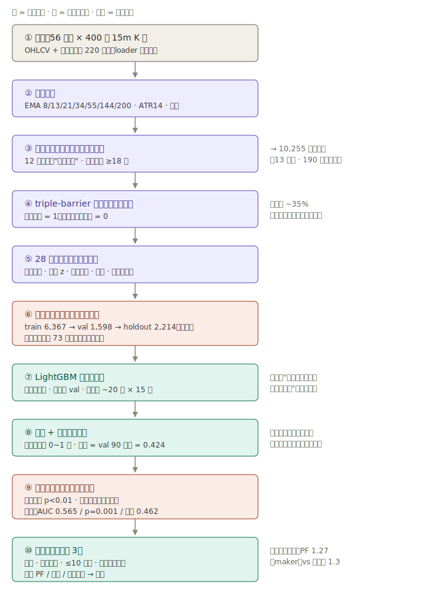
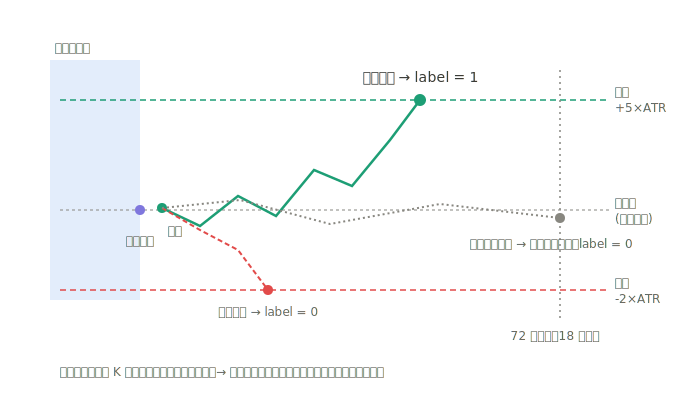

# 系统架构（2026-07-09）

一句话：**规则扫描产生候选 → 机器学习排序 → 组合回测定生死 → 前向数据终审**，
外加一个视觉检测层（YOLO）和一个全栈看板。

## 总览图

```
┌─────────────────────────── 数据层 ───────────────────────────┐
│ OKX 公共 API ──fetch_okx.py（并行+限速+断点续传）──┐          │
│               ──update_okx.py（每日增量，8:00 定时）─┤          │
│ 旧项目缓存（只读软链 data/kline_cache）────────────┼→ loader.py│
│                                                    │  合并去重 │
└────────────────────────────────────────────────────┴──────────┘
                              │ 15m OHLCV（现货 + USDT 永续）
              ┌───────────────┼────────────────┐
              ▼               ▼                ▼
┌──── 2a 检测层（旁路）──┐ ┌── 2b 判断层（主线）────────────┐
│ render.py 画 K 线图    │ │ candidates.py 密集规则扫描      │
│ （SMA/EMA 20/60/120） │ │ （EMA 8/13/21/34/55+144/200，  │
│ auto_label.py 规则标注 │ │  strict/expanded 双阈值预设）   │
│ YOLO11 训练/评估       │ │ labeling.py triple-barrier /    │
│ ＝"规则的视觉替身"     │ │  拖尾止损（tp/sl/horizon 参数化）│
│ 用途：未来实盘视觉入口 │ │ features.py 28 维无前视特征     │
└───────────────────────┘ │ train.py LightGBM + purge 切分  │
                          │  + 置换检验 + 基线对照           │
                          └──────────────┬─────────────────┘
                                         │ 打分后的信号
                          ┌──────────────▼─────────────────┐
                          │ 阶段 3 组合层 backtest/run.py    │
                          │ 等权/同币锁仓/10 并发/成本扫描    │
                          │ maker_val_sim.py maker 执行模拟  │
                          │ barrier_sweep.py 出场结构实验     │
                          └──────────────┬─────────────────┘
                                         │ 产物（analysis/output/*.json|csv）
              ┌──────────────────────────┼──────────────────────────┐
              ▼                          ▼                          ▼
   ┌─── 看板（全栈）────┐    ┌── 报告体系 ────────┐    ┌─ 前向验证（P1 在建）─┐
   │ webapp/server.py    │    │ analysis/p*_report │    │ freeze_model.py 冻结 │
   │ FastAPI 只读 API    │    │ docs/learnings/    │    │ forward_track.py 记录│
   │ static/ 原生JS+LWC  │    │ HANDOFF/NEXT_STEPS │    │ data/forward_log.csv │
   │ 本机 + VPS 双部署   │    └────────────────────┘    └──────────────────────┘
   └────────────────────┘
```

## 模块地图

| 路径 | 职责 | 关键约束 |
|---|---|---|
| `src/data/fetch_okx.py` | 全量历史拉取 | 浏览器 UA 过 WAF；全局 ≤8 req/s；.part 断点续传 |
| `src/data/update_okx.py` | 每日增量 | 幂等；文件名行数后缀保持同步 |
| `src/data/loader.py` | 序列合并去重 | 文件名正则过滤；黑名单币种；断链软链静默跳过 |
| `src/judgment/candidates.py` | 密集候选扫描 | 阈值预设是 owner 资产，改动需批准 |
| `src/judgment/labeling.py` | 出场标签 | entry=次根开盘；同根双触保守记止损；无前视 |
| `src/judgment/features.py` | 特征 | 只用信号 bar 及之前数据 |
| `src/judgment/train.py` | 训练评估 | purge 随 horizon；holdout 只在 --eval-holdout 时触碰 |
| `src/judgment/barrier_sweep.py` | 出场结构实验台 | 一次扫描多配置；只看 val |
| `src/backtest/run.py` | 组合回测 | 复放 barrier 成交；阈值 val q90 事前定死 |
| `src/backtest/maker_val_sim.py` | maker 执行模拟 | 严格下破才成交（逆向选择诚实） |
| `src/detection/*` | YOLO 检测层 | 增强全关；训练用 .venv/bin/python |
| `src/webapp/*` | 看板 | 只读产物；时间戳用 Timedelta 除法 |
| `scripts/deploy_vps.sh` | 部署 | rsync + systemd 重启 + 自检 |
| `scripts/offline_pipeline.sh` | 无人值守接力 | nohup 脱离会话 |
| `scripts/swap_replication.py` | 合约复制检验 | 冻结规则，val only |

## ⚠️ 已知不一致（owner 于 07-09 在架构图中发现）

**检测层与判断层的均线定义不同**：2a YOLO 打标/训练用 SMA/EMA 20/60/120（继承旧项目
画图管线），2b 判断层用 EMA 8/13/21/34/55+144/200（唯一有 P0 alpha 证据的均线组）。
至今无害的原因：交易候选直接来自 8-55 规则扫描，YOLO 不在关键路径。但 YOLO 要成为
实盘视觉入口前必须对齐——出路由 NEXT_STEPS P0-3 均线对比实验裁决：20/60/120 胜出则
判断层切换（两层自动对齐、YOLO 免重训）；8-55 胜出则重训 YOLO（P2-11b）或改两级漏斗。

## 数据资产与产物约定

- `data/`（不入 git）：`kline_fetched/okx_{SYM}_15m_{rows}.csv`（现货与 `_USDT_SWAP`
  同目录共存）、`judgment_dataset_v2_*.csv`、`sweep_v3/`、`scored_signals.csv`（缓存，
  schema 变更自动重建）、（在建）`forward_log.csv`；
- `analysis/output/`（入 git）：指标 JSON/CSV，命名 `p{阶段}[_变体]_{内容}`；
- `analysis/p*_report.md`（入 git）：每轮实验的正式记录，含复现命令与诚实声明；
- `models/`（P1 起）：冻结模型工件 + 阈值/指纹 sidecar；
- `runs/`、`datasets/`（不入 git）：YOLO 训练产物。

## 部署拓扑

```
MacBook (M4)                          VPS 103.214.174.58 (Debian12)
├─ 开发 + 训练（.venv: torch）         ├─ /opt/fable-trading + .venv
├─ 每日 8:00 定时数据更新（Claude 任务）├─ systemd fable-dashboard :8642
├─ 离线管道（nohup, caffeinate）       └─ 公网只读看板（与 xray 共存, MemoryMax 900M）
└─ git push ──→ GitHub darkforest-x/fable-trading (私有) ──→ VPS 用 deploy_vps.sh 同步
```

## 全局不变量（改任何代码前默念）

1. 时间切分 + purge，永不随机切分；特征无前视；
2. holdout 与验收窗口的消耗次数记账制（见 AGENTS.md 铁律 1）；
3. 成功指标 = 扣成本净收益 + 显著性，AUC 只是参考；
4. 实验只做加法（新模块/新 tag），不改已验证路径的默认行为；
5. 一切结论落在 report/learnings 里，"没写下来的工作等于没做"。

## 图解（GitHub 直接可看）

- **LightGBM 判断层十步流水线**：
- **triple-barrier 标签解剖**：


---

## 2026-07-16 现状补记(此前章节按历史阅读)

**两层主线**(全部经由 `src/judgment/frozen.py::default_config()` 一个咽喉):

```
K线(267 合约) → 渲染 200bar 窗口
  → 检测层 YOLO(models/owner_best.pt = owner_v9_chain, frozen-F1 0.627, 高召回)
  → 判断层 LightGBM 回归 predicted_realized_ret(frozen_tp5_sl2_swap_yolo_v8_reg_20260716,
     阈值 val-q90 = 0.0217)
  → TP5/SL2 出场 → forward / 看板 / scout 通知
```

**关键治理设施**(都是 2026-07-16 修复日加的):

| 设施 | 位置 | 防什么 |
|---|---|---|
| 冻结尺子清单 | `datasets/owner_eval_frozen/MANIFEST.json` | 改解析函数移动尺子;拼写跨线泄漏 |
| eval/val 切分唯一实现 | `src/detection/owner_eval.py` | 6 份拷贝漂移(23% 静默判错) |
| 续训 lr 配方 | `src/detection/train.py::FINETUNE_OPT` | optimizer='auto' 在 epoch 3 炸权重 |
| 标杆体检门 | `scripts/benchmark_check.py` | "没训过的模型带着合理 F1 上生产" |
| 成本路由表 | `src/costs.py` | 30 处硬编码漂移(owner 管控项) |
| promote 泄漏门 | `scripts/promote_owner_best.py` | 训过 eval 币种的模型上生产 |

**训练分工**:3060(CUDA, 7 倍速)做一切 YOLO 拟合;Mac 是唯一真相
(golden_pool / 尺子 / promote / 看板 / 前向)。LightGBM 是 CPU 秒级,留 Mac。

**已验证的标注价值模型**:F1 ≈ 0.067·log2(train图数) − 0.265(出样本外偏差 0.004);
质量杠杆:152 张标杆 ≈ 1600 张普通标注。渲染窗口 stride=50 导致存量池 96% 窗口重叠
——round8 起生成器必须强制窗口不重叠。
