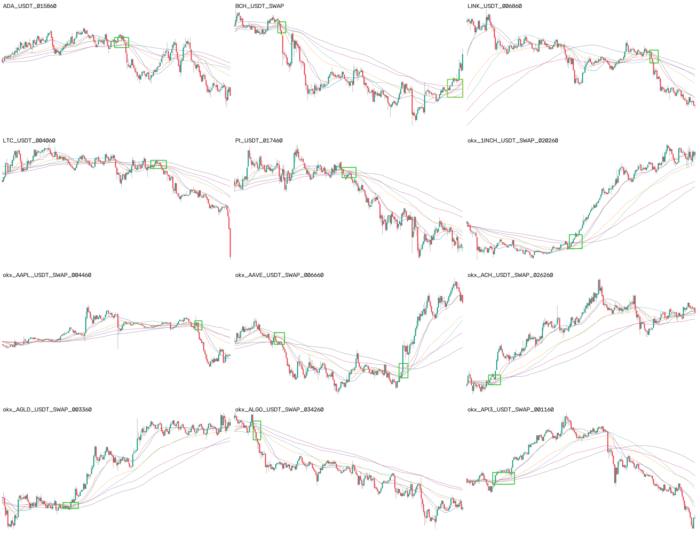

# "可交易的双均线密集启动" —— 视觉定义

> **2026-07-20**：定义仍有效。补充：实盘 tip 是**右缘无后文**视角；中图「右侧已启动」
> 的标注分布导致 v11 tip_hit≈0.9%——见 H-TIP（`analysis/h_tip_plan.md`）。

这个概念到 2026-07 为止只存在两处:项目所有者的判断(标注自洽度 0.88),和一个
表达不了它的规则族(324 组合网格的 F1 天花板 ~0.45)。本文用所有者亲手挑的
⭐ 标杆把它落成文档,给接手的人(或模型)一个不经转述的定义。

## 标杆样张(所有者标注的框)

完整注册表: `data/benchmark_exemplars.json` — 176 张 / 180 框 / 1 张背景,
全部由项目所有者在 2026-07-13 ~ 07-16 亲手加星。

## 从标杆几何反推的规律(描述,不是规则)

- 框的典型尺寸: 宽 ~5.3% / 高 ~10.4% 图幅 —— 密集是一个**局部瞬间**,不是一段行情;
- 6 条均线(SMA/EMA 20/60/120)在框内收拢到肉眼近乎一束,且 K 线实体同时穿过这一束;
- 框几乎总在**横盘末端、放量启动之前**,而不是启动之后(事后回看谁都会);
- 一半以上的已标图是背景(全池背景率 ~56%):**"没有密集"是一个同样需要判断的答案**。

## 所有者标注习惯的稳定性(2026-07-16 测)

| 轮次 | 张数 | 背景率 | 均框数 | 框宽% | 框高% |
|---|---|---|---|---|---|
| round1-3 | 2307 | 45-56% | 0.49-0.59 | 5.6-6.0 | 9.4-10.6 |
| round4-7 | 4360 | 56-59% | 0.43-0.46 | 5.0-5.4 | 9.4-10.9 |

round3 之后定义定型,无漂移 —— 模型上限不受定义漂移拖累。
数据: `analysis/output/label_drift_by_round.json`。

## 标杆的三个正式用途

1. **模型体检金标** (`scripts/benchmark_check.py`,已接入 v9 流水线):任何新模型
   必须在训练侧标杆 recall >= 0.90、eval 侧 >= 0.60,不过关就别看 F1 ——
   "连教科书案例都检不出"比 F1 掉几个点响亮得多,lr bug 藏了几个月就是因为没有这道闸。
   现任 v8_chain: 训练侧 0.955 / eval 侧 0.957 ✅
2. **过采样实验**:标杆图在训练集里加权,让模型把最标准形态当锚点(单变量实验,3060)。
3. **一致性锚点**:将来怀疑定义漂移时,拿新标注与标杆对照。
