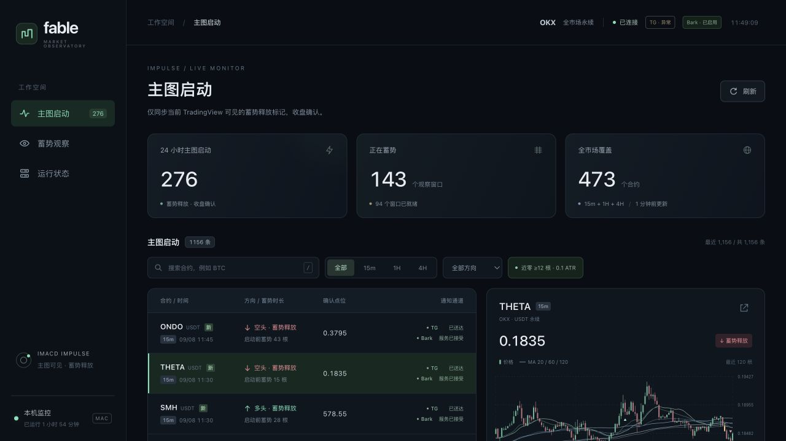
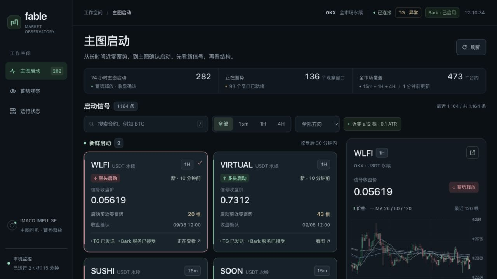
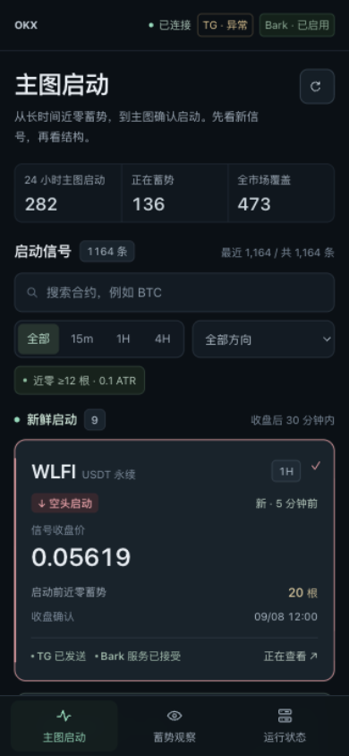
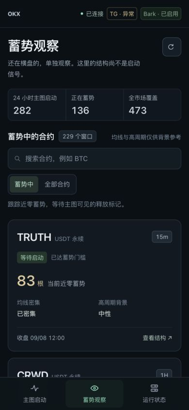

# IMACD 监控前端卡片改版验收

2026-09-08，本机 http://127.0.0.1:8766。功能源码提交：`a357228`。

首页以确认启动卡片为重点：币种、周期、方向、原收盘价与启动前蓄势根数优先，通知回执为次信息。新鲜与已记录事件分组；概览压缩；观察窗口也改为独立卡片。沿用真实 API、固定指标设置快照、15 秒刷新与现有通知通道。

## 验证结果

| 检查 | 结果 |
|---|---|
| 前端行为 | 20 个 Node 测试通过；包括时效边界、缓存降级、分页、筛选、转义与焦点 |
| 相关后端契约 | 97 个 pytest 用例通过；存在既有 LibreSSL 警告 |
| 真实浏览器 | 搜索、4H 空头筛选、空结果恢复、分页、Enter 选择、观察结构、系统页通过 |
| 响应式 | 390、753、1280、1536 像素宽验证，无页面横向溢出；1280×720 首卡约 y391–651 |
| 极小价格 | SATS 卡片完整显示 `0.000000011282`，未截断；不代表成交价格 |
| 手机看图 | 点击卡片直达详情，返回后恢复原卡片键盘焦点 |
| 图表 | 选中事件沿用真实 K 线、六条均线、IMACD 双线和零轴；不为每张卡单独请求图表 |
| 运行服务 | 完成时 health 的 service_alive、market_ready、ok 均 true，扫描 errors=0 |

复核命令：

```bash
cd /Users/zhangzc/fable-trading
node --check yoyo/monitor/static/app.js
node --test tests/monitor/frontend_cards.test.cjs
.venv/bin/python -m pytest -q tests/monitor/test_service.py tests/monitor/test_runtime.py tests/monitor/test_bark_store.py
```

## 前后对照

截图来自同一本机服务的实际页面，期间行情持续更新，记录数量与选中合约因此不同。

### 改版前



### 改版后



### 手机卡片与观察页





## 风险与诚实声明

这是前端功能与可读性验收，不是交易收益实验，AUC、胜率、回撤或净收益不适用；以真实 UI 场景及合成的旧事件/故障/边界对照验证信息身份。Node 测试使用轻量 DOM 桩，不冒充完整浏览器测试；另已独立做真实浏览器交互与视觉验证。

本轮没有改扫描规则、参数、通知发送、Pine、凭据或执行层，也未重启服务。Telegram 在改版前已有部分回执未知，页面继续如实显示；本轮未重发、补发或做测试推送。新鲜样式使用 API 标志及运行时既有 30 分钟期限；不把回执成功、旧记录或观察结构当作新启动。
